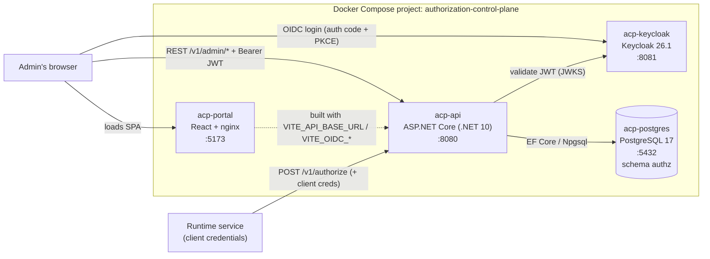
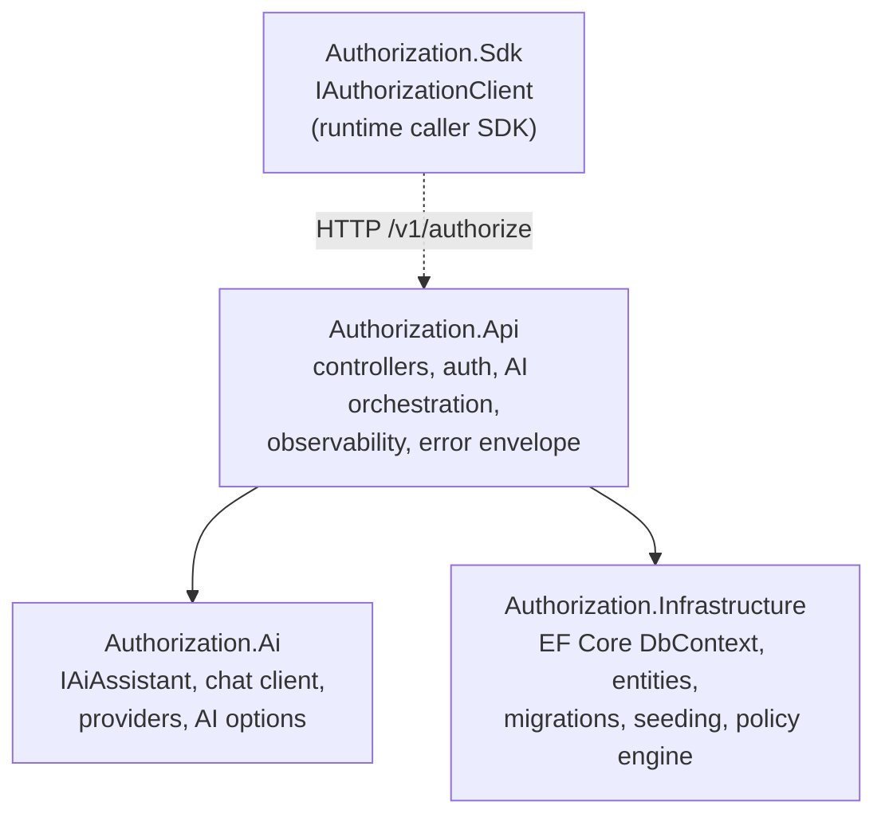
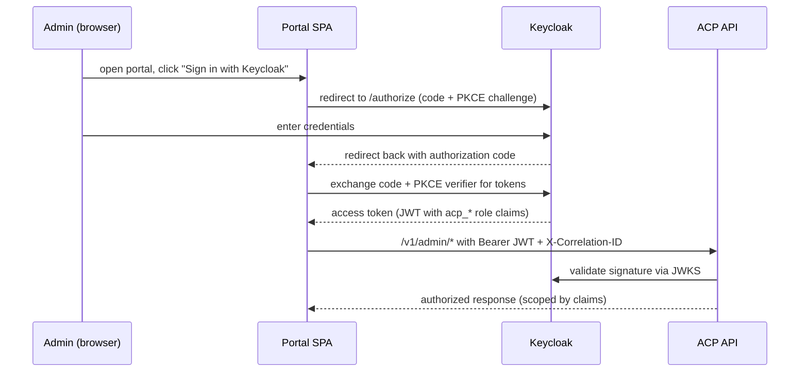
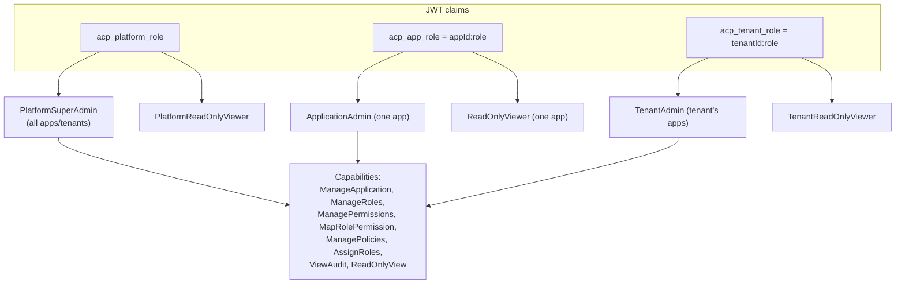
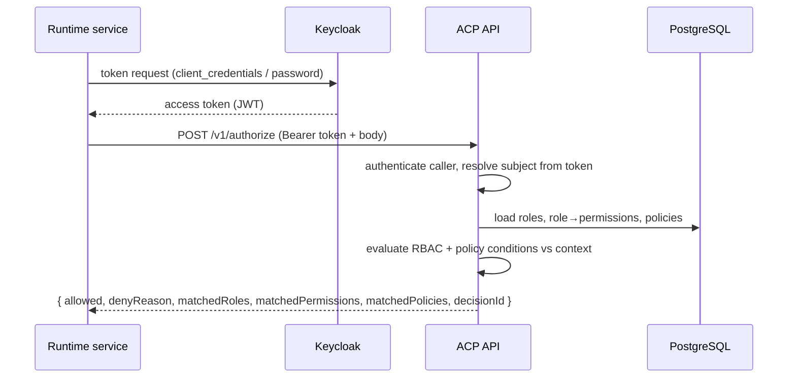
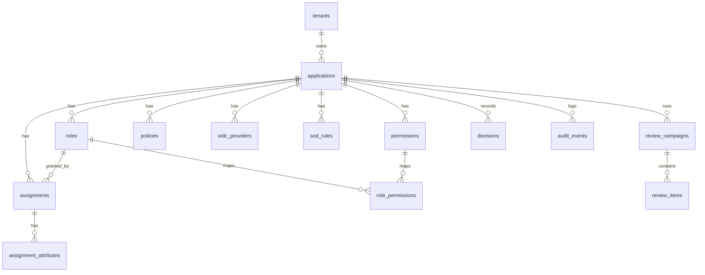

# Authorization Control Plane (ACP)

A local, self-contained **least-privilege access governance** platform. ACP lets platform and
application administrators model **tenants, applications, roles, permissions, policies, and
access assignments**, run **runtime authorization decisions**, keep a full **audit trail**, run
**access-review (recertification) campaigns**, and use **opt-in AI assistance** for policy
authoring, decision explanation, access search, and more.

The repository ships everything needed to run the whole system locally with Docker Compose:
a PostgreSQL database, a Keycloak OIDC identity provider (with a pre-seeded realm), the
ASP.NET Core API, and the React admin portal.

> **Status:** MVP / proof-of-concept. This README documents only what is verifiable in the
> repository and the running application. Items that could not be verified are called out
> explicitly as `Not verified`.

---

## Table of contents

- [What ACP does](#what-acp-does)
- [Screens](#screens)
- [Architecture](#architecture)
- [Technology stack](#technology-stack)
- [Repository structure](#repository-structure)
- [Prerequisites](#prerequisites)
- [Quick start (Docker Compose)](#quick-start-docker-compose)
- [Local accounts and seeded data](#local-accounts-and-seeded-data)
- [Configuration](#configuration)
- [AI assistance](#ai-assistance)
- [Authorization and security model](#authorization-and-security-model)
- [Runtime authorization flow](#runtime-authorization-flow)
- [Data model](#data-model)
- [API reference](#api-reference)
- [Frontend routes and pages](#frontend-routes-and-pages)
- [Local development (outside containers)](#local-development-outside-containers)
- [Testing](#testing)
- [Scripts](#scripts)
- [Observability](#observability)
- [Troubleshooting](#troubleshooting)
- [Known documentation discrepancies](#known-documentation-discrepancies)
- [Further documentation](#further-documentation)
- [Glossary](#glossary)

---

## What ACP does

ACP is a **control plane** for authorization. It separates two planes:

- **Admin plane** — human administrators use the React portal (and the `/v1/admin/*` API) to
  author the access model: applications, roles, permissions, role→permission mappings,
  policies, reference data, assignments, identity providers, and review campaigns. Every
  mutation is written to an immutable audit log.
- **Runtime plane** — services call `POST /v1/authorize` (and `/v1/authorize/batch`) with a
  subject, resource, action, and context. The engine evaluates the subject's roles,
  role→permission mappings, and policies and returns an allow/deny decision with a reason and
  a decision id. Callers authenticate with client credentials registered per application.

### Key capabilities

- **Multi-tenant model** — tenants own applications; applications own their own roles,
  permissions, policies, and assignments.
- **RBAC + policy conditions** — roles group permissions (`resource:action`), and policies add
  conditional allow/deny rules evaluated against request context (e.g. `status`, `isAuthor`).
- **Lifecycle & drafts** — roles, permissions, role→permission mappings, and policies support
  Draft/Published (and activate/disable/archive) states so changes can be staged then published.
- **Time-boxed assignments** — access grants have validity windows, states
  (`ACTIVE`/`EXPIRED`/`REVOKED`), bulk extend, CSV import, and break-glass (emergency) grants.
- **Access reviews** — recertification campaigns snapshot current assignments and let reviewers
  mark each item `KEEP` / `REVOKE` / `NEEDS_INFO`, then finalize to apply revokes.
- **Audit & analytics** — global and per-app audit feeds, decision analytics (allow/deny
  breakdown, top deny reasons), config findings, and Separation-of-Duties (SoD) violation scans.
- **Authorization simulator** — evaluate a hypothetical decision against the live model and see
  the matched roles/permissions/policies and the decision path — without mutating anything.
- **Opt-in AI assistance** — eight advisory AI features (see [AI assistance](#ai-assistance)),
  fully disabled by default and returning `404` when off.

---

## Screens

All screenshots below were captured from the running application (admin portal at
`http://localhost:5173`, signed in as `admin@local.test`). They live in
[docs/screenshots](docs/screenshots).

### Sign in

The portal landing page; authentication is delegated to Keycloak via OIDC.


### Platform overview

Global dashboard: tenants, applications, users, roles, permissions, policies, assignments,
activity trend, risk distribution, recent activity, and the current AI configuration.


### Applications catalog

Every application across all tenants, with tenant/status/risk filters.


### Ask AI (natural-language access search)

Natural-language questions about access, answered with a structured query spec and grounded
results. The example query `Which roles are privileged?` returned five privileged roles.


### AI usage telemetry

Per-feature invocations, tokens, success/error/latency, by-administrator breakdown, and an
auditable prompt log.


### Application workspace — dashboard

Per-application metrics and an interactive access graph.


### Authorization simulator + AI explanation

A live `DENIED` decision (reason `MISSING_CONTEXT`) with matched roles/permissions and the
decision path, plus an AI-generated explanation (feature F2) grounded in the real policies.


<details>
<summary>More screens</summary>

| Screen | Screenshot |
| --- | --- |
| Tenants | [platform-tenants.png](docs/screenshots/platform-tenants.png) |
| Users | [platform-users.png](docs/screenshots/platform-users.png) |
| Access lens | [platform-access-lens.png](docs/screenshots/platform-access-lens.png) |
| Audit | [platform-audit.png](docs/screenshots/platform-audit.png) |
| Platform settings | [platform-settings.png](docs/screenshots/platform-settings.png) |
| Your profile (roles & capabilities) | [platform-profile.png](docs/screenshots/platform-profile.png) |
| App roles | [app-roles.png](docs/screenshots/app-roles.png) |
| App permissions/policies | [app-policies.png](docs/screenshots/app-policies.png) |
| Access matrix | [app-matrix.png](docs/screenshots/app-matrix.png) |
| Assignments | [app-assignments.png](docs/screenshots/app-assignments.png) |
| Decisions analytics | [app-decisions.png](docs/screenshots/app-decisions.png) |
| Certifications | [app-certifications.png](docs/screenshots/app-certifications.png) |
| Delegated admin scoped view | [delegated-admin-scoped-view.png](docs/screenshots/delegated-admin-scoped-view.png) |

</details>

---

## Architecture

### Container topology (local Docker Compose)



The portal is a static SPA served by nginx; it talks directly to the API from the browser.
The API validates browser JWTs against Keycloak and persists everything to PostgreSQL.

### Logical layering (backend projects)



---

## Technology stack

Verified from project files and successful build/test runs.

### Backend

- **.NET 10** (SDK `10.0.303`, target framework `net10.0`) — ASP.NET Core Web API.
- **Entity Framework Core** with **Npgsql** (PostgreSQL), schema `authz`.
- **JWT bearer authentication** validated against **Keycloak** (OIDC).
- **OpenTelemetry** tracing + structured JSON logging; ASP.NET Core health checks.
- **OpenAPI** document exposed in Development.
- Solution: [backend/AuthorizationControlPlane.slnx](backend/AuthorizationControlPlane.slnx)
  with source projects `Authorization.Api`, `Authorization.Ai`,
  `Authorization.Infrastructure`, `Authorization.Sdk`.

### Frontend

- **React 19.2**, **React Router 7.18**, **TanStack Query 5.101**.
- **Vite 8.1** + **TypeScript ~6.0**, built with `tsc -b && vite build`.
- **oidc-client-ts 3.5** for OIDC Authorization Code + PKCE.
- **D3** (`d3-array`, `d3-hierarchy`, `d3-scale`, `d3-selection`, `d3-shape`, `d3-zoom`) for
  charts, access matrix heatmap, and graph/tree visualizations.
- **Vitest 4.1** + **jsdom** for tests; **oxlint** + **prettier** for lint/format.

### Infrastructure

- **PostgreSQL 17-alpine**, **Keycloak 26.1**, Docker Compose.

---

## Repository structure

```
poc-with-ai/
├─ backend/
│  ├─ AuthorizationControlPlane.slnx        # .NET solution
│  ├─ src/
│  │  ├─ Authorization.Api/                 # Web API: controllers, auth, AI builders, startup
│  │  ├─ Authorization.Ai/                  # IAiAssistant, chat client, providers, options
│  │  ├─ Authorization.Infrastructure/      # EF Core context, entities, migrations, seeding
│  │  └─ Authorization.Sdk/                 # Runtime caller client (IAuthorizationClient)
│  └─ tests/
│     ├─ Authorization.Api.Tests/
│     ├─ Authorization.Infrastructure.Tests/
│     ├─ Authorization.Sdk.Tests/
│     └─ Authorization.ContractTests/
├─ frontend/                                # React + Vite admin portal
│  ├─ src/
│  │  ├─ router.tsx, App.tsx, auth.ts, apiClient.ts, capabilities.tsx
│  │  ├─ api/ (hooks.ts, aiConfig.ts, queryKeys.ts, runtimeConfig.ts, useUrlState.ts)
│  │  ├─ pages/ (platform/*, app/*)
│  │  ├─ shells/ (PlatformShell.tsx, AppWorkspaceShell.tsx)
│  │  └─ components/, scope/, theme/, workspace/
│  ├─ Dockerfile, nginx.conf, vite.config.ts, package.json
├─ deploy/
│  └─ local/
│     ├─ docker-compose.yml                 # Postgres, Keycloak, API, Portal
│     ├─ .env.example                        # copy to .env before first run
│     ├─ README.md
│     └─ keycloak/authorization-local-realm.json   # seeded realm, users, clients
├─ scripts/                                  # dev-up/down/reset, local-smoke, perf-authorize, ...
├─ checklist.md                              # documentation reverse-engineering checklist
└─ docs/screenshots/                         # screenshots used by this README
```

> `Not verified`: `Authorization.Ai` is not shown under `backend/src/` in the truncated
> workspace tree, but it builds and is referenced by the solution and API — the folder exists.

---

## Prerequisites

- **Docker Desktop** (or Docker Engine) with Compose v2 — required to run the stack.
- For development outside containers (optional):
  - **.NET SDK 10** (`dotnet --version` reported `10.0.303`).
  - **Node.js** (tested with `v24.19.0`) and **npm** (`11.17.0`).

---

## Quick start (Docker Compose)

From the repository root:

```powershell
# 1) Create the local env file from the template (first run only)
Copy-Item deploy\local\.env.example deploy\local\.env -Force

# 2) Build and start the whole stack
docker compose --env-file deploy\local\.env -f deploy\local\docker-compose.yml up --build
```

Or use the helper scripts (they copy `.env` automatically if missing):

```powershell
.\scripts\dev-up.ps1            # foreground
.\scripts\dev-up.ps1 -Detached # background
.\scripts\dev-down.ps1          # stop (keep data)
.\scripts\dev-reset.ps1         # stop AND wipe the database volume
```

Once healthy, the services are available at:

| Service | URL | Notes |
| --- | --- | --- |
| Portal (SPA) | http://localhost:5173 | React admin portal (nginx) |
| API | http://localhost:8080 | ASP.NET Core API |
| Keycloak | http://localhost:8081 | OIDC provider, realm `authorization-local` |
| PostgreSQL | localhost:5432 | database `authorization`, schema `authz` |

Health checks: `GET http://localhost:8080/health/live` and `GET http://localhost:8080/health/ready`.

**Sign in:** open http://localhost:5173, click **Sign in with Keycloak**, and use one of the
[local accounts](#local-accounts-and-seeded-data) (e.g. `admin@local.test` /
`admin_dev_password`).

> On first start the API applies EF Core migrations and seeds sample data (controlled by
> `Database__RunDevelopmentSetup` and `Database__SeedDevelopmentData`, both default `true`).

---

## Local accounts and seeded data

### Portal login accounts (Keycloak realm `authorization-local`)

These are defined in
[deploy/local/keycloak/authorization-local-realm.json](deploy/local/keycloak/authorization-local-realm.json).
All passwords are dev-only placeholders.

| Username | Password | Portal role |
| --- | --- | --- |
| `admin@local.test` | `admin_dev_password` | `PlatformSuperAdmin` (full platform admin) |
| `platform-viewer@local.test` | `admin_dev_password` | `PlatformReadOnlyViewer` |
| `intelligence-authoring-admin@local.test` | `admin_dev_password` | `intelligence-authoring:ApplicationAdmin` |
| `intelligence-authoring-viewer@local.test` | `admin_dev_password` | `intelligence-authoring:ReadOnlyViewer` |
| `pricing-management-admin@local.test` | `admin_dev_password` | `pricing-management:ApplicationAdmin` |
| `pricing-management-viewer@local.test` | `admin_dev_password` | `pricing-management:ReadOnlyViewer` |
| `market-reference-admin@local.test` | `admin_dev_password` | `market-reference:ApplicationAdmin` |
| `market-reference-viewer@local.test` | `admin_dev_password` | `market-reference:ReadOnlyViewer` |
| `lng-edge-admin@local.test` | `admin_dev_password` | `lng-edge:ApplicationAdmin` |
| `lng-edge-viewer@local.test` | `admin_dev_password` | `lng-edge:ReadOnlyViewer` |
| `user7.lead@icis.com` | `pricing_lead_dev_password` | runtime end-user (`pricing-lead`); no portal admin role |

Infrastructure credentials (dev-only): Keycloak admin `admin` / `admin_dev_password`;
PostgreSQL `authorization` / `authorization_dev_password`.

### Runtime caller clients (used by `scripts/local-smoke.ps1`)

| Client id | Secret | Grant | Purpose |
| --- | --- | --- | --- |
| `pricing-management-runtime-client` | `pricing_management_dev_secret` | client_credentials | machine-to-machine authorize |
| `pricing-management-user-client` | `pricing_management_user_dev_secret` | password | interactive user authorize |

### Seeded domain data (observed in the running app)

| Entity | Count |
| --- | --- |
| Tenants | 2 — `Squad 1` (`squad-1`), `Squad 2` (`squad-2`) |
| Applications | 4 |
| Users | 29 |
| Roles | 18 |
| Permissions | 31 |
| Policies | 10 |
| Assignments | 32 (29 active) |

Applications:

| Application | Id | Tenant | Risk | Status |
| --- | --- | --- | --- | --- |
| Intelligence Authoring | `intelligence-authoring` | Squad 1 | MEDIUM | ACTIVE |
| Pricing Management | `pricing-management` | Squad 1 | HIGH | ACTIVE |
| Market Reference | `market-reference` | Squad 1 | LOW | ACTIVE |
| LNG Edge | `lng-edge` | Squad 2 | HIGH | ACTIVE |

> Counts reflect the seeded state observed during review and may change as you use the app.

---

## Configuration

Runtime configuration is supplied through [deploy/local/.env](deploy/local/.env.example)
(passed to Docker Compose) and `appsettings*.json`. Environment variables use the ASP.NET Core
`Section__Key` convention and override `appsettings`.

Key variables (see [deploy/local/.env.example](deploy/local/.env.example) for the full list):

| Variable | Default | Purpose |
| --- | --- | --- |
| `API_PORT` / `PORTAL_PORT` / `POSTGRES_PORT` / `KEYCLOAK_PORT` | `8080` / `5173` / `5432` / `8081` | Host port mappings |
| `POSTGRES_DB` / `POSTGRES_USER` / `POSTGRES_PASSWORD` | `authorization` / `authorization` / `authorization_dev_password` | Database |
| `ConnectionStrings__Postgres` | `Host=postgres;Port=5432;Database=authorization;...` | API DB connection |
| `Oidc__Authority` | `http://localhost:8081/realms/authorization-local` | Public token issuer (must match the URL the browser uses) |
| `Oidc__Audience` | `authorization-api` | Expected token audience |
| `Oidc__PortalClientId` | `authorization-portal` | Portal OIDC client id |
| `Oidc__MetadataAddress` | `http://keycloak:8080/realms/authorization-local/.well-known/openid-configuration` | Back-channel discovery/JWKS (reachable inside the Docker network) |
| `Cors__AllowedOrigins__0` | `http://localhost:5173` | Allowed portal origin |
| `Database__RunDevelopmentSetup` | `true` | Apply EF migrations on startup |
| `Database__SeedDevelopmentData` | `true` | Seed sample data on startup |
| `Portal__ApiBaseUrl` | `http://localhost:8080` | Baked into the SPA build (`VITE_API_BASE_URL`) |
| `Portal__OidcAuthority` | `http://localhost:8081/realms/authorization-local` | Baked into the SPA build (`VITE_OIDC_AUTHORITY`) |
| `Ai__Enabled` | `false` | Master switch for AI features |
| `Ai__Provider` | `Fake` (compose default) / `OpenAI` (`.env.example`) | `AzureOpenAI`, `OpenAI`, or `Fake` |
| `Ai__AzureOpenAI__Endpoint` | — | Provider base URL |
| `Ai__AzureOpenAI__ApiKey` | — | Provider key/PAT (**secret — never commit**) |
| `Ai__AzureOpenAI__ChatDeployment` | `gpt-4o-mini` (compose) / `openai/gpt-4.1-mini` (example) | Model / deployment |
| `Ai__AzureOpenAI__SupportsTemperature` | `true` | Set `false` for reasoning models that reject a non-default temperature |
| `Ai__AzureOpenAI__SupportsMaxTokens` | `true` | Set `false` for reasoning models that reject legacy `max_tokens` (uses `max_completion_tokens`) |

> **Security:** `deploy/local/.env` may contain a real API key and is git-ignored. Never commit
> real secrets or paste them into screenshots. The `.env.example` values are dev-only placeholders.

---

## AI assistance

AI is **opt-in and advisory only**. When `Ai__Enabled=false` (the default), all AI endpoints
return `404` and the portal hides AI surfaces. The provider is pluggable:

- `Fake` — deterministic offline stub (used by tests and offline dev).
- `OpenAI` — any OpenAI-compatible endpoint (e.g. GitHub Models). `.env.example` defaults to
  `https://models.github.ai/inference`.
- `AzureOpenAI` — an Azure OpenAI resource (`api-key` header, versioned deployment URL).

The eight features exposed through `IAiAssistant`
([backend/src/Authorization.Ai/IAiAssistant.cs](backend/src/Authorization.Ai/IAiAssistant.cs)):

| # | Feature | Method | What it does |
| --- | --- | --- | --- |
| F1 | Policy authoring | `DraftPolicyAsync` | Turn an instruction into a policy condition tree (temperature 0) |
| F2 | Decision explainer | `ExplainDecisionAsync` | Narrate why a decision was allowed/denied + remediation |
| F4 | Access certification | `SummarizeAccessReviewAsync` | Summarize review items (subject PII pseudonymized) |
| F5 | Impact analysis | `NarrateImpactAsync` | Explain the blast radius of publishing a policy |
| F6 | Config advisor | `SummarizeFindingsAsync` | Rank and explain deterministic config findings |
| F7 | SoD analysis | `DraftSodRuleAsync` | Draft a Separation-of-Duties rule from an instruction |
| F8 | Access search | `PlanAccessSearchAsync` | Natural-language access question → closed query spec |
| F9 | Audit narrative | `NarrateAuditAsync` | Narrate an audit window for compliance |

Each invocation is recorded (metadata to `authz.ai_invocations`, prompt/response to
`authz.ai_prompt_logs` with pseudonymization) and surfaced on the **AI usage** page.

> **Reasoning models:** `gpt-5.5` / o-series style deployments reject a non-default
> `temperature` and the legacy `max_tokens` field with a hard `400`. For those, set
> `Ai__AzureOpenAI__SupportsTemperature=false` and `Ai__AzureOpenAI__SupportsMaxTokens=false`;
> the client then omits temperature and sends `max_completion_tokens` instead of `max_tokens`
> (see [HttpChatCompletionClient.cs](backend/src/Authorization.Ai/Providers/HttpChatCompletionClient.cs)).

During review, AI was live against **Azure OpenAI (`gpt-5.5`)**: Ask AI and the simulator's
"Explain this decision" both returned grounded, correct results.

---

## Authorization and security model

### Two authentication paths

- **Admin plane (browser):** OIDC Authorization Code + PKCE against Keycloak. The portal keeps
  tokens **in-memory only** (PKCE verifier in `sessionStorage`), attaches
  `Authorization: Bearer <jwt>` and a per-request `X-Correlation-ID`, and silently renews.
  The API validates the JWT (issuer, audience, JWKS) under the `AdminJwt` scheme,
  mapping `acp_platform_role` as the role claim and `preferred_username` as the name claim.
- **Runtime plane (services):** callers send client credentials for `POST /v1/authorize`.
  These are validated by `RuntimeCallerAuthenticator` against configured runtime clients. The
  subject is always taken from the verified token, never trusted from the request body.

### Admin sign-in (OIDC Authorization Code + PKCE)



The portal routes each user by capability: `PlatformSuperAdmin` lands on `/platform`, while a
delegated `ApplicationAdmin` is taken straight to their application workspace and sees **only**
that application — verified by signing in as `pricing-management-admin@local.test`:


### Delegated admin roles and capabilities



Authorization policies enforced by the API include `AdminApi` (authenticated admin),
`PlatformAdmin` (requires `PlatformSuperAdmin`), and `DelegatedAdmin:{Capability}` (checked by
`DelegatedAdminAuthorizationHandler` against the caller's app/tenant roles).

### Runtime caller error codes

| Code | HTTP | Meaning |
| --- | --- | --- |
| `CALLER_UNAUTHENTICATED` | 401 | Missing/invalid runtime credentials |
| `CALLER_APPLICATION_MISMATCH` | 403 | Caller's app ≠ request's `applicationId` |
| `CALLER_SUBJECT_CLAIM_MISSING` | 403 | Token missing required subject claim |
| `SUBJECT_MISMATCH` | 403 | Request body subject conflicts with the token subject |

---

## Runtime authorization flow



Example (from [scripts/local-smoke.ps1](scripts/local-smoke.ps1)): the pricing runtime service
account is allowed to `price.publish` only when `context.status = READY_TO_PUBLISH`; without
that context the decision is denied with `MISSING_CONTEXT`.

---

## Data model

EF Core context `AuthorizationDbContext` maps all entities into the PostgreSQL schema `authz`.
Every governance entity derives from `AuditedEntity` (`Id`, `CreatedAt`, `CreatedBy`,
`UpdatedAt`, `UpdatedBy`, `Version`).



Additional tables: `reference_data` (named JSON documents referenced by policies),
`ai_invocations` and `ai_prompt_logs` (AI audit trail).

| Table | Purpose |
| --- | --- |
| `tenants` | Business unit / root owner of applications |
| `applications` | A service/system requiring authorization |
| `oidc_providers` | Runtime caller authentication config per application |
| `roles` | Named grouping of permissions within an application |
| `permissions` | `{resource, action}` pair (e.g. `price:publish`) |
| `role_permissions` | Role→permission mapping with Draft/Published state |
| `assignments` | Grants a subject a role, scoped and time-boxed |
| `assignment_attributes` | Free-form metadata on an assignment |
| `policies` | Conditional allow/deny rule with priority and obligations |
| `reference_data` | Named lookup JSON referenced by policy conditions |
| `sod_rules` | Separation-of-Duties rule (two permission matchers) |
| `review_campaigns` / `review_items` | Access recertification campaigns and items |
| `audit_events` | Immutable log of all governance mutations |
| `decisions` | Optional record of runtime authorize decisions |
| `ai_invocations` / `ai_prompt_logs` | AI invocation metadata and prompt/response logs |

---

## API reference

Base URL `http://localhost:8080`. Admin endpoints require the `AdminJwt` bearer token; AI
endpoints return `404` when AI is disabled. Route templates are taken from the controllers.

### Runtime authorization

| Method | Route | Notes |
| --- | --- | --- |
| POST | `/v1/authorize` | Single decision (runtime caller auth) |
| POST | `/v1/authorize/batch` | Batch decisions (max 50; `413` when exceeded) |

### Portal configuration & health

| Method | Route | Notes |
| --- | --- | --- |
| GET | `/v1/config` | Runtime config (AI availability, pagination, UI knobs) |
| GET | `/health/live` | Liveness |
| GET | `/health/ready` | Readiness (includes DB connectivity) |

### Governance (admin plane)

| Area | Routes |
| --- | --- |
| Applications | `GET/POST /v1/admin/applications` |
| Tenants | `GET/POST /v1/admin/tenants`, `PUT /v1/admin/tenants/{tenantId}` |
| Roles | `GET/POST /v1/admin/applications/{applicationId}/roles`, `PUT/DELETE .../roles/{roleKey}`, `POST .../roles/{roleKey}/{activate\|disable\|archive}` |
| Permissions | `GET/POST /v1/admin/applications/{applicationId}/permissions`, `PUT/DELETE .../permissions/{permissionKey}` |
| Role→permission | `GET/POST /v1/admin/applications/{applicationId}/role-permissions`, `POST .../{rolePermissionId}/{publish\|revoke}` |
| Assignments | `GET/POST .../assignments`, `GET .../assignments/summary`, `PUT/POST .../assignments/{id}` (update/revoke), `POST .../assignments/bulk-extend` |
| Policies | `GET/POST .../policies`, `GET/PUT .../policies/{policyKey}`, `POST .../policies/{policyKey}/{publish\|delete}` |
| Reference data | `GET/POST .../reference-data`, `PUT/DELETE .../reference-data/{refDataKey}` |
| OIDC providers | `GET/POST .../oidc-providers`, `PUT .../oidc-providers/{providerId}` |
| Review campaigns | `GET/POST .../review-campaigns`, `GET .../review-campaigns/{id}`, `POST .../{activate\|finalize}`, `PUT .../items/{itemId}` |
| Decision analytics | `GET .../decisions/analytics` |
| Application insights | `GET .../insights/{config-findings\|sod-rules\|sod-violations}` |
| Governance insights | `GET /v1/admin/audit-events`, `POST /v1/admin/access-simulator` |

### AI endpoints

| Scope | Routes |
| --- | --- |
| Application AI | `POST /v1/admin/applications/{applicationId}/ai/{policy-draft\|explain-decision\|impact-analysis\|advisor-findings\|draft-sod-rule\|access-search}` |
| Platform AI | `POST /v1/admin/ai/access-search`, `POST /v1/admin/ai/access-review/summarize`, `POST /v1/admin/ai/audit/narrative` |
| AI telemetry | `GET /v1/admin/ai/usage`, `GET /v1/admin/ai/prompt-logs` |

> `Not verified`: request/response body schemas are not exhaustively documented here. Explore
> the OpenAPI document (Development only) and [backend/src/Authorization.Api/Authorization.Api.http](backend/src/Authorization.Api/Authorization.Api.http)
> for concrete payloads.

---

## Frontend routes and pages

The SPA has two shells: a **platform** shell (global admin) and an **app workspace** shell
(single application). Routes are defined in [frontend/src/router.tsx](frontend/src/router.tsx).

### Platform routes (`PlatformShell`)

| Path | Page |
| --- | --- |
| `/platform` | Platform overview |
| `/platform/applications` | Applications catalog |
| `/platform/tenants`, `/platform/tenants/:tenantId` | Tenants list / detail |
| `/platform/users`, `/platform/users/:email` | Users directory / detail |
| `/platform/access-lens` | Access hierarchy explorer |
| `/platform/audit` | Global audit feed |
| `/platform/ai-usage` | AI telemetry |
| `/platform/ask-ai` | Natural-language access search |
| `/platform/settings` | Platform / AI settings |
| `/platform/profile` | Current user profile |

### Application workspace routes (`AppWorkspaceShell`, under `/app/:appId`)

`` (dashboard), `roles`, `roles/:roleKey`, `permissions`, `permissions/:permissionKey`,
`policies`, `policies/:policyKey`, `reference-data`, `matrix`, `assignments`, `identity`,
`simulator`, `decisions`, `activity`, `certifications`, `settings`.

The index route `/` redirects based on capabilities (delegated app admins go to their app;
platform users go to `/platform`). Legacy `?app=`, `?view=` query params redirect to the new
paths.

---

## Local development (outside containers)

### Backend

```powershell
cd backend
dotnet build AuthorizationControlPlane.slnx
dotnet test  AuthorizationControlPlane.slnx
# Run just the API (expects Postgres + Keycloak reachable, e.g. via the compose stack):
dotnet run --project src/Authorization.Api/Authorization.Api.csproj
```

### Frontend

```powershell
cd frontend
npm install
npm run dev        # Vite dev server (default http://localhost:5173)
npm run build      # tsc -b && vite build
npm test           # vitest run
npm run lint       # oxlint
npm run format     # prettier --check .
```

The dev SPA reads `VITE_API_BASE_URL`, `VITE_OIDC_AUTHORITY`, and `VITE_OIDC_CLIENT_ID`
(defaults target the local compose stack).

---

## Testing

All suites were run during review and passed.

| Suite | Command | Result |
| --- | --- | --- |
| Frontend (Vitest) | `npm test` | 13 files, **78 tests passed** |
| Frontend type-check | `npx tsc -b` | exit 0 |
| Backend — SDK | `dotnet test` | **16 passed** |
| Backend — Infrastructure | `dotnet test` | **71 passed** |
| Backend — Contract | `dotnet test` | **2 passed** |
| Backend — API | `dotnet test` | **459 passed** |

Backend total: **548 passed, 0 failed, 0 skipped**.

> During `Authorization.Api.Tests` the test host logs a non-fatal
> `Connection refused (keycloak:8080)` from `VerifySeededIssuersAsync` (no Keycloak is reachable
> from the test host); all tests still pass.

---

## Scripts

PowerShell helpers in [scripts/](scripts):

| Script | Purpose |
| --- | --- |
| `dev-up.ps1` | Copy `.env` if missing, then `docker compose up --build` (`-Detached` for background) |
| `dev-down.ps1` | Stop the stack (keep data volumes) |
| `dev-reset.ps1` | Stop the stack and **remove volumes** (wipes the database) |
| `local-smoke.ps1` | End-to-end runtime authorization smoke test (M2M + user flows, negative cases, batch) |
| `perf-authorize.ps1` | Load test for `/v1/authorize` |
| `verify-github-models-pat.ps1` | Check a GitHub Models PAT |

---

## Observability

- **Structured JSON logging** with trace/span ids.
- **OpenTelemetry** tracing for ASP.NET Core and outbound HTTP.
- **`CorrelationIdMiddleware`** propagates `X-Correlation-ID` end to end.
- **`ExceptionHandlingMiddleware`** wraps unhandled errors in a canonical `ApiErrorEnvelope`.
- **Health checks** at `/health/live` and `/health/ready` (`DatabaseReadinessHealthCheck`).
- **AI usage** page + `ai_invocations` / `ai_prompt_logs` tables provide an AI audit trail.

---

## Troubleshooting

- **Portal shows "Signing you in…" or 401s after a restart** — the API restart invalidates the
  in-memory session. Navigate to http://localhost:5173 (root) and click **Sign in with Keycloak**
  again.
- **AI calls return 500 with `400 (Bad Request)`** — the deployment is a reasoning model that
  rejects `temperature`/`max_tokens`. Set `Ai__AzureOpenAI__SupportsTemperature=false` and
  `Ai__AzureOpenAI__SupportsMaxTokens=false`, then rebuild the API
  (`docker compose build api; docker compose up -d api`).
- **AI features are missing / endpoints 404** — AI is disabled. Set `Ai__Enabled=true`, choose a
  provider, and supply endpoint + key.
- **Keycloak issuer mismatch** — `Oidc__Authority` must match the URL the **browser** uses
  (`http://localhost:8081/...`), while `Oidc__MetadataAddress` points at the in-network host
  (`http://keycloak:8080/...`).
- **Reset a broken local database** — `.\scripts\dev-reset.ps1` (this deletes the Postgres
  volume; re-seed happens on next start).

---

## Known documentation discrepancies

Documented per the "repository is the source of truth" principle:

- [deploy/local/README.md](deploy/local/README.md) lists **Finance / CRM / HR** runtime clients
  and describes `local-smoke.ps1` as creating a "Finance assignment". The current seeder and
  [scripts/local-smoke.ps1](scripts/local-smoke.ps1) instead use the **pricing-management**
  application and its runtime clients (`pricing-management-runtime-client`,
  `pricing-management-user-client`). Treat that credentials table as **stale**.
- [deploy/local/README.md](deploy/local/README.md) references
  `specs/001-authorization-control-plane-mvp/quickstart.md`, which **does not exist** in this
  repository.
- [deploy/local/.env.example](deploy/local/.env.example) defaults `Ai__Provider=OpenAI` with the
  GitHub Models endpoint. GitHub Models is a hosted preview that may be unavailable; for a real
  demo use an Azure OpenAI or OpenAI resource.
- The deeper [documentation/](documentation) suite predates the current code in places: it states
  **.NET 9 / EF Core 9**, **GPT-4o**, and **Tailwind CSS**. The code actually targets **.NET 10**
  (`net10.0`, SDK `10.0.303`), AI was exercised against **gpt-5.5**, and `frontend/package.json`
  does **not** list Tailwind. Prefer this root README for current, verified facts.

---

## Further documentation

A deeper, design-level documentation suite lives in [documentation/](documentation) (indexed by
[documentation/README.md](documentation/README.md)), covering project overview, requirements,
architecture, solution/module/component design, API and data-model references, AI features,
security, error handling, observability, business rules, configuration, a developer guide, a user
manual, a code walkthrough, and a glossary. The reverse-engineering tracker is in
[checklist.md](checklist.md).

> These documents provide additional depth but were authored earlier; where they disagree with
> this root README (e.g. .NET version), the root README reflects the current verified state.

---

## Glossary

| Term | Meaning |
| --- | --- |
| **Tenant** | A business unit that owns applications |
| **Application** | A system/service whose access ACP governs |
| **Role** | A named grouping of permissions within an application |
| **Permission** | A `resource:action` capability (e.g. `price:publish`) |
| **Policy** | A conditional allow/deny rule evaluated against request context |
| **Assignment** | A time-boxed grant of a role to a subject |
| **Reference data** | Named JSON documents referenced by policy conditions |
| **SoD rule** | Separation-of-Duties constraint (two permissions that must not coexist) |
| **Review campaign** | A recertification round over current assignments |
| **Decision** | The result of a runtime authorization check |
| **Break-glass** | Emergency, auto-audited short-term access grant |
| **Delegated admin** | An admin scoped to specific applications/tenants (not platform-wide) |

---

<sub>Generated by reverse-engineering the repository and exercising the running application.
Only verifiable behavior is documented; unverifiable items are marked `Not verified`.</sub>
