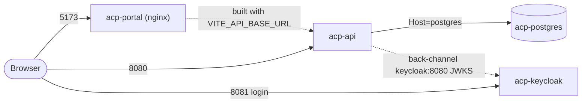

# Local Docker Environment

This directory contains the **local Docker Compose stack** for the Authorization Control Plane (ACP)
MVP: everything you need to run the whole system — database, identity provider, backend API, and admin
portal — on one machine with a single command. It is intended for **local development and evaluation
only**; every credential here is a throwaway dev placeholder, not a production secret.

> New to the project? Start with the [Documentation Portal](../../documentation/README.md) and the
> [Developer Guide](../../documentation/21_Developer_Guide.md). This file is the operational runbook for
> the containers.

---

## Table of Contents

1. [Stack Overview](#stack-overview)
2. [Prerequisites](#prerequisites)
3. [Quick Start](#quick-start)
4. [Lifecycle & Common Commands](#lifecycle--common-commands)
5. [Configuration](#configuration)
6. [What Happens on Startup](#what-happens-on-startup)
7. [Networking & Hostnames](#networking--hostnames)
8. [Seeded Data & Credentials](#seeded-data--credentials)
9. [AI Assistance (Opt-In)](#ai-assistance-opt-in)
10. [Verifying the Stack](#verifying-the-stack)
11. [Performance Sanity Check](#performance-sanity-check)
12. [Data Persistence & Volumes](#data-persistence--volumes)
13. [Troubleshooting](#troubleshooting)
14. [Security Notes](#security-notes)
15. [Related Documentation](#related-documentation)

---

## Stack Overview

The Compose project is named **`authorization-control-plane`** and defines four services, all wired
together on Compose's default bridge network so they reach each other by service name.

| Service | Container | Image | Host → container | Purpose |
|---------|-----------|-------|------------------|---------|
| **Portal** | `acp-portal` | built from [frontend/Dockerfile](../../frontend/Dockerfile) (nginx) | `5173 → 80` | React admin SPA (governance UI). |
| **API** | `acp-api` | built from [backend/src/Authorization.Api/Dockerfile](../../backend/src/Authorization.Api/Dockerfile) | `8080 → 8080` | ASP.NET Core backend (governance + runtime authorization). |
| **Keycloak** | `acp-keycloak` | `quay.io/keycloak/keycloak:26.1` | `8081 → 8080` | Local OIDC identity provider (admin login + runtime clients). |
| **PostgreSQL** | `acp-postgres` | `postgres:17-alpine` | `5432 → 5432` | System of record (database `authorization`, schema `authz`). |

Host ports are configurable via `.env` (`PORTAL_PORT`, `API_PORT`, `KEYCLOAK_PORT`, `POSTGRES_PORT`).
Two named volumes persist state across restarts: `postgres-data` (database) and `api-data-protection`
(ASP.NET Core Data Protection keys). Source of truth: [docker-compose.yml](docker-compose.yml).



## Prerequisites

- **Docker Desktop** (or Docker Engine) with **Compose v2** — this is the only hard requirement for
  running the stack.
- **PowerShell 7+** to use the `scripts/*.ps1` helpers (the raw `docker compose` commands work in any
  shell).
- **.NET 10 SDK** and **Node.js 24 + npm** are needed **only** if you build or run the API/portal
  *outside* containers; they are not required to run this Compose stack.

## Quick Start

### Recommended: helper script

From the **repository root**, one command copies the env file (if missing) and builds + starts
everything:

```powershell
./scripts/dev-up.ps1            # foreground (streams logs)
./scripts/dev-up.ps1 -Detached # background
```

[dev-up.ps1](../../scripts/dev-up.ps1) creates `deploy/local/.env` from the template on first run, then
runs `docker compose ... up --build`. When it's up:

- Portal: **http://localhost:5173** — sign in with `admin@local.test` / `admin_dev_password`.
- API: **http://localhost:8080**
- Keycloak: **http://localhost:8081** (admin console: `admin` / `admin_dev_password`)

### Manual: raw Compose

If you prefer to drive Compose directly, first create the env file, then start the stack from the
repository root:

```powershell
Copy-Item deploy/local/.env.example deploy/local/.env -Force
docker compose --env-file deploy/local/.env -f deploy/local/docker-compose.yml up --build
```

The `--env-file` and `-f` flags are required on every raw command because this project lives in a
subdirectory rather than the current folder.

## Lifecycle & Common Commands

| Action | Helper script | Raw Compose (from repo root) |
|--------|---------------|------------------------------|
| Start (build) | `./scripts/dev-up.ps1` | `docker compose --env-file deploy/local/.env -f deploy/local/docker-compose.yml up --build` |
| Start in background | `./scripts/dev-up.ps1 -Detached` | `... up --build -d` |
| Stop (keep data) | `./scripts/dev-down.ps1` | `... down` |
| Reset (wipe database) | `./scripts/dev-reset.ps1` | `... down -v` |
| View logs | — | `... logs -f api` (or `postgres`/`keycloak`/`portal`) |
| List container status | — | `... ps` |
| Rebuild one service | — | `... up --build -d api` |
| Validate compose config | — | `... config` |

- [dev-down.ps1](../../scripts/dev-down.ps1) stops and removes the containers but **keeps** the named
  volumes, so your database survives.
- [dev-reset.ps1](../../scripts/dev-reset.ps1) runs `down -v`, which **deletes the `postgres-data` and
  `api-data-protection` volumes** — use it when you want a clean re-seed. This is destructive; there is
  no undo.

## Configuration

All environment-specific values live in a **git-ignored** `deploy/local/.env`, created from the
checked-in [.env.example](.env.example) template. The template contains **dev-only placeholders** —
never put production secrets or customer data in it.

The variables fall into these groups (defaults shown; the Compose file also carries fallbacks so it
runs even without a value):

| Group | Keys | Notes |
|-------|------|-------|
| **Host ports** | `API_PORT` `PORTAL_PORT` `KEYCLOAK_PORT` `POSTGRES_PORT` | Change if a port is already in use locally. |
| **Database** | `POSTGRES_DB` `POSTGRES_USER` `POSTGRES_PASSWORD` `ConnectionStrings__Postgres` | The connection string uses `Host=postgres` (the service name on the Docker network). |
| **Keycloak admin** | `KEYCLOAK_ADMIN` `KEYCLOAK_ADMIN_PASSWORD` | Bootstraps the Keycloak master-realm admin. |
| **OIDC (admin plane)** | `Oidc__Authority` `Oidc__Audience` `Oidc__PortalClientId` `Oidc__MetadataAddress` | `Authority` is the browser-facing issuer; `MetadataAddress` is the back-channel discovery URL (see [Networking](#networking--hostnames)). |
| **Portal (build args)** | `Portal__ApiBaseUrl` `Portal__OidcAuthority` `Portal__OidcAuthorityBase` | Baked into the SPA at **build time** (`VITE_*`), so changes require an image rebuild. |
| **CORS** | `Cors__AllowedOrigins__0` | Must include the portal origin (default `http://localhost:5173`). |
| **Dev setup** | `Database__RunDevelopmentSetup` `Database__SeedDevelopmentData` | Both `true` by default — apply migrations and seed demo data on API startup. |
| **Logging** | `Logging__LogLevel__Default` | Default `Information`. |
| **AI** | `Ai__Enabled` `Ai__Provider` `Ai__AzureOpenAI__*` | Off by default — see [AI Assistance](#ai-assistance-opt-in). |
| **Feature flags** | `FeatureFlags__DecisionCachingEnabled` | Present but inert in the MVP (no decision cache). |

Full option semantics and validation are documented in [Configuration](../../documentation/20_Configuration.md).

## What Happens on Startup

1. **PostgreSQL** starts and reports healthy via `pg_isready`.
2. **Keycloak** starts with `start-dev --import-realm`, importing
   [keycloak/authorization-local-realm.json](keycloak/authorization-local-realm.json) — this creates the
   `authorization-local` realm with all seeded clients and users on first boot.
3. **API** waits for PostgreSQL to be **healthy** and Keycloak to have **started** (`depends_on`
   conditions), then — because `Database__RunDevelopmentSetup=true` — applies EF Core migrations to the
   `authz` schema and, with `Database__SeedDevelopmentData=true`, seeds demo tenants, applications,
   roles, permissions, policies, and assignments. In non-Development environments this step is a no-op.
4. **Portal** waits for the API, then nginx serves the pre-built SPA.

Because the realm and database seed only occur on an empty volume, a normal restart keeps your data; run
`./scripts/dev-reset.ps1` to force a clean re-seed.

## Networking & Hostnames

Services communicate over the Compose network using **service names**, while your browser uses
`localhost`. Keycloak is deliberately configured to bridge the two so tokens validate consistently:

- **Browser-facing issuer** — `Oidc__Authority` = `http://localhost:8081/realms/authorization-local`.
  Tokens are minted for this public URL, which is what the browser and the portal use.
- **Back-channel discovery** — `Oidc__MetadataAddress` =
  `http://keycloak:8080/realms/authorization-local/.well-known/openid-configuration`. The API validates
  tokens by fetching JWKS over the Docker network, where `localhost:8081` would not resolve.
- Keycloak sets `KC_HOSTNAME=http://localhost:8081` with `KC_HOSTNAME_BACKCHANNEL_DYNAMIC=true` so the
  issuer claim stays stable (public) while back-channel calls use the internal address.

The portal's API base URL (`Portal__ApiBaseUrl` → `VITE_API_BASE_URL`) is **baked into the SPA bundle at
build time**, so if you change it you must rebuild the `portal` image (`... up --build portal`).

## Seeded Data & Credentials

All of the following are **dev-only placeholders** imported by
[keycloak/authorization-local-realm.json](keycloak/authorization-local-realm.json) — none are real
secrets.

### Portal logins (Keycloak users, realm `authorization-local`)

All passwords are `admin_dev_password` except the pricing-lead end user.

| Purpose | Username | Password | Role |
|---------|----------|----------|------|
| Platform admin (full access) | `admin@local.test` | `admin_dev_password` | `PlatformSuperAdmin` |
| Platform read-only viewer | `platform-viewer@local.test` | `admin_dev_password` | `PlatformReadOnlyViewer` |
| Intelligence-Authoring admin | `intelligence-authoring-admin@local.test` | `admin_dev_password` | app `ApplicationAdmin` |
| Intelligence-Authoring viewer | `intelligence-authoring-viewer@local.test` | `admin_dev_password` | app `ReadOnlyViewer` |
| Pricing-Management admin | `pricing-management-admin@local.test` | `admin_dev_password` | app `ApplicationAdmin` |
| Pricing-Management viewer | `pricing-management-viewer@local.test` | `admin_dev_password` | app `ReadOnlyViewer` |
| Market-Reference admin | `market-reference-admin@local.test` | `admin_dev_password` | app `ApplicationAdmin` |
| Market-Reference viewer | `market-reference-viewer@local.test` | `admin_dev_password` | app `ReadOnlyViewer` |
| LNG-Edge admin | `lng-edge-admin@local.test` | `admin_dev_password` | app `ApplicationAdmin` |
| LNG-Edge viewer | `lng-edge-viewer@local.test` | `admin_dev_password` | app `ReadOnlyViewer` |
| Pricing-lead end user | `user7.lead@icis.com` | `pricing_lead_dev_password` | (no admin role) |

The per-application admin/viewer roles are carried on the user's `acp_app_role` attribute (e.g.
`pricing-management:ApplicationAdmin`) and drive the portal's capability-gated UI.

### Runtime clients (one per seeded application)

The four `*-runtime-client` clients are confidential with **service accounts enabled** (OAuth2
**client-credentials** grant) for machine-to-machine authorization calls. The user client uses the
**password (direct-access)** grant.

| Client ID | Secret | Grant |
|-----------|--------|-------|
| `pricing-management-runtime-client` | `pricing_management_dev_secret` | client-credentials |
| `intelligence-authoring-runtime-client` | `intelligence_authoring_dev_secret` | client-credentials |
| `market-reference-runtime-client` | `market_reference_dev_secret` | client-credentials |
| `lng-edge-runtime-client` | `lng_edge_dev_secret` | client-credentials |
| `pricing-management-user-client` | `pricing_management_user_dev_secret` | password |

The portal itself uses the public client `authorization-portal` (authorization-code + PKCE, no secret).

### Infrastructure

| Service | Username / Client ID | Secret / Password |
|---------|----------------------|-------------------|
| Keycloak admin console | `admin` | `admin_dev_password` |
| PostgreSQL | `authorization` | `authorization_dev_password` |

## AI Assistance (Opt-In)

The AI advisory features are **off by default** (`Ai__Enabled=false`), so every AI surface is absent
until you enable it. Provider options (`Ai__Provider`):

- **`Fake`** — a deterministic, offline stub that needs no key; ideal for demos and tests.
- **`OpenAI`** — any OpenAI-compatible endpoint (e.g. GitHub Models); set
  `Ai__AzureOpenAI__Endpoint`, `Ai__AzureOpenAI__ChatDeployment`, and paste a key into
  `Ai__AzureOpenAI__ApiKey`.
- **`AzureOpenAI`** — an Azure OpenAI resource.

To turn it on, set `Ai__Enabled=true`, choose a provider, and supply a key in `deploy/local/.env`
(**never commit a real key**). For reasoning-style deployments that reject a custom temperature or the
legacy `max_tokens` field, set `Ai__AzureOpenAI__SupportsTemperature`/`SupportsMaxTokens` to `false`.
Note that external free inference endpoints (such as GitHub Models) may be rate-limited or unavailable;
the `Fake` provider is the reliable offline option. See [AI Features](../../documentation/15_AI_Features.md).

## Verifying the Stack

Once the containers are running, check the main endpoints. The API exposes **two** health probes — there
is no bare `/health`:

```powershell
Invoke-WebRequest http://localhost:8080/health/live    # liveness: 200 whenever the process is up
Invoke-WebRequest http://localhost:8080/health/ready   # readiness: 200 only when the database is reachable
Invoke-WebRequest http://localhost:5173                # portal
Invoke-WebRequest http://localhost:8081                # Keycloak
```

Then run the domain smoke path from the repository root:

```powershell
./scripts/local-smoke.ps1
```

[local-smoke.ps1](../../scripts/local-smoke.ps1) checks API and portal reachability, then exercises both
runtime caller flows against the seeded `pricing-management` application — a machine-to-machine
(client-credentials) flow and a user (password-grant) flow. For each it verifies that `price.publish`
is **allowed** with `context.status = READY_TO_PUBLISH` and **denied** without it, that a conflicting
body subject is rejected `403 SUBJECT_MISMATCH`, that a mixed batch returns ordered allow/deny results,
and that missing or wrong-application tokens return `401 CALLER_UNAUTHENTICATED` /
`403 CALLER_APPLICATION_MISMATCH`.

## Performance Sanity Check

After the API is warm, run a quick latency check from the repository root:

```powershell
./scripts/perf-authorize.ps1 -Requests 1000 -Concurrency 20
```

The MVP target is `POST /v1/authorize` **p95 ≤ 50 ms** for valid, warmed requests at 20 concurrent
clients, excluding cold start and token acquisition. See [perf-authorize.ps1](../../scripts/perf-authorize.ps1).

## Data Persistence & Volumes

| Volume | Holds | Cleared by |
|--------|-------|------------|
| `postgres-data` | The PostgreSQL database (all governance data, audit, decisions). | `down -v` / `dev-reset.ps1` |
| `api-data-protection` | ASP.NET Core Data Protection keys (so protected payloads survive restarts). | `down -v` / `dev-reset.ps1` |

A plain `down` (or `dev-down.ps1`) preserves both volumes. Only `down -v` (or `dev-reset.ps1`) removes
them, after which the next start re-imports the realm and re-seeds the database.

## Troubleshooting

| Symptom | Likely cause & fix |
|---------|--------------------|
| `bind: address already in use` on start | Another process holds a host port. Change `API_PORT` / `PORTAL_PORT` / `KEYCLOAK_PORT` / `POSTGRES_PORT` in `.env`. |
| Portal loads but API calls fail (CORS) | `Cors__AllowedOrigins__0` must include the portal origin (default `http://localhost:5173`). |
| Login redirects fail / token "invalid issuer" | `Oidc__Authority` must match the URL the browser uses to reach Keycloak (`http://localhost:8081/...`). |
| API can't validate tokens | Back-channel `Oidc__MetadataAddress` must be reachable on the Docker network (`http://keycloak:8080/...`). |
| Changed `Portal__ApiBaseUrl` but the SPA ignores it | It's baked at build time — rebuild the portal image: `... up --build portal`. |
| Stale/broken seed data | Wipe and re-seed: `./scripts/dev-reset.ps1`, then `./scripts/dev-up.ps1`. |
| Compose errors before containers start | Validate the merged config: `docker compose --env-file deploy/local/.env -f deploy/local/docker-compose.yml config`. |

## Security Notes

This environment is for **local development only**. Every secret in `.env.example` and the seeded realm
is a public, throwaway placeholder. Do **not** reuse these values, deploy this Compose file, or place
real secrets or customer data here. A production deployment must supply real issuers, secrets, and
certificates through a secure configuration mechanism and run with `Database__RunDevelopmentSetup` and
`Database__SeedDevelopmentData` disabled. See [Security Design](../../documentation/16_Security_Design.md).

## Related Documentation

- [Developer Guide](../../documentation/21_Developer_Guide.md) — full local workflow and seeded environment.
- [Configuration](../../documentation/20_Configuration.md) — every environment variable and option.
- [System Architecture](../../documentation/04_System_Architecture.md) — deployment topology and service roles.
- [Security Design](../../documentation/16_Security_Design.md) — authentication schemes and credentials model.
- [AI Features](../../documentation/15_AI_Features.md) — the opt-in AI advisory subsystem.
- [Documentation Portal](../../documentation/README.md) — the full documentation suite.
