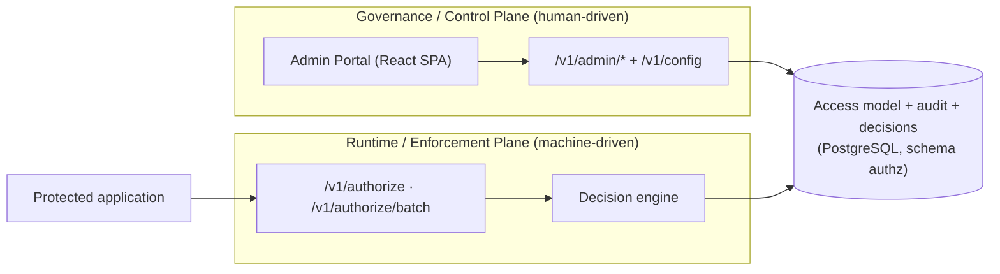
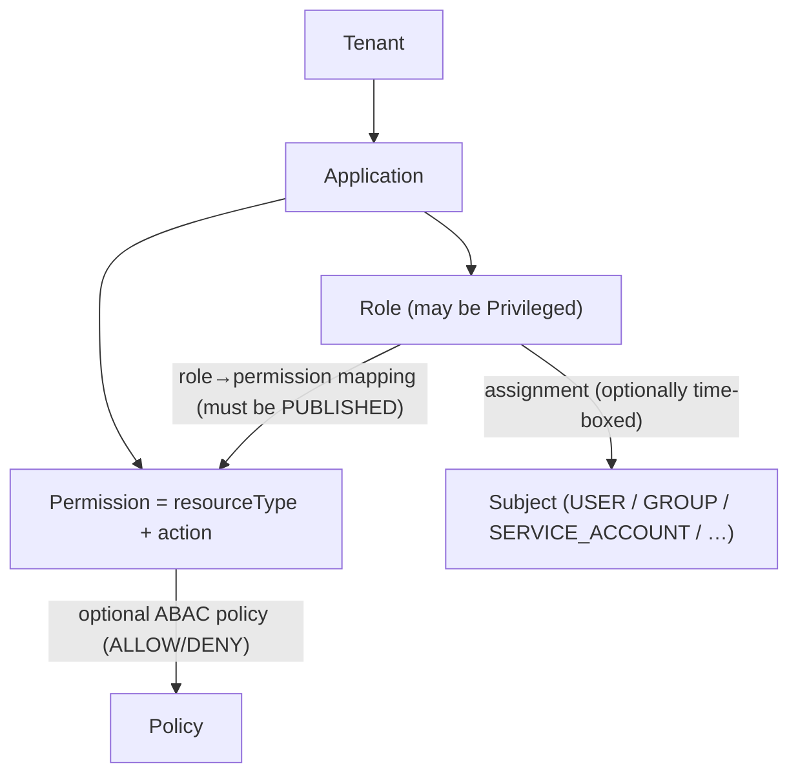
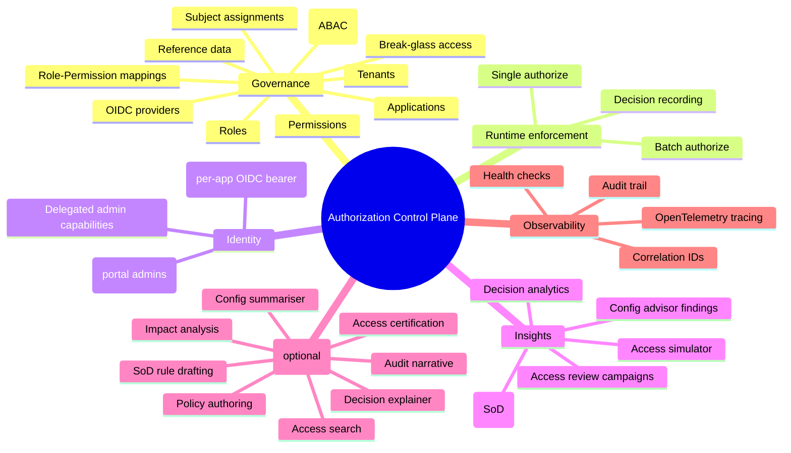
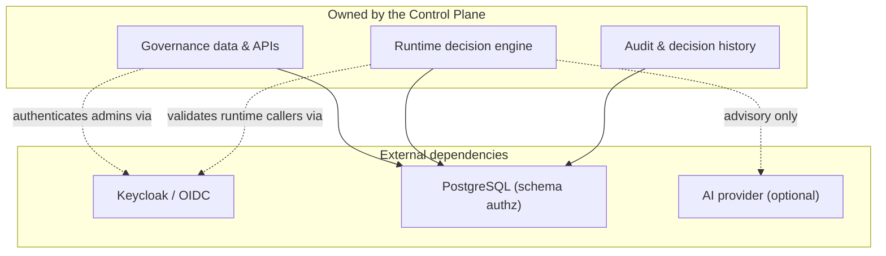
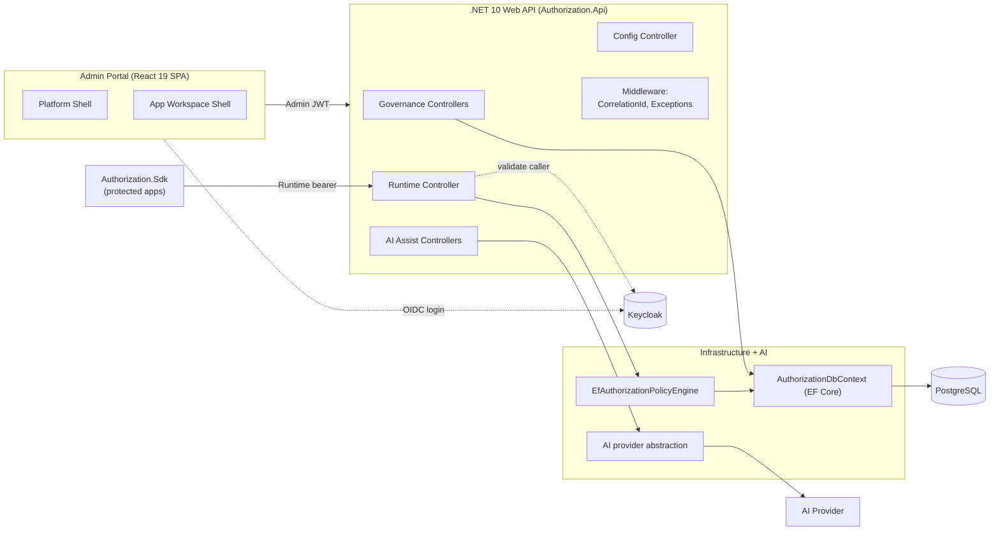
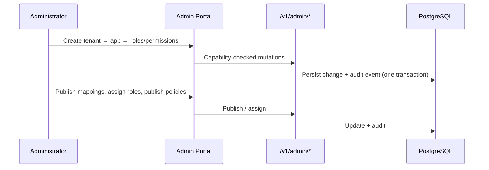

# 01 — Project Overview

> Part of the [Authorization Control Plane Documentation Portal](README.md).
> Related: [System Architecture](04_System_Architecture.md) · [Functional Requirements](02_Functional_Requirements.md) · [Feature Documentation](08_Feature_Documentation.md)

---

## Table of Contents

1. [Executive Summary](#executive-summary)
2. [Problem Statement & Motivation](#problem-statement--motivation)
3. [What Is the Authorization Control Plane?](#what-is-the-authorization-control-plane)
4. [Goals & Non-Goals](#goals--non-goals)
5. [Intended Audience & Personas](#intended-audience--personas)
6. [Core Concepts & Domain Language](#core-concepts--domain-language)
7. [The Authorization Model at a Glance](#the-authorization-model-at-a-glance)
8. [High-Level Capabilities](#high-level-capabilities)
9. [System Context & Boundaries](#system-context--boundaries)
10. [High-Level Architecture](#high-level-architecture)
11. [Solution & Repository Layout](#solution--repository-layout)
12. [Technology Stack at a Glance](#technology-stack-at-a-glance)
13. [Representative Workflows](#representative-workflows)
14. [Security & Identity at a Glance](#security--identity-at-a-glance)
15. [Running the System Locally](#running-the-system-locally)
16. [Project Status & Maturity](#project-status--maturity)
17. [How to Use This Documentation](#how-to-use-this-documentation)
18. [Cross-References](#cross-references)

---

## Executive Summary

The **Authorization Control Plane (ACP)** is a centralized system for **governing and enforcing
authorization** across many business applications. It replaces the common anti-pattern of hard-coding
role checks and entitlement logic inside every application with a single, auditable, versioned source
of truth for *who can do what*, and a low-latency service that answers *is this specific action
allowed right now?*

The system is built around a deliberate separation of two planes:

- A **governance (control) plane** — a delegated-administration web portal and `/v1/admin` APIs where
  administrators model tenants, applications, roles, permissions, role→permission mappings, subject
  assignments, and optional attribute-based policies.
- A **runtime (enforcement) plane** — the `POST /v1/authorize` and `POST /v1/authorize/batch`
  endpoints that protected applications call at request time to obtain an allow/deny decision with a
  structured reason and any obligations to enforce.

Access decisions are **deny-by-default** and combine **RBAC** (roles → permissions) with optional
**ABAC** (context-aware policy guardrails). Authentication is delegated to an external OIDC provider
(**Keycloak** locally). **Every governance change writes an audit event in the same transaction and
every runtime decision is recorded**, producing a complete, queryable trail. An **optional AI
advisory layer** assists with drafting, explaining, and summarizing — but is **off by default** and
**never makes an authorization decision**.

This repository is an **MVP / proof-of-concept**: a working end-to-end slice — .NET API, React portal,
client SDK, and a one-command local Docker Compose stack — intended to demonstrate the architecture,
not to be a production-hardened deployment.

## Problem Statement & Motivation

In a typical microservice or multi-application estate, authorization logic tends to be **scattered and
duplicated**: each service embeds its own role checks, entitlement tables, and ad-hoc "if user is
admin" branches. This creates recurring, expensive problems:

- **Inconsistency** — the same role means different things in different services; rules drift apart.
- **Poor auditability** — there is no single place to answer "who can do this?" or "why was this
  allowed?", and no reliable trail of who changed access and when.
- **Slow, risky change** — updating an access rule means editing, testing, and redeploying multiple
  applications.
- **Weak governance** — time-boxed access, break-glass grants, separation-of-duties, and periodic
  recertification are hard to implement uniformly.

The Authorization Control Plane addresses these by **externalizing and centralizing** both the
*definition* of access (governance) and the *evaluation* of access (runtime enforcement). Applications
stop owning authorization rules and instead **ask** the control plane. The result is one consistent
model, a complete audit and decision history, and the ability to change access policy without
redeploying the applications that depend on it.

## What Is the Authorization Control Plane?

The ACP is a service (plus an admin portal and SDK) that owns an organization's **access model** and
answers **authorization questions** about it. It is organized as two cooperating planes over one
shared data store:



- The **governance plane** is *human-driven* and *write-mostly*: administrators shape the access model
  and every change is capability-gated and audited.
- The **runtime plane** is *machine-driven* and *read-mostly*: protected applications ask for
  decisions at high volume and low latency; each decision is recorded for analytics and audit.

Both planes read and write the same authoritative store, which is what makes the model consistent and
the trail complete. The runtime plane implementation is
[RuntimeAuthorizationController.cs](../backend/src/Authorization.Api/Controllers/RuntimeAuthorizationController.cs)
delegating to the engine
[EfAuthorizationPolicyEngine.cs](../backend/src/Authorization.Infrastructure/RuntimeAuthorization/EfAuthorizationPolicyEngine.cs).

## Goals & Non-Goals

**Goals.**

- Provide **one source of truth** for the access model across many applications and tenants.
- **Decouple** access *governance* from access *enforcement* so policy can change without redeploying
  applications.
- Deliver **fast, deterministic runtime decisions** that are **deny-by-default** and return a
  structured reason and obligations.
- Support both **RBAC** (roles and permissions) and optional **ABAC** (attribute/context policies).
- Enable **delegated administration** with fine-grained, scoped capabilities.
- Guarantee **auditability**: every governance mutation is audited transactionally and every runtime
  decision is recorded.
- Offer **optional, advisory AI assistance** that is safe by construction (never on the decision path).

**Non-Goals (explicitly out of scope).**

- **Not an identity provider.** ACP does not store passwords or authenticate end users directly; it
  delegates authentication to an external OIDC provider (Keycloak locally).
- **Not automatic in-app enforcement.** Applications must *call* the runtime API (typically via the
  [SDK](../backend/src/Authorization.Sdk/AuthorizationClient.cs)); ACP does not intercept their traffic.
- **Not a general-purpose policy language.** ABAC conditions are limited to the supported match types,
  operators, and attribute namespaces (see [Business Rules](19_Business_Rules.md)).
- **Not AI-driven authorization.** AI features are advisory only and are disabled by default.
- **Not production-hardened.** High availability, multi-region, and hardened secrets management are
  beyond this MVP (see [Project Status & Maturity](#project-status--maturity)).

## Intended Audience & Personas

This documentation assumes **no prior knowledge** of the codebase. Every term is defined in the
[Glossary](24_Glossary.md), and each document links to the source files that implement the behavior it
describes.

| Persona | What they do with ACP | Typical rights | Start reading |
|---------|-----------------------|----------------|---------------|
| **Platform administrator** | Provision tenants and applications; manage platform settings and OIDC providers | `PlatformSuperAdmin` (broadest) | [User Manual](22_User_Manual.md) |
| **Delegated administrator** (tenant- or application-scoped) | Model roles, permissions, mappings, assignments, and policies within granted scope | Capability policies (e.g. `ManageRoles`, `AssignRoles`, `ManagePolicies`) | [Feature Documentation](08_Feature_Documentation.md) |
| **Access reviewer / auditor** | Run recertification campaigns; inspect audit trail, decision history, analytics | Read-only (`ReadOnlyView`, `ViewAudit`) | [User Flows](10_User_Flows.md) |
| **Application developer (integrator)** | Integrate a protected app with the runtime API to get allow/deny decisions | Runtime caller (per-app OIDC bearer) | [API Documentation](13_API_Documentation.md), [SDK](../backend/src/Authorization.Sdk/AuthorizationClient.cs) |
| **Backend / frontend engineer** | Extend or maintain the control plane itself | (developer) | [Developer Guide](21_Developer_Guide.md), [System Architecture](04_System_Architecture.md) |
| **Operator** | Run and observe the system locally; watch health, logs, traces | (operator) | [Developer Guide](21_Developer_Guide.md), [Logging & Observability](18_Logging_and_Observability.md) |
| **Security / compliance reviewer** | Validate the identity, capability, and audit model | (reviewer) | [Security Design](16_Security_Design.md) |

## Core Concepts & Domain Language

The access model is a hierarchy: a **tenant** owns **applications**; each application defines **roles**
and **permissions**, links them with **role→permission mappings**, grants roles to **subjects** via
**assignments**, and may add **policies**.



| Concept | Definition (as implemented) |
|---------|------------------------------|
| **Tenant** | Top-level ownership boundary. Entity `TenantEntity`; managed by [TenantsController.cs](../backend/src/Authorization.Api/Controllers/Governance/TenantsController.cs). |
| **Application** | A protected system registered under a tenant. Entity `ApplicationEntity`; carries a `SourceOfTruthMode`, a `PolicyCombiningAlgorithm`, a `riskLevel`, and a lifecycle status. Only `ACTIVE` applications resolve at runtime. |
| **Role** | A named bundle of access within one application. May be flagged `Privileged` (which forces time-boxed assignments). |
| **Permission** | A `resourceType` + `action` pair the application recognizes. Only `ACTIVE` permissions resolve at runtime. |
| **Role→permission mapping** | Links a role to a permission. Created as `DRAFT`; must be **`PUBLISHED`** before it grants any runtime access. |
| **Assignment** | Grants a subject a role, optionally time-boxed (`ValidFrom`/`ValidUntil`). Subjects are typed — `USER`, `GROUP`, `SERVICE_ACCOUNT`, `EXTERNAL_USER`, `TENANT`, or `APPLICATION`. At runtime the subject is derived **authoritatively from the verified token**, not from the request body. |
| **Break-glass** | An emergency, self-expiring assignment (1–24 h) requiring a reason; high-visibility in the audit trail. |
| **Policy** | An optional additive ABAC guardrail (`ALLOW`/`DENY`) with JSON conditions and obligations. Created `DRAFT`; only **`PUBLISHED`** policies affect runtime decisions. |
| **Obligation** | A directive returned with an `ALLOW` decision that the calling application must enforce (e.g. "require step-up auth"). |
| **Decision** | The result of a runtime authorization call — `allowed`, a structured **deny reason** if denied, matched roles/permissions/policies, and obligations. Recorded for analytics and audit. |
| **Capability** | A fine-grained permission a delegated admin holds (e.g. `ManageRoles`, `AssignRoles`), resolved from platform/tenant/application roles. |
| **Audit event** | An immutable record of a governance change, written in the same transaction as the change. |

Full definitions live in the [Glossary](24_Glossary.md); entity shapes are in the
[Data Model](14_Data_Model_Documentation.md).

## The Authorization Model at a Glance

A runtime decision is **deny-by-default** and evaluates RBAC first, then optional ABAC:

1. **Gates** — the application must be `ACTIVE` and a matching `ACTIVE` permission must exist for the
   requested `resourceType` + `action`; otherwise the decision denies outright (`APPLICATION_NOT_FOUND`
   / `PERMISSION_NOT_FOUND`).
2. **RBAC baseline** — the subject must have an **active assignment** to a role, and a **`PUBLISHED`**
   role→permission mapping must link that role to the requested permission. Absent this, the decision
   denies with the most specific reason (`ASSIGNMENT_REVOKED` > `ASSIGNMENT_EXPIRED` >
   `NO_ACTIVE_ASSIGNMENT`, or `PERMISSION_NOT_GRANTED`).
3. **ABAC refinement** — if the application has **`PUBLISHED`** policies for that permission, their JSON
   conditions are evaluated against the request context plus computed `system.*` (evaluation clock) and
   `reference.*` (reference-data) attributes. Policies are additive guardrails that `ALLOW` or `DENY`.
4. **Combining** — when several policies match, the application's configured **policy-combining
   algorithm** decides: `deny-overrides` (default), `allow-overrides`, or `first-applicable`.
5. **Result** — an allow/deny decision with a structured **deny reason** and any **obligations** for
   the caller to enforce. With no policies defined, a satisfied RBAC baseline simply `ALLOW`s.

The authoritative invariants, deny-reason ordering, and combining semantics are in
[Business Rules](19_Business_Rules.md); the engine algorithm is detailed in
[System Architecture](04_System_Architecture.md#the-authorization-decision-model) and the code path is
traced in [Code Walkthrough](23_Code_Walkthrough.md).

## High-Level Capabilities



The table below maps each capability area to where it is used and how it is guarded; each area is
expanded in [Feature Documentation](08_Feature_Documentation.md) and specified as requirements in
[Functional Requirements](02_Functional_Requirements.md).

| Capability area | Portal surface | API surface | Guarded by |
|-----------------|----------------|-------------|------------|
| Tenant / application governance | Platform shell pages | `/v1/admin/tenants`, `/v1/admin/applications` | `PlatformAdmin` + capability policies |
| Role / permission modeling | App workspace pages | `.../applications/{id}/roles`, `.../permissions`, `.../role-permissions` | `ManageRoles`, `ManagePermissions`, `MapRolePermission` |
| Access granting & lifecycle | Assignments page | `.../assignments`, `.../assignments/break-glass`, `.../revoke`, `.../import` | `AssignRoles` |
| Policy & reference-data authoring | Policies / Reference data pages | `.../policies`, `.../reference-data` | `ManagePolicies` |
| Access reviews (certification) | Certifications page | `.../review-campaigns` | `AssignRoles` |
| Runtime enforcement | (none — machine-to-machine) | `/v1/authorize`, `/v1/authorize/batch` | Per-app runtime caller authentication |
| Insights & analytics | Decisions, Activity, Access Lens | `.../decisions/analytics`, `/v1/admin/audit-events`, `.../users`, `.../insights/*` | `ReadOnlyView`, `AdminApi` |
| AI advisory | AI panels across pages | `.../ai/*` | `AdminApi` + per-feature availability flags |
| Server-owned configuration | (all pages, at bootstrap) | `/v1/config` | `AdminApi` |

## System Context & Boundaries

The control plane **owns** the authorization data, the decision engine, and the audit/decision
history. It **depends on** but does not own its identity provider, its database, and (optionally) an AI
provider.



**Depends on (but does not own):**

- **Keycloak / OIDC** — authenticates portal administrators (admin realm) and runtime callers
  (per-application OIDC providers). Configured via the `Oidc` options — see [Configuration](20_Configuration.md).
- **PostgreSQL** — all persistence, under schema `authz`.
- **An AI provider** — only when `Ai:Enabled` is true (Azure OpenAI, OpenAI, or the deterministic Fake).

**Explicitly does not:**

- Store user passwords or act as an identity provider (delegated to Keycloak).
- Enforce authorization inside protected applications automatically — applications must **call** the
  runtime API, typically through the [SDK](../backend/src/Authorization.Sdk/AuthorizationClient.cs).

## High-Level Architecture



The complete layered view, request lifecycle, middleware pipeline, and sequence diagrams are in
[System Architecture](04_System_Architecture.md); the design rationale is in
[Solution Design](05_Solution_Design.md).

## Solution & Repository Layout

The backend solution [AuthorizationControlPlane.slnx](../backend/AuthorizationControlPlane.slnx)
contains **four source projects** and **four test projects**; the portal and local stack live
alongside it.

| Area | Path | Responsibility |
|------|------|----------------|
| **Web API** (composition root) | [Authorization.Api](../backend/src/Authorization.Api/) | Controllers, authentication, authorization capability policies, middleware, DI, AI prompt/insight builders. References Infrastructure + AI. |
| **Infrastructure** | [Authorization.Infrastructure](../backend/src/Authorization.Infrastructure/) | EF Core `DbContext`, entities, migrations, and the runtime authorization engine. |
| **AI** | [Authorization.Ai](../backend/src/Authorization.Ai/) | AI provider abstraction, options, availability snapshot, and chat + fake assistants. |
| **SDK** | [Authorization.Sdk](../backend/src/Authorization.Sdk/) | Typed, resilient HTTP client protected applications use to call the runtime API (talks HTTP only — no in-solution references). |
| **Admin portal** | [frontend/](../frontend/) | React 19 SPA with platform and application-workspace shells. |
| **Local stack** | [deploy/local/](../deploy/local/) | Docker Compose wiring PostgreSQL, Keycloak, the API, and the portal. |
| **Docs** | [documentation/](README.md) | This documentation suite (24 numbered guides + index). |

**Dependency direction:** the API depends on Infrastructure and AI; the SDK is standalone (HTTP only);
Infrastructure and AI do not depend on the API. Test projects are `Authorization.Api.Tests`,
`Authorization.ContractTests`, `Authorization.Infrastructure.Tests`, and `Authorization.Sdk.Tests`.
Backend module detail is in [Module Design](12_Module_Design.md), the frontend in
[Component Design](11_Component_Design.md), and the full tree in
[Repository Structure](07_Repository_Structure.md).

## Technology Stack at a Glance

| Layer | Technology | Notes |
|-------|-----------|-------|
| API | **.NET 10** ASP.NET Core Web API | Controllers, nullable enabled |
| Persistence | **EF Core 10** + **Npgsql** on **PostgreSQL** | Schema `authz`; optimistic concurrency via an integer `Version` token |
| Admin portal | **React 19** + **Vite**, **TypeScript** | `react-router`, `@tanstack/react-query`, `oidc-client-ts` (PKCE), `d3` visualizations |
| Identity | **Keycloak** (OIDC) | Admin auth-code + PKCE; per-application runtime OIDC providers |
| Observability | **OpenTelemetry** | Correlation IDs, tracing, structured JSON logs, health checks |
| AI (optional) | **Azure OpenAI / OpenAI / Fake** | Pluggable via `Ai:Provider`; off by default |
| Local runtime | **Docker Compose** | One-command Postgres + Keycloak + API + portal |

Exact versions and rationale are in [Technology Stack](06_Technology_Stack.md).

## Representative Workflows

**Govern an application (control plane).** A platform admin creates a tenant and an application; a
delegated admin defines roles and permissions, **publishes** role→permission mappings, assigns roles to
subjects (optionally time-boxed), and optionally publishes ABAC policies. Every step is capability-gated
and writes an audit event.



**Enforce a decision (runtime plane).** A protected application presents its runtime bearer token and
asks whether a subject may perform an action; the engine evaluates RBAC then ABAC and returns a decision
that is recorded.

```mermaid
sequenceDiagram
    participant App as Protected App (SDK)
    participant RC as Runtime Controller
    participant ENG as Decision Engine
    participant DB as PostgreSQL
    App->>RC: POST /v1/authorize (bearer + subject/resource/action)
    RC->>RC: Validate caller token; derive authoritative subject
    RC->>ENG: Evaluate (deny-by-default)
    ENG->>DB: Resolve app, permission, assignments, mappings, policies
    ENG-->>RC: allowed + denyReason? + obligations
    RC-->>App: Decision (recorded for analytics/audit)
```

End-to-end journeys for both planes are in [User Flows](10_User_Flows.md).

## Security & Identity at a Glance

ACP has **two distinct identity planes**, both delegated to OIDC:

- **Administrators** sign in to the portal via the OIDC authorization-code flow with **PKCE (`S256`)**;
  their JWT is validated by the API under the `AdminJwt` scheme. Portal authorization is then enforced
  by **delegated-admin capabilities** resolved from platform/tenant/application roles — e.g.
  `ManageRoles`, `AssignRoles`, `ManagePolicies`, `ViewAudit`, `ReadOnlyView` — scoped to the target
  tenant/application. Missing capability → `403`; unauthenticated → `401`.
- **Runtime callers** (protected applications) present a bearer token issued by an OIDC provider
  registered for that application; the runtime endpoints self-validate the token in the controller
  (via `RuntimeCallerAuthenticator`, which supports **multiple issuers per application**) and derive
  the subject authoritatively from the token — a request body that contradicts the token is rejected.

The full model — schemes, capability resolution, token validation, and the runtime trust chain — is in
[Security Design](16_Security_Design.md).

## Running the System Locally

The entire stack runs with **Docker Compose**
([deploy/local/docker-compose.yml](../deploy/local/docker-compose.yml)) under the project
`authorization-control-plane`:

| Service | Container | Host port |
|---------|-----------|-----------|
| PostgreSQL (`postgres:17-alpine`) | `acp-postgres` | `5432` |
| Keycloak (`26.1`, realm `authorization-local`) | `acp-keycloak` | `8081 → 8080` |
| API | `acp-api` | `8080` |
| Portal (nginx) | `acp-portal` | `5173 → 80` |

Helper scripts in [scripts/](../scripts/) wrap common tasks (`dev-up.ps1`, `dev-down.ps1`,
`dev-reset.ps1`, `local-smoke.ps1`). Startup ordering, seeded data, environment variables, and secrets
handling are documented in the [Developer Guide](21_Developer_Guide.md) and [Configuration](20_Configuration.md).

## Project Status & Maturity

This repository is an **MVP / proof-of-concept**, not a production system. What that means concretely:

- **Implemented and working end-to-end:** the full governance model, the deny-by-default RBAC+ABAC
  runtime engine, decision recording and analytics, audit trail, delegated-admin capability
  enforcement, the React portal, the client SDK, and a one-command local stack with seeded demo data.
- **Optional / illustrative:** the AI advisory layer (off by default, provider-pluggable, and
  substitutable with a deterministic Fake for tests and demos).
- **Intentionally out of scope for now:** production hardening such as high availability, multi-region
  deployment, hardened secret management, and performance tuning beyond the MVP latency target for
  `/v1/authorize`. Non-functional targets are stated in
  [Non-Functional Requirements](03_Non_Functional_Requirements.md).

Treat code links in this suite as the source of truth; where documentation and code disagree, the code
wins and the docs should be corrected.

## How to Use This Documentation

Read by intent:

- **Understand the system** → this overview, then [System Architecture](04_System_Architecture.md) and
  [Solution Design](05_Solution_Design.md).
- **Know what it must do** → [Functional Requirements](02_Functional_Requirements.md) and
  [Non-Functional Requirements](03_Non_Functional_Requirements.md).
- **Build or extend it** → [Technology Stack](06_Technology_Stack.md),
  [Repository Structure](07_Repository_Structure.md), [Developer Guide](21_Developer_Guide.md),
  [Code Walkthrough](23_Code_Walkthrough.md).
- **Integrate an application** → [API Documentation](13_API_Documentation.md) and the
  [SDK](../backend/src/Authorization.Sdk/AuthorizationClient.cs).
- **Use the portal** → [User Manual](22_User_Manual.md), [User Flows](10_User_Flows.md),
  [Feature Documentation](08_Feature_Documentation.md), [UI/UX](09_UI_UX_Documentation.md).
- **Review security & data** → [Security Design](16_Security_Design.md),
  [Data Model](14_Data_Model_Documentation.md), [Business Rules](19_Business_Rules.md).
- **Operate it** → [Configuration](20_Configuration.md),
  [Logging & Observability](18_Logging_and_Observability.md), [Error Handling](17_Error_Handling.md).
- **Look up a term** → [Glossary](24_Glossary.md).

The complete index is in the [documentation portal README](README.md).

## Cross-References

- **What the system must do:** [Functional Requirements](02_Functional_Requirements.md), [Non-Functional Requirements](03_Non_Functional_Requirements.md)
- **How it is built:** [System Architecture](04_System_Architecture.md), [Solution Design](05_Solution_Design.md)
- **What technologies power it:** [Technology Stack](06_Technology_Stack.md)
- **How the code is organized:** [Repository Structure](07_Repository_Structure.md), [Module Design](12_Module_Design.md), [Component Design](11_Component_Design.md)
- **How access is decided:** [Business Rules](19_Business_Rules.md), [Code Walkthrough](23_Code_Walkthrough.md)
- **How to run it:** [Developer Guide](21_Developer_Guide.md), [Configuration](20_Configuration.md)
- **How to use it:** [User Manual](22_User_Manual.md), [User Flows](10_User_Flows.md)
- **Security & identity:** [Security Design](16_Security_Design.md)
- **Optional AI:** [AI Features](15_AI_Features.md)
- **Terminology:** [Glossary](24_Glossary.md)
