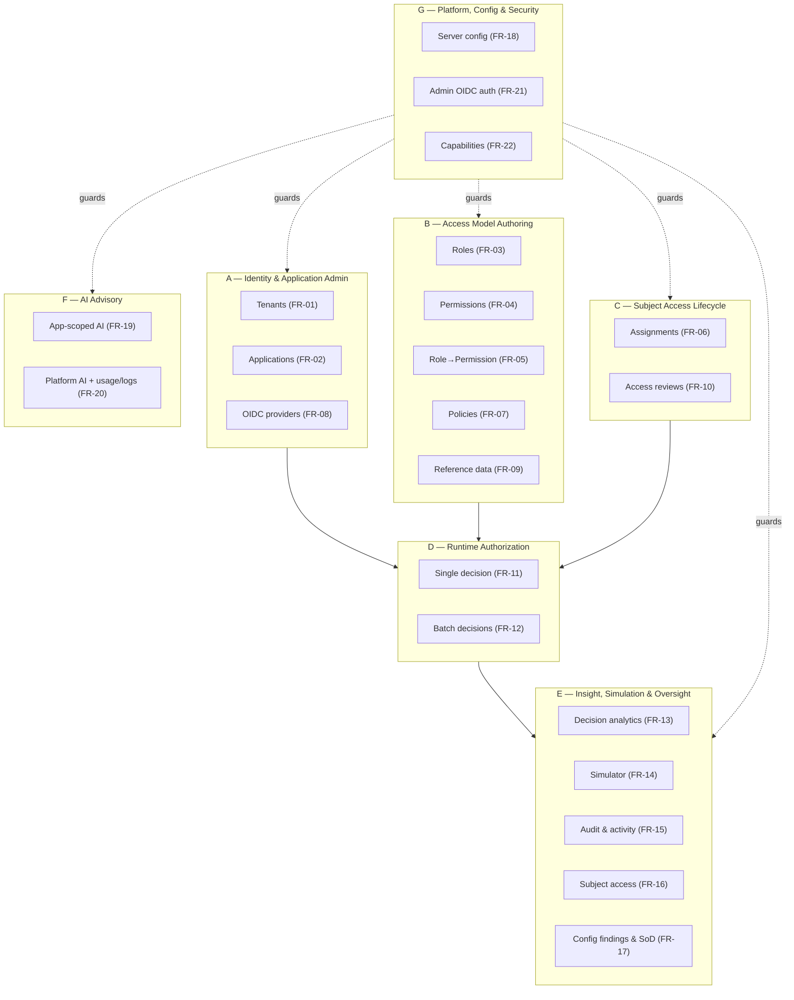
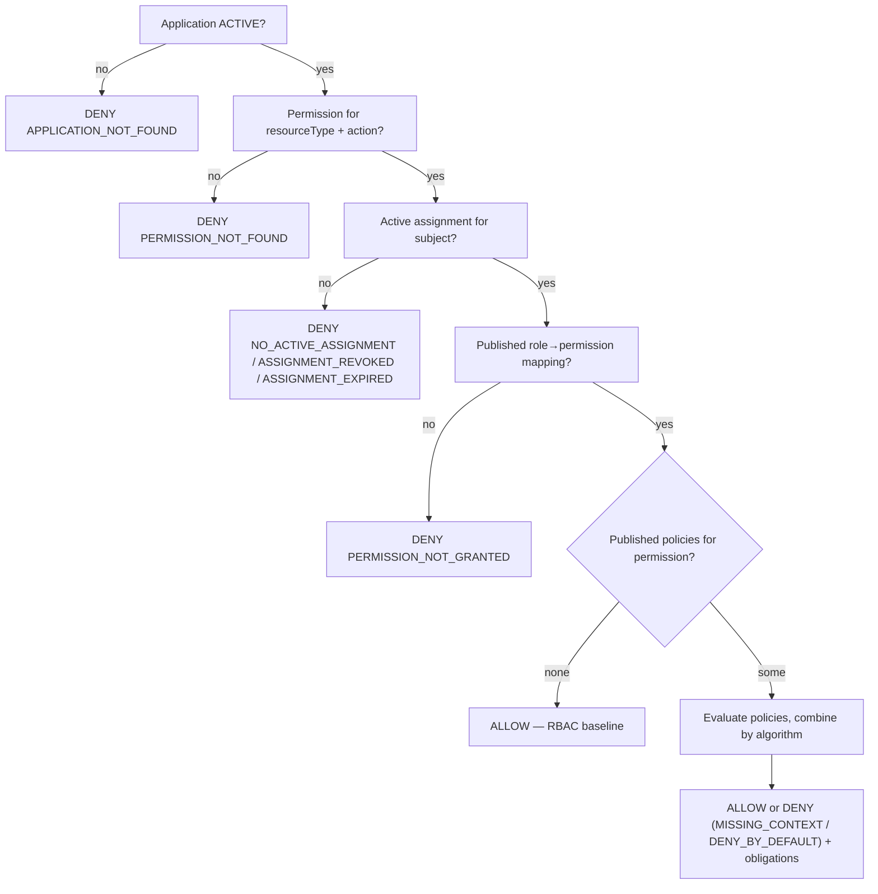

# 02 — Functional Requirements

> Part of the [Documentation Portal](README.md).
> Related: [Project Overview](01_Project_Overview.md) · [Feature Documentation](08_Feature_Documentation.md) · [API Documentation](13_API_Documentation.md) · [Business Rules](19_Business_Rules.md)

---

## Table of Contents

1. [Purpose & Scope](#purpose--scope)
2. [Intended Audience & How to Read This Document](#intended-audience--how-to-read-this-document)
3. [System Actors & Roles](#system-actors--roles)
4. [Requirement Conventions](#requirement-conventions)
5. [Functional Scope Overview](#functional-scope-overview)
6. [Cross-Cutting Functional Rules](#cross-cutting-functional-rules)
7. [Requirement Catalog](#requirement-catalog)
8. [Domain A — Identity & Application Administration](#domain-a--identity--application-administration)
9. [Domain B — Access Model Authoring](#domain-b--access-model-authoring)
10. [Domain C — Subject Access Lifecycle](#domain-c--subject-access-lifecycle)
11. [Domain D — Runtime Authorization](#domain-d--runtime-authorization)
12. [Domain E — Decision Insight, Simulation & Oversight](#domain-e--decision-insight-simulation--oversight)
13. [Domain F — AI Advisory](#domain-f--ai-advisory)
14. [Domain G — Platform, Configuration & Security](#domain-g--platform-configuration--security)
15. [Data Validation & Limits](#data-validation--limits)
16. [Functional Error-Code Catalog](#functional-error-code-catalog)
17. [Assumptions, Constraints & Dependencies](#assumptions-constraints--dependencies)
18. [Out of Scope / Non-Goals](#out-of-scope--non-goals)
19. [Traceability Matrix](#traceability-matrix)
20. [Cross-References](#cross-references)

---

## Purpose & Scope

This document specifies the **functional requirements** the Authorization Control Plane actually
implements — *what the system does*, expressed as discrete, verifiable requirements. Each requirement
has a stable **FR ID**, an owning **actor**, a **priority**, its inputs/outputs, its validation and
error behavior, testable **acceptance criteria**, and a pointer to the implementing code.

**In scope:** the behavior exposed by the backend API and consumed by the admin portal — governance
(modeling access), runtime enforcement (deciding access), oversight (audit, analytics, reviews,
insights), AI advisory assistance, and the authentication/authorization that guards all of it.

**Out of scope (documented elsewhere):** *why* the system is built this way ([Solution Design](05_Solution_Design.md)),
*how* a request is structured on the wire ([API Documentation](13_API_Documentation.md)), the *rules*
that constrain decisions ([Business Rules](19_Business_Rules.md)), quality attributes such as latency
and scalability ([Non-Functional Requirements](03_Non_Functional_Requirements.md)), and data shapes
([Data Model](14_Data_Model_Documentation.md)). This document references those rather than repeating
them.

**Source of truth.** Every requirement is reverse-engineered from the repository; behavior not present
in the code is not documented here. Machine-readable error codes are the exact string constants from
[GovernanceErrorCodes.cs](../backend/src/Authorization.Api/Constants/GovernanceErrorCodes.cs) and the
runtime controller.

## Intended Audience & How to Read This Document

| Reader | How to use it |
|--------|---------------|
| Product / QA | Read [System Actors](#system-actors--roles), the [Requirement Catalog](#requirement-catalog), and the **Acceptance Criteria** under each FR to derive test cases. |
| Backend engineers | Follow each FR's *primary code* link and the [Traceability Matrix](#traceability-matrix). |
| Frontend engineers | Map the *portal surface* column of the matrix to the API endpoints. |
| Security reviewers | Focus on [Domain G](#domain-g--platform-configuration--security) (authn/authz) and the capability column throughout. |

FRs are grouped into seven **capability domains** (A–G). Requirements that share behavior (the seven
governance CRUD entities) are specified once as a [common contract](#cross-cutting-functional-rules)
and then differentiated in a table, so the same rules are never restated seven times.

## System Actors & Roles

The system serves two fundamentally different kinds of caller — **humans administering access** and
**machines enforcing it** — plus the identity providers that authenticate them. Human administrators
act through **delegated-admin roles** resolved from OIDC claims at three scopes (platform, tenant,
application).

| Actor | Kind | Authenticated by | Scope & rights |
|-------|------|------------------|----------------|
| **Platform Super Admin** | Human | Admin IdP (`acp_platform_role`) | All applications/tenants; every capability, including creating tenants and applications. |
| **Platform Read-Only Viewer** | Human | Admin IdP (`acp_platform_role`) | Read-only across everything (`ViewAudit`, `ReadOnlyView`). |
| **Tenant Admin** | Human | Admin IdP (`acp_tenant_role`) | Full management of every application under one tenant. |
| **Tenant Read-Only Viewer** | Human | Admin IdP (`acp_tenant_role`) | Read-only across one tenant's applications. |
| **Application Admin** | Human | Admin IdP (`acp_app_role`) | Full management of a single application (roles, permissions, mappings, assignments, policies, reviews). |
| **Application Read-Only Viewer** | Human | Admin IdP (`acp_app_role`) | Read-only view of a single application. |
| **Access Reviewer** | Human | Admin IdP (holds `AssignRoles`) | Decides items in access-review campaigns; a role played via the assignment capability, not a separate identity. |
| **Protected Application (machine caller)** | Machine | The application's own registered OIDC provider | Calls `/v1/authorize[/batch]` for its own application only; cannot reach `/v1/admin/*`. |

The delegated-admin **capabilities** these roles resolve to are: `ManageApplication`, `ManageRoles`,
`ManagePermissions`, `MapRolePermission`, `ManagePolicies`, `AssignRoles`, `ViewAudit`, `ReadOnlyView`
(see [FR-22](#fr-22--enforce-delegated-admin-capabilities) and [Security Design](16_Security_Design.md)).

## Requirement Conventions

**Requirement ID.** `FR-NN`, stable across revisions. IDs are never reused or renumbered.

**Requirement attributes.** Each detailed requirement is described with: *Actor*, *Priority*,
*Preconditions*, *Inputs*, *Behavior*, *Outputs*, *Validation & failures*, and *Acceptance criteria*.
CRUD entities that share behavior reference the [common contract](#the-common-governance-crud-contract)
instead of restating it.

**Priority (MoSCoW).** `Must` — core to the product's purpose; `Should` — important but the system is
useful without it; `Could` — value-adding/optional (e.g. AI). Priorities describe *product importance*,
not implementation status (everything listed is implemented).

**Verification method.** `Test` — automated unit/integration test; `Demo` — observable via the portal;
`Inspect` — verified by code/contract inspection. Shown in the [Traceability Matrix](#traceability-matrix).

**Tracing.** Every requirement traces to one or more of: **controllers**
([Authorization.Api/Controllers](../backend/src/Authorization.Api/Controllers/)), the **runtime engine**
([EfAuthorizationPolicyEngine.cs](../backend/src/Authorization.Infrastructure/RuntimeAuthorization/EfAuthorizationPolicyEngine.cs)),
**governance validators** ([Authorization.Api/Governance](../backend/src/Authorization.Api/Governance/)),
and **portal hooks** ([frontend/src/api/hooks.ts](../frontend/src/api/hooks.ts)).

## Functional Scope Overview

The functional surface groups into seven domains. Governance (A–C) is human-driven and capability-gated;
enforcement (D) is machine-driven; oversight and assistance (E–F) are read-mostly; platform services (G)
underpin everything.

## Cross-Cutting Functional Rules

These rules apply across many requirements and are stated once here.

### The common governance CRUD contract

Tenants, applications, roles, permissions, role→permission mappings, OIDC providers, and reference
data (**FR-01–FR-05, FR-08, FR-09**) are managed through controllers deriving from
[GovernanceControllerBase](../backend/src/Authorization.Api/Controllers/Governance/) and share one
contract:

- **Preconditions.** The caller is an authenticated admin whose delegated-admin roles grant the
  entity's capability, and every parent entity (tenant → application → role/permission) already exists.
- **Inputs.** Strongly-typed records from
  [GovernanceRequests.cs](../backend/src/Authorization.Api/Contracts/GovernanceRequests.cs), validated
  by data-annotation attributes and `[AllowedValues]` for status/enum fields.
- **Outputs.** The persisted entity (a typed record from
  [GovernanceResponses.cs](../backend/src/Authorization.Api/Contracts/GovernanceResponses.cs)) **plus an
  audit event written in the same transaction**, so every change is attributable.
- **Uniform failures.** Malformed/missing fields → **422 `VALIDATION_ERROR`** (or a 400 model-binding
  error via the canonical envelope); duplicate natural key → **409 `*_EXISTS`**; missing entity/parent
  → **404 `*_NOT_FOUND`**; deleting something still referenced → **409 `*_IN_USE`**; missing capability
  → **403 `FORBIDDEN`**; unauthenticated → **401**.
- **Retire-by-status over delete.** Entities with a status vocabulary are retired by transitioning to
  `DISABLED`/`ARCHIVED`; non-`ACTIVE` applications, permissions, and reference data are excluded from
  runtime resolution, so retiring is preferred over deletion.

| FR | Entity | Duplicate → 409 | Not found → 404 | Referential / lifecycle guard | Mutate capability |
|----|--------|-----------------|-----------------|-------------------------------|-------------------|
| FR-01 | Tenant | `TENANT_EXISTS` | `TENANT_NOT_FOUND` | `TENANT_IN_USE` — still owns applications | `PlatformAdmin` |
| FR-02 | Application | `APPLICATION_EXISTS` | `APPLICATION_NOT_FOUND` | retire via `ACTIVE`→`DISABLED`/`ARCHIVED` | create: `PlatformAdmin`; edit: `ManageApplication` |
| FR-03 | Role | `ROLE_EXISTS` | `ROLE_NOT_FOUND` | `ROLE_IN_USE` — has assignments or grants | `ManageRoles` |
| FR-04 | Permission | `PERMISSION_EXISTS` | `PERMISSION_NOT_FOUND` | `PERMISSION_IN_USE` — mapped to roles/policies (soft-delete) | `ManagePermissions` |
| FR-05 | Role→permission mapping | — | `ROLE_PERMISSION_NOT_FOUND` | `DRAFT`→`PUBLISHED`; only published grants resolve | `MapRolePermission` |
| FR-08 | OIDC provider | — | `OIDC_PROVIDER_NOT_FOUND` | algorithm `none` rejected (422) | `ManageApplication` |
| FR-09 | Reference data | `REFERENCE_DATA_EXISTS` | `REFERENCE_DATA_NOT_FOUND` | invalid value shape → 422 `REFERENCE_DATA_VALUE_INVALID`; soft-delete to `ARCHIVED` | `ManagePolicies` |

### Error model

All errors are returned through the **canonical error envelope** `{ error: { code, message }, correlationId }`
(see [Error Handling](17_Error_Handling.md)). `code` values are stable machine-readable strings; clients
switch on `code`, never on `message`. The `correlationId` echoes the request's `X-Correlation-ID`.

### Pagination, filtering & sorting

List endpoints accept `page` and `pageSize` and return `PagedResult<T>` (`items`, `page`, `pageSize`,
`total`). The default page size is **25** and the server-enforced maximum is **200**
([Pagination.cs](../backend/src/Authorization.Api/Contracts/Pagination.cs)); the portal offers page-size
choices `[10, 25, 50, 100]`. Most list endpoints accept a free-text `q` filter plus entity-specific
filters (e.g. `status`, `state`, `riskLevel`).

### Validation limits & audit

Runtime and bulk operations are bounded (see [Data Validation & Limits](#data-validation--limits)). Every
successful mutation writes an audit event atomically (FR-15), and governed entities carry an optimistic
concurrency token so concurrent edits fail rather than silently overwrite.

## Requirement Catalog

| FR | Requirement | Domain | Priority | Primary code |
|----|-------------|--------|----------|--------------|
| FR-01 | Manage tenants (CRUD) | A | Must | [TenantsController.cs](../backend/src/Authorization.Api/Controllers/Governance/TenantsController.cs) |
| FR-02 | Manage applications & lifecycle status | A | Must | [ApplicationsController.cs](../backend/src/Authorization.Api/Controllers/Governance/ApplicationsController.cs) |
| FR-08 | Manage per-application OIDC providers | A | Must | [OidcProvidersController.cs](../backend/src/Authorization.Api/Controllers/Governance/OidcProvidersController.cs) |
| FR-03 | Manage roles & role status | B | Must | [RolesController.cs](../backend/src/Authorization.Api/Controllers/Governance/RolesController.cs) |
| FR-04 | Manage permissions & permission status | B | Must | [PermissionsController.cs](../backend/src/Authorization.Api/Controllers/Governance/PermissionsController.cs) |
| FR-05 | Map roles to permissions with draft/publish | B | Must | [RolePermissionsController.cs](../backend/src/Authorization.Api/Controllers/Governance/RolePermissionsController.cs) |
| FR-07 | Author, validate & publish policies | B | Should | [PoliciesController.cs](../backend/src/Authorization.Api/Controllers/Governance/PoliciesController.cs) |
| FR-09 | Manage reference data | B | Should | [ReferenceDataController.cs](../backend/src/Authorization.Api/Controllers/Governance/ReferenceDataController.cs) |
| FR-06 | Assign roles to subjects (+ break-glass, revoke, extend, import/export) | C | Must | [AssignmentsController.cs](../backend/src/Authorization.Api/Controllers/Governance/AssignmentsController.cs) |
| FR-10 | Run access-review (certification) campaigns | C | Should | [ReviewCampaignsController.cs](../backend/src/Authorization.Api/Controllers/Governance/ReviewCampaignsController.cs) |
| FR-11 | Evaluate a runtime decision (single) | D | Must | [RuntimeAuthorizationController.cs](../backend/src/Authorization.Api/Controllers/RuntimeAuthorizationController.cs) |
| FR-12 | Evaluate a batch of decisions | D | Must | [RuntimeAuthorizationController.cs](../backend/src/Authorization.Api/Controllers/RuntimeAuthorizationController.cs) |
| FR-13 | Record & analyze decisions | E | Should | [DecisionAnalyticsController.cs](../backend/src/Authorization.Api/Controllers/DecisionAnalyticsController.cs) |
| FR-14 | Simulate an access decision | E | Should | [GovernanceInsightsController.cs](../backend/src/Authorization.Api/Controllers/Governance/GovernanceInsightsController.cs) |
| FR-15 | Query audit events & activity summary | E | Must | [GovernanceInsightsController.cs](../backend/src/Authorization.Api/Controllers/Governance/GovernanceInsightsController.cs) |
| FR-16 | View a subject's aggregated access | E | Should | [GovernanceInsightsController.cs](../backend/src/Authorization.Api/Controllers/Governance/GovernanceInsightsController.cs) |
| FR-17 | Deterministic insights (config findings, SoD) | E | Should | [ApplicationInsightsController.cs](../backend/src/Authorization.Api/Controllers/ApplicationInsightsController.cs) |
| FR-19 | AI advisory features (app-scoped) | F | Could | [AiAssistController.cs](../backend/src/Authorization.Api/Controllers/AiAssistController.cs) |
| FR-20 | AI advisory features (platform-scoped) + usage/logs | F | Could | [PlatformAiAssistController.cs](../backend/src/Authorization.Api/Controllers/PlatformAiAssistController.cs) |
| FR-18 | Provide server-owned portal configuration | G | Must | [ConfigController.cs](../backend/src/Authorization.Api/Controllers/ConfigController.cs) |
| FR-21 | Authenticate portal admins via OIDC | G | Must | [auth.ts](../frontend/src/auth.ts) + [Authentication](../backend/src/Authorization.Api/Authentication/) |
| FR-22 | Enforce delegated-admin capabilities | G | Must | [DelegatedAdminAuthorizationHandler.cs](../backend/src/Authorization.Api/Authorization/DelegatedAdminAuthorizationHandler.cs) |

## Domain A — Identity & Application Administration

### FR-01 — Manage Tenants · FR-02 — Manage Applications · FR-08 — Manage OIDC Providers

These follow the [common governance CRUD contract](#the-common-governance-crud-contract); domain-specific
points:

- **FR-01 Tenant** *(Actor: Platform Super Admin · Priority: Must)* — the top of the hierarchy;
  `GET /v1/admin/tenants` is visible to any admin (filtered to their scope), while create/update require
  `PlatformAdmin`. A tenant that still owns applications cannot be deleted (`TENANT_IN_USE`).
- **FR-02 Application** *(Actor: Platform/Tenant/Application Admin · Priority: Must)* — an application
  owns its entire access model and carries metadata (`ownerTeam`, `riskLevel` ∈ {LOW, MEDIUM, HIGH,
  CRITICAL}, `sourceOfTruthMode`, `policyCombiningAlgorithm`). Creating an application requires
  `PlatformAdmin`; editing requires `ManageApplication`. Applications are retired by status, never
  deleted, so history and audit remain intact.
- **FR-08 OIDC Provider** *(Actor: Application Admin · Priority: Must)* — registers the issuer(s) whose
  tokens a protected application may present at runtime (issuer, JWKS URI, audience, allowed algorithms,
  required claims, subject claim, subject type). The insecure `none` algorithm is rejected with 422. This
  is the data that makes runtime authentication **multi-issuer** (see [FR-11](#fr-11--runtime-authorization-decision-single)).

**Acceptance criteria (representative).**
- AC-A1: Creating a tenant/application/provider with a duplicate natural key returns 409 `*_EXISTS`.
- AC-A2: A non-`PlatformAdmin` creating a tenant or application receives 403 `FORBIDDEN`.
- AC-A3: Registering an OIDC provider with `algorithm = none` returns 422 `VALIDATION_ERROR`.
- AC-A4: Every successful create/update/delete writes exactly one audit event in the same transaction.

## Domain B — Access Model Authoring

### FR-03 — Roles · FR-04 — Permissions · FR-05 — Role→Permission Mappings · FR-09 — Reference Data

These follow the [common CRUD contract](#the-common-governance-crud-contract):

- **FR-03 Role** *(Actor: Application Admin · `ManageRoles` · Must)* — roles carry `privileged`,
  `riskLevel`, and `status`; a role with assignments or grants cannot be deleted (`ROLE_IN_USE`).
  `privileged` roles trigger the mandatory-expiry rule on assignment (FR-06).
- **FR-04 Permission** *(Actor: Application Admin · `ManagePermissions` · Must)* — the `(resource,
  action)` pair the runtime engine resolves. Deleting a permission that is mapped or referenced by a
  policy soft-deletes it and returns `PERMISSION_IN_USE` where a hard delete was requested.
- **FR-05 Role→Permission Mapping** *(Actor: Application Admin · `MapRolePermission` · Must)* — the RBAC
  grant. Created as `DRAFT`, then explicitly **published**; **only `PUBLISHED` mappings are read by the
  runtime engine**, so drafts never affect live decisions.
- **FR-09 Reference Data** *(Actor: Application Admin · `ManagePolicies` · Should)* — application-scoped
  JSON documents that policy conditions read via the `reference.<key>` namespace; invalid value shapes
  return 422 `REFERENCE_DATA_VALUE_INVALID`; removal soft-deletes to `ARCHIVED`.

### FR-07 — Author, Validate & Publish Policies

- **Actor / Priority.** Application Admin (`ManagePolicies`) · Should.
- **Goal.** Layer optional **ABAC** guardrails on top of the RBAC baseline.
- **Inputs.** `CreatePolicyRequest` (`policyKey`, `permissionKey`, `effect` ∈ {`ALLOW`, `DENY`},
  `conditions` JSON, `priority`, `obligations` JSON, `publish` flag).
- **Behavior / lifecycle.** A policy is created `DRAFT`, may be edited while draft, and is then
  `PUBLISHED` (create-and-publish in one call is also supported). Editing a published policy is rejected.
  **Only `PUBLISHED` policies affect runtime decisions.** A `history` endpoint returns the change log.
- **Validation.** Conditions are validated by
  [PolicyConditionValidator.cs](../backend/src/Authorization.Api/Governance/PolicyConditionValidator.cs) —
  match types `all`/`any`/`none` over leaf conditions `{ attribute, operator, value }`, with operators
  from [PolicyOperators.cs](../backend/src/Authorization.Infrastructure/RuntimeAuthorization/PolicyOperators.cs)
  (comparison, text, set, date/range, presence). Obligations are validated by
  [PolicyObligationsValidator.cs](../backend/src/Authorization.Api/Governance/PolicyObligationsValidator.cs)
  (a JSON array of bare-string IDs or `{ id, value? }`; duplicate IDs rejected).
- **Failures.** Invalid conditions → 422 `POLICY_CONDITIONS_INVALID`; invalid obligations → 422
  `POLICY_OBLIGATIONS_INVALID`; editing a non-draft → 409 `POLICY_NOT_EDITABLE`; missing → 404
  `POLICY_NOT_FOUND`.
- **Acceptance criteria.**
  - AC-B1: A `PUBLISHED` mapping is required for any RBAC allow; a `DRAFT` mapping never grants access.
  - AC-B2: Publishing a policy with malformed conditions is rejected with `POLICY_CONDITIONS_INVALID`
    and no state change.
  - AC-B3: A `PUT` on a published policy returns `POLICY_NOT_EDITABLE`.
  - AC-B4: An obligation array with duplicate IDs is rejected with `POLICY_OBLIGATIONS_INVALID`.

## Domain C — Subject Access Lifecycle

### FR-06 — Assign Roles to Subjects (full lifecycle)

- **Actor / Priority.** Application Admin / Access Reviewer (`AssignRoles`) · Must.
- **Goal.** Grant a subject (user, group, or service account) a role within an application, optionally
  time-boxed, and manage that grant through its life (create, break-glass, revoke, extend, edit,
  import, export).
- **Preconditions.** Caller holds `AssignRoles` for the application; the application, role, and subject
  exist.
- **Operations.**

| Operation | Endpoint | Behavior |
|-----------|----------|----------|
| Create | `POST .../assignments` | Persists an `ACTIVE` assignment; audit `ASSIGNMENT_CREATED`. |
| Break-glass | `POST .../assignments/break-glass` | Emergency, self-expiring grant; requires a `reason` and `durationHours` (clamped **1–24**); `source = EMERGENCY`; high-visibility audit. |
| Revoke | `POST .../assignments/{id}/revoke` | Sets `state = REVOKED`, `revokedAt = now`; audit `ASSIGNMENT_REVOKED`. |
| Extend | `POST .../assignments/{id}/extend` | Updates `validUntil`; audit `ASSIGNMENT_EXTENDED`. |
| Edit | `PUT .../assignments/{id}` | Edits an active assignment (`roleKey`, `validUntil`, `reason`); rejected if already revoked. |
| List / summary | `GET .../assignments`, `.../assignments/summary` | Paged list (filters `q`, `state`, `expiry`) and counts by state. |
| Export | `GET .../assignments/export` | CSV export; **CSV-injection-safe** (escapes leading `= + - @`). |
| Import | `POST .../assignments/import` | Bulk CSV import (≤ **500** rows), `dryRun` supported, per-row `CREATE`/`UPDATE`/`SKIP`/`ERROR`. |

- **Validation & business rules.**
  - **Privileged roles must be time-boxed** — a grant of a `privileged` role without `validUntil` is
    rejected with 422 `PRIVILEGED_ASSIGNMENT_REQUIRES_EXPIRY`.
  - **Active USER de-duplication** — for `USER` subjects, at most one active grant per `(email, roleKey)`:
    a re-grant with the **same** expiry is rejected 409 `ASSIGNMENT_EXISTS`; a re-grant with a **later**
    expiry **consolidates** onto the existing record (extends it) rather than creating a duplicate.
  - **Import consolidation** mirrors this: in-file duplicates fold to the later expiry; against existing
    active grants, a later expiry updates, same/earlier skips.
  - `validUntil` must be in the future (422 `VALIDATION_ERROR`); break-glass `reason` is mandatory.
- **Failures.** 409 `ASSIGNMENT_EXISTS`; 422 `PRIVILEGED_ASSIGNMENT_REQUIRES_EXPIRY`; 404
  `APPLICATION_NOT_FOUND`/`ROLE_NOT_FOUND`/`ASSIGNMENT_NOT_FOUND`; 403 `FORBIDDEN`; 401.
- **Acceptance criteria.**
  - AC-C1: Granting a privileged role without an expiry returns `PRIVILEGED_ASSIGNMENT_REQUIRES_EXPIRY`.
  - AC-C2: Re-granting the same active USER role with a later expiry results in **one** consolidated
    active record, not two.
  - AC-C3: Break-glass with `durationHours > 24` is clamped to 24 and auto-expires.
  - AC-C4: Revoking an assignment excludes it from the very next runtime decision for that subject.
  - AC-C5: CSV export of a `roleKey` beginning with `=` is prefixed to neutralize formula injection.

### FR-10 — Access Review (Certification) Campaigns

- **Actor / Priority.** Access Reviewer (`AssignRoles`) · Should.
- **Goal.** Periodically recertify who has access and revoke what is no longer justified.
- **Lifecycle.** `DRAFT` → **activate** (snapshots every currently `ACTIVE` assignment into review
  items with decision `PENDING`) → reviewers decide items (`KEEP` / `REVOKE` / `NEEDS_INFO`, individually
  or in bulk) → **finalize** (applies every `REVOKE` decision through the standard revoke path, then
  closes the campaign as `COMPLETE`).
- **Behavior.** Decisions are recorded on review items and are **not** applied to the underlying
  assignments until finalize, so a campaign can be reviewed fully before any access is changed.
- **Acceptance criteria.**
  - AC-C6: Activating a campaign creates one review item per active assignment at that moment.
  - AC-C7: Finalizing revokes exactly the assignments whose item decision is `REVOKE` and leaves `KEEP`
    items untouched.
  - AC-C8: Items left `PENDING`/`NEEDS_INFO` at finalize do not revoke access.

## Domain D — Runtime Authorization

### FR-11 — Runtime Authorization Decision (Single)

- **Actor / Priority.** Protected Application (machine caller) · Must.
- **Goal.** Answer whether a subject may perform an action on a resource, deny-by-default.
- **Preconditions.** The caller presents a valid bearer token issued by an OIDC provider registered for
  the target application (FR-08); the token is validated **inside the controller** by
  `RuntimeCallerAuthenticator` — the runtime endpoints carry no ASP.NET `[Authorize]` attribute.
- **Inputs.** `AuthorizeApiRequest` — `applicationId`, `subject` (`type`, `email`), optional `claims`,
  `resource` (`type` + optional `id`), `action`, optional `context`
  ([RuntimeAuthorizationContracts.cs](../backend/src/Authorization.Api/Contracts/RuntimeAuthorizationContracts.cs)).
- **Outputs.** `AuthorizeResponse` — `allowed`, `decisionId`, `denyReason?`, `reason` (matched
  roles/permissions/policies), `obligations[]`.
- **Validation.** Body ≤ **256 KB**; context JSON ≤ **32 KB**. The **token subject is authoritative** —
  a body `subject.email` that conflicts with the verified token is rejected 403 `SUBJECT_MISMATCH`.
  Caller-auth failures map to 401 `CALLER_UNAUTHENTICATED` / 403 `CALLER_APPLICATION_MISMATCH` /
  403 `CALLER_SUBJECT_CLAIM_MISSING`; oversize payloads map to 413 `REQUEST_TOO_LARGE` /
  `CONTEXT_TOO_LARGE`.
- **Decision behavior (engine order).**

- **Acceptance criteria.**
  - AC-D1: An unknown/inactive application denies with `APPLICATION_NOT_FOUND`.
  - AC-D2: A subject with no active assignment denies with the most specific reason
    (`ASSIGNMENT_REVOKED` > `ASSIGNMENT_EXPIRED` > `NO_ACTIVE_ASSIGNMENT`).
  - AC-D3: With a published mapping and no policies, the decision is `ALLOW` on the RBAC baseline.
  - AC-D4: A published `DENY` policy whose conditions match overrides the RBAC allow under
    `deny-overrides`.
  - AC-D5: A body subject that differs from the token subject returns `SUBJECT_MISMATCH`.

The full rule set (assignment validity windows, policy combining algorithms, obligations) is in
[Business Rules](19_Business_Rules.md); the engine is documented in
[System Architecture](04_System_Architecture.md#the-authorization-decision-model).

### FR-12 — Batch Authorization

- **Actor / Priority.** Protected Application · Must.
- **Goal.** Evaluate up to **50** checks that share one subject and base context in a single call.
- **Inputs.** `BatchAuthorizeApiRequest` — request-level `applicationId`/`subject`/`claims`/`context`
  plus a `checks[]` array (each: `resource`, `action`, optional `context`).
- **Behavior.** Per-check context **overrides** request-level context (case-insensitive keys). Each
  check is evaluated independently by the same engine, and results preserve input order.
- **Validation.** More than 50 checks → 413 `BATCH_TOO_LARGE`; an individual oversize check context is
  **denied for that check only** (`CONTEXT_TOO_LARGE`) rather than failing the whole batch.
- **Outputs.** `BatchAuthorizeResponse` with one `AuthorizeResponse` per check.
- **Acceptance criteria.**
  - AC-D6: A 51-check batch returns 413 `BATCH_TOO_LARGE` and evaluates none.
  - AC-D7: One oversize check context denies that check while the others still return decisions.
  - AC-D8: Results align 1:1 and in order with the submitted checks.

## Domain E — Decision Insight, Simulation & Oversight

### FR-13 — Decision Recording & Analytics

- **Actor / Priority.** Application Read-Only Viewer+ (`ReadOnlyView`) · Should.
- **Goal.** Persist enforcement decisions and expose read-only aggregate analytics per application.
- **Recording.** Runtime decisions are written asynchronously through the decision outbox
  ([InProcessDecisionOutbox](../backend/src/Authorization.Infrastructure/RuntimeAuthorization/)) into the
  append-only `DecisionEntity` table. Recording is **feature-gated**; until enabled the analytics surface
  is simply empty rather than erroring.
- **Inputs.** `applicationId` (route) + optional `windowDays` (default **30**, clamped to **365** —
  `Math.Min(d, 365)`).
- **Outputs.** `DecisionAnalyticsResponse` — total/allowed/denied counts, top deny reasons (≤10), most-
  denied `resourceType:action` pairs (≤10), and a daily allowed/denied series.
- **Acceptance criteria.**
  - AC-E1: `windowDays = 999` is clamped to 365; omitted/invalid defaults to 30.
  - AC-E2: With recording disabled, the endpoint returns zeroed/empty aggregates, not an error.

### FR-14 — Access Simulator

- **Actor / Priority.** Any admin (`AdminApi`) · Should.
- **Goal.** Evaluate a hypothetical decision from the portal using the **exact same engine** as runtime,
  without recording a decision or needing a runtime credential.
- **Inputs / endpoint.** `POST /v1/admin/simulator/authorize` — subject (type + email), resource (type +
  optional id), action, optional context.
- **Outputs.** The same decision shape as runtime (`allowed`, matched roles/permissions/policies, deny
  reason, obligations), so the simulator faithfully mirrors production.
- **Acceptance criteria.**
  - AC-E3: For identical inputs, the simulator's decision matches the runtime engine's decision.
  - AC-E4: A simulation writes **no** `DecisionEntity` row.

### FR-15 — Audit Events & Activity Summary

- **Actor / Priority.** Any admin (`AdminApi`; scoped) · Must.
- **Goal.** Query the immutable audit trail and an aggregated activity summary for oversight.
- **Endpoints.** `GET /v1/admin/audit-events` (paged, default page **50**, filters `applicationId`,
  `actorEmail`, `q`, `category`) and `GET /v1/admin/audit-events/summary` (daily counts; `days` clamped to
  **370**, default 112). Results are scoped to the caller's authorized applications.
- **Data.** The append-only `AuditEventEntity` table — audit rows are never updated or deleted.
- **Acceptance criteria.**
  - AC-E5: Every governance mutation (Domains A–C) appears as exactly one audit event.
  - AC-E6: An application-scoped admin cannot see audit events for applications outside their scope.

### FR-16 — Subject Aggregated Access

- **Actor / Priority.** Any admin (`AdminApi`; scoped) · Should.
- **Goal.** Show a directory of known subjects and, per subject, their effective access across
  applications.
- **Endpoints.** `GET /v1/admin/users` (paged directory) and `GET /v1/admin/users/{email}` (detail).
- **Data.** Computed by aggregating active `AssignmentEntity` rows with published `RolePermissionEntity`
  grants — there is **no dedicated user table**; delegated-admin scoping narrows the visible set.
- **Acceptance criteria.**
  - AC-E7: A subject's detail lists only assignments within the caller's authorized scope.
  - AC-E8: Revoked/expired assignments are reflected in the per-subject status counts.

### FR-17 — Deterministic Governance Insights (Config Findings & SoD)

- **Actor / Priority.** Application Read-Only Viewer+ (`ReadOnlyView`) · Should.
- **Goal.** Surface configuration "smells" and separation-of-duties (SoD) rules/violations computed
  **purely from the structured access model** — no AI provider is involved, so these remain available
  even when AI is disabled.
- **Endpoints.** Under `/v1/admin/applications/{applicationId}/insights`: `config-findings` (stale drafts,
  duplicate roles, unused permissions, dead context), `sod-rules`, and `sod-violations` (subjects/roles
  holding both sides of a rule).
- **Services.** [ConfigAdvisorBuilder.cs](../backend/src/Authorization.Api/Ai/ConfigAdvisorBuilder.cs) and
  [SodAnalysisBuilder.cs](../backend/src/Authorization.Api/Ai/SodAnalysisBuilder.cs); the optional AI
  features (FR-19/20) only layer narration/ranking on top of these same deterministic builders.
- **Acceptance criteria.**
  - AC-E9: Config findings and SoD violations return the same results with AI enabled or disabled.
  - AC-E10: A subject holding both roles of an SoD rule appears as a violation.

## Domain F — AI Advisory

> AI features are **advisory only** — they draft, explain, and summarize, and **never** make or
> influence an authorization decision. Each is independently gated by `AiAvailability`
> ([AiAvailability.cs](../backend/src/Authorization.Ai/AiAvailability.cs)); when a feature is off its
> endpoint is unavailable and the portal hides the corresponding surface. Subject identities are
> pseudonymized before any prompt is built; the AI provider API key is never exposed. Full behavior:
> [AI Features](15_AI_Features.md).

### FR-19 — AI Advisory Features (Application-Scoped)

- **Actor / Priority.** Application Admin (`AdminApi` + feature gate) · Could.
- **Endpoints** under `/v1/admin/applications/{applicationId}/ai`: `policy-draft` (gate
  `PolicyAuthoring`), `decision-explain` (`DecisionExplainer`), `impact-analysis` (`ImpactAnalysis`),
  `config-advisor` (`ConfigAdvisor`).
- **Behavior.** Each builds a grounded prompt from the application's access model, calls the configured
  provider (or the deterministic Fake), and records an `AiInvocation` metadata row.
- **Acceptance criteria.**
  - AC-F1: With a feature disabled, its endpoint is unavailable and no provider call is made.
  - AC-F2: A `policy-draft` result is advisory (a draft to review) and does not publish anything.

### FR-20 — AI Advisory Features (Platform-Scoped) + Usage & Logs

- **Actor / Priority.** Platform Admin (`AdminApi` + feature gate) · Could.
- **Endpoints** under `/v1/admin/ai`: `access-search` (gate `AccessSearch`), `access-review`
  (`AccessCertification`), `audit-narrative` (`AuditNarrative`), plus `ai-usage` and `prompt-log`
  (paged observability of AI calls). Results are scoped to the caller's accessible applications.
- **Behavior.** Every model call writes an `AiInvocation` (metadata: feature, actor, provider/model,
  outcome, latency, token counts — **no PII/prompt content**); full prompts are captured to
  `AiPromptLog` only when prompt logging is enabled.
- **Acceptance criteria.**
  - AC-F3: `ai-usage` reflects one invocation row per model call with token counts and outcome.
  - AC-F4: `prompt-log` is empty unless prompt capture is explicitly enabled.

## Domain G — Platform, Configuration & Security

### FR-18 — Server-Owned Portal Configuration

- **Actor / Priority.** Any admin (`AdminApi`) · Must.
- **Goal.** Make the server the single source of truth for feature availability (notably AI),
  pagination, cache windows, UI windows, and role labels, so the SPA needs no rebuild to change them.
- **Endpoint / output.** `GET /v1/config` → `PortalConfigResponse` (`ai`, `pagination`, `cache`, `ui`,
  `roleLabels`). The AI provider/model/limits are present **only when AI is enabled**, and the API key
  is **never** returned.
- **Acceptance criteria.**
  - AC-G1: When AI is disabled, `config.ai.enabled = false` and no provider/model/key fields are present.
  - AC-G2: Pagination reports default 25 and max 200 with page-size options `[10, 25, 50, 100]`.

### FR-21 — Portal Admin Authentication (OIDC)

- **Actor / Priority.** All human admins · Must.
- **Goal.** Authenticate portal administrators against the admin IdP (Keycloak locally) using the OIDC
  authorization-code flow with **PKCE (`S256`)**, then authorize their API calls with the validated JWT.
- **Flow.** The SPA ([auth.ts](../frontend/src/auth.ts), `oidc-client-ts`) redirects to realm
  `authorization-local`, receives tokens (held in memory, silently renewed), and attaches the bearer to
  every admin request. The API validates it under the **`AdminJwt`** scheme
  ([Authentication](../backend/src/Authorization.Api/Authentication/)) — issuer, audience, signature, and
  lifetime — with `preferred_username` as the name claim and `acp_platform_role` as the role claim.
- **Failures.** Missing/expired/invalid tokens are rejected 401 before any controller logic runs.
- **Acceptance criteria.**
  - AC-G3: A request to any `/v1/admin/*` route without a valid `AdminJwt` returns 401.
  - AC-G4: An expired token is refreshed silently or forces re-authentication, never granting access.

### FR-22 — Enforce Delegated-Admin Capabilities

- **Actor / Priority.** All human admins · Must.
- **Goal.** Gate every `/v1/admin/*` and `/v1/config` action behind a fine-grained **capability**
  resolved from the caller's platform, tenant, and application roles, so admins only see and change what
  they are entitled to.
- **Mechanism.** Controllers/actions declare a policy (`AdminApi`, `ReadOnlyView`) or a specific
  capability (`ManageRoles`, `AssignRoles`, `ManagePolicies`, `ViewAudit`, …); the
  [DelegatedAdminAuthorizationHandler.cs](../backend/src/Authorization.Api/Authorization/DelegatedAdminAuthorizationHandler.cs)
  evaluates the caller's delegated-admin roles against the required capability, scoped to the target
  tenant/application. Platform roles short-circuit; application roles apply to the route's application;
  tenant roles apply to every application under the tenant.
- **Failures.** Missing capability → 403 `FORBIDDEN`; unauthenticated → 401.
- **Acceptance criteria.**
  - AC-G5: An `ApplicationAdmin` for app X receives 403 when mutating app Y.
  - AC-G6: A `ReadOnlyViewer` can read but receives 403 on any mutating capability.
  - AC-G7: A `TenantAdmin` can manage every application under their tenant and none outside it.

## Data Validation & Limits

| Limit | Value | Where enforced | On breach |
|-------|-------|----------------|-----------|
| Runtime request body | ≤ 256 KB | `RuntimeAuthorizationController.MaxRequestBodyBytes` | 413 `REQUEST_TOO_LARGE` |
| Runtime/per-check context JSON | ≤ 32 KB | `MaxContextJsonBytes` | 413 `CONTEXT_TOO_LARGE` (batch: that check denied) |
| Batch size | ≤ 50 checks | `MaxBatchSize` | 413 `BATCH_TOO_LARGE` |
| Default page size | 25 | `PageRequest.DefaultPageSize` | — |
| Maximum page size | 200 | `PageRequest.MaxPageSize` | clamped |
| Assignment CSV import | ≤ 500 rows | `AssignmentsController` | 422 |
| Break-glass duration | 1–24 hours | `AssignmentsController` | clamped |
| Decision analytics window | default 30, max 365 | `DecisionAnalyticsController` | clamped |
| Audit summary window | default 112, max 370 | `GovernanceInsightsController` | clamped |
| Privileged-role grant | must have `validUntil` | `AssignmentsController` | 422 `PRIVILEGED_ASSIGNMENT_REQUIRES_EXPIRY` |

## Functional Error-Code Catalog

Stable `code` values returned in the error envelope. Governance codes are defined in
[GovernanceErrorCodes.cs](../backend/src/Authorization.Api/Constants/GovernanceErrorCodes.cs); runtime
and caller codes in the runtime controller and `RuntimeCallerAuthenticator`.

| Code | Typical HTTP | Meaning |
|------|--------------|---------|
| `VALIDATION_ERROR` | 422 | A domain validation rule failed. |
| `FORBIDDEN` | 403 | Authenticated but lacks the required capability. |
| `TENANT_EXISTS` / `APPLICATION_EXISTS` / `ROLE_EXISTS` / `PERMISSION_EXISTS` / `REFERENCE_DATA_EXISTS` | 409 | Duplicate natural key. |
| `*_NOT_FOUND` (`TENANT`, `APPLICATION`, `OIDC_PROVIDER`, `ROLE`, `PERMISSION`, `ROLE_PERMISSION`, `ASSIGNMENT`, `POLICY`, `REFERENCE_DATA`) | 404 | Target or parent missing. |
| `TENANT_IN_USE` / `ROLE_IN_USE` / `PERMISSION_IN_USE` | 409 | Still referenced by other entities. |
| `PRIVILEGED_ASSIGNMENT_REQUIRES_EXPIRY` | 422 | Privileged role granted without an expiry. |
| `ASSIGNMENT_EXISTS` | 409 | Duplicate active USER grant (same expiry). |
| `ASSIGNMENT_REVOKED` | 422 | Editing an already-revoked assignment. |
| `POLICY_CONDITIONS_INVALID` / `POLICY_OBLIGATIONS_INVALID` | 422 | Malformed policy conditions/obligations. |
| `POLICY_NOT_EDITABLE` | 409 | Editing a published policy. |
| `REFERENCE_DATA_VALUE_INVALID` | 422 | Reference-data value shape invalid. |
| `SUBJECT_MISMATCH` | 403 | Runtime body subject ≠ token subject. |
| `REQUEST_TOO_LARGE` / `CONTEXT_TOO_LARGE` / `BATCH_TOO_LARGE` | 413 | Runtime payload limits exceeded. |
| `CALLER_UNAUTHENTICATED` | 401 | Runtime token not valid for any registered provider. |
| `CALLER_APPLICATION_MISMATCH` / `CALLER_SUBJECT_CLAIM_MISSING` | 403 | Token authentic but not bound to this app / missing subject claim. |

Runtime **deny reasons** (`denyReason` in an `AuthorizeResponse`, distinct from HTTP errors) —
`APPLICATION_NOT_FOUND`, `PERMISSION_NOT_FOUND`, `NO_ACTIVE_ASSIGNMENT`, `ASSIGNMENT_REVOKED`,
`ASSIGNMENT_EXPIRED`, `PERMISSION_NOT_GRANTED`, `MISSING_CONTEXT`, `DENY_BY_DEFAULT` — are catalogued in
the [Glossary](24_Glossary.md) and [Business Rules](19_Business_Rules.md).

## Assumptions, Constraints & Dependencies

**Assumptions.**
- An external OIDC identity provider exists for admins (Keycloak in the local stack) and, for each
  protected application, at least one runtime OIDC provider is registered.
- Callers treat `code` (not `message`) as the stable contract and re-authenticate on 401.

**Constraints.**
- Runtime enforcement is **deny-by-default**; absence of data, missing context, and errors all resolve
  to deny.
- Only `PUBLISHED` role→permission mappings and policies affect runtime decisions.
- Delegated-admin scoping is mandatory: no endpoint returns data outside the caller's platform/tenant/
  application scope.
- Payloads and batches are hard-capped (see [limits](#data-validation--limits)).

**Dependencies.**
- **PostgreSQL** (schema `authz`) for all governance, audit, and decision data.
- The **admin IdP** for FR-21/FR-22; **per-application OIDC issuers** for FR-11/FR-12.
- An **AI provider** for FR-19/FR-20 only — optional, gated, and substitutable with the Fake provider.

## Out of Scope / Non-Goals

- **AI-driven enforcement.** AI never makes or influences a decision; it is advisory only.
- **User provisioning / directory management.** The system consumes identities from IdPs; it does not
  create or manage user accounts (there is no user table — FR-16 is computed).
- **Policy language beyond the supported operators/attributes.** Conditions are limited to the
  documented match types, operators, and attribute namespaces.
- **Cross-application runtime tokens.** A runtime token is validated for exactly one application.
- **Synchronous decision recording / external event streaming.** Recording is via an in-process outbox
  into the local database; no external bus is in scope.
- **Non-functional targets** (latency budgets, throughput, availability) — see
  [Non-Functional Requirements](03_Non_Functional_Requirements.md).

## Traceability Matrix

| FR | Actor | Capability | Portal surface | API endpoint(s) | Engine / Service | Data entity | Verify |
|----|-------|-----------|----------------|-----------------|------------------|-------------|--------|
| FR-01 | Platform Admin | `PlatformAdmin` | Tenants pages | `/v1/admin/tenants*` | GovernanceControllerBase | `TenantEntity` | Test |
| FR-02 | Platform/App Admin | `PlatformAdmin` / `ManageApplication` | Applications pages | `/v1/admin/applications*` | GovernanceControllerBase | `ApplicationEntity` | Test |
| FR-08 | App Admin | `ManageApplication` | Identity page | `.../oidc-providers*` | — | `OidcProviderEntity` | Test |
| FR-03 | App Admin | `ManageRoles` | Roles pages | `.../roles*` | GovernanceControllerBase | `RoleEntity` | Test |
| FR-04 | App Admin | `ManagePermissions` | Permissions pages | `.../permissions*` | GovernanceControllerBase | `PermissionEntity` | Test |
| FR-05 | App Admin | `MapRolePermission` | Role/permission mapping UI | `.../role-permissions*` | GovernanceControllerBase | `RolePermissionEntity` | Test |
| FR-07 | App Admin | `ManagePolicies` | Policies pages | `.../policies*` | Policy validators | `PolicyEntity` | Test |
| FR-09 | App Admin | `ManagePolicies` | Reference data page | `.../reference-data*` | ReferenceDataValueValidator | `ReferenceDataEntity` | Test |
| FR-06 | App Admin / Reviewer | `AssignRoles` | Assignments page | `.../assignments*` (+ break-glass/revoke/extend/import/export) | GovernanceControllerBase | `AssignmentEntity` | Test |
| FR-10 | Reviewer | `AssignRoles` | Certifications page | `.../review-campaigns*` | — | `ReviewCampaignEntity`, `ReviewItemEntity` | Test |
| FR-11/12 | Protected app | *(per-app OIDC)* | (machine-to-machine) | `/v1/authorize*` | EfAuthorizationPolicyEngine | `DecisionEntity` | Test |
| FR-13 | Viewer+ | `ReadOnlyView` | Decisions page | `.../decisions/analytics` | InProcessDecisionOutbox | `DecisionEntity` | Test |
| FR-14 | Admin | `AdminApi` | Simulator page | `/v1/admin/simulator/authorize` | EfAuthorizationPolicyEngine | — | Test |
| FR-15 | Admin | `AdminApi` (scoped) | Audit/Activity pages | `/v1/admin/audit-events*` | GovernanceInsightsController | `AuditEventEntity` | Test |
| FR-16 | Admin | `AdminApi` (scoped) | Access Lens / Users pages | `/v1/admin/users`, `.../users/{email}` | GovernanceInsightsController | aggregated (`AssignmentEntity`, `RolePermissionEntity`) | Test |
| FR-17 | Viewer+ | `ReadOnlyView` | Dashboard SoD/Config panels | `.../insights/*` | ConfigAdvisorBuilder, SodAnalysisBuilder | multiple | Test |
| FR-19 | App Admin | `AdminApi` + feature | App AI panels | `.../applications/{id}/ai/*` | IAiAssistant | `AiInvocationEntity`, `AiPromptLogEntity` | Demo |
| FR-20 | Platform Admin | `AdminApi` + feature | Platform AI panels | `/v1/admin/ai/*` | IAiAssistant | `AiInvocationEntity`, `AiPromptLogEntity` | Demo |
| FR-18 | Admin | `AdminApi` | (all pages, at bootstrap) | `/v1/config` | ConfigController | — (server-owned config) | Inspect |
| FR-21 | All admins | *(authenticated)* | Login | Keycloak OIDC (realm `authorization-local`) | Authentication (`AdminJwt`) | — (IdP) | Test |
| FR-22 | All admins | all capabilities | (all admin pages) | all `/v1/admin/*` | DelegatedAdminAuthorizationHandler | delegated-admin roles | Test |

## Cross-References

- Who uses these features and how they read: [Project Overview](01_Project_Overview.md), [User Manual](22_User_Manual.md)
- Feature-level walkthroughs: [Feature Documentation](08_Feature_Documentation.md)
- Endpoint contracts and payloads: [API Documentation](13_API_Documentation.md)
- Rules that constrain these requirements: [Business Rules](19_Business_Rules.md)
- The decision engine in depth: [System Architecture](04_System_Architecture.md#the-authorization-decision-model)
- End-to-end journeys: [User Flows](10_User_Flows.md)
- Authentication & capability model: [Security Design](16_Security_Design.md)
- Error envelope and codes: [Error Handling](17_Error_Handling.md)
- AI feature behavior: [AI Features](15_AI_Features.md)
- Server-owned settings: [Configuration](20_Configuration.md)
- Terms, capabilities & reason codes: [Glossary](24_Glossary.md)
