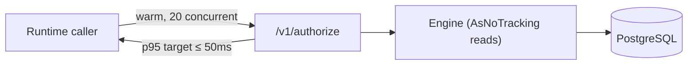

# 03 — Non-Functional Requirements

> Part of the [Documentation Portal](README.md).
> Related: [System Architecture](04_System_Architecture.md) · [Security Design](16_Security_Design.md) · [Logging & Observability](18_Logging_and_Observability.md) · [Error Handling](17_Error_Handling.md)

---

## Table of Contents

1. [Purpose](#purpose)
2. [Performance](#performance)
3. [Scalability](#scalability)
4. [Security](#security)
5. [Reliability & Resilience](#reliability--resilience)
6. [Data Integrity & Consistency](#data-integrity--consistency)
7. [Auditability & Compliance](#auditability--compliance)
8. [Validation & Input Limits](#validation--input-limits)
9. [Observability & Monitoring](#observability--monitoring)
10. [Caching](#caching)
11. [Portability & Deployability](#portability--deployability)
12. [Maintainability & Testability](#maintainability--testability)
13. [Cross-References](#cross-references)

## Purpose

This document catalogs the **non-functional requirements (NFRs)** — the cross-cutting quality
attributes the Authorization Control Plane must satisfy: how fast, how scalable, how secure, how
reliable, how observable, and how maintainable it is, as opposed to the feature behavior captured in
[Functional Requirements](02_Functional_Requirements.md). Each NFR is tied to the concrete mechanism
that implements it and the source file where that mechanism lives, so the guarantees are verifiable
rather than aspirational.

> Only mechanisms present in the repository are documented. Where the code states an explicit target,
> it is quoted with its source. Exact configuration values and defaults live in
> [Configuration](20_Configuration.md); this document explains the *quality goal* each mechanism serves.

## Performance

| NFR | Mechanism | Source |
|-----|-----------|--------|
| Low-latency runtime decisions | The engine reads with `AsNoTracking()` and only queries reference data when a policy references it (avoiding extra round-trips). | [EfAuthorizationPolicyEngine.cs](../backend/src/Authorization.Infrastructure/RuntimeAuthorization/EfAuthorizationPolicyEngine.cs) |
| Stated performance target | "MVP target is `/v1/authorize` p95 <= 50 ms for valid warmed requests at 20 concurrent clients, excluding cold start and token acquisition." | [deploy/local/README.md](../deploy/local/README.md) |
| Performance harness | A repeatable load script drives the target measurement. | [scripts/perf-authorize.ps1](../scripts/perf-authorize.ps1) |
| Batch efficiency | Up to 50 checks per call reuse one authenticated subject/context. | [RuntimeAuthorizationController.cs](../backend/src/Authorization.Api/Controllers/RuntimeAuthorizationController.cs) |
| Frontend bundle splitting | Vite splits vendor chunks (`vendor-charts`, `vendor-react`, `vendor-query`). | [frontend/vite.config.ts](../frontend/vite.config.ts) |

## Scalability

The runtime and admin APIs are designed so that throughput can grow by adding instances rather than
by vertical scaling alone.

| NFR | Mechanism | Source |
|-----|-----------|--------|
| Stateless request handling | Callers authenticate with a per-request JWT bearer token; there is no server-side session or sticky state, and the portal keeps tokens in browser memory only. Any API instance can therefore serve any request behind a load balancer. | [auth.ts](../frontend/src/auth.ts), [Authentication/](../backend/src/Authorization.Api/Authentication/) |
| Tracking-free reads | Decision queries run with `AsNoTracking()`, avoiding EF change-tracking overhead and reducing per-request memory. | [EfAuthorizationPolicyEngine.cs](../backend/src/Authorization.Infrastructure/RuntimeAuthorization/EfAuthorizationPolicyEngine.cs) |
| Bounded connections | The `DbContext` is registered per request (scoped) and Npgsql pools database connections by default, so concurrent requests share a bounded pool instead of opening a socket each. | [DependencyInjection.cs](../backend/src/Authorization.Infrastructure/DependencyInjection.cs) |
| Round-trip amortization | The batch endpoint evaluates up to 50 checks under a single authenticated call, amortizing token validation and connection setup. | [RuntimeAuthorizationController.cs](../backend/src/Authorization.Api/Controllers/RuntimeAuthorizationController.cs) |

> **Current deployment:** the local Compose environment runs a single API instance for simplicity;
> nothing in the design prevents running multiple replicas against the same PostgreSQL database.

## Security

Security is a first-class NFR. Highlights (full detail in [Security Design](16_Security_Design.md)):

- **One wired authentication scheme, plus a self-managed runtime path**: only `AdminJwt` is registered
  as an ASP.NET JWT-bearer scheme (gating `/v1/admin/*` and `/v1/config`); the runtime `/v1/authorize*`
  endpoints carry no `[Authorize]` attribute and are validated per application by
  `RuntimeCallerAuthenticator` against the app's OIDC provider. `RuntimeClientCredentials` is only a
  string constant (a legacy static-secret path kept for unit tests), not a live scheme —
  [ApiAuthenticationSchemes.cs](../backend/src/Authorization.Api/Authentication/ApiAuthenticationSchemes.cs),
  [ServiceCollectionExtensions.cs](../backend/src/Authorization.Api/Authentication/ServiceCollectionExtensions.cs).
- **Token subject is authoritative** at runtime; a conflicting body subject is rejected (403).
- **Tokens are never persisted** in the browser — memory-only storage with PKCE — [frontend/src/auth.ts](../frontend/src/auth.ts).
- **Secrets are never returned** by the config endpoint (the AI API key is omitted) — [ConfigController.cs](../backend/src/Authorization.Api/Controllers/ConfigController.cs).
- **PII protection for AI**: subject emails are pseudonymized before inclusion in AI prompts — [SubjectPseudonymizer.cs](../backend/src/Authorization.Api/Ai/SubjectPseudonymizer.cs).
- **Delegated-admin RBAC** gates every governance mutation by capability and scope.
- **CORS** is restricted to configured origins (default `http://localhost:5173`).

## Reliability & Resilience

The system is built to degrade gracefully and recover from transient faults rather than failing hard.

| Mechanism | Description | Source |
|-----------|-------------|--------|
| SDK retry & timeout policy | The typed client retries only idempotent, read-only authorize calls, and only on transient transport failures or `5xx`/`408`/`429` responses. It honors a server `Retry-After` hint; otherwise it applies a **linear** backoff (`RetryBaseDelay × attempt`) with random jitter, and enforces an optional per-request timeout. Retries are **off by default** (`MaxRetryAttempts = 0`) and opt-in via client options. | [AuthorizationClient.cs](../backend/src/Authorization.Sdk/AuthorizationClient.cs) |
| Global exception handling | Unhandled exceptions are caught, logged with the trace identifier, and converted to a canonical `500` envelope. | [ExceptionHandlingMiddleware.cs](../backend/src/Authorization.Api/Errors/ExceptionHandlingMiddleware.cs) |
| Graceful AI degradation | Invalid AI configuration disables AI instead of crashing startup. | [AiServiceCollectionExtensions.cs](../backend/src/Authorization.Ai/AiServiceCollectionExtensions.cs) |
| Atomic governance mutations | Each mutation persists the change and its audit event together in one EF transaction. | GovernanceControllerBase |
| Health-gated dependencies | Compose waits for PostgreSQL health before starting the API. | [docker-compose.yml](../deploy/local/docker-compose.yml) |

## Data Integrity & Consistency

Because the control plane is the system of record for access, it protects the correctness of its data
at several layers.

| Mechanism | Description | Source |
|-----------|-------------|--------|
| Optimistic concurrency | Every audited entity carries an integer `version` column configured as an EF concurrency token. A concurrent update whose version has moved on fails with `DbUpdateConcurrencyException` instead of silently overwriting a newer change. | `ConfigureAuditedEntity` in [AuthorizationDbContext.cs](../backend/src/Authorization.Infrastructure/Persistence/AuthorizationDbContext.cs) |
| Atomic mutation + audit | A governance change and its audit event are saved in one transaction, so the data and the audit trail can never diverge. | GovernanceControllerBase |
| Database-level constraints | `CHECK` constraints (`ck_*`) enforce status and enum vocabularies (e.g. subject type, review-campaign status) at the database, independent of application code. | [AuthorizationDbContext.cs](../backend/src/Authorization.Infrastructure/Persistence/AuthorizationDbContext.cs) |
| Deterministic evaluation clock | The engine reads "now" from an injected `TimeProvider`, so time-based decisions (assignment expiry, `system.*` attributes) are reproducible and testable rather than depending on wall-clock timing. | [EfAuthorizationPolicyEngine.cs](../backend/src/Authorization.Infrastructure/RuntimeAuthorization/EfAuthorizationPolicyEngine.cs) |
| Single schema & foreign keys | All tables live in the `authz` schema, with foreign keys enforcing the tenant → application → role/permission ownership hierarchy. | [Data Model](14_Data_Model_Documentation.md) |

## Auditability & Compliance

Auditability is a primary design goal of a control plane: every change and every decision must be
attributable and reconstructable.

- **Immutable audit trail** — Every governance mutation appends an `AuditEventEntity` row that is
  never updated or deleted, capturing the actor, action type, and affected entity. Event types are
  centralized in [AuditEventTypes.cs](../backend/src/Authorization.Api/Constants/AuditEventTypes.cs).
- **Decision history** — When decision recording is enabled, each runtime decision is persisted to
  the append-only `DecisionEntity` table for analytics and forensic review.
- **AI transparency** — AI usage and prompts are recorded to the append-only `AiInvocationEntity` and
  `AiPromptLogEntity` tables; subject emails are **pseudonymized** before being logged
  ([SubjectPseudonymizer.cs](../backend/src/Authorization.Api/Ai/SubjectPseudonymizer.cs)).
- **Attribution** — Audited entities record `CreatedAt`/`CreatedBy` and `UpdatedAt`/`UpdatedBy`, so
  every configuration row is traceable to who changed it and when.
- **Queryable** — The trail is exposed through `GET /v1/admin/audit-events` and
  `.../audit-events/summary`. See [Business Rules](19_Business_Rules.md) for the invariants and
  [Logging & Observability](18_Logging_and_Observability.md) for how audit relates to tracing.

## Validation & Input Limits

| Limit | Value | Source |
|-------|-------|--------|
| Max batch checks | 50 | `RuntimeAuthorizationController.MaxBatchSize` |
| Max request body | 256 KB | `RuntimeAuthorizationController.MaxRequestBodyBytes` |
| Max context JSON | 32 KB | `RuntimeAuthorizationController.MaxContextJsonBytes` |
| Max AI prompt chars | 4000 | `Ai:Limits:MaxPromptChars` |
| Correlation ID length | ≤ 128 chars, charset `A-Za-z0-9-_.:` | [CorrelationIdMiddleware.cs](../backend/src/Authorization.Api/Observability/CorrelationIdMiddleware.cs) |

Governance requests are validated with data annotations plus domain validators; see
[Error Handling](17_Error_Handling.md).

## Observability & Monitoring

- **Correlation IDs** on every request/response (`X-Correlation-ID`).
- **OpenTelemetry** tracing with activity source `Authorization.RuntimeAuthorization`; each decision
  emits a span tagged with application, resource, action, allowed, deny reason, and duration.
- **Structured JSON logs** with trace/span/parent IDs.
- **Health probes**: `/health/live` (liveness) and `/health/ready` (database readiness).

Full detail: [Logging & Observability](18_Logging_and_Observability.md).

## Caching

- **Client-side cache freshness** is server-driven via `CacheConfigResponse`
  (`DefaultStaleMs` 30 s, `VolatileStaleMs` 10 s, `ConfigStaleMs` 5 min by default) and applied
  through React Query staleness in [frontend/src/api/hooks.ts](../frontend/src/api/hooks.ts). Serving
  these windows from the server lets operators tune client polling without redeploying the SPA.
- A **decision caching feature flag** exists (`FeatureFlags:DecisionCachingEnabled`, default `false`)
  — [appsettings.Development.json](../backend/src/Authorization.Api/appsettings.Development.json).

## Portability & Deployability

- **Containerized** — Both the API and the portal ship with Dockerfiles ([backend Dockerfile](../backend/src/Authorization.Api/Dockerfile), [frontend Dockerfile](../frontend/Dockerfile)); the whole stack (PostgreSQL, Keycloak, API, portal) is orchestrated by [docker-compose.yml](../deploy/local/docker-compose.yml).
- **Config over code** — Environment-specific settings (database, OIDC, AI, CORS, feature flags) are supplied through `appsettings*.json` and environment variables and bound via the options pattern, so the same image runs in any environment.
- **Automated dev schema setup** — In development the API applies database setup at startup (`UseDevelopmentDatabaseSetupAsync`), so a fresh checkout comes up with a ready schema without manual migration steps.
- **Reverse-proxy friendly** — The portal is served by nginx ([frontend/nginx.conf](../frontend/nginx.conf)) and the API accepts and echoes `X-Correlation-ID`, so requests stay traceable across a proxy.

## Maintainability & Testability

- **Options pattern with validation** for all configuration — [Configuration/ServiceCollectionExtensions.cs](../backend/src/Authorization.Api/Configuration/ServiceCollectionExtensions.cs).
- **Layered separation**: API ↔ Infrastructure ↔ AI ↔ SDK (see [Solution Design](05_Solution_Design.md)).
- **Stable vocabularies** centralized as constants: [AuditEventTypes.cs](../backend/src/Authorization.Api/Constants/AuditEventTypes.cs), [GovernanceErrorCodes.cs](../backend/src/Authorization.Api/Constants/GovernanceErrorCodes.cs), [GovernanceVocabulary.cs](../backend/src/Authorization.Api/Governance/GovernanceVocabulary.cs).
- **Deterministic, provider-independent tests**: time is injected via `TimeProvider` and the AI layer offers a `Fake` provider, so tests do not depend on the wall clock or a live model endpoint.
- **Comprehensive test suites**: separate API, contract, infrastructure, and SDK test projects under [backend/tests](../backend/tests/), plus a frontend Vitest suite ([frontend/src](../frontend/src/)), covering runtime evaluation, governance rules, error contracts, and the SDK.

## Cross-References

- [Security Design](16_Security_Design.md) — authentication, authorization, secrets
- [Logging & Observability](18_Logging_and_Observability.md) — tracing, health, audit
- [Configuration](20_Configuration.md) — options and flags
- [System Architecture](04_System_Architecture.md) — where these mechanisms sit
- [Data Model](14_Data_Model_Documentation.md) — entities, concurrency token, constraints
- [Business Rules](19_Business_Rules.md) — the invariants behind these guarantees
