# 04 — System Architecture

> Part of the [Documentation Portal](README.md).
> Related: [Solution Design](05_Solution_Design.md) · [Module Design](12_Module_Design.md) · [Data Model](14_Data_Model_Documentation.md) · [Code Walkthrough](23_Code_Walkthrough.md)

---

## Table of Contents

1. [Purpose & Scope](#purpose--scope)
2. [Architecture Drivers & Quality Attributes](#architecture-drivers--quality-attributes)
3. [Architectural Principles & Key Decisions](#architectural-principles--key-decisions)
4. [System Context](#system-context)
5. [Logical Architecture](#logical-architecture)
6. [Layered Architecture & Solution Structure](#layered-architecture--solution-structure)
7. [Component View](#component-view)
8. [The Authorization Decision Model](#the-authorization-decision-model)
9. [Data Architecture](#data-architecture)
10. [Cross-Cutting Concerns](#cross-cutting-concerns)
11. [Request Lifecycle & Middleware Pipeline](#request-lifecycle--middleware-pipeline)
12. [Key Workflow Sequences](#key-workflow-sequences)
13. [Security Architecture](#security-architecture)
14. [Configuration & Server-Owned Settings](#configuration--server-owned-settings)
15. [Observability Architecture](#observability-architecture)
16. [Integration Architecture](#integration-architecture)
17. [Data Flow](#data-flow)
18. [Deployment & Runtime Topology](#deployment--runtime-topology)
19. [Scalability, Availability & Resilience](#scalability-availability--resilience)
20. [Technology Stack](#technology-stack)
21. [Architecture Decisions & Trade-offs](#architecture-decisions--trade-offs)
22. [Constraints, Risks & Future Evolution](#constraints-risks--future-evolution)
23. [Cross-References](#cross-references)

---

## Purpose & Scope

The **Authorization Control Plane** is a centralized service that lets organizations *model* who may
do what (governance) and *decide* whether a specific action is allowed at runtime (enforcement). This
document describes the architecture **as implemented in this repository**: the structural
decomposition, how a request flows end-to-end, how the authorization decision is actually computed,
how data is modeled and protected, and how the pieces are deployed and observed.

**In scope:** the backend Web API (`Authorization.Api`), its supporting libraries
(`Authorization.Infrastructure`, `Authorization.Ai`, `Authorization.Sdk`), the React admin portal, the
PostgreSQL data store, and the external identity/AI integrations. **Out of scope:** design rationale
narratives (see [Solution Design](05_Solution_Design.md)), per-entity field catalogs (see
[Data Model](14_Data_Model_Documentation.md)), and per-feature AI behavior (see
[AI Features](15_AI_Features.md)) — this document links to those rather than duplicating them.

**Audience:** engineers, architects, and reviewers who need one authoritative picture of how the
system is put together before diving into a specific module.

## Architecture Drivers & Quality Attributes

The structure below is not arbitrary; it is a response to a small set of **architecturally significant
requirements**. Each driver is traceable to a concrete design choice.

| # | Driver (quality attribute) | What it demands | How the architecture responds |
|---|----------------------------|-----------------|-------------------------------|
| D1 | **Low-latency enforcement** | Runtime decisions sit on the request path of protected apps and must be fast and predictable. | A dedicated read-only runtime plane; a self-contained EF query pipeline (`AsNoTracking`) with targeted composite indexes; batch endpoint to amortize round-trips; OpenTelemetry latency span per decision. |
| D2 | **Correctness & determinism** | The same inputs must always yield the same decision, and "unknown" must never mean "allow". | Deny-by-default engine; explicit deny-reason codes; deterministic policy-combining algorithms; time supplied via injectable `TimeProvider` for reproducibility. |
| D3 | **Auditability** | Every access change and every decision must be reconstructable. | Governance mutations write an `AuditEvent` in the *same transaction* as the change; runtime decisions are recorded to an append-only `decisions` store. |
| D4 | **Least-privilege delegated administration** | Different admins manage different applications/tenants with different rights. | Capability-based authorization (8 capabilities) resolved from OIDC role claims at platform, tenant, and application scope. |
| D5 | **Multi-issuer runtime identity** | Each protected application authenticates with its own IdP, not a shared one. | Per-application OIDC provider records; runtime callers self-authenticate against the app's registered issuer/JWKS in `RuntimeCallerAuthenticator`. |
| D6 | **Horizontal scalability** | Enforcement traffic can grow independently of admin traffic. | Fully stateless request handling — every call carries its own token, no server session — so API instances scale out behind a load balancer. |
| D7 | **Extensibility without core coupling** | New capabilities (notably AI) must not compromise the enforcement core. | The API is the single composition root; AI is isolated behind `IAiAssistant`, is advisory-only, and is gated per feature so it can be fully absent. |
| D8 | **Central control of client behavior** | The portal's limits, cache windows, and feature flags must be changeable without redeploying the SPA. | Server-owned configuration exposed via `GET /v1/config`. |
| D9 | **Operability** | Operators must be able to gate traffic on real readiness and trace failures. | Split liveness/readiness health probes; correlation-ID propagation; canonical error envelope; structured JSON logs correlated to traces. |

## Architectural Principles & Key Decisions

These principles operationalize the drivers above; the deeper *rationale* is in
[Solution Design](05_Solution_Design.md).

- **Separation of control and runtime planes (D1, D6).** Write-heavy, human-driven governance and
  read-heavy, machine-driven enforcement are distinct surfaces that share one database and codebase,
  so each can be reasoned about, tuned, and scaled independently.
- **The API is the composition root (D7).** `Authorization.Ai`, `Authorization.Infrastructure`, and
  `Authorization.Sdk` hold *no* project references to one another; only `Authorization.Api` references
  the AI and Infrastructure libraries and wires everything together in
  [Program.cs](../backend/src/Authorization.Api/Program.cs). This keeps the libraries independently
  testable and replaceable.
- **Deny-by-default enforcement (D2).** A runtime decision is `DENY` unless an active assignment and a
  published role→permission mapping (plus any matching policies) explicitly allow it. Missing data,
  missing context, and errors all resolve to deny — see [The Authorization Decision Model](#the-authorization-decision-model)
  and [Business Rules](19_Business_Rules.md).
- **Layered defense of runtime identity (D5).** The token is validated for authenticity *and* for
  binding to the requested application; the subject is taken from the verified token, never from
  request input, and a mismatch returns `403` rather than silently trusting the body.
- **Stateless request handling (D6).** Every call carries its own JWT; no server-side session is kept,
  so the API scales horizontally — see [Non-Functional Requirements](03_Non_Functional_Requirements.md).
- **Server-owned configuration (D8).** The portal reads feature availability, limits, and cache windows
  from `GET /v1/config` rather than hard-coding them, so behavior is controlled centrally.
- **Auditability by construction (D3).** Every governance mutation writes an audit event in the same
  transaction, and every runtime decision is recorded — the trail cannot drift from the data.
- **AI is optional and decoupled (D7).** The AI layer is advisory only, off by default, gated per
  feature, and isolated behind `IAiAssistant`, so the enforcement core never depends on a model
  provider and never consumes AI output as a decision input.

## System Context

At the highest level (C4 Level 1), the control plane sits between human administrators, machine
callers, an identity provider, a database, and an optional AI provider.

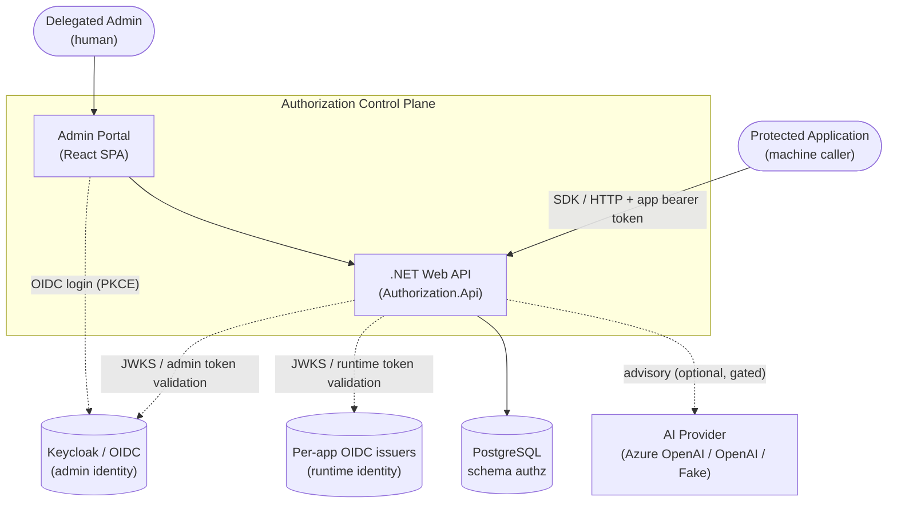

**External dependencies and why they exist:**

| Actor / system | Interaction | Notes |
|----------------|-------------|-------|
| **Delegated Admin** | Uses the SPA to model access. | Authenticated by the admin IdP (Keycloak locally); authorized by capability. |
| **Protected Application** | Calls `POST /v1/authorize[/batch]` to check access, typically via the SDK. | Authenticated per-application against its own OIDC issuer. |
| **Admin IdP (Keycloak)** | Issues the admin JWT the portal sends; the API validates it as `AdminJwt`. | Realm `authorization-local` in the dev stack. |
| **Per-app OIDC issuers** | Issue the runtime bearer tokens machine callers present. | Registered as `OidcProviderEntity` rows per application (issuer, JWKS URI, audience, algorithms, required claims, subject claim). |
| **PostgreSQL** | Single system of record for governance data, audit, and decision logs (schema `authz`). | Accessed through EF Core. |
| **AI provider** | Optional, advisory drafting/summarization. | Selectable (Azure OpenAI / OpenAI / deterministic Fake); off by default and gated per feature. |

## Logical Architecture

The system decomposes into three logical planes that share one database and process but serve
different consumers and load profiles.

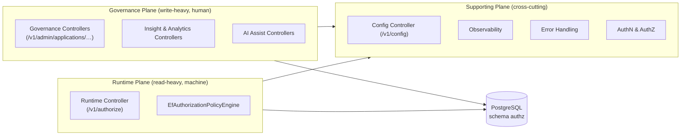

- **Governance plane** — human-driven modeling of access (applications, roles, permissions,
  role→permission mappings, assignments, policies, reference data, SoD rules, review campaigns).
  Write-heavy and capability-gated; every mutation is audited.
- **Runtime plane** — machine-driven decision evaluation. Read-heavy, latency-sensitive, and the only
  surface a protected application touches in normal operation.
- **Supporting plane** — cross-cutting concerns (authentication, authorization, configuration,
  observability, error shaping) that both other planes rely on.

## Layered Architecture & Solution Structure

The solution ([AuthorizationControlPlane.slnx](../backend/AuthorizationControlPlane.slnx)) is four
backend projects plus the frontend. The dependency rule is strict and one-directional: **only
`Authorization.Api` references other in-solution projects.**

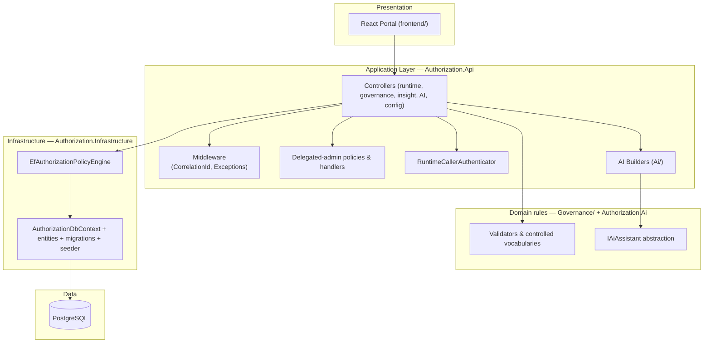

**Project responsibilities and dependency rules:**

| Project | Responsibility | References |
|---------|----------------|------------|
| [Authorization.Api](../backend/src/Authorization.Api/) | Composition root: HTTP surface, middleware, authN/authZ, controllers, AI builders, DI wiring. | → `Authorization.Infrastructure`, `Authorization.Ai` |
| [Authorization.Infrastructure](../backend/src/Authorization.Infrastructure/) | EF Core `DbContext`, entities, migrations, the decision engine, seeding, decision recorder. | *(none in-solution)* |
| [Authorization.Ai](../backend/src/Authorization.Ai/) | `IAiAssistant` abstraction, chat-client and fake implementations, AI options/availability, provider transport. | *(none in-solution)* |
| [Authorization.Sdk](../backend/src/Authorization.Sdk/) | Thin HTTP client protected apps embed to call `/v1/authorize`. | *(none in-solution)* — talks to the API over HTTP, not a project reference |
| [frontend/](../frontend/) | React admin portal (SPA). | Calls the API over HTTP |

Keeping the AI, Infrastructure, and SDK libraries free of cross-references means each can be tested and
replaced in isolation, and the enforcement core has no compile-time dependency on the AI layer.

## Component View

The internal components of each backend project and how they collaborate (C4 Level 3):

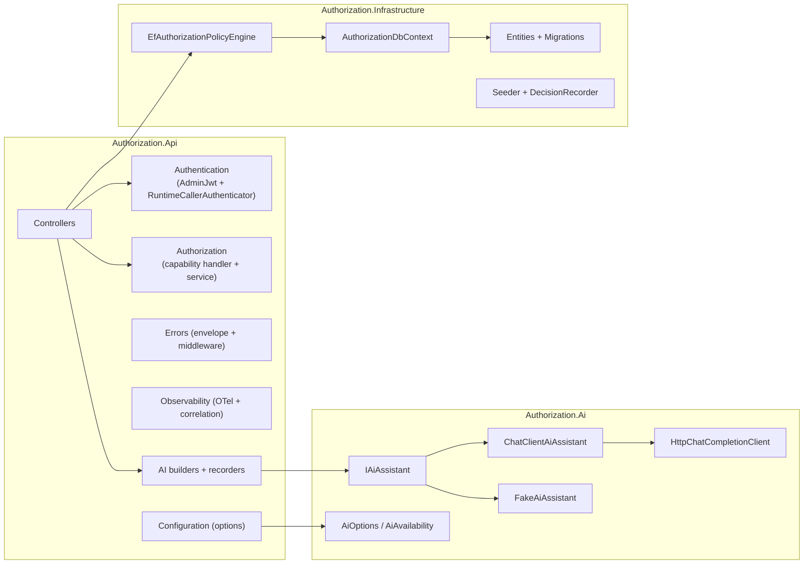

Registration wiring lives in [Program.cs](../backend/src/Authorization.Api/Program.cs) and the various
`ServiceCollectionExtensions` (see [Module Design](12_Module_Design.md)).

## The Authorization Decision Model

This is the core of the system: how [EfAuthorizationPolicyEngine](../backend/src/Authorization.Infrastructure/RuntimeAuthorization/EfAuthorizationPolicyEngine.cs)
turns a request into an `ALLOW`/`DENY` decision. The model is **RBAC as a baseline, refined by optional
ABAC policies**, evaluated **deny-by-default**.

### Inputs and result

The engine receives an `AuthorizeRequest` (`ApplicationId`, `SubjectType`, `SubjectEmail`,
`ResourceType`, `Action`, and an optional request `Context` dictionary) and returns:

```csharp
public sealed record AuthorizeDecision(
    string DecisionId,
    bool Allowed,
    string? DenyReason,                              // e.g. "NO_ACTIVE_ASSIGNMENT" when Allowed == false
    IReadOnlyCollection<string> MatchedRoles,        // role keys that contributed
    IReadOnlyCollection<string> MatchedPermissions,  // permission keys satisfied
    IReadOnlyCollection<string> MatchedPolicies,     // policy keys that decided
    IReadOnlyCollection<AuthorizeObligation> Obligations); // advisory instructions for the caller
```

### Evaluation pipeline

Each step short-circuits to a `DENY` with a specific reason code as soon as a precondition fails; the
full reason-code catalog is in the [Glossary](24_Glossary.md).

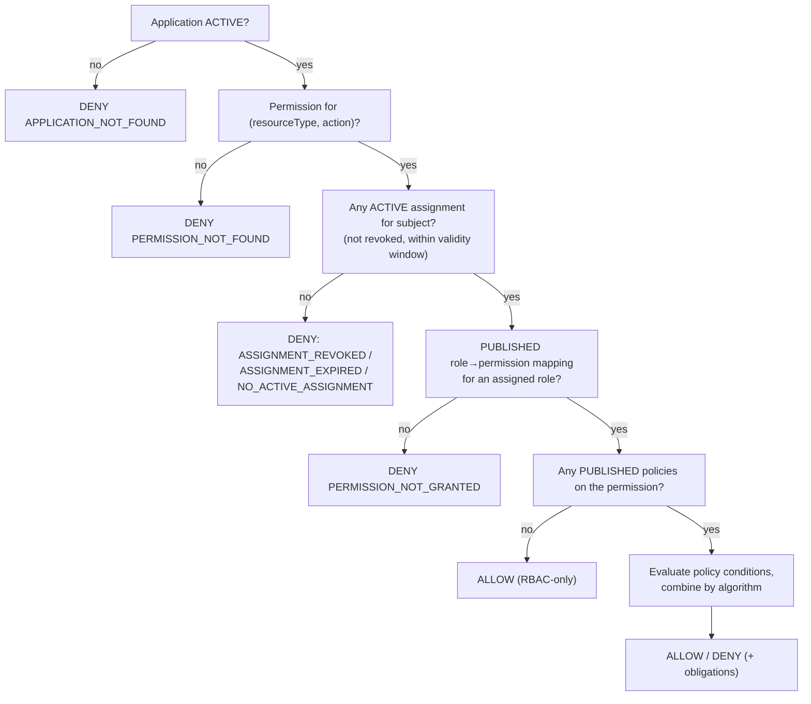

1. **Application lookup.** The `ApplicationEntity` must exist and be `ACTIVE`, else `APPLICATION_NOT_FOUND`.
2. **Permission resolution.** A `PermissionEntity` matching `(application, resourceType, action)` must
   exist, else `PERMISSION_NOT_FOUND`.
3. **Active-assignment filter.** All `AssignmentEntity` rows for the subject are loaded, then filtered
   to those that are `ACTIVE`, not revoked, and inside their validity window (`ValidFrom <= now` and
   `ValidUntil` null-or-future, using an injected `TimeProvider`). If none survive, the **most
   informative** reason is returned: `ASSIGNMENT_REVOKED` → `ASSIGNMENT_EXPIRED` → `NO_ACTIVE_ASSIGNMENT`.
4. **RBAC baseline.** The assigned roles are joined to `RolePermissionEntity` rows in state
   `PUBLISHED` for this permission. No mapping ⇒ `PERMISSION_NOT_GRANTED` (the roles are surfaced so
   the caller can see what the subject *does* hold).
5. **Policy layer (ABAC).** `PolicyEntity` rows in state `PUBLISHED` for the permission are loaded.
   - **No policies** ⇒ `ALLOW` on the RBAC baseline alone.
   - **Policies present** ⇒ each is evaluated against the subject's assignment attributes and the
     request context.

### Policy evaluation & combining

Each policy carries a JSON **condition tree** and an **effect** (`ALLOW` or `DENY`). Condition trees
support boolean composition — `all` (AND), `any` (OR), `none` (NOT) — over leaf conditions of the form
`{ attribute, operator, value }`. Attributes are resolved case-insensitively from four namespaces:

| Namespace | Source | Example |
|-----------|--------|---------|
| `context.*` | The request's `Context` dictionary (dot-path traversal supported) | `context.ip.country` |
| `assignment.*` | `AssignmentAttributeEntity` key/value pairs on the matched assignment | `assignment.department` |
| `system.*` | Engine-computed values (e.g. current time) | `system.now` |
| `reference.*` | The application's `ReferenceDataEntity` JSON documents (path traversal) | `reference.regions.emea` |

If a referenced attribute cannot be resolved, that branch is flagged **missing context**, which
matters for the final resolution. Results are combined using the application's
`PolicyCombiningAlgorithm`:

- **`deny-overrides`** (default) — any matching `DENY` wins.
- **`allow-overrides`** — any matching `ALLOW` wins.
- **`first-applicable`** — the highest-`Priority` matching policy decides.

The final resolution preserves deny-by-default: if an `ALLOW` policy exists but none matched (or
required context was missing), the result is `DENY` (`MISSING_CONTEXT` / `DENY_BY_DEFAULT`); the RBAC
baseline only carries the decision through when no `ALLOW` policy contradicted it.

### Obligations

**Obligations** are advisory instructions (e.g. `require_mfa`, `mask_ssn`) attached to a policy and
surfaced **only from policies whose effect matches the final decision**. The engine does not enforce
them — it returns them so the calling application can apply the additional control.

### Performance characteristics

The engine runs entirely against PostgreSQL with `AsNoTracking()` reads and **no caching** — every
decision reflects the current data. Latency is kept low by composite indexes tuned for the exact
filters used (see [Data Architecture](#data-architecture)), and each decision emits a latency span on
the `Authorization.RuntimeAuthorization` activity source.

## Data Architecture

All state lives in a single PostgreSQL database under the **`authz`** schema, accessed through
[AuthorizationDbContext](../backend/src/Authorization.Infrastructure/Persistence/). Entities are mapped
with the EF Core fluent API in `OnModelCreating`; controlled vocabularies (statuses, subject types,
policy effects, etc.) are enforced with **check constraints** at the database level.

### Entity groups

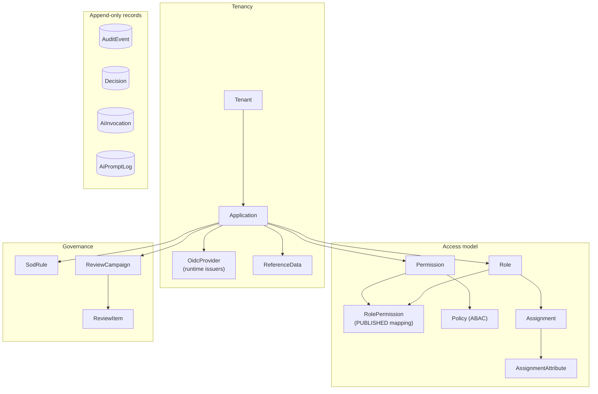

- **Tenancy & applications** — `Tenant` (root), `Application` (owns its access model),
  `OidcProvider` (per-app runtime issuers), `ReferenceData` (JSON docs for `reference.*` attributes).
- **Access model** — `Role`, `Permission`, `RolePermission` (the mapping the engine reads in
  `PUBLISHED` state), `Policy` (ABAC conditions/effect/obligations), `Assignment` (subject↔role with a
  validity window), `AssignmentAttribute` (KV pairs for `assignment.*`).
- **Governance extras** — `SodRule` (segregation-of-duties), `ReviewCampaign`/`ReviewItem`
  (access certification).
- **Append-only records** — `AuditEvent` (governance trail), `Decision` (runtime decision log),
  `AiInvocation` (metadata-only AI call record), `AiPromptLog` (optional prompt capture).

Full field-level detail is in the [Data Model](14_Data_Model_Documentation.md).

### Concurrency, auditing, and lifecycle

- **Optimistic concurrency.** Governed entities derive from `AuditedEntity` (`Id`, `CreatedAt/By`,
  `UpdatedAt/By`) and carry an **integer `Version` concurrency token**; EF checks it on update so
  concurrent edits fail loudly rather than silently overwriting. A few entities (`OidcProvider`,
  `RolePermission`, `Policy`) use a GUID `VersionId` token instead, reflecting their version-per-row
  model. (Note: this is a *numeric/GUID* token, not PostgreSQL `xmin`.)
- **Transactional audit (D3).** Governance controllers persist the entity change and its `AuditEvent`
  in **one `SaveChanges`** via the base controller's mutation helper, so the audit trail cannot drift
  from the data.
- **Publication lifecycle.** Mappings and policies move `DRAFT → REVIEW → APPROVED → PUBLISHED`; the
  runtime engine only ever reads the `PUBLISHED` state, so in-progress edits never affect live
  decisions.
- **Migrations & seeding.** On startup the API awaits `UseDevelopmentDatabaseSetupAsync`, which in
  **Development** applies the schema (migrations) and optionally seeds demo data, and is a **no-op** in
  other environments — production schema changes are applied through the normal migration process.

## Cross-Cutting Concerns

These concerns apply to every request regardless of plane and are implemented once, centrally:

| Concern | Where | Notes |
|---------|-------|-------|
| Correlation | [CorrelationIdMiddleware.cs](../backend/src/Authorization.Api/Observability/CorrelationIdMiddleware.cs) | Accepts/echoes `X-Correlation-ID` (≤ 128 chars) and sets the log scope + `TraceIdentifier`. |
| Error shaping | [ExceptionHandlingMiddleware.cs](../backend/src/Authorization.Api/Errors/ExceptionHandlingMiddleware.cs) + canonical error envelope | Converts unhandled exceptions and known failures into a `{ error, correlationId }` envelope — see [Error Handling](17_Error_Handling.md). |
| Authentication | [Authentication/](../backend/src/Authorization.Api/Authentication/) | Only `AdminJwt` is a wired JWT-bearer scheme (gates `/v1/admin/*` + `/v1/config`); runtime `/v1/authorize*` self-authenticates via `RuntimeCallerAuthenticator` against each app's OIDC provider. `RuntimeClientCredentials` is a bare constant (legacy test-only path), not a registered scheme. |
| Authorization | [Authorization/](../backend/src/Authorization.Api/Authorization/) | Delegated-admin capability policies gate `/v1/admin`; runtime callers are validated per application by `RuntimeCallerAuthenticator`. |
| Observability | [Observability/](../backend/src/Authorization.Api/Observability/) | OpenTelemetry tracing (`Authorization.RuntimeAuthorization` source) and structured JSON logs — see [Logging & Observability](18_Logging_and_Observability.md). |
| Validation & limits | Controllers + [Governance/](../backend/src/Authorization.Api/Controllers/Governance/) | Data-annotation + domain validators; runtime body/context/batch caps (256 KB body, 32 KB context, 50 checks/batch). |
| Configuration | [Configuration/](../backend/src/Authorization.Api/Configuration/) | Validated, strongly-typed options; portal behavior surfaced via `GET /v1/config`. |

## Request Lifecycle & Middleware Pipeline

At startup, before the pipeline is built, the app awaits `UseDevelopmentDatabaseSetupAsync` (schema +
optional seed in Development; no-op elsewhere). Every HTTP request then passes through the pipeline
configured in [Program.cs](../backend/src/Authorization.Api/Program.cs), **in this exact order**:

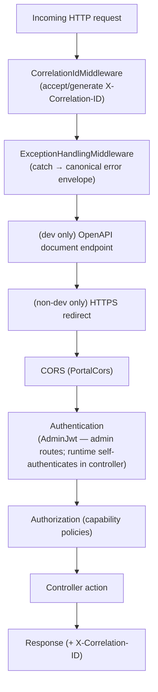

> **Authentication nuance.** `UseAuthentication` only has the `AdminJwt` scheme registered, so the
> middleware authenticates admin routes (`/v1/admin/*`, `/v1/config`). The runtime endpoints
> (`/v1/authorize`, `/v1/authorize/batch`) declare no `[Authorize]` attribute —
> `RuntimeAuthorizationController` extracts and validates the bearer token itself via
> `RuntimeCallerAuthenticator`, so authentication for those routes happens in the controller. The
> `RuntimeClientCredentials` constant is not a registered scheme, and the legacy `RuntimeApi` policy is
> defined but not applied by any runtime endpoint.

> **Health probes** are mapped after the pipeline: `/health/live` runs no checks (pure liveness — it
> answers as long as the process is up), while `/health/ready` runs only the database-readiness check
> (tagged `ReadyTag`) so an orchestrator can gate traffic on a reachable database.

## Key Workflow Sequences

### Runtime decision

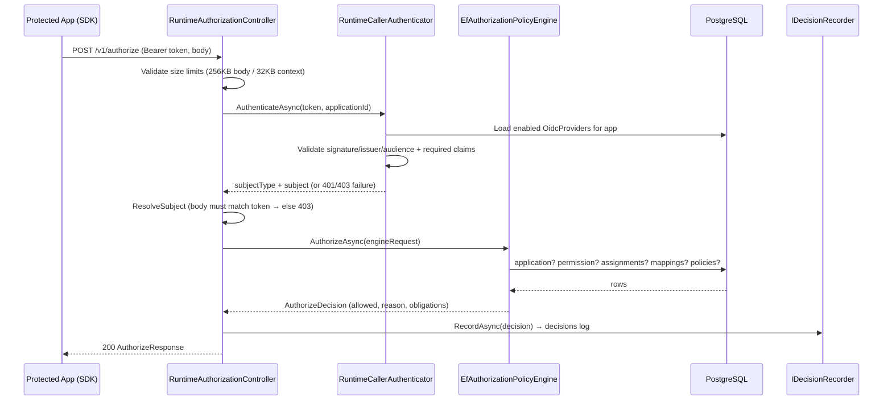

Implementation: [RuntimeAuthorizationController.cs](../backend/src/Authorization.Api/Controllers/RuntimeAuthorizationController.cs),
[EfAuthorizationPolicyEngine.cs](../backend/src/Authorization.Infrastructure/RuntimeAuthorization/EfAuthorizationPolicyEngine.cs).

### Governance mutation

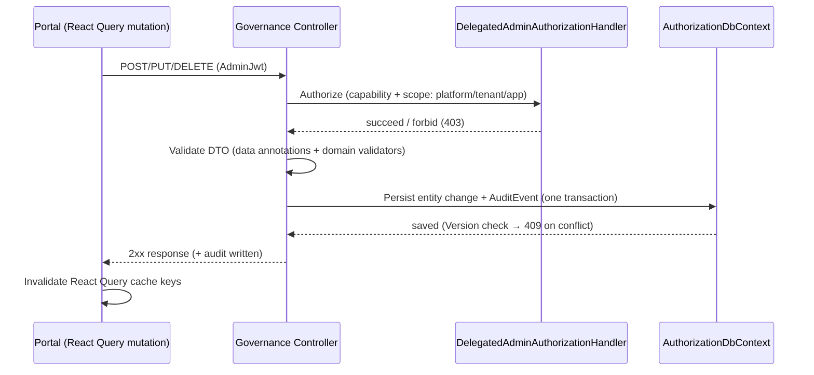

### AI advisory

AI features never make authorization decisions; they read the structured access model, ask a provider
to draft or explain, and record the interaction. Each feature is independently gated by
`AiAvailability`, so its endpoint is absent (returns "unavailable") when the feature is off.

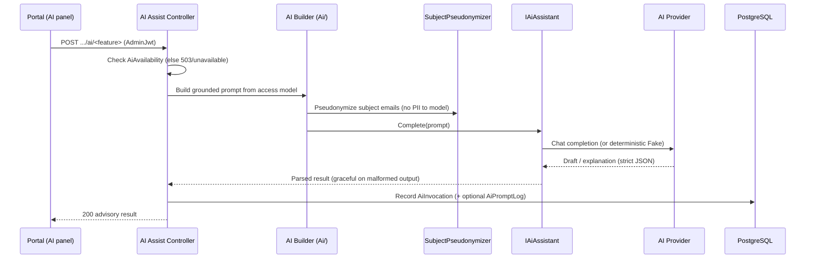

Detail and per-feature behavior: [AI Features](15_AI_Features.md).

## Security Architecture

Security is layered along two distinct identity planes and a set of data-protection measures.

### Two identity planes

| | Admin plane | Runtime plane |
|---|-------------|---------------|
| **Who** | Human delegated administrators via the portal | Machine callers (protected applications) |
| **Token** | Admin JWT from the shared admin IdP (Keycloak) | Per-application bearer token from the app's own OIDC issuer |
| **Validated by** | ASP.NET `AdminJwt` JWT-bearer scheme (issuer/audience/signature/lifetime) | [RuntimeCallerAuthenticator](../backend/src/Authorization.Api/Authentication/RuntimeCallerAuthenticator.cs) inside the controller |
| **Authorized by** | Capability policies from role claims (`acp_platform_role`, `acp_tenant_role`, `acp_app_role`) | The token's authenticity **and** binding to the requested application |
| **Failure modes** | `401` unauthenticated, `403` missing capability | `401 CALLER_UNAUTHENTICATED`, `403 CALLER_APPLICATION_MISMATCH`, `403 CALLER_SUBJECT_CLAIM_MISSING`, `403 SUBJECT_MISMATCH` |

### Delegated-admin authorization

Admin authorization is **capability-based**. There are **8 capabilities** —
`ManageApplication`, `ManageRoles`, `ManagePermissions`, `MapRolePermission`, `ManagePolicies`,
`AssignRoles`, `ViewAudit`, `ReadOnlyView` — each backed by a policy that adds a
`DelegatedAdminRequirement`. [DelegatedAdminAuthorizationHandler](../backend/src/Authorization.Api/Authorization/DelegatedAdminAuthorizationHandler.cs)
resolves the caller's rights from role claims across three scopes:

- **Platform roles** (`PlatformSuperAdmin`, `PlatformReadOnlyViewer`) apply everywhere; super-admin
  grants all capabilities, read-only viewer grants `ViewAudit`/`ReadOnlyView`.
- **Application roles** (`acp_app_role`, e.g. `ApplicationAdmin`, `ReadOnlyViewer`) apply to a single
  application taken from the route.
- **Tenant roles** (`acp_tenant_role`, e.g. `TenantAdmin`, `TenantReadOnlyViewer`) apply to every
  application under the tenant; the handler resolves the route's application to its tenant and
  re-checks. Cheap claim-only checks run first; the tenant lookup is a fallback.

### Runtime caller trust chain (D5)

`RuntimeCallerAuthenticator` loads the **enabled `OidcProvider` records for the requested application**
and, for each, resolves the issuer's JWKS (via `IRuntimeSigningKeyResolver`) and validates the token's
signature, issuer, audience, allowed algorithms, and lifetime. It then enforces the provider's
**required claims** (the app binding, e.g. `azp`) and derives the **subject from the verified token
only** — the subject in the request body must match, or the request is rejected `403 SUBJECT_MISMATCH`.
The tri-state error precedence (subject-missing → app-mismatch → unauthenticated) distinguishes "wrong
token type", "authentic but not for this app", and "not authentic".

### Data protection & secrets

- **Transport limits.** Runtime requests are capped at **256 KB** body and **32 KB** context, and
  batches at **50 checks**, to bound resource use from untrusted callers.
- **CORS.** Only configured origins (default `http://localhost:5173`) may call the API from a browser.
- **Data Protection keys** persist in the `api-data-protection` volume so protected payloads survive
  restarts.
- **Secrets** (DB credentials, AI keys) come from a **git-ignored** `deploy/local/.env`, never from
  source. Runtime tokens are validated with `RequireSignedTokens`; HTTPS metadata is required outside
  the local Docker network.
- **AI PII minimization.** Subject emails are pseudonymized before any prompt is built, and prompt
  bodies are captured only when explicitly enabled — see [Integration Architecture](#integration-architecture).

Deeper treatment: [Security Design](16_Security_Design.md).

## Configuration & Server-Owned Settings

Configuration is bound to **validated, strongly-typed options** at startup
([Configuration/ServiceCollectionExtensions.cs](../backend/src/Authorization.Api/Configuration/)); an
invalid configuration fails fast rather than surfacing at runtime.

| Options | Purpose | Key settings |
|---------|---------|--------------|
| `DatabaseOptions` | PostgreSQL connection | Connection string |
| `OidcOptions` | Admin-plane identity | `Authority`, `Audience`, `PortalClientId`, optional back-channel `MetadataAddress` |
| `PortalOptions` | Portal behavior surfaced to the SPA | Pagination (default 25, server max 200; UI options `[10,25,50,100]`), cache windows, reporting windows, role labels |
| `AiOptions` | AI provider & features | `Enabled`, `Provider`, provider settings, per-feature flags, limits, logging |

**Server-owned configuration (D8).** The portal does not hard-code its behavior; it fetches
[`GET /v1/config`](../backend/src/Authorization.Api/Controllers/ConfigController.cs), which surfaces:

- **AI availability** — which features are on, the active provider/model, and limits.
- **Pagination** — default/max page sizes and the size options offered in the UI.
- **Cache freshness windows** — React Query staleness in ms: default `30000`, volatile (assignments,
  decisions) `10000`, config `300000`.
- **UI settings** — AI reporting windows (e.g. 7/30/90 days), activity-trend days, audit page size, and
  display labels for roles.

Changing any of these is a server-side configuration change; the SPA picks it up without a redeploy.

## Observability Architecture

Observability is built in, not bolted on (D9).

- **Tracing.** OpenTelemetry is configured with service name `Authorization.Api` and instruments
  ASP.NET Core and outbound `HttpClient` calls. The engine's own
  `Authorization.RuntimeAuthorization` activity source emits **one span per decision**, tagged with
  `authorization.application_id`, `resource_type`, `action`, `allowed`, `deny_reason`, and
  `duration_ms` — so decision latency and deny reasons are queryable.
- **Logging.** Structured **JSON console** logs carry `TraceId`/`SpanId`/`ParentId`, so logs correlate
  to traces automatically.
- **Correlation.** `CorrelationIdMiddleware` accepts or generates an `X-Correlation-ID` (≤ 128 chars),
  binds it to the log scope and `TraceIdentifier`, echoes it on the response, and stamps it onto audit
  events and decision records.
- **Health.** [DatabaseReadinessHealthCheck](../backend/src/Authorization.Api/Observability/DatabaseReadinessHealthCheck.cs)
  (tag `ready`) verifies the database is reachable. `/health/live` runs **no** checks (liveness);
  `/health/ready` runs **only** the readiness check, so orchestrators gate traffic correctly.

See [Logging & Observability](18_Logging_and_Observability.md).

## Integration Architecture

The system integrates with three external classes of system, each isolated so it can be swapped or
disabled.

### Identity providers

- **Admin IdP (Keycloak locally).** Issues the portal's admin JWT; the API validates it as `AdminJwt`
  against `OidcOptions.Authority`/`Audience`, with an optional back-channel `MetadataAddress` for
  Docker networks where the public issuer URL isn't reachable internally.
- **Per-application OIDC issuers.** Each application registers one or more `OidcProvider` records
  (issuer, JWKS URI, audience, allowed algorithms, required claims, subject claim, subject type). This
  is what makes the runtime plane **multi-issuer** — every protected app can bring its own IdP.

### AI providers

The AI layer is isolated behind `IAiAssistant` with two implementations:

- **[ChatClientAiAssistant](../backend/src/Authorization.Ai/ChatClientAiAssistant.cs)** — the live path,
  calling an OpenAI-compatible chat endpoint through `HttpChatCompletionClient`; it constrains the model
  to strict JSON and degrades gracefully on malformed output.
- **[FakeAiAssistant](../backend/src/Authorization.Ai/FakeAiAssistant.cs)** — a deterministic offline
  stub for tests and local development.

Provider selection is driven by `Ai:Provider` (`AzureOpenAI` / `OpenAI` / `Fake`); misconfiguration
registers the layer as **disabled** rather than throwing at startup. Feature enablement is computed
once into `AiAvailability`, gating each of the nine advisory features (policy authoring, decision
explanation, impact analysis, config advisor, access search, SoD drafting, access-review
summarization, audit narration). Every call writes an **`AiInvocation`** metadata row (feature, actor,
provider/model, outcome, latency, token counts, correlation id — **no PII or prompt content**); the
full prompt is captured to **`AiPromptLog`** only when `Ai:Logging:CapturePrompts` is enabled. Subject
identities are pseudonymized by `SubjectPseudonymizer` before any prompt is constructed.

### SDK

[Authorization.Sdk](../backend/src/Authorization.Sdk/) is a thin, dependency-free HTTP client that
protected applications embed to call `/v1/authorize[/batch]`. It couples to the API only over HTTP —
never via a project reference — so it can ship and version independently of the service.

## Data Flow

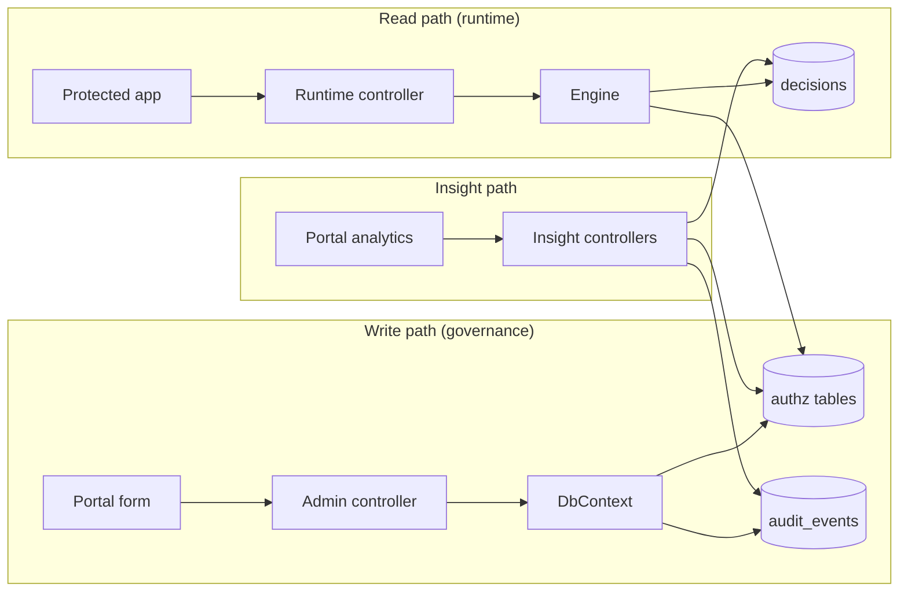

The write path and read path meet at the `authz` tables: governance **writes** the access model and
the runtime engine **reads** its `PUBLISHED` projection. Insight/analytics controllers read across the
model, audit, and decision stores to power the portal's dashboards.

## Deployment & Runtime Topology

The local stack is defined as one Docker Compose project, `authorization-control-plane`. All
credentials, ports, and AI settings come from a git-ignored `deploy/local/.env` file (the compose file
supplies the defaults shown below).

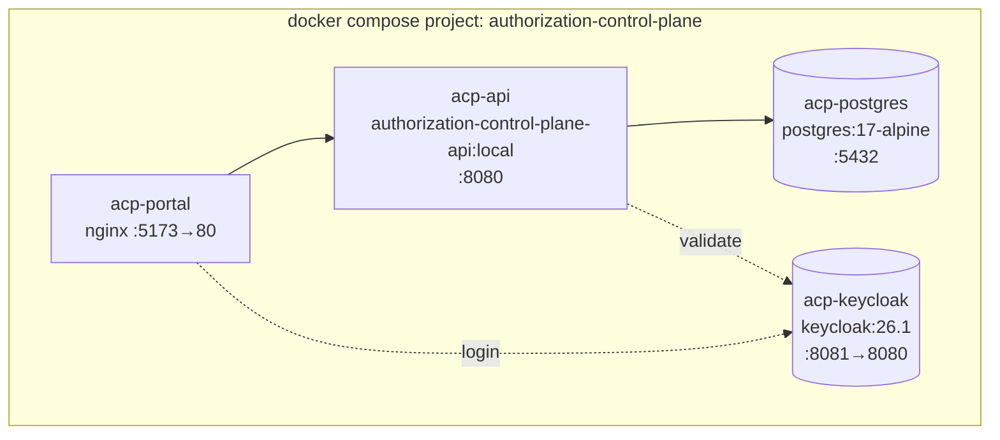

**Containers:** `acp-postgres` (PostgreSQL 17), `acp-keycloak` (Keycloak 26.1, published `8081→8080`),
`acp-api` (the Web API on `8080`), and `acp-portal` (the built SPA served by nginx, published
`5173→80`).

**Startup ordering** is enforced with `depends_on` conditions: the API waits for PostgreSQL to be
*healthy* (`pg_isready`) and for Keycloak to have *started*; the portal waits for the API. Two named
volumes persist state across restarts — `postgres-data` (database) and `api-data-protection` (ASP.NET
Core Data Protection keys). The API and portal images are built from
[backend/src/Authorization.Api/Dockerfile](../backend/src/Authorization.Api/Dockerfile) and
[frontend/Dockerfile](../frontend/Dockerfile).

**Environments.** In **Development** the API applies migrations and can seed demo data on boot; in
other environments that step is a no-op and schema changes are applied through the normal migration
process. Because the API is stateless, non-local deployments run **multiple API instances** behind a
load balancer, sharing the database and (for Data Protection) a shared key ring.

Source: [docker-compose.yml](../deploy/local/docker-compose.yml). See [Developer Guide](21_Developer_Guide.md)
for run instructions.

### Dependency diagram

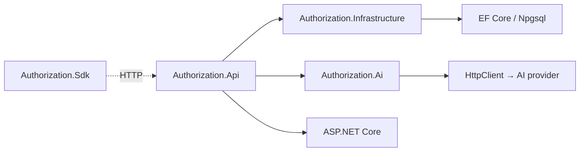

Only `Authorization.Api` references other in-solution projects (`Authorization.Ai` and
`Authorization.Infrastructure`); those libraries — and `Authorization.Sdk` — hold no project
references of their own, so the API is the single composition root.

## Scalability, Availability & Resilience

| Attribute | How the architecture addresses it |
|-----------|-----------------------------------|
| **Horizontal scale (D6)** | Stateless request handling: each call carries its own token and no server session is kept, so API instances scale out behind a load balancer with the database as the shared state. The read-heavy runtime plane can be scaled independently of admin traffic. |
| **Low, predictable latency (D1)** | The decision engine uses `AsNoTracking` reads over composite indexes tuned to its exact filters; the batch endpoint amortizes network cost; per-decision spans expose latency for tuning. |
| **Availability & readiness (D9)** | Split health probes let orchestrators restart on liveness failure but only route traffic when the database is reachable (readiness). Startup ordering prevents the API from serving before its dependencies are up. |
| **Fault isolation (D7)** | The AI layer degrades to "disabled" on misconfiguration and never throws at startup; malformed model output is handled gracefully; AI is never a dependency of an enforcement decision. |
| **Data integrity (D2, D3)** | Optimistic concurrency (`Version`/`VersionId`) prevents lost updates; the `PUBLISHED`-only read model isolates live decisions from in-progress edits; check constraints enforce controlled vocabularies at the database. |
| **Consistency of audit (D3)** | Entity change and audit event share one transaction, so partial writes cannot desynchronize the trail from the data. |

See [Non-Functional Requirements](03_Non_Functional_Requirements.md) for the target quality bars.

## Technology Stack

| Layer | Technology | Version |
|-------|------------|---------|
| Runtime | .NET / ASP.NET Core | `net10.0` |
| Auth (admin) | `Microsoft.AspNetCore.Authentication.JwtBearer` | 10.0.9 |
| ORM | `Microsoft.EntityFrameworkCore` | 10.0.9 |
| DB driver | `Npgsql` / `Npgsql.EntityFrameworkCore.PostgreSQL` | 10.0.3 / 10.0.2 |
| Ad-hoc queries | `Dapper` | 2.1.79 |
| Telemetry | `OpenTelemetry.*` (hosting, ASP.NET Core, HTTP) | 1.16.0 |
| API docs | `Microsoft.AspNetCore.OpenApi` / `Microsoft.OpenApi` | 10.0.9 / 2.10.0 |
| Database | PostgreSQL (container) | 17 (`postgres:17-alpine`) |
| Admin IdP | Keycloak (container) | 26.1 |
| Frontend framework | React / react-dom | 19.2.7 |
| Frontend build | Vite / TypeScript | 8.1.1 / ~6.0.2 |
| Frontend routing/state | react-router-dom / @tanstack/react-query | 7.18.1 / 5.101.2 |
| Frontend auth | oidc-client-ts (PKCE, in-memory token, silent renew) | 3.5.0 |
| Frontend viz | d3-* (hierarchy, scale, selection, shape, zoom) | 3.x |

Full stack detail: [Technology Stack](06_Technology_Stack.md).

## Architecture Decisions & Trade-offs

| Decision | Alternative considered | Why this choice | Trade-off accepted |
|----------|------------------------|-----------------|--------------------|
| Split control/runtime planes in one codebase & DB | Separate services/databases | Simplicity and a single source of truth; independent tuning without operational sprawl. | Both planes share a DB, so extreme scale would eventually need read replicas or a cache. |
| RBAC baseline + optional ABAC policies | Pure RBAC, or pure policy engine (e.g. OPA) | Familiar RBAC covers the common case; ABAC adds context sensitivity only where needed. | Two mechanisms to understand; policy authoring is more complex than roles alone. |
| EF Core engine, **no decision cache** | Cache decisions or the access model | Always-current decisions; no invalidation complexity or stale-grant risk. | Every decision hits the DB; throughput is bounded by DB read capacity + indexes. |
| Per-application OIDC issuers | One shared IdP for all runtime callers | Real multi-tenant isolation — each app trusts its own IdP. | More configuration per application; JWKS resolution per issuer. |
| Capability-based delegated admin | Coarse "admin/non-admin" roles | Fine-grained least privilege across platform/tenant/app scopes. | More policies and claim plumbing. |
| AI advisory-only behind `IAiAssistant` | AI-assisted or AI-driven decisions | Keeps enforcement deterministic and auditable; AI can be fully absent. | AI cannot auto-apply changes; it drafts for a human to approve. |
| Server-owned config via `/v1/config` | Hard-coded SPA config / rebuilds | Change limits/flags/windows without redeploying the SPA. | An extra request on load and a config contract to maintain. |
| Stateless API (token per request) | Server-side sessions | Trivial horizontal scale; no session store. | Slightly larger requests; token validation on every call. |

## Constraints, Risks & Future Evolution

- **Single database.** All planes share one PostgreSQL instance. This is deliberate for simplicity but
  is the primary scaling constraint; read replicas or a runtime read-model cache are the natural next
  steps if enforcement traffic outgrows a single primary.
- **No decision cache (by design).** Favors correctness over raw throughput; if latency/throughput
  targets tighten, a carefully invalidated cache of the `PUBLISHED` access model is the first lever.
- **Local-first deployment.** The provided topology is Docker Compose for local development; a
  production topology (managed Postgres, real admin IdP, horizontal API scaling, shared Data Protection
  key ring, TLS termination) must be provisioned separately.
- **AI is a preview capability.** Off by default, advisory only, and provider-dependent; treat the Fake
  provider as the contract and real providers as substitutable.
- **Mixed concurrency tokens.** Most entities use an integer `Version`; a few use a GUID `VersionId`.
  Both are optimistic-concurrency tokens — new contributors should not assume a single scheme.

## Cross-References

- Design rationale and patterns: [Solution Design](05_Solution_Design.md)
- Backend modules in depth: [Module Design](12_Module_Design.md)
- Entities and relationships: [Data Model](14_Data_Model_Documentation.md)
- Runtime decision rules in detail: [Business Rules](19_Business_Rules.md)
- End-to-end startup trace: [Code Walkthrough](23_Code_Walkthrough.md)
- Frameworks and versions at each layer: [Technology Stack](06_Technology_Stack.md)
- Authentication schemes and capability policies: [Security Design](16_Security_Design.md)
- AI feature behavior: [AI Features](15_AI_Features.md)
- Error envelope and codes: [Error Handling](17_Error_Handling.md)
- Tracing, logging, and health: [Logging & Observability](18_Logging_and_Observability.md)
- Reason codes, capabilities, and vocabularies: [Glossary](24_Glossary.md)
- Quality attributes (scalability, resilience): [Non-Functional Requirements](03_Non_Functional_Requirements.md)
