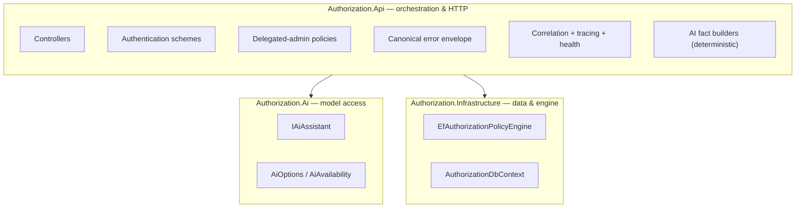
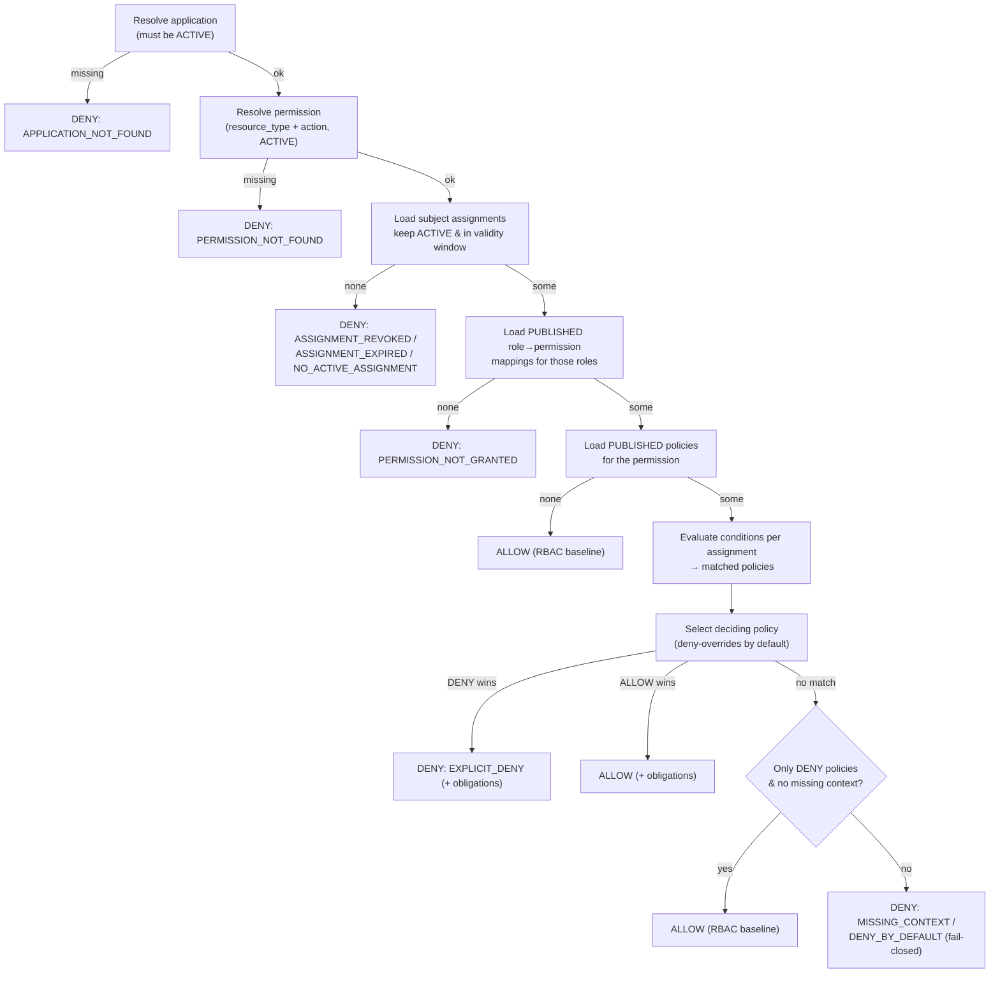
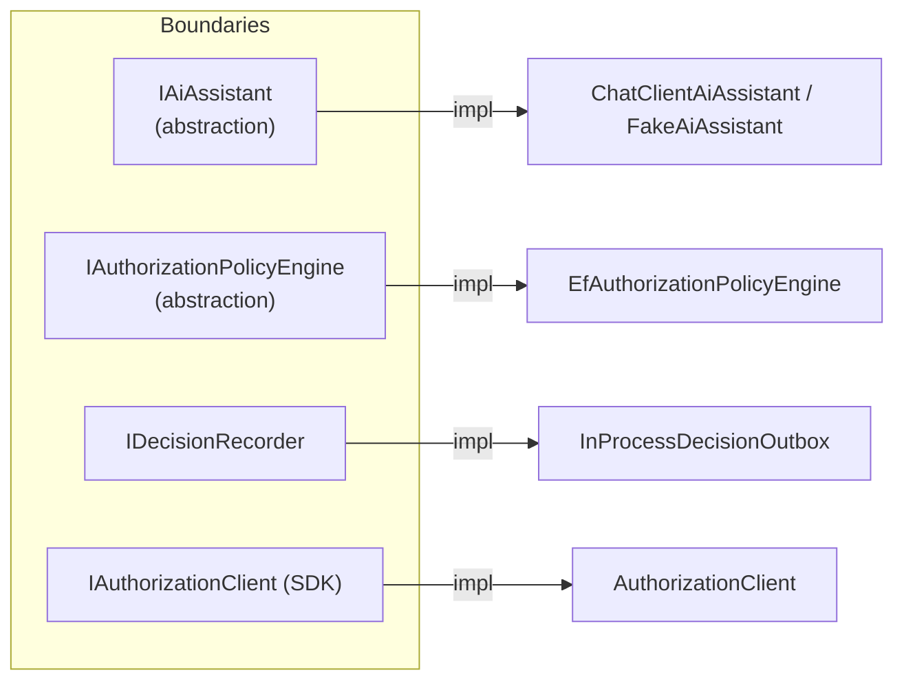

# 05 — Solution Design

> Part of the [Documentation Portal](README.md).
> Related: [System Architecture](04_System_Architecture.md) · [Module Design](12_Module_Design.md) · [Component Design](11_Component_Design.md)

---

## Table of Contents

1. [Purpose](#purpose)
2. [Solution Overview](#solution-overview)
3. [Design Goals](#design-goals)
4. [Core Domain Concepts](#core-domain-concepts)
5. [Responsibility Allocation](#responsibility-allocation)
6. [The Authorization Decision Model](#the-authorization-decision-model)
7. [Governance Design](#governance-design)
8. [Runtime Design](#runtime-design)
9. [AI Design](#ai-design)
10. [Major Design Decisions](#major-design-decisions)
11. [Design Patterns Used](#design-patterns-used)
12. [Module Boundaries & Abstractions](#module-boundaries--abstractions)
13. [Extension Points](#extension-points)
14. [Service Interactions](#service-interactions)
15. [Trade-offs, Constraints & Non-Goals](#trade-offs-constraints--non-goals)
16. [Cross-References](#cross-references)

---

## Purpose

This document explains the **design of the solution** — *why* the system is shaped the way it is,
not just what its structure is. Where [System Architecture](04_System_Architecture.md) shows the
components and how a request flows, this document explains the decisions behind that structure: how
governance is separated from enforcement, how an authorization decision is actually computed, how the
abstraction boundaries (seams) keep the code testable, and which trade-offs were deliberately made.

It is written for engineers and architects who need to understand the intent behind the code before
changing it. It translates the requirements in [Functional Requirements](02_Functional_Requirements.md)
and [Non-Functional Requirements](03_Non_Functional_Requirements.md) into concrete design choices, and
links out to the deeper module, data-model, and security documents for implementation detail.

## Solution Overview

The system is a centralized, multi-tenant **authorization control plane**: a single service that lets
organizations *model* access centrally and lets many independent applications *enforce* it
consistently. It is organized around two complementary surfaces over one shared data model:

- **Governance plane (write path).** Delegated administrators use the React portal to model access —
  tenants, applications, roles, permissions, role→permission mappings, condition-based policies,
  subject assignments, OIDC providers, reference data, and access-review campaigns. Every change is
  capability-gated and recorded as an audit event.
- **Runtime plane (read path).** Protected applications call `POST /v1/authorize` (directly or through
  the [SDK](../backend/src/Authorization.Sdk/)) to ask *"may this subject perform this action on this
  resource?"* The engine returns an allow/deny decision with the reasons and any obligations, and the
  decision is recorded for analytics and audit.

Two cross-cutting design choices sit on top of both planes:

- **Server-owned configuration.** Feature availability, limits, and cache windows are decided by the
  server and published through `GET /v1/config`; the portal never hard-codes them.
- **Optional AI assistance.** An advisory AI layer helps administrators draft policies, explain
  decisions, and summarize access. It reads the model and narrates facts but **never** participates in
  a runtime decision, and can be fully disabled.

Identity is delegated to per-application OIDC providers (Keycloak in the local stack); all state lives
in a single PostgreSQL database under schema `authz`. The context diagram and component inventory are
in [System Architecture](04_System_Architecture.md).

## Design Goals

The design is driven by the following goals, each of which is realized concretely in the codebase:

1. **Separate governance from enforcement.** Modeling access (write-heavy, human-driven,
   capability-gated) and deciding access (read-heavy, machine-driven, latency-sensitive) have
   different performance and security profiles, so they use different controllers and different
   authentication schemes.
2. **Safe by default.** A decision denies unless something explicitly allows it; policy evaluation is
   *fail-closed* (missing required context denies) and uses **deny-overrides** combining by default.
3. **Low-latency, stateless runtime.** Every call carries its own token, the engine reads with
   `AsNoTracking`, and no server-side session is kept, so the runtime path is horizontally scalable
   (target p95 ≤ 50 ms — see [Non-Functional Requirements](03_Non_Functional_Requirements.md)).
4. **Auditable by construction.** Every governance mutation writes its audit event in the *same*
   transaction as the change, and every runtime decision is recorded — the trail cannot drift from
   the data.
5. **Server as the source of truth for behavior.** The portal reads feature availability and limits
   from `GET /v1/config` rather than inferring them, eliminating client/server drift.
6. **AI advisory and optional.** AI never decides; it degrades gracefully when disabled or
   misconfigured and is gated per feature.
7. **Extensible and testable through seams.** Core behaviors sit behind interfaces
   (`IAuthorizationPolicyEngine`, `IAiAssistant`, `IDecisionRecorder`, `IAuthorizationClient`), the
   engine takes an injected `TimeProvider`, a deterministic `Fake` AI provider keeps tests keyless,
   and `public partial class Program` enables in-process integration tests.

## Core Domain Concepts

Understanding the design requires a shared vocabulary. These are the concepts the rest of the document
relies on; their storage and relationships are detailed in [Data Model](14_Data_Model_Documentation.md)
and their definitions in the [Glossary](24_Glossary.md).

| Concept | Meaning in the design |
|---------|-----------------------|
| **Tenant** | Top-level owner that groups applications for a business unit or team. |
| **Application** | A protected system with its own roles, permissions, policies, and OIDC provider. Runtime-resolvable **only when `ACTIVE`** — a non-active application is invisible to the engine (a status kill-switch). |
| **Permission** | A `(resource_type, action)` capability defined within an application (e.g. `price` / `publish`). |
| **Role** | A named bundle of permissions that can be assigned to subjects. |
| **Role→Permission mapping** | Grants a permission to a role. Effective at runtime **only when `PUBLISHED`** (draft mappings are staged, not enforced). |
| **Policy** | An additive, condition-based `ALLOW`/`DENY` rule attached to a permission, carrying a priority and optional obligations. Effective **only when `PUBLISHED`**. |
| **Assignment** | Binds a subject to a role within an application, with a validity window (`ValidFrom`/`ValidUntil`), state, and optional ABAC attributes. |
| **Subject** | The actor a decision is about — `USER`, `GROUP`, `SERVICE_ACCOUNT`, `EXTERNAL_USER`, `TENANT`, or `APPLICATION`. At runtime the subject is derived authoritatively from the verified token. |
| **Decision** | The runtime outcome: `allowed` plus a `denyReason` (when denied), the matched roles/permissions/policies, and any obligations. Recorded for audit and analytics. |
| **Obligation** | A key/value instruction returned alongside an `ALLOW` that the calling application is expected to honor (e.g. an additional constraint). |
| **Audit event** | An append-only record of a governance mutation, capturing actor, timestamp, correlation id, and before/after values. |

## Responsibility Allocation

Each project owns a distinct slice of the solution; the API is the composition root that wires them
together (it references the AI and Infrastructure libraries, which do not reference each other — see
[System Architecture](04_System_Architecture.md#dependency-diagram)).



| Concern | Owner |
|---------|-------|
| HTTP contracts, status codes, validation | Authorization.Api controllers + [Contracts](../backend/src/Authorization.Api/Contracts/) |
| Shared mutation + audit workflow | [GovernanceControllerBase.cs](../backend/src/Authorization.Api/Controllers/GovernanceControllerBase.cs) |
| Authentication (portal + runtime) | [Authentication](../backend/src/Authorization.Api/Authentication/) |
| Fine-grained (delegated-admin) authorization | [Authorization](../backend/src/Authorization.Api/Authorization/) |
| Runtime decision logic | [EfAuthorizationPolicyEngine.cs](../backend/src/Authorization.Infrastructure/RuntimeAuthorization/EfAuthorizationPolicyEngine.cs) |
| Decision recording | [InProcessDecisionOutbox.cs](../backend/src/Authorization.Infrastructure/RuntimeAuthorization/InProcessDecisionOutbox.cs) (`IDecisionRecorder`) |
| Persistence (schema `authz`) | [AuthorizationDbContext.cs](../backend/src/Authorization.Infrastructure/Persistence/AuthorizationDbContext.cs) |
| AI provider access | [IAiAssistant.cs](../backend/src/Authorization.Ai/IAiAssistant.cs) + implementations |
| Deterministic AI "facts" | [Ai builders](../backend/src/Authorization.Api/Ai/) |
| Client access for protected apps | [Authorization.Sdk](../backend/src/Authorization.Sdk/) |

A recurring design choice: **deterministic computation is separated from generative AI**. Builders
such as [ConfigAdvisorBuilder.cs](../backend/src/Authorization.Api/Ai/ConfigAdvisorBuilder.cs),
[SodAnalysisBuilder.cs](../backend/src/Authorization.Api/Ai/SodAnalysisBuilder.cs), and
[DecisionDiagnosticsBuilder.cs](../backend/src/Authorization.Api/Ai/DecisionDiagnosticsBuilder.cs)
compute facts from the database; the AI layer only *narrates or summarizes* those facts.

## The Authorization Decision Model

The runtime decision is the heart of the solution. It is implemented by
[EfAuthorizationPolicyEngine.cs](../backend/src/Authorization.Infrastructure/RuntimeAuthorization/EfAuthorizationPolicyEngine.cs)
as a deterministic, read-only (`AsNoTracking`) pipeline that emits one tracing span per decision. The
design combines **RBAC as the baseline** with **policies as an additive, optional guardrail layer**,
and is **fail-closed**.



**Design rationale, step by step:**

1. **Application gate.** Only an `ACTIVE` application resolves; any other status yields
   `APPLICATION_NOT_FOUND`. Status is therefore a genuine runtime kill-switch, not just an
   administrative label.
2. **Permission gate.** The `(resource_type, action)` must map to an `ACTIVE` permission, else
   `PERMISSION_NOT_FOUND`.
3. **Assignment gate.** The subject must have at least one assignment that is `ACTIVE`, not revoked,
   and within its `ValidFrom`/`ValidUntil` window. When none qualifies, the engine surfaces the *most
   informative* reason — `ASSIGNMENT_REVOKED`, then `ASSIGNMENT_EXPIRED`, then `NO_ACTIVE_ASSIGNMENT`.
4. **RBAC grant.** A `PUBLISHED` role→permission mapping must connect one of the subject's roles to
   the permission, else `PERMISSION_NOT_GRANTED`. Draft mappings never affect runtime.
5. **RBAC baseline (no policies).** If no `PUBLISHED` policy targets the permission, the role grant
   alone authorizes — this is the deliberate RBAC baseline. Policies are an *optional* layer, so the
   simple case stays simple.
6. **Policy evaluation.** Each `PUBLISHED` policy is parsed once per decision and evaluated against
   each eligible assignment. A policy's condition document has a `match` mode (`all`/`any`) and a list
   of leaf conditions; operators and their arities/value-types are defined in
   [PolicyOperators.cs](../backend/src/Authorization.Infrastructure/RuntimeAuthorization/PolicyOperators.cs).
   Conditions can reference four attribute sources: the request **context**, the assignment's **ABAC
   attributes**, computed **`system.*`** values (the evaluation clock), and shared **`reference.*`**
   application lookup lists (queried lazily, only when a policy actually references them).
7. **Combining.** Matched policies are resolved by the application's configured
   `PolicyCombiningAlgorithm` (**deny-overrides** by default). A deciding `DENY` yields
   `EXPLICIT_DENY`; a deciding `ALLOW` yields an allow. Obligations from the matched policies of the
   deciding effect are collected and returned.
8. **Fail-closed fallback.** If no policy matched: when *only* `DENY` policies exist and no required
   context was missing, the RBAC baseline still allows; otherwise the engine denies with
   `MISSING_CONTEXT` (a guard couldn't evaluate) or `DENY_BY_DEFAULT`.

The full, authoritative rule set (including the exact deny-reason ordering and combining semantics) is
documented in [Business Rules](19_Business_Rules.md); the request-level sequence is in
[System Architecture](04_System_Architecture.md#runtime-decision-sequence).

## Governance Design

Governance mutations follow one shared, auditable workflow so every controller behaves identically.

- **Atomic mutation + audit.** All delegated-admin controllers extend
  [GovernanceControllerBase.cs](../backend/src/Authorization.Api/Controllers/GovernanceControllerBase.cs).
  Its `SaveGovernanceMutationAsync` adds the `AuditEventEntity` and calls a single
  `SaveChangesAsync`, so on the relational provider the entity change and its audit row commit inside
  one implicit transaction — **both or neither**. Bulk handlers build many audit events with
  `BuildAuditEvent` and commit them with one save. This is what makes the system *auditable by
  construction*: an audit gap would require the mutation itself to fail.
- **Draft → Publish lifecycle.** Role→permission mappings and policies have an explicit `PUBLISHED`
  state and only affect runtime once published, so administrators can stage changes safely and review
  them before they take effect.
- **Optimistic concurrency.** Every audited entity carries an integer `version` concurrency token, so
  concurrent edits fail loudly rather than silently losing an update (see
  [Non-Functional Requirements](03_Non_Functional_Requirements.md)).
- **Boundary validation.** Input is validated at the edge with data annotations, a `RequireText`
  guard (because `[Required]` accepts whitespace-only strings), and domain validators; failures return
  a `422` with a `GovernanceErrorCodes` value in the canonical error envelope (see
  [Error Handling](17_Error_Handling.md)).
- **Business keys vs surrogate ids.** Entities expose a human-readable business key
  (`applicationId`, `roleKey`, `permissionKey`) in external contracts while using a surrogate `GUID`
  row id for internal foreign keys — decoupling the wire contract from storage identity.
- **Actor attribution.** The audit event records the acting admin (`User.Identity.Name`, falling back
  to `local-admin`), the resolved actor role, and the request correlation id, tying every change to a
  who and a trace.

## Runtime Design

The runtime path is optimized for low latency, statelessness, and multi-application isolation.

- **Stateless.** Each request carries its own bearer token; no session state is kept server-side, so
  the API scales horizontally behind a load balancer.
- **Per-application caller authentication.** Each application registers its own OIDC provider
  (issuer/audience/JWKS + subject claim) as an `OidcProviderEntity`. At runtime,
  `RuntimeCallerAuthenticator` validates the presented bearer token against *that application's*
  provider and resolves the caller's subject type and email — this is how one API safely serves many
  applications, each with its own identity provider.
- **Token-authoritative subject.** The effective subject always comes from the verified token. A
  `subject` supplied in the request body may only *corroborate* it; a mismatch returns `403`
  `SUBJECT_MISMATCH`, never an override.
- **Input limits at the boundary.** The runtime controller enforces `MaxBatchSize` (50),
  `MaxRequestBodyBytes` (256 KB), and `MaxContextJsonBytes` (32 KB), returning `413`/`422` for
  oversized payloads to protect the hot path.
- **Batch evaluation.** `POST /v1/authorize/batch` evaluates each check independently; a per-check
  `context` is merged over the shared base context, so callers can amortize one round-trip across
  many questions about the same subject.
- **Decision recording.** Decisions are handed to `IDecisionRecorder`, implemented by the in-process
  [InProcessDecisionOutbox.cs](../backend/src/Authorization.Infrastructure/RuntimeAuthorization/InProcessDecisionOutbox.cs).
  Recording sits behind the interface so it can be swapped without touching the controller, and the
  engine emits an OpenTelemetry span (`authorization.decision`) per evaluation for latency tracking.

## AI Design

AI is an advisory layer, deliberately isolated so the core never depends on a model provider.

- **Advisory only.** AI output is text or structured JSON — a draft, an explanation, or a summary. It
  is never fed back into an authorization decision.
- **Deterministic facts vs generative narration.** The API computes *facts* deterministically from the
  database (the `Ai/` builders — config findings, SoD analysis, decision diagnostics), and the AI
  layer only narrates or summarizes those facts. This keeps AI answers grounded and reproducible in
  their factual core.
- **Availability & graceful degradation.**
  [AiServiceCollectionExtensions.cs](../backend/src/Authorization.Ai/AiServiceCollectionExtensions.cs)
  builds an `AiAvailability` at startup. If the master switch is off *or* the selected provider is
  misconfigured, AI is registered as **disabled** — no `IAiAssistant` is resolvable and availability
  reports `Enabled = false` — and startup **never throws**; an `AiStartupLogger` surfaces the config
  gaps for operators.
- **Per-feature gating.** `AiFeatureAvailability` exposes eight independent flags (policy authoring,
  decision explainer, impact analysis, config advisor, access search, SoD analysis, access
  certification, audit narrative). Each endpoint checks its own flag, so a disabled feature's endpoint
  is simply absent.
- **Provider strategy.** The `Fake` provider is a deterministic, keyless stub used by tests and
  offline development; live providers (Azure OpenAI / OpenAI-compatible) share one small typed
  `HttpClient` and an optional `IAiUsageObserver` for token/cost accounting.
- **Privacy.** Subject emails are pseudonymized (one-way) before any prompt leaves the process, and AI
  invocations and prompt logs are written to append-only tables for audit and cost visibility.

Feature behavior and prompt structure are detailed in [AI Features](15_AI_Features.md).

## Major Design Decisions

| Decision | Rationale | Trade-off accepted | Evidence |
|----------|-----------|--------------------|----------|
| RBAC baseline; policies additive | Keep the common case simple; add fine-grained control only where needed. | A permission with no published policy relies solely on role grants. | Engine "Case 1 — no policies published" |
| Deny-overrides, fail-closed | Safety: an ambiguous or under-specified request should deny. | A missing context value denies rather than defaulting to allow. | `SelectDecidingPolicy`, `MISSING_CONTEXT` |
| Token subject is authoritative | A caller cannot authorize as someone else by editing the body. | Callers must present a valid per-app token; body subject is advisory only. | `ResolveSubject` (RuntimeAuthorizationController) |
| Per-application OIDC providers | One control plane can serve many apps, each with its own IdP. | Each application must register issuer/audience/JWKS. | `OidcProviderEntity`, [OidcProvidersController.cs](../backend/src/Authorization.Api/Controllers/Governance/OidcProvidersController.cs) |
| Draft → Publish for mappings & policies | Safe staging; changes are reviewable before they take effect. | Administrators must remember to publish. | Engine filters `State == "PUBLISHED"` |
| Atomic mutation + audit | The audit trail can never drift from the data. | Every mutation carries the cost of an audit write. | `SaveGovernanceMutationAsync` |
| Server-owned config | Eliminates client/server feature drift. | The portal depends on `GET /v1/config` at load. | [ConfigController.cs](../backend/src/Authorization.Api/Controllers/ConfigController.cs) |
| AI off by default, per-feature gated | Safe defaults; no external dependency unless opted in. | AI features are unavailable until explicitly enabled and configured. | [AiAvailability.cs](../backend/src/Authorization.Ai/AiAvailability.cs) |
| Explicit input limits at the boundary | Protects the runtime path from oversized payloads. | Callers must respect batch/body/context caps. | `MaxBatchSize`, `MaxRequestBodyBytes`, `MaxContextJsonBytes` |

## Design Patterns Used

| Pattern | Where | Purpose |
|---------|-------|---------|
| **Options pattern (validated)** | [Configuration](../backend/src/Authorization.Api/Configuration/) | Strongly-typed, validated settings bound from configuration |
| **Dependency Injection** | [Program.cs](../backend/src/Authorization.Api/Program.cs) + `ServiceCollectionExtensions` | Composition root & testability |
| **Strategy / provider abstraction** | [IAiAssistant.cs](../backend/src/Authorization.Ai/IAiAssistant.cs) (Chat vs Fake) | Swap AI providers without touching callers |
| **Repository / Unit-of-Work (via EF Core)** | [AuthorizationDbContext.cs](../backend/src/Authorization.Infrastructure/Persistence/AuthorizationDbContext.cs) | Persistence with implicit transactions |
| **Middleware pipeline** | [Observability](../backend/src/Authorization.Api/Observability/), [Errors](../backend/src/Authorization.Api/Errors/) | Correlation, tracing, and error shaping as cross-cutting concerns |
| **Policy-based authorization + custom handler** | [DelegatedAdminAuthorizationHandler.cs](../backend/src/Authorization.Api/Authorization/DelegatedAdminAuthorizationHandler.cs) | Capability/scope gating for delegated admins |
| **Typed HttpClient + resilience** | [AuthorizationClient.cs](../backend/src/Authorization.Sdk/AuthorizationClient.cs) | Robust runtime client with linear-backoff retries (opt-in) |
| **Outbox (in-process)** | [InProcessDecisionOutbox.cs](../backend/src/Authorization.Infrastructure/RuntimeAuthorization/InProcessDecisionOutbox.cs) | Decision recording behind `IDecisionRecorder` |
| **Builder** | [Ai builders](../backend/src/Authorization.Api/Ai/) | Assemble deterministic fact sets for AI grounding |
| **Template method (base controller)** | [GovernanceControllerBase.cs](../backend/src/Authorization.Api/Controllers/GovernanceControllerBase.cs) | Shared mutation + audit + error-envelope workflow |

## Module Boundaries & Abstractions



These interfaces are the **seams** that make the system testable and extensible — a new implementation
can be registered in DI without touching controllers. They are also the natural test doubles: the
`Fake` AI assistant, a substitute decision recorder, or an in-memory engine can be swapped in for
unit and integration tests.

## Extension Points

| To add… | Do this | Reference |
|---------|---------|-----------|
| A new AI provider | Implement `IAiAssistant` and register it in [AiServiceCollectionExtensions.cs](../backend/src/Authorization.Ai/AiServiceCollectionExtensions.cs) | [AI Features](15_AI_Features.md) |
| A new policy operator | Add its definition to [PolicyOperators.cs](../backend/src/Authorization.Infrastructure/RuntimeAuthorization/PolicyOperators.cs) and handle it in the engine's evaluation | [Business Rules](19_Business_Rules.md) |
| A new delegated-admin capability | Add to `DelegatedAdminCapability` and wire a policy in [Authentication/ServiceCollectionExtensions.cs](../backend/src/Authorization.Api/Authentication/ServiceCollectionExtensions.cs) | [Security Design](16_Security_Design.md) |
| A new governance entity | Add the entity + `DbSet` + migration + a controller extending `GovernanceControllerBase` | [Data Model](14_Data_Model_Documentation.md) |
| A new portal page | Add a route in [router.tsx](../frontend/src/router.tsx) and a nav entry in [workspace/nav.ts](../frontend/src/workspace/nav.ts) | [Developer Guide](21_Developer_Guide.md) |

## Service Interactions

```mermaid
sequenceDiagram
    participant Ctrl as Controller
    participant Opt as Validated Options
    participant Eng as Engine
    participant Ai as IAiAssistant
    participant Db as DbContext
    Ctrl->>Opt: read feature availability / limits
    Ctrl->>Db: read/write governance state
    Ctrl->>Eng: authorize (runtime / simulator)
    Ctrl->>Ai: draft / explain / summarize (advisory)
    Ai-->>Ctrl: text / JSON (never a decision)
```

The engine and the AI assistant are independent collaborators: a controller may consult the engine
for a decision *and* the AI assistant for a human-readable narrative, but the two never depend on each
other.

## Trade-offs, Constraints & Non-Goals

The design is scoped for a demonstrable, locally-runnable control plane. The following choices are
deliberate and bound the solution:

- **Single shared database for both planes.** Governance and runtime share one PostgreSQL database for
  simplicity and transactional consistency; the trade-off is that the two planes scale together rather
  than independently.
- **In-process decision recording.** Decisions are recorded through an in-process outbox rather than
  an external broker — simpler to run locally, at the cost of coupling recording to the API process
  lifecycle. The `IDecisionRecorder` seam leaves room to swap in a durable queue later.
- **Decision caching off by default.** `FeatureFlags:DecisionCachingEnabled` is `false`, so every
  decision reads the database; this is mitigated by `AsNoTracking`, targeted indexes, and the
  low-latency query shape (p95 ≤ 50 ms target).
- **Deny-overrides is the only shipped combining algorithm default.** The application carries a
  `PolicyCombiningAlgorithm` field for future strategies, but deny-overrides is the safe default.
- **AI is advisory and optional — never a control.** It is explicitly *not* a decision input; this is
  a hard boundary, not a configuration.
- **Local identity via Keycloak.** The local stack uses Keycloak as the OIDC provider; a production
  deployment would register each application's real provider through the same `OidcProviderEntity`
  mechanism.
- **Local-first operations.** The stack targets Docker Compose for development and demos and is not
  hardened for production HA/DR (see [Developer Guide](21_Developer_Guide.md)).

## Cross-References

- What the system must do: [Functional Requirements](02_Functional_Requirements.md)
- Quality attributes and limits: [Non-Functional Requirements](03_Non_Functional_Requirements.md)
- Structural view and diagrams: [System Architecture](04_System_Architecture.md)
- Backend module internals: [Module Design](12_Module_Design.md)
- Frontend internals: [Component Design](11_Component_Design.md)
- Entities, tables, and constraints: [Data Model](14_Data_Model_Documentation.md)
- AI features and prompts: [AI Features](15_AI_Features.md)
- Authentication schemes and capabilities: [Security Design](16_Security_Design.md)
- Authorization rules and invariants: [Business Rules](19_Business_Rules.md)
- Configuration surface: [Configuration](20_Configuration.md)
- End-to-end code path: [Code Walkthrough](23_Code_Walkthrough.md)
