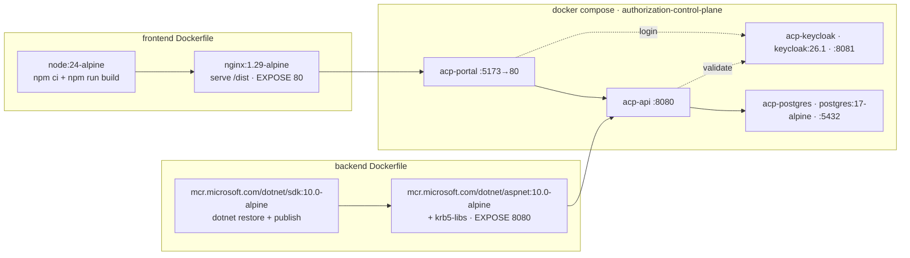

# 06 — Technology Stack

> Part of the [Documentation Portal](README.md).
> Related: [Repository Structure](07_Repository_Structure.md) · [Developer Guide](21_Developer_Guide.md) · [System Architecture](04_System_Architecture.md)

---

## Table of Contents

1. [Purpose](#purpose)
2. [Stack at a Glance](#stack-at-a-glance)
3. [Backend Stack](#backend-stack)
4. [Frontend Stack](#frontend-stack)
5. [Data & Identity](#data--identity)
6. [AI Stack](#ai-stack)
7. [Testing Stack](#testing-stack)
8. [Tooling & Build](#tooling--build)
9. [Runtime & Deployment](#runtime--deployment)
10. [Consolidated Version Reference](#consolidated-version-reference)
11. [Cross-References](#cross-references)

---

## Purpose

This document is the authoritative catalog of every technology, framework, library, and tool used in
the solution, with **exact declared versions** and the purpose of each. All versions are sourced
directly from the project manifests — the backend `*.csproj` files, the frontend
[package.json](../frontend/package.json), the two `Dockerfile`s, and
[docker-compose.yml](../deploy/local/docker-compose.yml) — and should be treated as the source of
truth. There is no central package-management file (`Directory.Packages.props`) or `global.json` SDK
pin, so backend versions are declared per project.

> **How to read versions.** Backend NuGet versions are exact pins (e.g. `10.0.9`). Frontend npm
> versions are the declared semver ranges (`^` allows compatible minor/patch, `~` allows patch only);
> the exact resolved versions are locked in `frontend/package-lock.json`.

## Stack at a Glance

| Layer | Core technology | Version | Language |
|-------|-----------------|---------|----------|
| Backend API | ASP.NET Core (`Microsoft.NET.Sdk.Web`) | .NET **10** (`net10.0`) | C# |
| ORM / data | Entity Framework Core + Dapper over Npgsql | EF Core **10.0.9**, Dapper **2.1.79**, Npgsql **10.0.3** | C# |
| Frontend | React SPA built with Vite | React **19.2.7**, Vite **8.1.1** | TypeScript **6.0.2** |
| Database | PostgreSQL (schema `authz`) | **17** (`postgres:17-alpine`) | SQL |
| Identity | Keycloak (OIDC, realm `authorization-local`) | **26.1** | — |
| AI (optional) | Custom OpenAI-compatible HTTP chat client | Azure OpenAI / OpenAI / Fake | C# |
| Orchestration | Docker Compose (project `authorization-control-plane`) | Compose v2 | YAML |

The solution comprises four backend projects (`Authorization.Api`, `Authorization.Ai`,
`Authorization.Infrastructure`, `Authorization.Sdk`) and one frontend app, all targeting **`net10.0`**
with nullable reference types and implicit usings enabled. Project layout is described in
[Repository Structure](07_Repository_Structure.md).

## Backend Stack

All backend projects target `net10.0`. The table below lists every declared NuGet package, its exact
version, the project that references it, and its role.

| Package | Version | Project | Purpose |
|---------|---------|---------|---------|
| **Microsoft.AspNetCore.Authentication.JwtBearer** | 10.0.9 | Api | Validate portal-admin and runtime-caller JWTs (JWKS-backed) |
| **Microsoft.AspNetCore.OpenApi** | 10.0.9 | Api | Generate the OpenAPI document (`MapOpenApi`, dev only) |
| **Microsoft.OpenApi** | 2.10.0 | Api, Api.Tests | OpenAPI object model used by the description pipeline |
| **Microsoft.EntityFrameworkCore** | 10.0.9 | Api | ORM: `DbContext`, change tracking, LINQ queries |
| **Microsoft.EntityFrameworkCore.Relational** | 10.0.9 | Api | Relational EF Core primitives |
| **Microsoft.EntityFrameworkCore.Design** | 10.0.9 | Api, Infrastructure | Design-time services for migrations (`dotnet ef`) |
| **Npgsql** | 10.0.3 | Infrastructure | PostgreSQL ADO.NET driver; raw connections for Dapper |
| **Npgsql.EntityFrameworkCore.PostgreSQL** | 10.0.2 | Infrastructure | EF Core provider for PostgreSQL (`UseNpgsql`) |
| **Dapper** | 2.1.79 | Infrastructure | Lightweight micro-ORM for hand-tuned read queries |
| **Microsoft.Extensions.Hosting.Abstractions** | 10.0.9 | Infrastructure, Ai | Hosted-service / DI abstractions |
| **Microsoft.Extensions.Http** | 10.0.9 | Ai, Sdk | `IHttpClientFactory` typed/named clients |
| **Microsoft.Extensions.Options(.ConfigurationExtensions)** | 10.0.9 | Ai | Strongly-typed, bound options |
| **Microsoft.Extensions.Configuration.Abstractions / .Binder** | 10.0.9 | Ai | Configuration binding for `AiOptions` |
| **Microsoft.Extensions.DependencyInjection.Abstractions** | 10.0.9 | Ai | DI registration extensions |
| **Microsoft.Extensions.Logging.Abstractions** | 10.0.9 | Ai | Logging abstractions |
| **OpenTelemetry.Extensions.Hosting** | 1.16.0 | Api | Tracing pipeline registration |
| **OpenTelemetry.Instrumentation.AspNetCore** | 1.16.0 | Api | Automatic server-side request spans |
| **OpenTelemetry.Instrumentation.Http** | 1.16.0 | Api | Outbound `HttpClient` spans |

Notable design points reflected in the dependencies:

- **EF Core *and* Dapper coexist.** EF Core owns the write model, migrations, and most reads;
  [NpgsqlConnectionFactory.cs](../backend/src/Authorization.Infrastructure/Persistence/NpgsqlConnectionFactory.cs)
  supplies raw connections so Dapper can serve specific read-optimized queries.
- **The AI project has no model-SDK dependency.** `Authorization.Ai` depends only on the
  `Microsoft.Extensions.*` primitives and `Microsoft.Extensions.Http`; the chat client is a
  hand-rolled OpenAI-compatible HTTP client (see [AI Stack](#ai-stack)) — there is no
  `Microsoft.Extensions.AI`, `Azure.AI.OpenAI`, or `OpenAI` NuGet package.
- **Project independence.** `Authorization.Ai`, `Authorization.Infrastructure`, and
  `Authorization.Sdk` declare no in-solution `ProjectReference`; only `Authorization.Api` composes
  them (see [System Architecture](04_System_Architecture.md#dependency-diagram)).
- **`System.Text.Json`** (in the framework) is used for all contract serialization and runtime
  context sizing; no third-party JSON library is used.

The built-in framework also supplies **ASP.NET Core health checks** (used by
[DatabaseReadinessHealthCheck.cs](../backend/src/Authorization.Api/Observability/DatabaseReadinessHealthCheck.cs))
and **policy-based authorization** (`Microsoft.AspNetCore.Authorization`, part of the shared
framework) for the delegated-admin handler.

## Frontend Stack

The portal is a React SPA written in TypeScript and built with Vite. Source:
[frontend/package.json](../frontend/package.json).

**Runtime dependencies**

| Package | Version | Purpose |
|---------|---------|---------|
| **react** / **react-dom** | ^19.2.7 | UI framework and DOM renderer |
| **react-router-dom** | ^7.18.1 | Client-side routing (platform and app-workspace shells) |
| **@tanstack/react-query** | ^5.101.2 | Server-state management: fetching, caching, mutations, invalidation |
| **oidc-client-ts** | ^3.5.0 | OIDC login (authorization code + PKCE), token storage, silent renew |
| **d3-array** | ^3.2.4 | Data transforms for charts |
| **d3-hierarchy** | ^3.1.2 | Tree/hierarchy layouts |
| **d3-scale** | ^4.0.2 | Scales for axes and heatmaps |
| **d3-selection** | ^3.0.0 | DOM selection for D3 rendering |
| **d3-shape** | ^3.2.0 | Line/area/arc generators |
| **d3-zoom** | ^3.0.0 | Pan/zoom for graph and matrix views |

**Build & development dependencies**

| Package | Version | Purpose |
|---------|---------|---------|
| **typescript** | ~6.0.2 | Language and type checking (`tsc -b` in the build) |
| **vite** | ^8.1.1 | Dev server and production bundler |
| **@vitejs/plugin-react** | ^6.0.3 | React fast-refresh / JSX transform for Vite |
| **vitest** | ^4.1.10 | Unit-test runner |
| **jsdom** | ^29.1.1 | Simulated DOM environment for component tests |
| **oxlint** | ^1.71.0 | Fast Rust-based linter |
| **prettier** | ^3.9.5 | Code formatter |
| **@types/react**, **@types/react-dom** | ^19.2.17 / ^19.2.3 | React type definitions |
| **@types/node** | ^24.13.2 | Node type definitions (build scripts, Vite config) |
| **@types/d3-\*** | ^3.x–^4.x | Type definitions for each D3 module |

> The component tests run on **Vitest + jsdom** using React's own render utilities; there is no
> `@testing-library/*` or Jest dependency in the project.

## Data & Identity

| Technology | Version / Image | Purpose |
|------------|-----------------|---------|
| **PostgreSQL** | `postgres:17-alpine` | Primary datastore; all tables live under schema `authz`. Container `acp-postgres` on port 5432. |
| **Keycloak** | `quay.io/keycloak/keycloak:26.1` | OIDC identity provider. Container `acp-keycloak` on 8081→8080, started with `start-dev --import-realm` importing realm `authorization-local`. |

Evidence: [docker-compose.yml](../deploy/local/docker-compose.yml) and the seeded realm
[authorization-local-realm.json](../deploy/local/keycloak/authorization-local-realm.json). Each
protected application also registers its *own* OIDC provider record for runtime caller validation
(see [Solution Design](05_Solution_Design.md#runtime-design)).

## AI Stack

AI assistance is an **optional, off-by-default** subsystem. It is implemented as a small,
hand-rolled HTTP client rather than a vendor SDK, which keeps `Authorization.Ai` dependency-light and
provider-agnostic.

| Provider (`Ai:Provider`) | Purpose | Evidence |
|--------------------------|---------|----------|
| **AzureOpenAI** | Live chat completions against an Azure OpenAI deployment | [AiOptions.cs](../backend/src/Authorization.Ai/AiOptions.cs) |
| **OpenAI** | Any OpenAI-compatible endpoint (also used for **GitHub Models** in development) | [AiOptions.cs](../backend/src/Authorization.Ai/AiOptions.cs) |
| **Fake** | Deterministic, keyless in-process stub for tests and offline development | [FakeAiAssistant.cs](../backend/src/Authorization.Ai/FakeAiAssistant.cs) |

Key facts:

- **Transport.** Live providers share one named `HttpClient`; requests are issued by
  [HttpChatCompletionClient.cs](../backend/src/Authorization.Ai/Providers/HttpChatCompletionClient.cs)
  (an `IChatCompletionClient`). For Azure it targets
  `{endpoint}/openai/deployments/{ChatDeployment}/chat/completions?api-version={ApiVersion}`.
- **Defaults.** In code, `Ai:Provider` defaults to `AzureOpenAI` with chat model `gpt-4o-mini` and
  Azure `api-version` `2024-10-21`. The shipped
  [appsettings.Development.json](../backend/src/Authorization.Api/appsettings.Development.json) sets
  `Ai:Enabled = false` and `Ai:Provider = "Fake"`, so a fresh checkout runs with **no** AI provider
  and every AI endpoint absent.
- **Reasoning-model toggles.** `SupportsTemperature` / `SupportsMaxTokens` let reasoning-style
  deployments (e.g. `gpt-5.5`, o-series) omit the `temperature` field and use
  `max_completion_tokens` — the model is fully configurable per deployment.
- **Grounding & privacy.** The API computes deterministic facts (the `Ai/` builders) and the model
  only narrates them; subject emails are pseudonymized before any prompt leaves the process.

Detailed feature behavior is in [AI Features](15_AI_Features.md); all AI configuration keys are in
[Configuration](20_Configuration.md).

## Testing Stack

Both stacks ship automated tests. The backend uses **xUnit**; the frontend uses **Vitest**.

**Backend** (all test projects target `net10.0`, `IsPackable=false`):

| Package | Version | Role |
|---------|---------|------|
| **xunit** | 2.9.3 | Test framework (`[Fact]`/`[Theory]`) |
| **xunit.runner.visualstudio** | 3.1.4 | Test adapter for `dotnet test` / IDE |
| **Microsoft.NET.Test.Sdk** | 17.14.1 | Test host and discovery |
| **coverlet.collector** | 6.0.4 | Code-coverage collection |
| **Microsoft.AspNetCore.Mvc.Testing** | 10.0.9 | In-process API integration tests (`WebApplicationFactory`) — `Authorization.Api.Tests` |
| **Microsoft.EntityFrameworkCore.InMemory** | 10.0.9 | In-memory EF Core provider for fast persistence tests |
| **System.IdentityModel.Tokens.Jwt** | 8.19.1 | Mint signed JWTs for auth tests |

The four test projects are `Authorization.Api.Tests`, `Authorization.Infrastructure.Tests`,
`Authorization.Sdk.Tests`, and `Authorization.ContractTests`. Tests rely on the **EF Core InMemory**
provider and hand-written fakes (e.g. the `Fake` AI assistant) — there is **no** Testcontainers, real
database, or mocking library (Moq/NSubstitute) dependency.

**Frontend:** [Vitest](https://vitest.dev) `^4.1.10` with `jsdom` `^29.1.1`, run via `npm test`
(`vitest run`). Test files sit beside their modules (e.g.
[App.test.tsx](../frontend/src/App.test.tsx), [capabilities.test.ts](../frontend/src/capabilities.test.ts)).

## Tooling & Build

| Tool | Version | Purpose |
|------|---------|---------|
| **.NET SDK** | 10.x | Build/test/publish the backend (`dotnet build`, `dotnet test`, `dotnet publish`). No `global.json` pin — the installed SDK is used. |
| **dotnet ef (EF Core tools)** | 10.0.x | Create/apply migrations (design package referenced) |
| **Node.js** | 24 (build image) | Runs Vite/TypeScript for the frontend build |
| **Vite** | ^8.1.1 | `npm run dev` (dev server) and `npm run build` (bundle) |
| **oxlint** | ^1.71.0 | `npm run lint` |
| **Prettier** | ^3.9.5 | `npm run format` / `format:write` |
| **Docker / Docker Compose** | Engine + Compose v2 | Local orchestration of the four-container stack |
| **PowerShell scripts** | — | Dev lifecycle and performance: [scripts/](../scripts/) (`dev-up.ps1`, `dev-down.ps1`, `dev-reset.ps1`, `local-smoke.ps1`, `perf-authorize.ps1`) |
| **nginx** | `nginx:1.29-alpine` | Serves the built portal inside its container |

Frontend npm scripts (from [package.json](../frontend/package.json)): `dev` = `vite`; `build` =
`tsc -b && vite build`; `lint` = `oxlint`; `format` = `prettier --check .`; `test` = `vitest run`;
`preview` = `vite preview`. Build and run instructions are in [Developer Guide](21_Developer_Guide.md).

## Runtime & Deployment

Both application images are multi-stage builds; the stack is composed by
[docker-compose.yml](../deploy/local/docker-compose.yml).

Base images and build details:

- **Backend:** build stage `mcr.microsoft.com/dotnet/sdk:10.0-alpine` (`dotnet restore` then
  `dotnet publish -c Release`); runtime stage `mcr.microsoft.com/dotnet/aspnet:10.0-alpine` with
  `krb5-libs` added (Kerberos support for Npgsql), exposing port 8080 and entering via
  `dotnet Authorization.Api.dll`.
- **Frontend:** build stage `node:24-alpine` (`npm ci` + `npm run build`, with `VITE_API_BASE_URL`,
  `VITE_OIDC_AUTHORITY`, and `VITE_OIDC_CLIENT_ID` supplied as build args); runtime stage
  `nginx:1.29-alpine` serving the static `dist/` via [nginx.conf](../frontend/nginx.conf), exposing
  port 80 (published as 5173).

Dockerfiles: [backend API Dockerfile](../backend/src/Authorization.Api/Dockerfile),
[frontend Dockerfile](../frontend/Dockerfile). The deployment topology is in
[System Architecture](04_System_Architecture.md#deployment-view).

## Consolidated Version Reference

A single lookup table across all layers. Backend = exact pins; frontend = declared ranges.

| Component | Version | Source |
|-----------|---------|--------|
| .NET target framework | `net10.0` | all `*.csproj` |
| ASP.NET Core / framework packages | 10.0.9 | `Authorization.Api.csproj` |
| Entity Framework Core (+ Relational, Design, InMemory) | 10.0.9 | `*.csproj` |
| Npgsql | 10.0.3 | `Authorization.Infrastructure.csproj` |
| Npgsql.EntityFrameworkCore.PostgreSQL | 10.0.2 | `Authorization.Infrastructure.csproj` |
| Dapper | 2.1.79 | `Authorization.Infrastructure.csproj` |
| OpenTelemetry (Hosting + AspNetCore + Http) | 1.16.0 | `Authorization.Api.csproj` |
| Microsoft.OpenApi | 2.10.0 | `Authorization.Api.csproj` |
| xunit | 2.9.3 | test `*.csproj` |
| Microsoft.NET.Test.Sdk | 17.14.1 | test `*.csproj` |
| Microsoft.AspNetCore.Mvc.Testing | 10.0.9 | `Authorization.Api.Tests.csproj` |
| System.IdentityModel.Tokens.Jwt | 8.19.1 | `Authorization.Api.Tests.csproj` |
| React / React DOM | ^19.2.7 | `package.json` |
| React Router DOM | ^7.18.1 | `package.json` |
| @tanstack/react-query | ^5.101.2 | `package.json` |
| oidc-client-ts | ^3.5.0 | `package.json` |
| TypeScript | ~6.0.2 | `package.json` |
| Vite | ^8.1.1 | `package.json` |
| Vitest | ^4.1.10 | `package.json` |
| PostgreSQL | 17 (`postgres:17-alpine`) | `docker-compose.yml` |
| Keycloak | 26.1 | `docker-compose.yml` |
| Node.js (build) | 24 (`node:24-alpine`) | `frontend/Dockerfile` |
| nginx (serve) | `nginx:1.29-alpine` | `frontend/Dockerfile` |
| .NET base images | `sdk:10.0-alpine`, `aspnet:10.0-alpine` | `backend/.../Dockerfile` |

## Cross-References

- Where each technology lives in the tree: [Repository Structure](07_Repository_Structure.md)
- How to build and run with them: [Developer Guide](21_Developer_Guide.md)
- How the components connect and deploy: [System Architecture](04_System_Architecture.md)
- Configuration keys (including AI settings): [Configuration](20_Configuration.md)
- AI features and prompt design: [AI Features](15_AI_Features.md)
