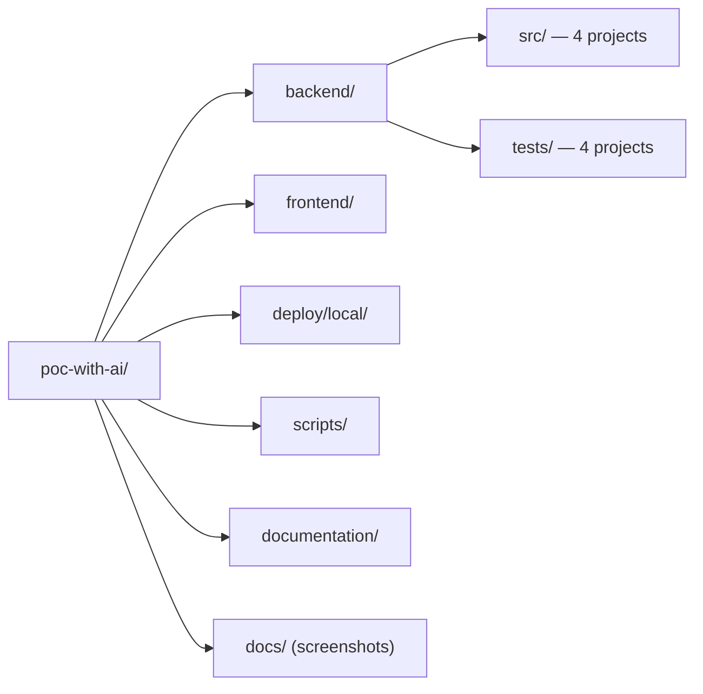
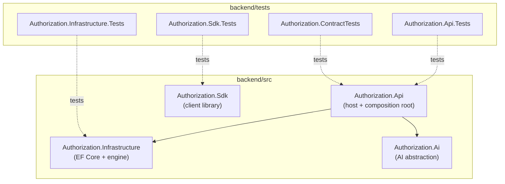
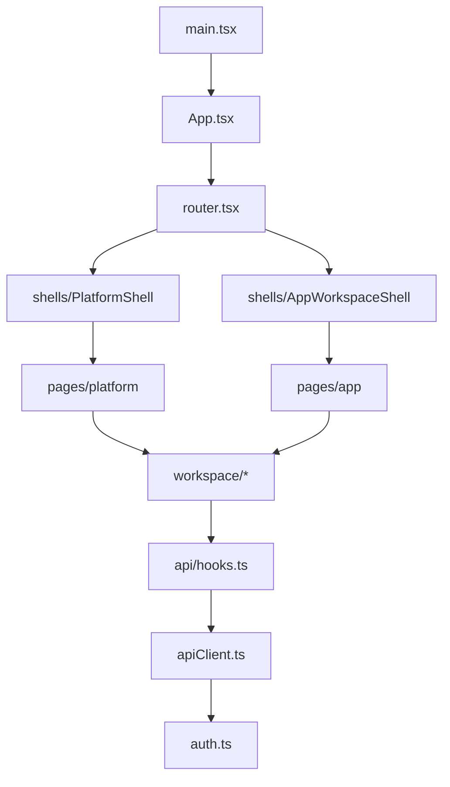
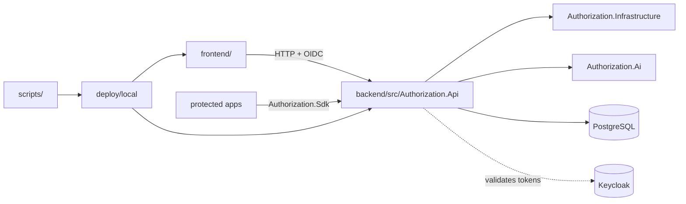

# 07 — Repository Structure

> Part of the [Documentation Portal](README.md).
> Related: [Technology Stack](06_Technology_Stack.md) · [Module Design](12_Module_Design.md) · [Component Design](11_Component_Design.md)

---

## Table of Contents

1. [Purpose](#purpose)
2. [Naming & Layout Conventions](#naming--layout-conventions)
3. [Top-Level Layout](#top-level-layout)
4. [Backend Solution Map](#backend-solution-map)
5. [Backend Source Projects](#backend-source-projects)
6. [Backend Test Projects](#backend-test-projects)
7. [Frontend Layout](#frontend-layout)
8. [Deploy](#deploy)
9. [Scripts](#scripts)
10. [Documentation & Root Files](#documentation--root-files)
11. [Where to Find Things](#where-to-find-things)
12. [Folder Relationships](#folder-relationships)
13. [Cross-References](#cross-references)

---

## Purpose

This is a folder-by-folder map of the repository so any engineer can locate a concern quickly and
understand *why* each folder exists. Every path listed below has been verified to exist in the
repository. Where a folder's name is not self-explanatory, its responsibility is described. For the
*responsibilities* of the code inside these folders see [Module Design](12_Module_Design.md) (backend)
and [Component Design](11_Component_Design.md) (frontend); this document is about *location*, not
behavior.

## Naming & Layout Conventions

Understanding a few conventions makes the whole tree predictable:

- **Backend projects are `Authorization.<Concern>`.** `Authorization.Api` (the composition root and
  ASP.NET Core host), `Authorization.Infrastructure` (persistence + runtime engine),
  `Authorization.Ai` (AI provider abstraction), `Authorization.Sdk` (a client library other services
  consume). Only `Authorization.Api` references other projects; `Ai`, `Infrastructure`, and `Sdk` are
  independent libraries with no in-solution `ProjectReference`.
- **Test projects mirror their subject** as `<Project>.Tests` (plus the standalone
  `Authorization.ContractTests`). Inside `Authorization.Api.Tests`, folders mirror the API's feature
  areas so a test's location predicts what it covers.
- **Folder-per-concern on the backend.** Each API folder maps to one cross-cutting concern
  (`Authentication/`, `Authorization/`, `Errors/`, `Observability/`, …) rather than to a technical
  layer, so related code lives together.
- **Feature-folder on the frontend.** `src/workspace/` groups the portal's domain features (matrix,
  access lens, certifications, condition builder, simulator, …); shared infrastructure lives in
  `api/`, `components/`, `shells/`, `theme/`, and `scope/`.
- **Build/generated folders are not source.** `bin/`, `obj/` (backend), `node_modules/`, `dist/`
  (frontend), and `.playwright-mcp/` (tooling artifacts) are produced by the toolchain and are
  git-ignored; they are omitted from the reference tables below.

## Top-Level Layout

```text
poc-with-ai/
├── backend/            # .NET 10 solution: 4 source projects + 4 test projects
├── frontend/           # React 19 + Vite SPA (admin portal)
├── deploy/local/       # Docker Compose stack, Keycloak realm import, env template
├── scripts/            # PowerShell dev / smoke / performance scripts
├── documentation/      # This documentation suite (01–24 + report + README)
├── docs/               # Screenshots referenced from the documentation
├── checklist.md        # Documentation tracking checklist
├── README.md           # Repository entry-point readme
├── .gitignore          # Git ignore rules
├── .dockerignore       # Docker build-context ignore rules
└── .playwright-mcp/    # Local Playwright MCP artifacts (tooling, not source)
```



## Backend Solution Map

Solution file: [AuthorizationControlPlane.slnx](../backend/AuthorizationControlPlane.slnx) (the modern
XML-based solution format). Eight projects sit under `backend/src/` and `backend/tests/`. The arrows
below are compile-time `ProjectReference`s (solid) and test targets (dotted).



`Authorization.Sdk` has no relationship to the host at build time — it is a standalone package that
*consumers* of the runtime API depend on. See [Technology Stack](06_Technology_Stack.md#backend-stack)
for the reference details.

## Backend Source Projects

### `Authorization.Api` — [backend/src/Authorization.Api](../backend/src/Authorization.Api/)

The ASP.NET Core host and single composition root. Entry point:
[Program.cs](../backend/src/Authorization.Api/Program.cs).

| Folder | Purpose |
|--------|---------|
| `Ai/` | Deterministic AI *fact* builders, access-search engine, telemetry recorders, and the subject pseudonymizer (see note below) |
| `Authentication/` | JWT validation, runtime-caller authentication, and auth-scheme registration |
| `Authorization/` | Delegated-admin capabilities, the authorization requirement + handler, role constants, and policy names |
| `Configuration/` | Strongly-typed options — `DatabaseOptions`, `OidcOptions`, `PortalOptions`, `RuntimeClientOptions` — plus their binding/validation extension |
| `Constants/` | `AuditEventTypes`, `GovernanceErrorCodes` (wire-level error codes) |
| `Contracts/` | Request/response DTOs (governance + runtime) and pagination shapes |
| `Controllers/` | HTTP endpoints: top-level controllers + a `Governance/` subfolder (see below) |
| `Errors/` | Canonical `ApiErrorEnvelope` + the exception-handling middleware |
| `Governance/` | Domain vocabulary + the policy-condition, obligation, and reference-data validators |
| `Observability/` | Correlation-ID middleware, health checks, and OpenTelemetry registration |
| `Startup/` | `DevelopmentDatabaseExtensions` — dev-only database create/seed helper |
| `Properties/` | `launchSettings.json` |

Loose files: `appsettings.json` / `appsettings.Development.json` (configuration),
`Authorization.Api.http` (REST client requests), and the `Dockerfile`.

The **`Controllers/`** folder holds the runtime and admin controllers at the top level
(`RuntimeAuthorizationController`, `AiAssistController`, `PlatformAiAssistController`,
`ConfigController`, `ApplicationInsightsController`, `DecisionAnalyticsController`, and the shared
`GovernanceControllerBase`), while the **`Controllers/Governance/`** subfolder holds the 11 CRUD
governance controllers: Tenants, Applications, Permissions, Roles, RolePermissions, Assignments,
Policies, OidcProviders, ReferenceData, ReviewCampaigns, and GovernanceInsights.

The **`Ai/`** folder is larger than a couple of files — it contains the per-feature fact builders
([ConfigAdvisorBuilder.cs](../backend/src/Authorization.Api/Ai/ConfigAdvisorBuilder.cs),
`DecisionDiagnosticsBuilder`, `ImpactAnalysisBuilder`, `SodAnalysisBuilder`, `AuditNarrativeBuilder`,
`AccessReviewBuilder`, `AiUsageBuilder`), the access-search engine (`AccessSearchExecutor`,
`AccessSearchRegistry`, `AccessSearchSuggester`, `AccessRelationshipRegistry`), the telemetry
recorders (`AiInvocationRecorder`, `AiPromptLogRecorder`), and the privacy boundary
([SubjectPseudonymizer.cs](../backend/src/Authorization.Api/Ai/SubjectPseudonymizer.cs)). These build
the grounded facts that the model narrates — see [AI Features](15_AI_Features.md).

### `Authorization.Infrastructure` — [backend/src/Authorization.Infrastructure](../backend/src/Authorization.Infrastructure/)

Persistence and the runtime decision engine.

| Folder / File | Purpose |
|---------------|---------|
| `Persistence/` | `AuthorizationDbContext`, `AuthorizationDbContextFactory` (design-time factory for `dotnet ef`), `AuthorizationEntities` (entity types), `IDbConnectionFactory` + `NpgsqlConnectionFactory` (raw connections for Dapper), `LocalDevelopmentSeeder`, and the `Migrations/` folder |
| `RuntimeAuthorization/` | `EfAuthorizationPolicyEngine` (the decision engine), `AuthorizeModels` (request/decision models), `PolicyOperators` (condition operators), and `InProcessDecisionOutbox` (decision recording) |
| (root) | [DependencyInjection.cs](../backend/src/Authorization.Infrastructure/DependencyInjection.cs) — `AddAuthorizationInfrastructure` registers the DbContext, connection factory, engine, and outbox |

### `Authorization.Ai` — [backend/src/Authorization.Ai](../backend/src/Authorization.Ai/)

The provider-agnostic AI abstraction. This project references only `Microsoft.Extensions.*`
primitives — the chat client is hand-rolled (no vendor SDK).

| File / Folder | Purpose |
|---------------|---------|
| [IAiAssistant.cs](../backend/src/Authorization.Ai/IAiAssistant.cs) | The assistant abstraction consumed by the API |
| [ChatClientAiAssistant.cs](../backend/src/Authorization.Ai/ChatClientAiAssistant.cs) | Live implementation driving a chat model |
| [FakeAiAssistant.cs](../backend/src/Authorization.Ai/FakeAiAssistant.cs) | Deterministic, keyless stub for tests/offline dev |
| `Providers/HttpChatCompletionClient.cs` | Hand-rolled OpenAI-compatible HTTP chat client (`IChatCompletionClient`) |
| [AiOptions.cs](../backend/src/Authorization.Ai/AiOptions.cs) | Options for provider selection, model, endpoint, retries |
| [AiAvailability.cs](../backend/src/Authorization.Ai/AiAvailability.cs) | Snapshot describing whether/why AI is enabled |
| [AiServiceCollectionExtensions.cs](../backend/src/Authorization.Ai/AiServiceCollectionExtensions.cs) | DI registration (`AddAuthorizationAi`) |
| `AiStartupLogger.cs`, `AiUsageObserver.cs` | Startup diagnostics and usage-observation hooks |
| `AiPolicyOperators.cs`, `PolicyEffectInference.cs` | Helpers for inferring policy effects from model output |
| `AiPayloadTooLargeException.cs` | Guard for oversized prompt payloads |

### `Authorization.Sdk` — [backend/src/Authorization.Sdk](../backend/src/Authorization.Sdk/)

A thin client library that protected applications use to call the runtime authorize endpoints:
[AuthorizationClient.cs](../backend/src/Authorization.Sdk/AuthorizationClient.cs) (typed client with
retry) and [ServiceCollectionExtensions.cs](../backend/src/Authorization.Sdk/ServiceCollectionExtensions.cs)
(DI registration for consumers).

## Backend Test Projects

Located under [backend/tests](../backend/tests/). All target `net10.0` and use xUnit (see
[Technology Stack](06_Technology_Stack.md#testing-stack)).

| Project | Scope |
|---------|-------|
| `Authorization.Api.Tests` | In-process API tests via [TestWebApplicationFactory.cs](../backend/tests/Authorization.Api.Tests/TestWebApplicationFactory.cs); folders mirror API concerns: `Admin/`, `Ai/`, `Authentication/`, `Authorization/`, `Configuration/`, `Errors/`, `Governance/`, `Observability/`, `OpenApi/`, `RuntimeAuthorization/` |
| `Authorization.ContractTests` | API route/contract verification ([ApiRouteContractTests.cs](../backend/tests/Authorization.ContractTests/ApiRouteContractTests.cs)) |
| `Authorization.Infrastructure.Tests` | Persistence and runtime-engine tests (`Persistence/`, `RuntimeAuthorization/` folders) |
| `Authorization.Sdk.Tests` | SDK client behavior ([AuthorizationClientTests.cs](../backend/tests/Authorization.Sdk.Tests/AuthorizationClientTests.cs)) |

## Frontend Layout

Root: [frontend](../frontend/). The build configuration lives at the project root; all application
code lives under `src/`.

**Root configuration files**

| File | Purpose |
|------|---------|
| [package.json](../frontend/package.json) / `package-lock.json` | Dependencies and npm scripts / lockfile |
| [vite.config.ts](../frontend/vite.config.ts) | Vite dev-server and build configuration |
| `tsconfig.json` / `tsconfig.app.json` / `tsconfig.node.json` | TypeScript project references (app vs. build tooling) |
| `.oxlintrc.json` | oxlint rules |
| [index.html](../frontend/index.html) | SPA HTML entry document |
| [nginx.conf](../frontend/nginx.conf) | Nginx config for serving the built SPA |
| [Dockerfile](../frontend/Dockerfile) | Multi-stage build → nginx image |
| `public/` | Static assets copied verbatim to the build output |

**Source root** ([frontend/src](../frontend/src/))

| Folder / File | Purpose |
|---------------|---------|
| [main.tsx](../frontend/src/main.tsx) | Bootstrap; handles the silent-renew iframe; mounts the app |
| [App.tsx](../frontend/src/App.tsx) | Root providers (Theme, Toast, QueryClient, Capabilities) + auth gating |
| [router.tsx](../frontend/src/router.tsx) | Route tree for the platform and app-workspace shells |
| [apiClient.ts](../frontend/src/apiClient.ts) | `portalApi` HTTP client + error mapping |
| [auth.ts](../frontend/src/auth.ts) | OIDC login / silent-renew / token access |
| [types.ts](../frontend/src/types.ts) | Shared TypeScript types / DTOs |
| [constants.ts](../frontend/src/constants.ts) | Shared constant values |
| [capabilities.tsx](../frontend/src/capabilities.tsx) | Capability context provider (gates admin UI) |
| [ui.tsx](../frontend/src/ui.tsx) | Shared UI helpers |
| `App.css` / `index.css` | Global styles |
| `App.test.tsx` / `capabilities.test.ts` | Root-level Vitest tests |
| `api/` | React Query hooks (`hooks.ts`), query keys (`queryKeys.ts`), AI config (`aiConfig.ts`), runtime config (`runtimeConfig.ts`), URL-state (`useUrlState.ts`) |
| `pages/` | Top-level page composition — `platform/PlatformPages.tsx` and `app/AppPages.tsx` |
| `components/` | Shared UI — `primitives.tsx`, `icons.tsx`, `Toast.tsx`, `NotificationsBell.tsx`, `charts.tsx`, `useResizeWidth.ts`, and a `viz/` subfolder |
| `shells/` | `PlatformShell`, `AppWorkspaceShell`, their contexts (`PortalContext`, `appContext`), and `UserMenu` |
| `scope/` | Scope badge + breadcrumb components |
| `theme/` | Theme provider + toggle |
| `workspace/` | The domain features (see below) |
| `assets/` | Static assets imported by components |

The **`workspace/`** folder is where the portal's substance lives: dashboards
(`Dashboard.tsx`), the access matrix (`AccessMatrix.tsx`), access lens (`AccessLens.tsx`), access
search (`AccessSearch.tsx`), certifications (`Certifications.tsx`), decision analytics
(`DecisionAnalytics.tsx`), the config advisor (`ConfigAdvisor.tsx`), SoD analysis (`SodPanel.tsx`),
the command palette, forms, and inspectors — plus feature subfolders `conditions/` (the ABAC
condition builder), `hierarchy/`, `inspectors/`, `panels/`, and `simulator/`.



## Deploy

[deploy/local](../deploy/local/) contains everything needed to run the full stack locally.

| Path | Purpose |
|------|---------|
| [docker-compose.yml](../deploy/local/docker-compose.yml) | Defines the four services: `postgres`, `keycloak`, `api`, `portal` |
| [keycloak/authorization-local-realm.json](../deploy/local/keycloak/authorization-local-realm.json) | Imported OIDC realm (`authorization-local`): clients, roles, seed users |
| `.env.example` | Template for the environment file (image tags, ports, secrets) |
| `.env` | The active, **git-ignored** environment file created from the template (holds local secrets — never commit) |
| [README.md](../deploy/local/README.md) | Instructions for the local stack |

## Scripts

PowerShell helpers in [scripts/](../scripts/):

| Script | Purpose |
|--------|---------|
| [dev-up.ps1](../scripts/dev-up.ps1) | Start the local stack (creates `.env` from the template if absent) |
| [dev-down.ps1](../scripts/dev-down.ps1) | Stop the stack |
| [dev-reset.ps1](../scripts/dev-reset.ps1) | Reset the stack and its data volumes |
| [local-smoke.ps1](../scripts/local-smoke.ps1) | End-to-end smoke path (assign → allow → revoke → deny → simulate → audit) |
| [perf-authorize.ps1](../scripts/perf-authorize.ps1) | Runtime authorize performance harness |
| [verify-github-models-pat.ps1](../scripts/verify-github-models-pat.ps1) | Verify a GitHub Models AI credential |

## Documentation & Root Files

| Path | Purpose |
|------|---------|
| [documentation/](../documentation/) | This suite: numbered docs `01`–`24`, plus `README.md` (portal index) and `documentation-review-report.md` (verification log) |
| [docs/](../docs/) | Screenshots (`screenshots/`) referenced from the documentation |
| [checklist.md](../checklist.md) | Documentation tracking checklist |
| [README.md](../README.md) | Repository entry-point readme |
| `.gitignore` / `.dockerignore` | Ignore rules for Git and Docker build contexts |
| `.playwright-mcp/` | Local Playwright MCP tooling artifacts (not source; git-ignored) |

## Where to Find Things

A task-oriented lookup for common questions.

| I want to… | Look in |
|------------|---------|
| Add or change an HTTP endpoint | `Authorization.Api/Controllers/` (governance CRUD under `Controllers/Governance/`) |
| Change how a runtime decision is made | `Authorization.Infrastructure/RuntimeAuthorization/EfAuthorizationPolicyEngine.cs` |
| Add a database table or column | `Authorization.Infrastructure/Persistence/` (entities + `Migrations/`) |
| Change a wire-level error code | `Authorization.Api/Constants/GovernanceErrorCodes.cs` |
| Add a strongly-typed config option | `Authorization.Api/Configuration/` |
| Change AI provider/model behavior | `Authorization.Ai/` (options, client) + `Authorization.Api/Ai/` (fact builders) |
| Change the consumer SDK | `Authorization.Sdk/` |
| Add a portal page or feature | `frontend/src/pages/` + `frontend/src/workspace/` |
| Change API calls from the portal | `frontend/src/api/hooks.ts` + `frontend/src/apiClient.ts` |
| Change login / token handling | `frontend/src/auth.ts` |
| Change the local run stack | `deploy/local/docker-compose.yml` + `scripts/dev-*.ps1` |
| Change the seeded realm/users | `deploy/local/keycloak/authorization-local-realm.json` |

## Folder Relationships



## Cross-References

- Backend module responsibilities: [Module Design](12_Module_Design.md)
- Frontend component responsibilities: [Component Design](11_Component_Design.md)
- What technologies fill these folders: [Technology Stack](06_Technology_Stack.md)
- How the pieces connect and deploy: [System Architecture](04_System_Architecture.md)
- How to build and run: [Developer Guide](21_Developer_Guide.md)
