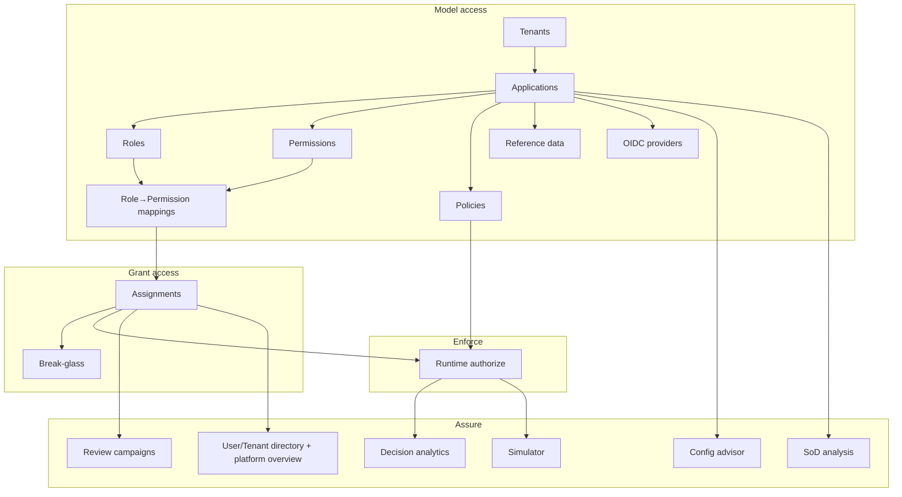
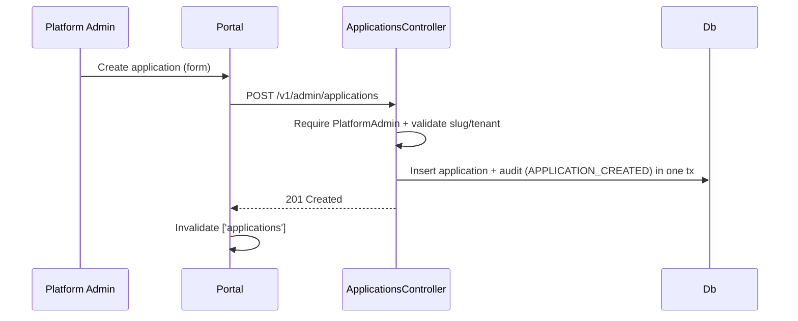
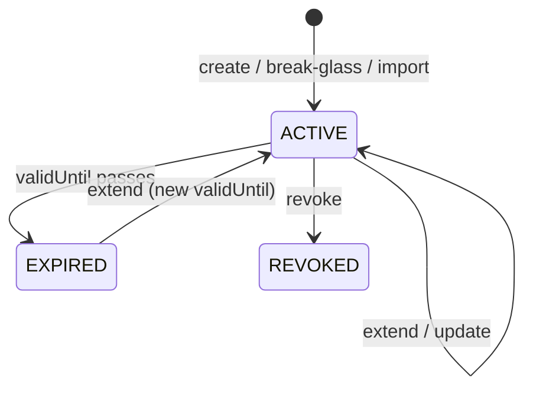
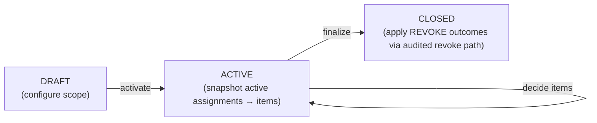

# 08 — Feature Documentation

> Part of the [Documentation Portal](README.md).
> Related: [Functional Requirements](02_Functional_Requirements.md) · [User Flows](10_User_Flows.md) · [API Documentation](13_API_Documentation.md) · [AI Features](15_AI_Features.md)

---

## Table of Contents

1. [Purpose](#purpose)
2. [Feature Map](#feature-map)
3. [Governance Features](#governance-features)
   - [Tenants & Applications](#tenants--applications)
   - [Roles & Permissions](#roles--permissions)
   - [Role–Permission Mapping](#rolepermission-mapping)
   - [Assignments, ABAC Attributes & Break-Glass](#assignments-abac-attributes--break-glass)
   - [Policies (ABAC)](#policies-abac)
   - [Reference Data](#reference-data)
   - [OIDC Providers](#oidc-providers)
4. [Runtime Enforcement](#runtime-enforcement)
5. [Platform Overview, User & Tenant Directory](#platform-overview-user--tenant-directory)
6. [Insight & Analytics Features](#insight--analytics-features)
7. [Access Review (Certification)](#access-review-certification)
8. [Access Simulator](#access-simulator)
9. [AI Advisory Features](#ai-advisory-features)
10. [Cross-References](#cross-references)

---

## Purpose

Each feature is documented end-to-end: user value, UI flow, backend flow, APIs, models, validation,
business rules, error handling, and an example. Features map to requirements in
[Functional Requirements](02_Functional_Requirements.md).

## Feature Map



## Governance Features

Governance is the **write side** of the platform: administrators model the access world (tenants →
applications → roles/permissions/policies) and grant it to subjects.

### Cross-cutting governance behavior

Every governance controller shares the traits below, so they are described once here rather than
repeated per feature.

**Two-tier authorization.** All governance controllers sit under the `/v1/admin` route prefix and
require the coarse **`AdminApi`** policy (a valid portal-admin JWT) at the controller level. Each
operation then applies a narrower gate:

- **Platform-wide operations** — creating/updating/deleting *tenants* and registering new
  *applications* — require the **`PlatformAdmin`** policy, which is satisfied only by the
  platform-super-admin role. `AdminApi` and `PlatformAdmin` are **authorization policies**, *not*
  delegated-admin capabilities.
- **Application-scoped operations** require a fine-grained **delegated-admin capability**, checked
  against the caller's role *for the owning application*. The capabilities are exactly the
  `DelegatedAdminCapability` enum ([DelegatedAdminCapability.cs](../backend/src/Authorization.Api/Authorization/DelegatedAdminCapability.cs)):
  `ManageApplication`, `ManageRoles`, `ManagePermissions`, `MapRolePermission`, `ManagePolicies`,
  `AssignRoles`, `ViewAudit`, and `ReadOnlyView` (read-only). Each maps to a
  `DelegatedAdmin:<Capability>` policy name. See [Security Design](16_Security_Design.md) for the
  full role → capability matrix.

**Atomic audit.** Every create/update/delete/lifecycle call routes through
`GovernanceControllerBase.SaveGovernanceMutationAsync`, which persists the entity change **and** its
audit event in **one EF Core `SaveChanges`** (an implicit transaction) — so the audit trail can never
drift from the data (see [Logging & Observability](18_Logging_and_Observability.md)).

**Ownership scoping.** A delegated admin only sees and mutates the applications they own; a platform
admin sees the whole estate. Read endpoints filter their result set to the applications for which the
caller holds `ReadOnlyView`.

**Optimistic concurrency.** Audited entities carry an integer `version` column configured as an EF
Core concurrency token (`IsConcurrencyToken`, default `1`) — a stale update fails with a concurrency
error rather than silently overwriting a concurrent change. (This is a plain incrementing integer, not
a PostgreSQL `xmin` system column.)

In the per-feature tables below, the **Authorization** column names the delegated-admin capability
required, except where it names the `PlatformAdmin` policy or the controller-level `AdminApi` gate.

### Tenants & Applications

**Purpose.** A **tenant** is the top-level ownership boundary (an organisation/business unit); an
**application** is a protected system registered under a tenant whose access is governed here. Every
role, permission, policy, and assignment ultimately belongs to an application, and every application
to a tenant — this two-level hierarchy scopes both data and delegated-admin authority.

**UI.** Platform shell → **Tenants** and **Applications** pages; create/edit via modal forms
([workspace/CreateForms.tsx](../frontend/src/workspace/CreateForms.tsx)). A tenant detail page rolls
up its applications; an application overview page summarises its roles/permissions/policies/assignments.

**Backend & endpoints.**

| Method + route | Authorization | Behaviour |
|----------------|---------------|-----------|
| `GET /v1/admin/tenants` | AdminApi (policy) | List tenants (delegated admins see only owning tenants). |
| `GET /v1/admin/tenants/{tenantId}` | AdminApi (policy) | Single tenant with rollup. |
| `POST /v1/admin/tenants` | PlatformAdmin (policy) | Create a tenant. |
| `PUT /v1/admin/tenants/{tenantId}` | PlatformAdmin (policy) | Update name/description/status. |
| `DELETE /v1/admin/tenants/{tenantId}` | PlatformAdmin (policy) | Delete a tenant (guarded — see edge cases). |
| `GET /v1/admin/applications` | AdminApi (policy) | List applications (scoped to accessible apps). |
| `POST /v1/admin/applications` | PlatformAdmin (policy) | Register a new application. |
| `PUT /v1/admin/applications/{applicationId}` | ManageApplication | Update metadata, risk, `SourceOfTruthMode`, `PolicyCombiningAlgorithm`. |
| `POST /v1/admin/applications/{applicationId}/activate` | ManageApplication | Status → `ACTIVE`. |
| `POST /v1/admin/applications/{applicationId}/disable` | ManageApplication | Status → `DISABLED`. |
| `POST /v1/admin/applications/{applicationId}/archive` | ManageApplication | Status → `ARCHIVED`. |
| `GET /v1/admin/applications/{applicationId}/overview` | ReadOnlyView | Counts/KPIs for the app dashboard. |

**Key fields.** `TenantEntity` = `{ tenantId, name, description?, status }`. `ApplicationEntity` =
`{ applicationId, name, description?, tenantRefId, ownerTeam?, businessOwner?, technicalOwner?,
riskLevel (LOW/MEDIUM/HIGH), status (ACTIVE/DISABLED/DEPRECATED/ARCHIVED), sourceOfTruthMode (default
PLATFORM_OWNED), policyCombiningAlgorithm (default deny-overrides) }`.

**Validation & edge cases.** `tenantId`/`applicationId` are stable slugs, unique, and immutable after
creation (updates change display metadata only). Creating a duplicate id returns `TENANT_EXISTS` /
`APPLICATION_EXISTS`; referencing a missing one returns `TENANT_NOT_FOUND` / `APPLICATION_NOT_FOUND`.
An application must reference an existing tenant. `PolicyCombiningAlgorithm` must be one of
`deny-overrides` | `allow-overrides` | `first-applicable`. Deleting a tenant that still owns
applications is rejected. **Application status is a runtime kill-switch:** the engine resolves only
`ACTIVE` applications, so an authorize call against a `DISABLED`/`DEPRECATED`/`ARCHIVED` application
denies with `APPLICATION_NOT_FOUND`. The same is true for permissions — only `ACTIVE` permissions
resolve (else `PERMISSION_NOT_FOUND`).



### Roles & Permissions

**Purpose.** These define an application's **access vocabulary**. A **permission** is an atomic
capability expressed as a `resource` + `action` pair (stored as a dotted `permissionKey`, e.g.
`price.publish`); a **role** is a named bundle that subjects are granted. Roles carry a `Privileged`
flag and a `RiskLevel` used by dashboards and Separation-of-Duties analysis.

**UI.** App workspace → **Roles** and **Permissions** pages (paged, filterable) → detail/inspector
panels. Rows show status and risk badges.

**Backend & endpoints** (roles shown; permissions are identical with `ManagePermissions` +
`permissionKey`):

| Method + route | Capability |
|----------------|-----------|
| `GET .../roles` · `GET .../permissions` | ReadOnlyView |
| `POST .../roles` · `POST .../permissions` | ManageRoles / ManagePermissions |
| `PUT .../roles/{roleKey}` · `PUT .../permissions/{permissionKey}` | ManageRoles / ManagePermissions |
| `DELETE .../roles/{roleKey}` · `DELETE .../permissions/{permissionKey}` | ManageRoles / ManagePermissions |
| `POST .../roles/{roleKey}/{activate\|disable\|archive}` | ManageRoles |
| `POST .../permissions/{permissionKey}/{activate\|disable\|archive}` | ManagePermissions |

**Key fields.** `RoleEntity` = `{ roleKey, name, description?, privileged, riskLevel, status }`.
`PermissionEntity` = `{ permissionKey, resource, action, description?, riskLevel, status }`.

**Validation & edge cases.** Keys are unique per application and lower-cased/slugified. Status flows
`ACTIVE ↔ DISABLED → ARCHIVED`. A role/permission that is referenced by a published role–permission
mapping, policy, or active assignment cannot be hard-deleted — disable or archive it instead. Only
`ACTIVE` roles/permissions participate in new mappings; the runtime engine additionally ignores any
grant whose permission does not resolve.

### Role–Permission Mapping

**Purpose.** Connects a permission to a role, with a **draft → publish** safety gate so that
modelling changes never take effect at runtime until an administrator explicitly publishes them.

**UI.** The **Matrix** page (roles × permissions grid, with a bipartite coverage graph) and role/
permission inspectors; unpublished cells render as *draft*.

**Backend & endpoints** ([RolePermissionsController.cs](../backend/src/Authorization.Api/Controllers/Governance/RolePermissionsController.cs)):

| Method + route | Capability |
|----------------|-----------|
| `GET .../role-permissions` | ReadOnlyView |
| `POST .../role-permissions` | MapRolePermission (creates a `DRAFT` mapping) |
| `POST .../role-permissions/{id}/publish` | MapRolePermission (`DRAFT` → `PUBLISHED`) |
| `DELETE .../role-permissions/{id}` | MapRolePermission (revoke a mapping) |

**Rule.** Only mappings whose `State == "PUBLISHED"` authorize at runtime — the engine filters on
this exact value ([EfAuthorizationPolicyEngine.cs](../backend/src/Authorization.Infrastructure/RuntimeAuthorization/EfAuthorizationPolicyEngine.cs)).
A `DRAFT` mapping is fully visible in the portal (so reviewers can stage a change) but has **zero**
runtime effect until published. `RolePermissionEntity` carries `{ roleRefId, permissionRefId, state,
validFrom?, publishedAt?, versionId }`.

### Assignments, ABAC Attributes & Break-Glass

**Purpose.** An **assignment** grants a role to a **subject** — either a human `USER` (identified by
email) or a `SERVICE_ACCOUNT` (a machine caller) — optionally time-boxed with a `validUntil`.
Assignments are the bridge between the modelled world and real principals, and are the primary input
to runtime RBAC. **Break-glass** is an emergency, short-lived, reason-stamped grant; **ABAC
attributes** attach typed key/values to an assignment that policy conditions can read as
`subject.<name>`.

**UI.** App workspace → **Assignments** page (filter by subject/role/state, import/export), plus the
subject **Access** panel (grant/break-glass/revoke/extend inline).

**Backend & endpoints** ([AssignmentsController.cs](../backend/src/Authorization.Api/Controllers/Governance/AssignmentsController.cs)):

| Method + route | Capability | Behaviour |
|----------------|-----------|-----------|
| `GET .../assignments` | ReadOnlyView | Paged, filterable list with resolved display status. |
| `GET .../assignments/summary` | ReadOnlyView | Counts by state (active/expired/revoked). |
| `POST .../assignments` | AssignRoles | Create a grant (`subjectType`, `subjectEmail`/`groupId`, `roleKey`, optional `validUntil`, optional resource scope). |
| `POST .../assignments/break-glass` | AssignRoles | Emergency grant, `1–24h` TTL, mandatory reason; `source = EMERGENCY`. |
| `POST .../assignments/{id}/revoke` | AssignRoles | Set `RevokedAt`; display status → `REVOKED`. |
| `POST .../assignments/{id}/extend` | AssignRoles | Push out `validUntil` (re-activates a soon/just-expired grant). |
| `PUT .../assignments/{id}` | AssignRoles | Update role/expiry/reason. |
| `POST .../assignments/{id}/attributes` | AssignRoles | Attach an ABAC attribute `{ name, valueJson, valueType }`. |
| `GET .../assignments/export` | ReadOnlyView | CSV export of the current assignment set. |
| `POST .../assignments/import` | AssignRoles | Bulk CSV import; **`dryRun` defaults to `true`** (validate/preview only). |

**Bulk import outcomes.** Each row resolves to `CREATE` (new grant), `UPDATE` (existing grant's
expiry consolidated), `SKIP` (duplicate, no change), or `ERROR` (rejected, with a message). With
`dryRun = true` nothing is persisted — the same result set is returned as a preview so an operator
can confirm before committing (`dryRun = false`).

**Key fields.** `AssignmentEntity` = `{ subjectType, subjectEmail?, groupId?, roleRefId,
resourceType?, resourceId?, validFrom, validUntil?, revokedAt?, source (MANUAL/EMERGENCY/IMPORT),
state, reason? }`. `AssignmentAttributeEntity` = `{ assignmentId, name, value (JSON), valueType }`.

**Display-status resolution & edge cases.** The stored `state` plus `validUntil`/`revokedAt` are
resolved to a single **display status** by `AssignmentDisplayStatus.Resolve()`
([GovernanceVocabulary.cs](../backend/src/Authorization.Api/Governance/GovernanceVocabulary.cs)):
`REVOKED` if revoked, else `EXPIRED` if `validUntil` has passed, else `ACTIVE`. Only `ACTIVE`
assignments authorize at runtime. Duplicate active `USER` grants of the same role are de-duplicated
(a second create consolidates rather than double-granting). Break-glass TTL is clamped to `1–24h`;
attributes must carry a `valueType` consistent with their JSON value so policy operators can compare
them.



### Policies (ABAC)

**Purpose.** Policies add **attribute-based** guardrails on top of RBAC. Each policy targets one
permission and either **ALLOW**s or **DENY**s it when its condition tree matches the request's
`subject`, `resource`, and `context` attributes — enabling rules like "publish a price only when
`context.status = READY_TO_PUBLISH`" or "deny if the author is publishing their own price". Policies
may also attach **obligations** (advisory instructions such as `require_mfa`) returned to the caller.

**UI.** **Policies** page + policy detail; conditions are built visually with the
[ConditionBuilder](../frontend/src/workspace/conditions/ConditionBuilder.tsx) (AND/OR/NOT trees) and
obligations with the [ObligationsEditor](../frontend/src/workspace/ObligationsEditor.tsx). An
optional AI **impact analysis** previews the effect before publishing.

**Backend & endpoints** ([PoliciesController.cs](../backend/src/Authorization.Api/Controllers/Governance/PoliciesController.cs)):

| Method + route | Capability |
|----------------|-----------|
| `GET .../policies` | ReadOnlyView |
| `POST .../policies` | ManagePolicies (creates a `DRAFT`) |
| `PUT .../policies/{policyKey}` | ManagePolicies (edit a draft) |
| `POST .../policies/{policyKey}/publish` | ManagePolicies (`DRAFT` → `PUBLISHED`) |
| `DELETE .../policies/{policyKey}` | ManagePolicies |
| `GET .../policies/{policyKey}/history` | ReadOnlyView (version history) |

**Validation.** [PolicyConditionValidator.cs](../backend/src/Authorization.Api/Governance/PolicyConditionValidator.cs)
enforces match types `all` / `any` / `none` and the operator set in
[PolicyOperators.cs](../backend/src/Authorization.Infrastructure/RuntimeAuthorization/PolicyOperators.cs);
[PolicyObligationsValidator.cs](../backend/src/Authorization.Api/Governance/PolicyObligationsValidator.cs)
validates each obligation is `{ id, value? }`. `PolicyEntity` = `{ policyKey, permissionRefId, effect
(ALLOW/DENY), conditions (JSON), priority, obligations (JSON), state, publishedAt? }`.

**Combining algorithm & edge cases.** When multiple policies match one request, the application's
`PolicyCombiningAlgorithm` decides the outcome: `deny-overrides` (any matching DENY wins — the safe
default), `allow-overrides` (any matching ALLOW wins), or `first-applicable` (the highest-`priority`
matching policy decides). Only `PUBLISHED` policies affect runtime. With **no** published policy for
a permission, a published role→permission mapping alone authorizes (RBAC baseline); a policy that
references a missing reference-data key or attribute simply fails to match rather than erroring. See
[Business Rules](19_Business_Rules.md) for the full precedence table.

### Reference Data

**Purpose.** Named, application-scoped lookup documents (typically JSON arrays like `["US","CA"]`)
that policy conditions reference as `reference.<key>` instead of hard-coding values — maintained once
and reused across policies.

**UI.** **Reference Data** page with a JSON editor ([ReferenceDataForm.tsx](../frontend/src/workspace/ReferenceDataForm.tsx)).

**Backend & endpoints** ([ReferenceDataController.cs](../backend/src/Authorization.Api/Controllers/Governance/ReferenceDataController.cs)):

| Method + route | Capability |
|----------------|-----------|
| `GET .../reference-data` | ReadOnlyView |
| `POST .../reference-data` | ManagePolicies |
| `PUT .../reference-data/{key}` | ManagePolicies |
| `DELETE .../reference-data/{key}` | ManagePolicies |

**Validation & edge cases.** Values are validated as JSON by
[ReferenceDataValueValidator.cs](../backend/src/Authorization.Api/Governance/ReferenceDataValueValidator.cs);
`ReferenceDataEntity` = `{ key, description?, value (JSON), status }`. Reference data is **soft-deleted**
(status flip) to preserve history, and is only loaded by the engine when a policy actually references
it (no extra round-trip otherwise). Managing reference data uses the **`ManagePolicies`** capability
(it is policy-support data), not a dedicated one.

### OIDC Providers

**Purpose.** Register the **per-application token issuers** so runtime callers can be authenticated
against the right identity provider. Each application configures its own issuer, audience, JWKS
endpoint, allowed algorithms, required scopes/claims, and the claim from which the subject is derived
— so different protected apps can trust entirely different IdPs.

**UI.** App workspace → **Identity** page ([IdentityPanel.tsx](../frontend/src/workspace/panels/IdentityPanel.tsx)).

**Backend & endpoints** ([OidcProvidersController.cs](../backend/src/Authorization.Api/Controllers/Governance/OidcProvidersController.cs)):

| Method + route | Capability |
|----------------|-----------|
| `GET .../oidc-providers` | ReadOnlyView |
| `POST .../oidc-providers` | ManageApplication |
| `PUT .../oidc-providers/{providerId}` | ManageApplication |
| `POST .../oidc-providers/validate` | ManageApplication (deterministic config check, no live fetch) |

**Key fields.** `OidcProviderEntity` = `{ providerType, issuer, audience, jwksUri, allowedAlgorithms[]
(default RS256), requiredScopes[], requiredClaims (JSON), claimMappings (JSON), subjectType
(USER/SERVICE_ACCOUNT), subjectClaim (default sub), enabled }`.

**Validation & edge cases.** Update **forbids** the `"none"` signing algorithm (unsigned tokens are
never accepted). The `validate` endpoint performs a **deterministic** configuration check (well-formed
issuer/audience/JWKS URI, sane algorithms) without contacting the IdP, so it is safe to run in any
environment. At runtime the caller's token is matched to a provider by issuer/audience and the
subject is taken from the configured `subjectClaim` — never from the request body.

## Runtime Enforcement

**Purpose.** The **read/hot path** of the platform: a protected application asks "may this subject
perform this action on this resource?" and receives a fast, deterministic allow/deny with a
structured, auditable reason. This is the only endpoint group callers hit in production traffic and
the reason the platform exists.

**Endpoints.**

| Method + route | Auth scheme | Behaviour |
|----------------|------------|-----------|
| `POST /v1/authorize` | Runtime client token (per-app OIDC) | Single decision. |
| `POST /v1/authorize/batch` | Runtime client token | Up to **50** checks that **share one subject and a base context**: `{ applicationId, subject, context?, checks: [{ resource, action, context? }] }` → `{ results: [ ... ] }` in the same order. Each check's context is **merged over** the base context. |

**Client.** Applications integrate via the typed [Authorization.Sdk](../backend/src/Authorization.Sdk/AuthorizationClient.cs)
(`AuthorizationClient.AuthorizeAsync` / `AuthorizeBatchAsync`) or call the REST endpoint directly.

**Decision algorithm** (implemented in [EfAuthorizationPolicyEngine.cs](../backend/src/Authorization.Infrastructure/RuntimeAuthorization/EfAuthorizationPolicyEngine.cs)):

1. Resolve the application; if it is unknown **or not `ACTIVE`** → deny `APPLICATION_NOT_FOUND`.
2. Resolve the permission for `resource.type` + `action`; if none (or not `ACTIVE`) →
   deny `PERMISSION_NOT_FOUND`.
3. Find the subject's assignments granting a relevant role. The engine returns the **most-informative**
   reason: if the only matching assignment is revoked → `ASSIGNMENT_REVOKED`; if only expired →
   `ASSIGNMENT_EXPIRED`; if there is no matching assignment at all → `NO_ACTIVE_ASSIGNMENT`. An
   active assignment (not revoked, within `validFrom`/`validUntil`) proceeds.
4. Confirm a **published** role→permission mapping grants the permission; otherwise →
   `PERMISSION_NOT_GRANTED`.
5. If **no published policy** targets the permission, the published mapping alone authorizes →
   **allow** (the RBAC baseline).
6. Otherwise evaluate every **published** policy targeting the permission and combine the outcomes
   with the application's `PolicyCombiningAlgorithm`: a matching **DENY** (under `deny-overrides`) →
   `EXPLICIT_DENY`; a matching **ALLOW** → allow, carrying that policy's obligations; a policy that
   could not be evaluated because a required context/attribute was absent → `MISSING_CONTEXT`;
   nothing decisive → `DENY_BY_DEFAULT` (fail-closed).
7. On allow, attach any matching policies' **obligations** and persist a `DecisionEntity`
   (decision log) with the matched roles/permissions/policies and the versions used.

**Deny reason codes** (returned in `denyReason`): `APPLICATION_NOT_FOUND`, `PERMISSION_NOT_FOUND`,
`NO_ACTIVE_ASSIGNMENT`, `ASSIGNMENT_REVOKED`, `ASSIGNMENT_EXPIRED`, `PERMISSION_NOT_GRANTED`,
`EXPLICIT_DENY`, `MISSING_CONTEXT`, `DENY_BY_DEFAULT`. See [Error Handling](17_Error_Handling.md).

**Example request** (mirrors the seeded `pricing-management` app exercised by
[local-smoke.ps1](../scripts/local-smoke.ps1)). The **effective subject is always derived from the
verified runtime token**; the request body's `subject` carries its `type` and may *optionally*
corroborate an `email` — a mismatching email is rejected with `403 SUBJECT_MISMATCH`, and it can
never override the token:

```json
POST /v1/authorize
{
  "applicationId": "pricing-management",
  "subject": { "type": "SERVICE_ACCOUNT" },
  "resource": { "type": "price", "id": "price-1" },
  "action": "publish",
  "context": { "status": "READY_TO_PUBLISH" }
}
```

**Example response (allow):**

```json
{
  "allowed": true,
  "decisionId": "3f2b7c9d-6a41-4e2a-9c58-0b1d2e3f4a5b",
  "denyReason": null,
  "reason": { "matchedRoles": ["pricing-lead"], "matchedPermissions": ["price.publish"], "matchedPolicies": ["allow-publish-ready"] },
  "obligations": []
}
```

**Example response (deny)** — same call with `context.status` absent, so the `allow-publish-ready`
policy cannot match and `deny-overrides` falls through:

```json
{
  "allowed": false,
  "decisionId": "8c1f0a2e-77b4-4d19-8a3c-2e5f9b6d4c10",
  "denyReason": "MISSING_CONTEXT",
  "reason": { "matchedRoles": ["pricing-lead"], "matchedPermissions": ["price.publish"], "matchedPolicies": [] },
  "obligations": []
}
```

**Edge cases.** Every decision is written to the decision log for analytics, even denials. A batch
of more than 50 checks is rejected with `413 BATCH_TOO_LARGE`; an oversized per-check context
(> 32 KB) denies **only that check** with `CONTEXT_TOO_LARGE` instead of failing the whole batch. The
request body is capped at 256 KB (`REQUEST_TOO_LARGE`). Obligations are advisory — the calling
application is responsible for enforcing them (e.g. prompting for MFA). See
[Functional Requirements FR-11](02_Functional_Requirements.md#fr-11--runtime-authorization-decision-single)
and [Business Rules](19_Business_Rules.md) for the full precedence rules.

## Platform Overview, User & Tenant Directory

**Purpose.** Cross-application, platform-wide visibility for platform admins and auditors: a single
place to see the whole estate's posture, browse every governed identity, and drill into one person's
access across all applications. These features answer "what does our access landscape look like?" and
"what can *this* user do everywhere?" without opening each application in turn.

**UI.** Platform shell → **Overview** (KPI dashboard), **Users** (directory), and a user detail
drawer; tenant detail pages roll up their applications.

**Backend & endpoints** ([GovernanceInsightsController.cs](../backend/src/Authorization.Api/Controllers/Governance/GovernanceInsightsController.cs),
all requiring `AdminApi` and scoped to the caller's accessible applications):

| Method + route | Returns |
|----------------|---------|
| `GET /v1/admin/overview` | `PlatformOverviewResponse`: totals for tenants, applications, roles, permissions, policies, assignments, and active assignments; `applicationsByRisk`; `applicationsByTenant`; and the 10 most recent audit events. |
| `GET /v1/admin/users` | `PagedResult<UserDirectoryEntry>`: one row per distinct subject email with `appCount` and total/active/expired/revoked assignment counts. Supports paging and search. |
| `GET /v1/admin/users/{email}` | `UserAccessResponse`: that subject's assignments **across every application**, grouped by app with role, status, and validity. |

**Behaviour & edge cases.** A **delegated** admin sees only the tenants/applications they own, so
their overview totals and user directory are automatically narrowed; a platform admin sees the whole
estate. The user directory keys on email, so a `SERVICE_ACCOUNT` without an email is represented by
its client identity. The overview's `recentAudit` is a convenience feed — the full, filterable audit
log lives under **Audit** (see below). All figures are computed live from the governance tables (no
denormalised counters), so they are always consistent with the underlying data.

## Insight & Analytics Features

These are the **assurance/read-side** features. All are **deterministic** (computed from stored data,
no AI required); several offer an *optional* AI narration layer that is clearly separated and gated.

| Feature | Portal surface | API | AI layer |
|---------|---------------|-----|----------|
| **Decision analytics** | [DecisionAnalytics.tsx](../frontend/src/workspace/DecisionAnalytics.tsx) | `GET .../applications/{id}/decisions/analytics` | — |
| **Audit feed + heatmap** | [ActivityPanel.tsx](../frontend/src/workspace/panels/ActivityPanel.tsx) | `GET /v1/admin/audit-events`, `GET /v1/admin/audit-events/summary` | Optional narrative |
| **Config advisor** | [ConfigAdvisor.tsx](../frontend/src/workspace/ConfigAdvisor.tsx) | `GET .../insights/config-findings` | Optional summary |
| **Separation of Duties (SoD)** | [SodPanel.tsx](../frontend/src/workspace/SodPanel.tsx) | `GET .../insights/sod-rules`, `GET .../insights/sod-violations` | Optional draft/save/delete |
| **Access lens (hierarchy)** | [AccessLens.tsx](../frontend/src/workspace/AccessLens.tsx) | user/tenant/app reads | — |

- **Decision analytics** aggregates the decision log for one application: allow/deny rates over time,
  top deny reasons, and busiest permissions — the raw material for spotting misconfiguration or abuse.
- **Audit feed** is the immutable, filterable governance history (`GET /v1/admin/audit-events`), with a
  time-of-day/day-of-week **heatmap** built from `GET /v1/admin/audit-events/summary`. Every governance
  mutation emits exactly one event here; reading the audit log requires the **`ViewAudit`** capability.
- **Config advisor** runs deterministic best-practice checks (`config-findings`) — e.g. privileged
  roles with no SoD coverage, permissions with no mapping, policies referencing missing data — each
  with a severity. An AI **summary** can optionally narrate the findings for a stakeholder.
- **Separation of Duties has two distinct surfaces.** The **deterministic** surface
  (`.../insights/sod-rules`, `.../insights/sod-violations` in
  [ApplicationInsightsController.cs](../backend/src/Authorization.Api/Controllers/ApplicationInsightsController.cs))
  lists the configured toxic-permission-pair rules and any subjects currently violating them — this is
  always available to any viewer, **independent of AI**. The **AI** surface (under
  [AiAssistController.cs](../backend/src/Authorization.Api/Controllers/AiAssistController.cs))
  additionally lets an admin **draft** a rule from natural language (`POST .../ai/sod/rules/draft`),
  **save** a validated rule (`POST .../ai/sod/rules` — the two matchers must differ and be validated
  against the app's real permission vocabulary), and **delete** one (`DELETE .../ai/sod/rules/{ruleKey}`).
  `SodRuleEntity` = `{ ruleKey, name, rationale?, severity, matcherA (JSON), matcherB (JSON), status }`.
- **Access lens** renders the subject → role → permission hierarchy as an interactive graph so an
  auditor can trace *why* someone has access.

## Access Review (Certification)

**Purpose.** Periodic **recertification**: a campaign forces owners to re-confirm (or revoke) every
active grant in an application, producing an auditable attestation trail required by most access-
governance regimes.

**Lifecycle.**



**Backend & endpoints** ([ReviewCampaignsController.cs](../backend/src/Authorization.Api/Controllers/Governance/ReviewCampaignsController.cs)):

| Method + route | Capability | Behaviour |
|----------------|-----------|-----------|
| `GET .../review-campaigns` | ReadOnlyView | List campaigns with progress. |
| `GET .../review-campaigns/{id}` | ReadOnlyView | One campaign with its items. |
| `POST .../review-campaigns` | AssignRoles | Create a `DRAFT` campaign (`name`, optional `dueAt`). |
| `POST .../review-campaigns/{id}/activate` | AssignRoles | Snapshot the app's **active** assignments into `PENDING` review items. |
| `POST .../review-campaigns/{id}/items/{itemId}/decision` | AssignRoles | Set one item to `KEEP` / `REVOKE` / `NEEDS_INFO` (with an optional note). |
| `POST .../review-campaigns/{id}/decisions` | AssignRoles | **Bulk** decide — an empty `itemIds` list applies the decision to **all** still-`PENDING` items. |
| `POST .../review-campaigns/{id}/finalize` | AssignRoles | Close the campaign and **apply every `REVOKE`** through the standard audited revoke path. |

**Key fields & edge cases.** `ReviewCampaignEntity` = `{ name, status (DRAFT→ACTIVE→CLOSED), dueAt? }`;
`ReviewItemEntity` = `{ campaignRefId, assignmentRefId, subjectEmail, roleKey, decision
(PENDING/KEEP/REVOKE/NEEDS_INFO), decisionNote?, decidedAt?, decidedBy? }`. Subject/role are
**denormalised** at activation, so the worklist stays stable even if the underlying assignment later
changes. `NEEDS_INFO` parks an item without a final decision (it is not revoked at finalize). Only
items decided `REVOKE` cause an actual grant revocation on finalize — `KEEP`/`NEEDS_INFO`/still-
`PENDING` items are left untouched. Finalize is idempotent per campaign (a `CLOSED` campaign cannot be
re-finalised). UI: [Certifications.tsx](../frontend/src/workspace/Certifications.tsx); an optional AI
**summary** (`/v1/admin/ai/access-review/summarize`) narrates campaign progress.

## Access Simulator

**Purpose.** A safe "what-if" that answers "can subject X perform action Y on resource Z (in context
C)?" **without** a live caller or a real token — indispensable for validating a model change before
publishing it.

**UI.** [SimulatorPanel.tsx](../frontend/src/workspace/panels/SimulatorPanel.tsx) (app workspace).

**Backend.** `POST /v1/admin/simulator/authorize` runs the **exact same** engine as production
`/v1/authorize` and returns the same structured result — allow/deny, deny reason, and matched
roles/permissions/policies — but reads the subject from the request instead of a token, and **does
not** protect a real resource. An optional AI **explain-decision** call narrates *why* the engine
decided as it did in plain language. Because it shares the engine, the simulator can never disagree
with real enforcement for the same inputs.

## AI Advisory Features

A set of **optional, per-feature-gated** capabilities layered on the deterministic core. Each is
independently toggled in configuration and degrades gracefully (the underlying deterministic feature
keeps working if AI is disabled or unavailable). Every invocation is metered (`AiInvocationEntity`)
and, where it accepts free text, prompt-logged (`AiPromptLogEntity`). Full detail — gating,
pseudonymisation, provider fallback, and limits — is in [AI Features](15_AI_Features.md).

| Feature | Surface | Endpoint |
|---------|---------|----------|
| Policy authoring | Condition builder | `POST .../ai/policy-draft` |
| Decision explainer | Simulator | `POST .../ai/explain-decision` |
| Impact analysis | Policy detail | `POST .../ai/impact-analysis` |
| Config advisor summary | Dashboard | `POST .../ai/advisor/summarize` (findings via `GET .../ai/advisor/findings`) |
| Access search (app-scoped) | Access search | `POST .../ai/access-search` |
| Access search (platform-wide) | Ask AI | `POST /v1/admin/ai/access-search` |
| SoD rule drafting | SoD panel | `POST .../ai/sod/rules/draft` (save `POST .../ai/sod/rules`, delete `DELETE .../ai/sod/rules/{ruleKey}`) |
| Access certification summary | Certifications | `POST /v1/admin/ai/access-review/summarize` |
| Audit narrative | Audit | `POST /v1/admin/ai/audit/narrative` |

Two platform-scoped **observability** endpoints round out the AI surface for platform admins:
`GET /v1/admin/ai/usage` (aggregated invocation metrics) and `GET /v1/admin/ai/prompt-logs`
(reviewable free-text prompts and how the model interpreted them). See
[PlatformAiAssistController.cs](../backend/src/Authorization.Api/Controllers/PlatformAiAssistController.cs).

## Cross-References

- Requirement IDs: [Functional Requirements](02_Functional_Requirements.md)
- Endpoint details & examples: [API Documentation](13_API_Documentation.md)
- Journeys through these features: [User Flows](10_User_Flows.md)
- UI surfaces: [UI/UX Documentation](09_UI_UX_Documentation.md)
