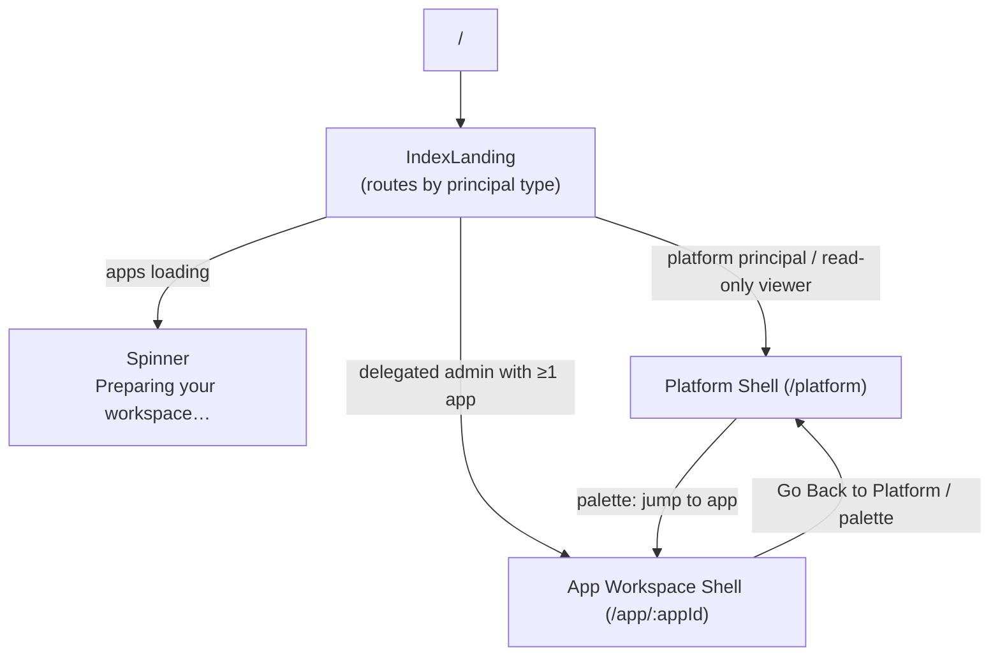
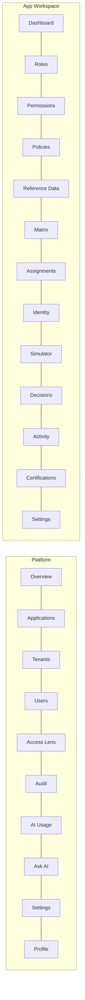
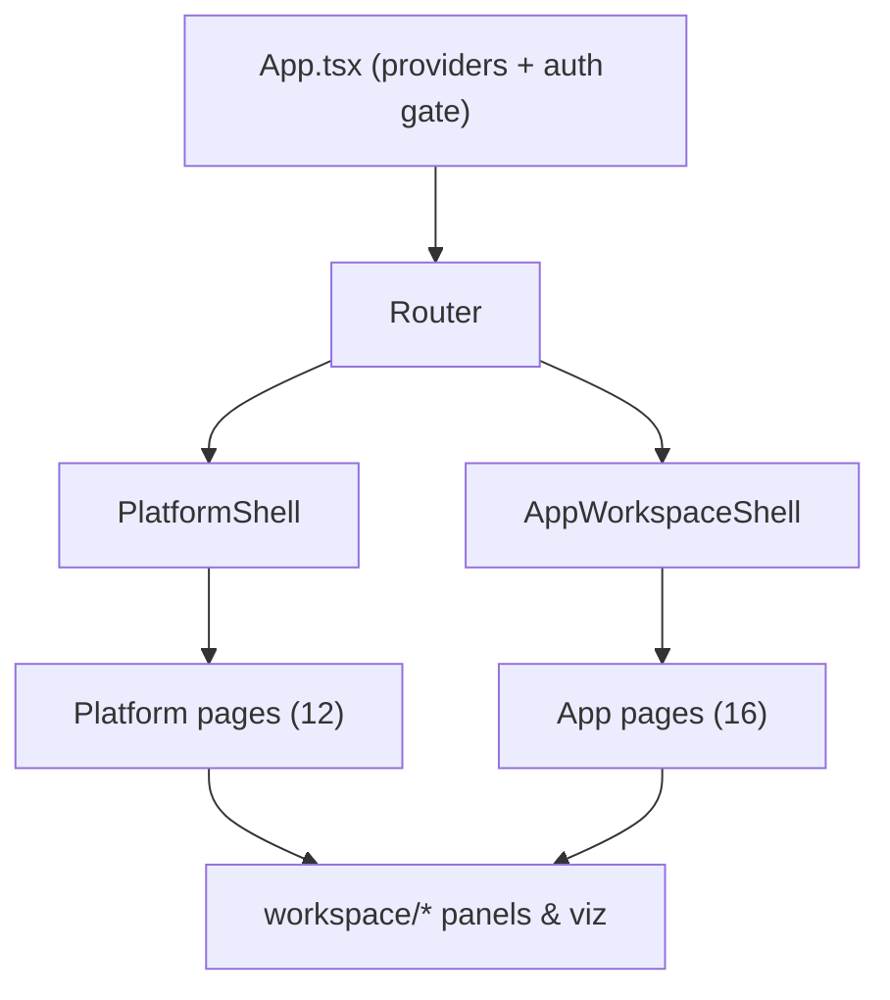

# 09 — UI / UX Documentation

> Part of the [Documentation Portal](README.md).
> Related: [Component Design](11_Component_Design.md) · [User Flows](10_User_Flows.md) · [User Manual](22_User_Manual.md) · [Feature Documentation](08_Feature_Documentation.md)

---

## Table of Contents

1. [Purpose & Scope](#purpose--scope)
2. [UX Foundations](#ux-foundations)
3. [Application Shells](#application-shells)
4. [Shell Chrome & Layout](#shell-chrome--layout)
5. [Navigation Model](#navigation-model)
6. [Command Palette](#command-palette)
7. [Screen Hierarchy](#screen-hierarchy)
8. [Platform Pages](#platform-pages)
9. [Application Workspace Pages](#application-workspace-pages)
10. [Modals, Slide-Overs & Dialogs](#modals-slide-overs--dialogs)
11. [Cross-Cutting UX](#cross-cutting-ux)
12. [Theme & Visual System](#theme--visual-system)
13. [Accessibility](#accessibility)
14. [Cross-References](#cross-references)

---

## Purpose & Scope

This document describes the **user interface and user-experience design** of the Authorization
Control Plane portal — a single-page React application that administrators use to manage tenants,
applications, roles, permissions, policies, assignments, and to run authorization simulations and
AI-assisted governance workflows.

It covers the two application shells, the shared chrome (top bar and sidebar), the navigation
model, every page and its route, the interaction surfaces (command palette, modals, slide-overs,
dialogs), cross-cutting UX behaviours, theming, and accessibility.

**Audience:** frontend engineers, UX designers, and reviewers who need a complete picture of what
the portal looks like and how a user moves through it.

**Out of scope (documented elsewhere):**

- React component internals and props — [Component Design](11_Component_Design.md).
- Step-by-step task walkthroughs — [User Flows](10_User_Flows.md), [User Manual](22_User_Manual.md).
- REST contracts behind the pages — [API Documentation](13_API_Documentation.md).

All source references point at [frontend/src](../frontend/src); the portal is built with React 19,
React Router, TanStack Query, and D3, and is bootstrapped from
[main.tsx](../frontend/src/main.tsx) → [App.tsx](../frontend/src/App.tsx) → [router.tsx](../frontend/src/router.tsx).

## UX Foundations

The portal is organised around a small set of consistent design decisions:

- **Two-level information architecture.** Everything lives at one of two *scopes*: the **platform
  scope** (global — all tenants and applications) or a single **application scope**. The URL prefix
  (`/platform/*` vs `/app/:appId/*`) selects the scope, the shell, and the scope badge shown in the
  sidebar.
- **Scope-first, capability-aware UI.** What a signed-in principal can *see and do* is derived from
  their capability claims via [capabilities.tsx](../frontend/src/capabilities.tsx). Create/edit
  affordances (buttons, palette "Create" actions, form controls) only render when the matching
  capability is held; a delegated administrator never sees platform-wide surfaces.
- **Consistent chrome.** Every screen shares the same frame: a top bar (brand, command-palette
  trigger, theme toggle, user menu) and a left sidebar (scope bar + navigation links) wrapping a
  main content outlet.
- **Keyboard-first navigation.** A command palette (Cmd/Ctrl+K) is available in both shells for
  fuzzy navigation, application switching, and capability-gated creation — no mouse required.
- **Progressive disclosure.** List/table views drill into slide-over inspectors and dedicated
  detail routes; dense visualizations can be enlarged into a modal.
- **Persisted preferences and state.** The theme choice persists in `localStorage`; table filters,
  paging, and selection persist in the URL so views are shareable and reload-safe.

## Application Shells

The portal renders one of two shells, chosen by the URL prefix. A landing component decides which
shell a user enters after sign-in.

| Shell | Prefix | Source | Scope |
|-------|--------|--------|-------|
| Platform shell | `/platform/*` | [PlatformShell.tsx](../frontend/src/shells/PlatformShell.tsx) | Global (all tenants/apps) |
| App workspace shell | `/app/:appId/*` | [AppWorkspaceShell.tsx](../frontend/src/shells/AppWorkspaceShell.tsx) | A single application |

**Entry routing** (defined in [router.tsx](../frontend/src/router.tsx)):

- `/` renders `IndexLanding`. While the application list loads it shows a `Spinner`
  ("Preparing your workspace…").
- A **delegated administrator** (`!canAccessAllApplications`) with at least one application is
  redirected straight into their first application's dashboard (`/app/:appId`).
- A **platform principal** (or platform read-only viewer) lands on the platform overview
  (`/platform`).
- **Legacy query-param deep links** (`?app=&view=&key=&email=`) are translated to modern path
  routes by `LegacyRedirect` (including `view=tenants|users|explorer`), so old bookmarks keep
  working.
- Any **unknown path** (`*`) redirects to the platform overview.

Both shells share a **command palette** (Cmd/Ctrl+K), a **theme toggle**, a **user menu**, and a
**scope badge**. The **tenant-grouped application switcher** is a `<select>` rendered **only in the
app workspace shell**; on the platform shell you switch into an application via the command
palette's application list.

## Shell Chrome & Layout

Both shells use the same three-part layout — a top bar, a left sidebar (`explorer`), and a main
`<Outlet>` — but populate them with scope-appropriate controls.

**Platform shell** ([PlatformShell.tsx](../frontend/src/shells/PlatformShell.tsx)):

| Region | Contents |
|--------|----------|
| Top bar | Brand ("Authorization Control Plane" / "Platform administration"), palette trigger ("Search or jump to…", Cmd/Ctrl+K), `ThemeToggle`, `UserMenu` |
| Sidebar scope bar | `ScopeBadge scope="platform"` |
| Sidebar links (9) | Overview · Applications · Tenants · Users · Access lens · Audit · AI usage · Ask AI · Platform settings |
| Main | Route `<Outlet>` (`aria-live="polite"`) |
| Mounted overlays | `CommandPalette`, `ApplicationForm` (create application) |

> The **Profile** page and the **Tenant/User detail** pages are not sidebar links — Profile is
> reached from the user menu, and detail pages are reached by drilling into a row.

**App workspace shell** ([AppWorkspaceShell.tsx](../frontend/src/shells/AppWorkspaceShell.tsx)):

| Region | Contents |
|--------|----------|
| Top bar | Brand ("Authorization Control Plane" / current app name), palette trigger, `NotificationsBell` (per-app), `ThemeToggle`, `UserMenu` |
| Sidebar scope bar | "← Go Back to Platform" button (only when `canAccessAllApplications`), `ScopeBadge scope="application"`, **application switcher** (`<select>` grouped by tenant via `<optgroup>`) |
| Sidebar links (13) | Dashboard · Roles · Permissions · Policies · Reference data · Access matrix · Assignments · Identity providers · Simulator · Decisions · Activity · Certifications · Settings |
| Main | Route `<Outlet context>` exposing `appId`, `app`, `tenantName`, and `startCreate` to pages |
| Mounted overlays | `CommandPalette`, `CreateForms` (role/permission/policy) |

## Navigation Model

Route paths are centralized in [workspace/nav.ts](../frontend/src/workspace/nav.ts): `platformPaths`
holds static strings (e.g. `platformPaths.overview = "/platform"`), while `appPaths` holds functions
of `appId` (e.g. `appPaths.dashboard(appId)`, `appPaths.role(appId, roleKey)`). The route tree is a
`createBrowserRouter` definition in [router.tsx](../frontend/src/router.tsx) with the two shells as
parent routes, nested child routes for each page, and a `*` catch-all that redirects to the platform
overview. Detail routes are deep-linkable via URL params: `:tenantId`, `:email`, `:roleKey`,
`:permissionKey`, `:policyKey`.

## Command Palette

The command palette ([CommandPalette.tsx](../frontend/src/workspace/CommandPalette.tsx)) is opened
with **Cmd/Ctrl+K** or the top-bar "Search or jump to…" button and provides fuzzy search over
grouped, keyboard-navigable actions. Its contents are scope-aware:

| Group | Platform shell | App workspace shell |
|-------|----------------|---------------------|
| Navigate | "Platform" go-to items (Overview, Applications, Tenants, Users, Access lens, Audit, AI usage, Ask AI) | "Go to" nav items (Dashboard, Roles, Permissions, Policies, Reference data, Access matrix, Assignments, Identity, Simulator, Activity, Settings) |
| Switch application | Applications listed (hinted by tenant) to jump into a workspace | "Switch application" group — every other app, hinted by its tenant name |
| Create | — | "New role / permission / policy" — shown **only** when the matching capability is held |
| Scope | — | "Exit to platform" — shown **only** when `canAccessAllApplications` |
| Quick jump | — | Live lists of roles (hint: role key), permissions (hint: `resource·action`), and policies (hint: effect) |

This lets an administrator move between screens, switch applications, and create entities entirely
from the keyboard.

## Screen Hierarchy

## Platform Pages

Source: [pages/platform/PlatformPages.tsx](../frontend/src/pages/platform/PlatformPages.tsx). Twelve
page components are mounted under `/platform`; nine appear as sidebar links, while **Profile** (via
the user menu) and the **Tenant/User detail** pages (via drill-down) are reached indirectly. Data is
fetched through TanStack Query hooks in [api/hooks.ts](../frontend/src/api/hooks.ts).

| Page | Route | Purpose | Key data hooks |
|------|-------|---------|----------------|
| PlatformOverviewPage | `/platform` | KPIs, activity trend, recent activity | `usePlatformOverview` |
| ApplicationsPage | `/platform/applications` | App catalog + create | `useFilteredApplicationsPaged` |
| TenantsPage | `/platform/tenants` | Tenant list + hierarchy tree | `useTenants` |
| TenantDetailPage | `/platform/tenants/:tenantId` | Tenant rollup | `useTenantDetail` |
| UsersPage | `/platform/users` | User directory (paged) | `useUsersDirectoryPaged` |
| UserDetailPage | `/platform/users/:email` | Cross-app access tree | `useUserDetail` |
| AccessLensPage | `/platform/access-lens` | Hierarchy explorer + heatmaps | multiple |
| AuditPage | `/platform/audit` | Global audit trail | `useAuditFeed`, `useAuditActivitySummary` |
| AiUsagePage | `/platform/ai-usage` | AI telemetry (invocations, tokens, cost) | `useAiUsage`, `useAiPromptLogs` |
| AskAiPage | `/platform/ask-ai` | Natural-language platform access search | `usePlatformAccessSearch` |
| PlatformSettingsPage | `/platform/settings` | OIDC providers, feature flags, role labels | config hooks |
| ProfilePage | `/platform/profile` | Signed-in user + sign out | auth context |

*Platform overview (`/platform`) — KPI cards (tenants, applications, users, roles, permissions, policies, assignments), an activity-trend chart, applications-by-risk/-by-tenant breakdowns, and a recent-activity feed.*

*Applications (`/platform/applications`) — the application catalog with filtering/paging and a create action.*

*Tenants (`/platform/tenants`) — tenant list plus a hierarchy tree; selecting a tenant opens its rollup detail.*

*Users (`/platform/users`) — a paged directory of subjects; opening a user shows their cross-application access tree.*

*Access lens (`/platform/access-lens`) — an interactive hierarchy explorer with coverage heatmaps.*

*Audit (`/platform/audit`) — the global audit trail with an activity-summary chart and a filterable event feed.*

*AI usage (`/platform/ai-usage`) — AI invocation counts, token consumption, cost, and prompt logs.*

*Ask AI (`/platform/ask-ai`) — natural-language access search across the platform, returning structured results.*

*Platform settings (`/platform/settings`) — OIDC provider configuration, feature flags, and role-label management.*

## Application Workspace Pages

Source: [pages/app/AppPages.tsx](../frontend/src/pages/app/AppPages.tsx). Pages read the current
`appId`/`app` from the shell outlet context and load data via app-scoped query hooks; list pages
drill into slide-over inspectors and dedicated detail routes.

| Page | Route | Purpose |
|------|-------|---------|
| AppDashboardPage | `/app/:appId` | Overview KPIs, access graph, expiring-access, config health, SoD |
| RolesPage / RoleDetailPage | `.../roles`, `.../roles/:roleKey` | Role table + inspector |
| PermissionsPage / PermissionDetailPage | `.../permissions`, `.../permissions/:permissionKey` | Permission table + inspector |
| PoliciesPage / PolicyDetailPage | `.../policies`, `.../policies/:policyKey` | Policy table + inspector + impact analysis |
| ReferenceDataPage | `.../reference-data` | Lookup data management |
| MatrixPage | `.../matrix` | Roles × permissions grid (with a bipartite coverage-graph view) |
| AssignmentsPage | `.../assignments` | Assignments (filter / import / export) |
| IdentityPage | `.../identity` | OIDC identity providers |
| SimulatorPage | `.../simulator` | Authorization simulator (+ AI explanation) |
| DecisionsPage | `.../decisions` | Decision analytics |
| ActivityPage | `.../activity` | App-scoped audit feed + heatmap |
| CertificationsPage | `.../certifications` | Access-review campaigns |
| AppSettingsPage | `.../settings` | Application configuration |

*Application workspace dashboard (`/app/:appId`) — per-application KPIs, an access graph, expiring-access alerts, deterministic Config Advisor findings, and Separation-of-Duties analysis.*

*Roles (`.../roles`) — the role table; selecting a row opens the role inspector and its detail route.*

*Policies (`.../policies`) — policy table with inspector, impact analysis, and AI policy drafting.*

*Access matrix (`.../matrix`) — roles (rows) mapped to permissions (columns); each cell is published (green ✓), draft (amber), or ungranted. Coverage stats and a “Coverage graph” (bipartite) view are available.*

*Assignments (`.../assignments`) — subject-to-role assignments with filtering plus CSV import/export (import defaults to a dry-run preview).*

*Decisions (`.../decisions`) — runtime decision analytics (allow/deny trends and top reasons).*

*Simulator (`.../simulator`) — run an authorization request and see the decision, matched policy, and reason codes.*

*Simulator — AI explanation: a natural-language rationale for the simulated decision.*

*Certifications (`.../certifications`) — access-review campaigns for periodic recertification.*

## Modals, Slide-Overs & Dialogs

Overlay surfaces come from two modules: shared dialog/drawer components in
[ui.tsx](../frontend/src/ui.tsx) and lower-level building blocks in
[components/primitives.tsx](../frontend/src/components/primitives.tsx).

| Surface | Component | Source | Example usage |
|---------|-----------|--------|---------------|
| Modal dialog | `DialogPanel` | [ui.tsx](../frontend/src/ui.tsx) | Centered modal panel |
| Slide-over drawer | `DrawerPanel` | [ui.tsx](../frontend/src/ui.tsx) | Right-side drawer |
| Slide-over panel | `SlideOver` | [components/primitives.tsx](../frontend/src/components/primitives.tsx) | Entity inspectors and **create forms** |
| Confirmation | `ConfirmDialog` | [ui.tsx](../frontend/src/ui.tsx) | Delete/revoke confirmations (e.g. revoking a matrix cell) |
| Create forms | `CreateForms` (renders in a `SlideOver`); `ApplicationForm` for apps | [CreateForms.tsx](../frontend/src/workspace/CreateForms.tsx) | Create role / permission / policy / application |
| Visualization modal | `VizModal` | [components/viz/VizModal.tsx](../frontend/src/components/viz/VizModal.tsx) | Enlarged tree / heatmap / bipartite views |
| Command palette | `CommandPalette` | [CommandPalette.tsx](../frontend/src/workspace/CommandPalette.tsx) | Cmd/Ctrl+K navigation & creation |

> There is no component named `Modal`; the modal primitive is `DialogPanel`. Entity **create forms
> are presented as slide-overs** (`SlideOver`), not centered modals.

## Cross-Cutting UX

| Concern | Mechanism | Source |
|---------|-----------|--------|
| Toasts / error surfacing | `ToastProvider` + `useToast`; failed mutations surface automatically | [components/Toast.tsx](../frontend/src/components/Toast.tsx), [App.tsx](../frontend/src/App.tsx) |
| In-app notifications | `NotificationsBell` (per-application, in the app-shell top bar) | [components/NotificationsBell.tsx](../frontend/src/components/NotificationsBell.tsx) |
| Filters / paging persist in URL | `useUrlState` | [api/useUrlState.ts](../frontend/src/api/useUrlState.ts) |
| Scope indication | `ScopeBadge`, `Breadcrumbs` | [scope/Scope.tsx](../frontend/src/scope/Scope.tsx) |
| Risk / state indicators | `RiskDot`, `StateBadge` | [components/primitives.tsx](../frontend/src/components/primitives.tsx) |
| Loading states | `Spinner` | [components/primitives.tsx](../frontend/src/components/primitives.tsx) |
| Charts | Theme-aware D3 area/bar via `useChartTheme()` | [components/charts.tsx](../frontend/src/components/charts.tsx) |
| Hierarchies / graphs | D3 tree / heatmap / bipartite | [components/viz/](../frontend/src/components/viz/) |
| Capability-aware UI | `CapabilitiesProvider` / `useCapabilities` | [capabilities.tsx](../frontend/src/capabilities.tsx) |

## Theme & Visual System

Theming is provided by [theme/ThemeProvider.tsx](../frontend/src/theme/ThemeProvider.tsx), which
supports two modes, `light` and `dark`:

- **Default is `dark`** — the product default. The provider does **not** read the OS
  `prefers-color-scheme`; a fresh visitor gets dark mode until they explicitly switch.
- The choice **persists** in `localStorage` under the key `acp-theme`.
- On change, the provider sets both `data-theme` and `colorScheme` on the `<html>` element
  (`document.documentElement`).
- `useTheme()` exposes `{ theme, setTheme, toggleTheme }`; the top-bar control is
  [theme/ThemeToggle.tsx](../frontend/src/theme/ThemeToggle.tsx).
- Charts subscribe to the live theme through `useChartTheme()` so colours update when the theme
  toggles.

## Accessibility

- The main content region is a live region (`aria-live="polite"`) so route changes and async
  updates are announced.
- Navigation landmarks are labelled: the platform/app sidebars use
  `aria-label="Platform navigation"` / `"Application navigation"`, and breadcrumbs render as
  `<nav aria-label="Breadcrumb">`.
- The application switcher `<select>` carries `aria-label="Switch application"` with a
  visually-hidden text label.
- The palette trigger shows a platform-aware shortcut hint (`⌘K` on macOS, `Ctrl K` otherwise) via
  a `Kbd` component.
- Decorative icons are `aria-hidden`; interactive controls always carry a text label.
- State is never conveyed by colour alone — `RiskDot`/`StateBadge` pair colour with text, and both
  light and dark themes are supported.

## Cross-References

- React components in depth: [Component Design](11_Component_Design.md)
- How users move through screens: [User Flows](10_User_Flows.md)
- Task-oriented instructions: [User Manual](22_User_Manual.md)
- REST contracts behind the pages: [API Documentation](13_API_Documentation.md)
- Feature behaviour and authorization model: [Feature Documentation](08_Feature_Documentation.md)
