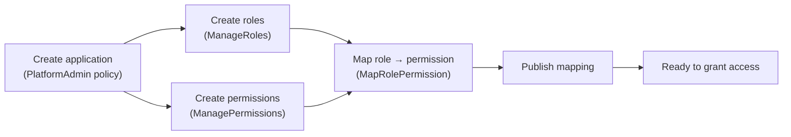
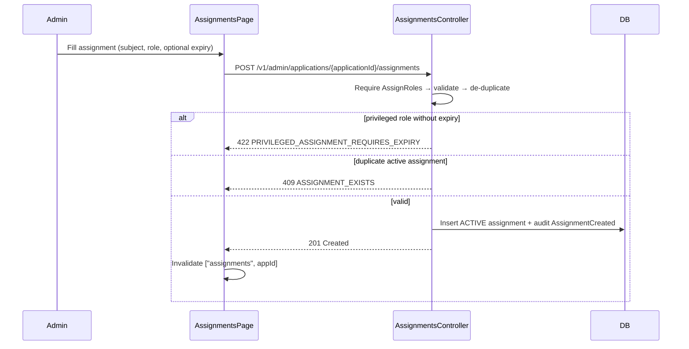
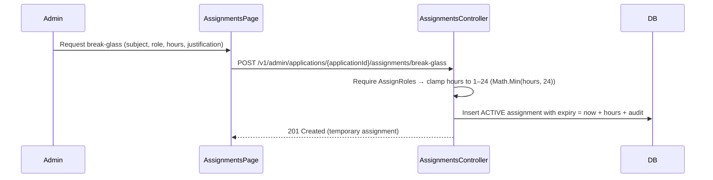
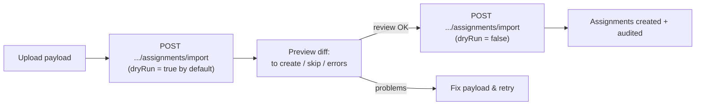
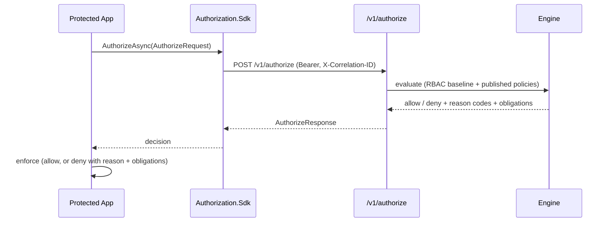
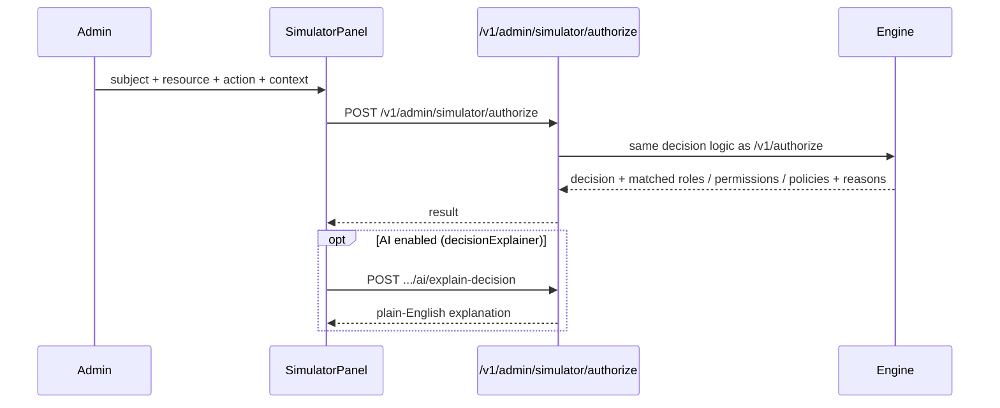
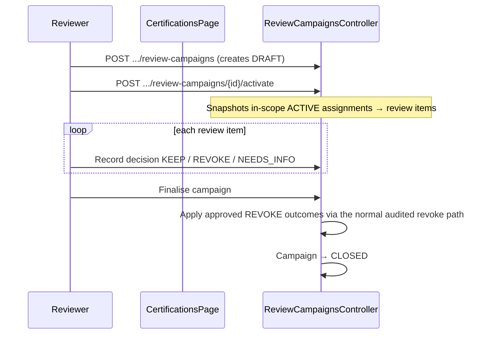

# 10 — User Flows

> Part of the [Documentation Portal](README.md).
> Related: [UI/UX Documentation](09_UI_UX_Documentation.md) · [Feature Documentation](08_Feature_Documentation.md) · [User Manual](22_User_Manual.md) · [Security Design](16_Security_Design.md)

---

## Table of Contents

1. [Purpose & Scope](#purpose--scope)
2. [How to Read These Flows](#how-to-read-these-flows)
3. [Actors](#actors)
4. [Flow Catalog](#flow-catalog)
5. [Authentication & Landing](#authentication--landing)
6. [Model an Application's Access](#model-an-applications-access)
7. [Grant Access (Assignment)](#grant-access-assignment)
8. [Break-Glass Emergency Access](#break-glass-emergency-access)
9. [Bulk Import Assignments](#bulk-import-assignments)
10. [Runtime Authorization](#runtime-authorization)
11. [Revoke & Re-evaluate](#revoke--re-evaluate)
12. [Simulate a Decision](#simulate-a-decision)
13. [Author & Publish a Policy](#author--publish-a-policy)
14. [Access Review (Certification) Campaign](#access-review-certification-campaign)
15. [Investigate via Audit](#investigate-via-audit)
16. [AI-Assisted Flows](#ai-assisted-flows)
17. [Cross-References](#cross-references)

---

## Purpose & Scope

This document traces the **end-to-end journeys** users and integrating systems take through the
Authorization Control Plane, following each one from the UI (or SDK) through the API, the decision
engine, and the database, and back to the resulting UI update or enforcement decision.

Each flow corresponds to real code paths and, where applicable, mirrors the local smoke test in
[scripts/local-smoke.ps1](../scripts/local-smoke.ps1) (the M2M authorize + user authorize
walkthrough). The goal is that a reader with no prior context can follow *who* does *what*, *which
endpoint* is called, *what validation* applies, and *what the observable outcome* is.

- **Screens** referenced by these flows are catalogued in [UI/UX Documentation](09_UI_UX_Documentation.md).
- **Feature behaviour and authorization rules** are detailed in [Feature Documentation](08_Feature_Documentation.md).
- **REST request/response contracts** live in [API Documentation](13_API_Documentation.md).

## How to Read These Flows

Every flow in this document follows the same conventions and relies on a small set of cross-cutting
behaviours. Read this section once; it applies to all flows below.

- **Authorization gating.** Governance endpoints are protected by *policies* (not the fine-grained
  capabilities directly). `AdminApi` is the coarse controller gate; `PlatformAdmin` gates
  tenant/application create/update/delete; each fine-grained action maps to a
  `DelegatedAdmin:<Capability>` policy such as `AssignRoles` or `ManagePolicies`. A user only sees a
  flow's entry points when they hold the matching capability. (See [Security Design](16_Security_Design.md).)
- **Every mutation is audited.** Governance writes go through a shared `SaveGovernanceMutationAsync`
  helper that records an immutable audit event (actor, action such as `AssignmentCreated` /
  `PolicyPublished`, old value, new value, and correlation ID) in the same transaction as the change.
- **Optimistic concurrency.** Audited entities carry an integer `version` concurrency token; a
  conflicting concurrent edit fails rather than silently overwriting.
- **Cache invalidation.** After a successful mutation the SPA invalidates the relevant TanStack
  Query keys (e.g. `["assignments", appId]`, `["policies", appId]`) so the UI re-fetches and reflects
  the new state.
- **Correlation IDs.** A correlation ID (`X-Correlation-ID`) threads a request from the caller
  through the API, engine, and audit trail, making a single action traceable end to end.
- **Publish gating.** Draft artefacts do not affect runtime. A role→permission mapping only grants
  at runtime once **published**, and only a **PUBLISHED** policy influences decisions.

**Diagram legend:** `sequenceDiagram` blocks show request/response ordering across participants;
`flowchart` blocks show state or step progression; `stateDiagram` blocks show entity lifecycles.

## Actors

| Actor | Description | Typical shell |
|-------|-------------|---------------|
| Platform administrator | Full-access operator managing tenants, applications, and global views | Platform shell (`/platform`) |
| Delegated administrator | Scoped operator managing one (or a few) applications' roles, permissions, policies, and assignments | App workspace shell (`/app/:appId`) |
| Reviewer | Runs and decides access-review (certification) campaigns | App workspace shell |
| Protected application / service | A machine caller that asks the runtime `/v1/authorize` endpoint (via the SDK) whether a subject may perform an action | Server-to-server (no UI) |

## Flow Catalog

| # | Flow | Primary actor | Entry surface | Key endpoint(s) |
|---|------|---------------|---------------|-----------------|
| 1 | Authentication & Landing | Any admin | Portal load | `GET /v1/config` |
| 2 | Model an application's access | Platform / delegated admin | Application workspace | roles / permissions / role-permission endpoints |
| 3 | Grant access (assignment) | Delegated admin | Assignments page | `POST /v1/admin/applications/{id}/assignments` |
| 4 | Break-glass emergency access | Delegated admin | Assignments page | `POST .../assignments/break-glass` |
| 5 | Bulk import assignments | Delegated admin | Assignments page | `POST .../assignments/import` |
| 6 | Runtime authorization | Protected application | SDK | `POST /v1/authorize`, `/v1/authorize/batch` |
| 7 | Revoke & re-evaluate | Delegated admin | Assignments page | `POST .../assignments/{id}/revoke` |
| 8 | Simulate a decision | Admin | Simulator | `POST /v1/admin/simulator/authorize` |
| 9 | Author & publish a policy | Delegated admin | Policies page | `POST .../policies`, `POST .../policies/{key}/publish` |
| 10 | Access review campaign | Reviewer | Certifications page | `POST .../review-campaigns` (+ activate / decide / finalise) |
| 11 | Investigate via audit | Admin | Audit / Activity | `GET /v1/admin/audit-events`, `.../summary` |
| 12 | AI-assisted flows | Admin | Various | `.../ai/*` overlays |

## Authentication & Landing

The portal uses OpenID Connect (authorization code + PKCE) against Keycloak. On load it attempts a
silent SSO sign-in; if there is no session it redirects the user to Keycloak to authenticate.

```mermaid
sequenceDiagram
    participant U as Admin
    participant SPA as Portal
    participant KC as Keycloak
    participant API
    U->>SPA: Open portal
    SPA->>SPA: trySilentSignin() → signinSilent()
    alt no active SSO session
        SPA->>KC: login() → signinRedirect (code + PKCE)
        KC-->>SPA: redirect back with code
        SPA->>SPA: handleRedirectCallback() → signinRedirectCallback()
    end
    SPA->>API: GET /v1/config (Bearer)
    API-->>SPA: PortalConfigResponse (AI availability, pagination, UI flags, role labels)
    SPA->>SPA: IndexLanding routes by principal
    Note over SPA: Delegated admin with &ge;1 app → /app/:appId;<br/>Platform principal / read-only viewer → /platform
```

`GET /v1/config` is guarded by the `AdminApi` policy and returns `PortalConfigResponse`, which the
SPA uses to tailor the UI (for example, hiding AI overlays when AI is unavailable). Source:
[auth.ts](../frontend/src/auth.ts), [App.tsx](../frontend/src/App.tsx),
[router.tsx](../frontend/src/router.tsx), [ConfigController.cs](../backend/src/Authorization.Api/Controllers/ConfigController.cs).

## Model an Application's Access

Before anyone can be granted access, an administrator defines the application's access model:
roles, permissions, and the role→permission mappings that connect them. Creating the application
itself requires the `PlatformAdmin` policy; the remaining steps require the corresponding
fine-grained capability.



A role→permission mapping is created as a **draft** and only authorizes at runtime once it is
**published** (see [Business Rules](19_Business_Rules.md)). The Access Matrix visualizes each cell's
state (published / draft / ungranted).

## Grant Access (Assignment)

An administrator with the `AssignRoles` capability assigns a subject (user or group) to a role,
optionally with an expiry.



**Validations / edge cases:** privileged roles require a bounded expiry (`422
PRIVILEGED_ASSIGNMENT_REQUIRES_EXPIRY`); an identical active assignment is rejected as a duplicate
(`409 ASSIGNMENT_EXISTS`). Source:
[AssignmentsController.cs](../backend/src/Authorization.Api/Controllers/Governance/AssignmentsController.cs).

## Break-Glass Emergency Access

For urgent, time-boxed access, an `AssignRoles` holder can grant a **break-glass** assignment. It is
always temporary: the requested duration is clamped to a maximum of 24 hours, and the grant is
heavily audited.



The assignment behaves like any other at runtime but automatically ceases to authorize once its
expiry passes (runtime returns `ASSIGNMENT_EXPIRED`).

## Bulk Import Assignments

Administrators can import many assignments at once from a CSV/JSON payload. The import is
**dry-run by default**, so the first call returns a preview diff without changing anything.



Because `dryRun` defaults to `true`, an accidental submit cannot mutate data — the caller must
explicitly set `dryRun=false` to commit. Source:
[AssignmentsController.cs](../backend/src/Authorization.Api/Controllers/Governance/AssignmentsController.cs).

## Runtime Authorization

The core enforcement journey, exercised by protected applications through the SDK.



- **Single vs batch.** `AuthorizeAsync` calls `POST /v1/authorize`; `AuthorizeBatchAsync` calls
  `POST /v1/authorize/batch` (up to `MaxBatchSize = 50` items). Request bodies are capped
  (256 KB body, 32 KB context JSON).
- **Deny reason codes** are informative — e.g. `ASSIGNMENT_REVOKED`, `ASSIGNMENT_EXPIRED`,
  `NO_ACTIVE_ASSIGNMENT`, `PERMISSION_NOT_GRANTED`, `EXPLICIT_DENY`, `DENY_BY_DEFAULT`.
- **Correlation.** The SDK sends the caller's correlation ID under the
  `X-Correlation-ID` header (`AuthorizationClient.CorrelationIdHeaderName`) and logs the decision.

Source: [AuthorizationClient.cs](../backend/src/Authorization.Sdk/AuthorizationClient.cs),
[RuntimeAuthorizationController.cs](../backend/src/Authorization.Api/Controllers/RuntimeAuthorizationController.cs).

## Revoke & Re-evaluate

Mirrors the smoke test's **allow → revoke → deny** sequence and demonstrates that runtime decisions
reflect governance changes immediately.

```mermaid
flowchart LR
    G["Assignment ACTIVE"] -->|authorize| A1["ALLOW"]
    G -->|POST .../assignments/{id}/revoke| RG["Assignment REVOKED (audited)"]
    RG -->|authorize| D1["DENY ASSIGNMENT_REVOKED"]
```

Revoking is itself an audited mutation; the next authorization for that subject/role returns
`DENY` with reason `ASSIGNMENT_REVOKED`.

## Simulate a Decision

The simulator lets an administrator test *what the engine would decide* for a hypothetical request,
using the **exact same** decision logic as production — without affecting any real caller.



`POST /v1/admin/simulator/authorize` is **POST-only** (there is no GET variant) and lives on the
`GovernanceInsightsController`.

## Author & Publish a Policy

Policies are authored as drafts, edited while in draft, and then published; only published policies
affect runtime decisions.

```mermaid
stateDiagram-v2
    [*] --> DRAFT: create (Publish=false; conditions validated)
    [*] --> PUBLISHED: create (Publish=true)
    DRAFT --> DRAFT: edit (only drafts are editable)
    DRAFT --> PUBLISHED: publish (audit PolicyPublished, sets PublishedAt)
    PUBLISHED --> [*]
    note right of DRAFT
      Optional AI policy authoring
      drafts conditions from natural language
    end note
```



- A policy can be created directly published (`Publish=true`) or saved as a draft first.
- **Only draft policies are editable** — editing a published policy is rejected
  (`PolicyNotEditable`).
- Publishing (`POST .../policies/{policyKey}/publish`) sets state to `PUBLISHED`, stamps
  `PublishedAt`, and writes a `PolicyPublished` audit event.
- **Only `PUBLISHED` policies influence runtime decisions.** Impact can be previewed with AI impact
  analysis before publishing (see [AI Features](15_AI_Features.md)). Source:
  [PoliciesController.cs](../backend/src/Authorization.Api/Controllers/Governance/PoliciesController.cs).

## Access Review (Certification) Campaign

A reviewer periodically recertifies who has access. A campaign is created as a draft, activated to
snapshot the in-scope active assignments into review items, decided item by item, then finalised.



Finalising applies each **REVOKE** decision through the same audited assignment-revoke path used by
manual revocation (so every revocation is traceable), then closes the campaign (terminal `CLOSED`
state). Only a `DRAFT` campaign can be activated. Source:
[ReviewCampaignsController.cs](../backend/src/Authorization.Api/Controllers/Governance/ReviewCampaignsController.cs).

## Investigate via Audit

Every governance change is recorded as an immutable audit event. Administrators investigate activity
through a filterable feed and a time-of-day/day-of-week heatmap.

```mermaid
flowchart LR
    Q["Search audit (q, category, app)"] --> Feed["GET /v1/admin/audit-events"]
    Feed --> Heatmap["GET /v1/admin/audit-events/summary"]
    Feed --> Detail["Event card: actor, action, old / new value, correlation ID"]
    opt AI auditNarrative
        Feed --> Narr["POST /v1/admin/ai/audit/narrative"]
    end
```

Both audit endpoints are served by the `GovernanceInsightsController`. Portal presentation logic
(icons, tones, categories, relative time) lives in
[workspace/activity.ts](../frontend/src/workspace/activity.ts).

## AI-Assisted Flows

All AI flows are **advisory overlays** on existing pages: they never make governance decisions on
their own, and they are hidden when the relevant feature is disabled (as reported by
`PortalConfigResponse`). Application-scoped routes are prefixed
`/v1/admin/applications/{applicationId}/ai`; platform-scoped routes are prefixed `/v1/admin/ai`.

| Flow | Trigger page | Endpoint |
|------|--------------|----------|
| Draft policy from natural language | Condition builder | `.../ai/policy-draft` |
| Explain a decision | Simulator | `.../ai/explain-decision` |
| Analyze publish impact | Policy detail | `.../ai/impact-analysis` |
| Summarize config health | Dashboard | `.../ai/advisor/summarize` |
| Ask about access | Ask AI / Access search | `.../ai/access-search`, `/v1/admin/ai/access-search` |
| Draft an SoD rule | SoD panel | `.../ai/sod/rules/draft` |
| Summarize an access review | Certifications | `/v1/admin/ai/access-review/summarize` |
| Narrate audit activity | Audit | `/v1/admin/ai/audit/narrative` |

## Cross-References

- Screens involved in each flow: [UI/UX Documentation](09_UI_UX_Documentation.md)
- Feature depth and authorization model: [Feature Documentation](08_Feature_Documentation.md)
- REST contracts behind each endpoint: [API Documentation](13_API_Documentation.md)
- Domain rules enforced during these flows: [Business Rules](19_Business_Rules.md)
- Step-by-step task instructions: [User Manual](22_User_Manual.md)
