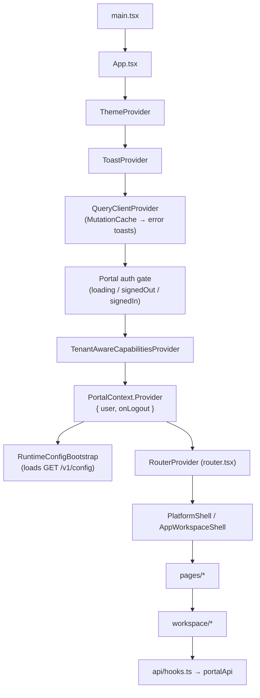
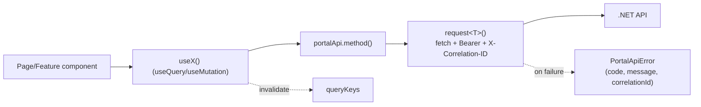
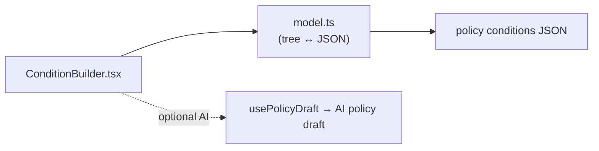

# 11 — Component Design (Frontend)

> Part of the [Documentation Portal](README.md).
> Related: [UI/UX Documentation](09_UI_UX_Documentation.md) · [Technology Stack](06_Technology_Stack.md) · [API Documentation](13_API_Documentation.md) · [Module Design](12_Module_Design.md)

---

## Table of Contents

1. [Purpose & Scope](#purpose--scope)
2. [Design Principles & Conventions](#design-principles--conventions)
3. [Composition & Provider Tree](#composition--provider-tree)
4. [Providers & Context](#providers--context)
5. [Data Layer (React Query)](#data-layer-react-query)
6. [Application Shells](#application-shells)
7. [UI Primitives](#ui-primitives)
8. [Icons & Notifications](#icons--notifications)
9. [Visualization & Charts](#visualization--charts)
10. [Workspace Feature Components](#workspace-feature-components)
11. [Condition Builder](#condition-builder)
12. [Selection, URL & State Persistence](#selection-url--state-persistence)
13. [Cross-References](#cross-references)

---

## Purpose & Scope

This document describes the **frontend component architecture** of the Authorization Control Plane
portal ([frontend/src](../frontend/src)): how the React tree is composed, how components obtain data,
and what each reusable and feature-level component is responsible for.

**In scope:** the provider/context tree, the React Query data layer and API client, the two
application shells, the shared UI primitive library, icons, the D3/chart visualization components, the
per-app workspace feature components, the policy condition builder, and how UI state is persisted to
the URL.

**Out of scope:** where screens appear and how they look (see
[UI/UX Documentation](09_UI_UX_Documentation.md)), the HTTP endpoints the hooks call (see
[API Documentation](13_API_Documentation.md)), and the backend modules behind those endpoints (see
[Module Design](12_Module_Design.md)).

## Design Principles & Conventions

- **Function components + hooks only.** Every component is a function; cross-cutting behaviour is
  packaged as hooks (`useCapabilities`, `usePortal`, `useAppContext`, `useToast`, `useTheme`,
  `useModalDialog`, `useUrlState`).
- **Server state lives in React Query; the API client is the only fetch boundary.** Components never
  call `fetch` directly — they call typed hooks that wrap `portalApi`
  ([apiClient.ts](../frontend/src/apiClient.ts)). Local/ephemeral UI state uses `useState`/`useMemo`.
- **Capability-gated UI.** Components read the signed-in principal's capabilities from
  `CapabilitiesProvider` and hide or disable actions the caller may not perform, mirroring (never
  replacing) the server's authorization.
- **Theme-aware and token-driven.** Colours come from CSS custom properties; charts subscribe to live
  theme tokens via `useChartTheme()` so light/dark switches re-render correctly.
- **URL as shared state.** Filters, paging, and the current selection are serialized into the URL so a
  view can be reloaded, bookmarked, and shared.
- **Presentational primitives vs. feature containers.** [primitives.tsx](../frontend/src/components/primitives.tsx)
  and [ui.tsx](../frontend/src/ui.tsx) hold stateless building blocks; [workspace/](../frontend/src/workspace/)
  holds data-bound feature components that compose them.

## Composition & Provider Tree

[main.tsx](../frontend/src/main.tsx) mounts `<App />`. `App` establishes the provider stack, an
authentication gate, and finally the router. Providers are **nested** (outer to inner), and the
capabilities/router layer only mounts once the user is signed in.

The `Portal` component holds an auth state machine (`loading` → shows a "Signing you in…" splash;
`signedOut` → shows the Keycloak sign-in screen; `signedIn` → mounts the app). On mount it processes
any OIDC redirect callback, then falls back to a no-interaction silent sign-in before rendering the
signed-in tree. See [User Flows](10_User_Flows.md) for the authentication sequence.

## Providers & Context

| Provider / Context | Source | Responsibility |
|--------------------|--------|----------------|
| `ThemeProvider` | [theme/ThemeProvider.tsx](../frontend/src/theme/ThemeProvider.tsx) | Light/dark theme; **defaults to `dark`**, persisted to `localStorage` under `acp-theme`; sets `data-theme` and `colorScheme` on `<html>`. `useTheme()` reads/sets it. |
| `ToastProvider` | [components/Toast.tsx](../frontend/src/components/Toast.tsx) | Toast surface; `useToast()` exposes success/error/info toasts |
| `QueryClientProvider` | [App.tsx](../frontend/src/App.tsx) (via `useQueryClientWithToasts()`) | React Query client whose `MutationCache` surfaces every failed write as an error toast |
| `TenantAwareCapabilitiesProvider` → `CapabilitiesProvider` | [App.tsx](../frontend/src/App.tsx) + [capabilities.tsx](../frontend/src/capabilities.tsx) | Supplies the capability model (with the application→tenant map) so the UI can gate actions; `useCapabilities()` |
| `PortalContext` | [shells/PortalContext.ts](../frontend/src/shells/PortalContext.ts) | `{ user, onLogout }`; `usePortal()` |
| `RuntimeConfigBootstrap` | [App.tsx](../frontend/src/App.tsx) + [api/runtimeConfig.ts](../frontend/src/api/runtimeConfig.ts) | Loads `GET /v1/config` once and updates the runtime-config singleton |
| `AppOutletContext` | [shells/appContext.ts](../frontend/src/shells/appContext.ts) | `{ appId, app, tenantName, startCreate }` for app-scoped pages; `useAppContext()` |

## Data Layer (React Query)

Components consume server state through hooks in [api/hooks.ts](../frontend/src/api/hooks.ts), which
wrap `portalApi` ([apiClient.ts](../frontend/src/apiClient.ts)). Cache keys are centralized in
[api/queryKeys.ts](../frontend/src/api/queryKeys.ts); paging, staleness, and UI windows come from
server config cached in [api/runtimeConfig.ts](../frontend/src/api/runtimeConfig.ts).

**API client.** `request<T>(path, init)` fetches an access token via `getAccessToken()`, attaches
`Authorization: Bearer <token>` and a fresh `X-Correlation-ID: crypto.randomUUID()` header, and maps
non-2xx responses to a typed `PortalApiError` carrying the server error `code`, `message`, and the
response `correlationId` for traceability.

**Query hooks** (examples): `useTenants`, `useApplications`, `useFilteredApplicationsPaged`,
`useRolesPaged`, `usePermissionsPaged`, `usePoliciesPaged`, `useAssignmentsPaged`, `useAuditFeed`,
`useDecisionAnalytics`, `useConfigFindings`, `useSodRules`, `useSodViolations`, `useAiUsage`.

**Mutation hooks** (examples): `useCreateApplication`, `useCreateRole`, `useCreateAssignment`,
`useBreakGlass`, `useCreatePolicy`, `usePublishPolicy`, `useUpdatePolicy`, `useDeletePolicy`,
`useCreateReviewCampaign`, `useFinalizeReviewCampaign`, `useSimulate`. AI mutations:
`usePolicyDraft`, `useExplainDecision`, `useImpactAnalysis`, `useAccessSearch`, `useAuditNarrative`,
`useDraftSodRule`.

**Runtime config** (`DEFAULT_PORTAL_CONFIG` until `GET /v1/config` loads):

| Group | Values |
|-------|--------|
| Cache staleness | `defaultStaleMs` 30 s · `volatileStaleMs` 10 s (audit, AI usage) · `configStaleMs` 300 s |
| Pagination | `defaultPageSize` 25 · `maxPageSize` 200 · `pageSizeOptions` `[10, 25, 50, 100]` |
| UI windows | `aiReportingWindows` `[7, 30, 90]` · `activityTrendDays` 14 · `auditPageSize` 200 |
| Role labels | Friendly names for `platformsuperadmin`, `platformreadonlyviewer`, `applicationadmin`, `readonlyviewer` |

## Application Shells

### PlatformShell — [shells/PlatformShell.tsx](../frontend/src/shells/PlatformShell.tsx)

- Renders the platform sidebar (Overview, Applications, Tenants, Users, Access lens, Audit, AI usage,
  Ask AI, Platform settings) with a `ScopeBadge` (`scope="platform"`).
- Topbar: brand, command-palette trigger (Cmd/Ctrl+K), `ThemeToggle`, and `UserMenu`.
- **Switching between applications is done through the command palette** (there is no tenant-grouped
  app-switcher `<select>` here — that control lives only in the app shell).
- Creating an application opens the `ApplicationForm` in a `SlideOver` (not a modal dialog).

### AppWorkspaceShell — [shells/AppWorkspaceShell.tsx](../frontend/src/shells/AppWorkspaceShell.tsx)

- Renders the app sidebar (Dashboard, Roles, Permissions, Policies, Reference data, Access matrix,
  Assignments, Identity providers, Simulator, Decisions, Activity, Certifications, Settings) with a
  `ScopeBadge` (`scope="application"`).
- Topbar adds a `NotificationsBell(appId)`; the sidebar includes a **tenant-grouped app-switcher
  `<select>`** (`<optgroup>` per tenant) and, for callers who can access all applications, a
  "← Go Back to Platform" button.
- App-scoped creation is driven from the command palette (`startCreate`).
- **Guard:** while the applications list is loading it shows an "Opening application…" spinner; once
  the list resolves and the current `appId` is not found (unknown or unauthorized), it redirects to
  the platform applications list (`navigate(platformPaths.applications, { replace: true })`) with an
  explanatory toast rather than rendering a blank workspace.

## UI Primitives

Source: [components/primitives.tsx](../frontend/src/components/primitives.tsx) — stateless,
presentational building blocks.

| Export | Kind | Purpose |
|--------|------|---------|
| `Button` | component | Actions; `variant`, `size`, `loading`, `icon`, `iconEnd` |
| `Kbd` | component | Keyboard-shortcut key badge (`<kbd>`) |
| `RiskDot` | component | Colour-coded risk indicator dot; `level` |
| `StateBadge` | component | Lifecycle label (DRAFT / PUBLISHED / ACTIVE / REVOKED …); `value` |
| `Chip` | component | Tag/pill; `tone` (`neutral`/`granted`/`draft`/`danger`), optional `onRemove` |
| `Toggle` | component | Accessible switch (`role="switch"`); `checked`, `onChange`, `label` |
| `InlineText` | component | Inline-editable text; `value`, `onCommit`, `placeholder`, `multiline` |
| `Segmented` | component | Segmented radio control; `value`, `onChange`, `options` |
| `Field` | component | Form-field wrapper; `label`, `required`, `hint` |
| `SlideOver` | component | Right-side detail panel; `open`, `title`, `onClose`, `footer` |
| `EmptyBlock` | component | Empty-state block |
| `Spinner` | component | Loading indicator; optional `label` |
| `InfoHint` | component | Info icon with an accessible popover; `label`, `children` |
| `useModalDialog(open, onClose)` | hook | Shared modal behaviour: scroll-lock, Escape-to-close, focus-trap, and focus-restore; returns a ref for the dialog container |

> **Overlay surfaces are not in `primitives.tsx`.** The centered modal (`DialogPanel`), the drawer
> (`DrawerPanel`), and the confirmation dialog (`ConfirmDialog`) live in
> [ui.tsx](../frontend/src/ui.tsx) and are built on top of `useModalDialog`. `SlideOver` above is the
> only slide-in panel exported from `primitives.tsx`.

## Icons & Notifications

- [components/icons.tsx](../frontend/src/components/icons.tsx) — `AppIcon`, stroke-based SVG icons
  that inherit `currentColor`.
- [components/NotificationsBell.tsx](../frontend/src/components/NotificationsBell.tsx) — the
  app-scoped notifications control rendered in the `AppWorkspaceShell` topbar.
- [components/useResizeWidth.ts](../frontend/src/components/useResizeWidth.ts) — a resize-observer
  hook used to make charts and grids responsive.

## Visualization & Charts

Sources: [components/viz/](../frontend/src/components/viz/) (D3) and
[components/charts.tsx](../frontend/src/components/charts.tsx) (SVG charts + theme hook).

| Export | Source | Purpose |
|--------|--------|---------|
| `D3Tree` | viz/ | Tenant → app → entity hierarchy tree |
| `D3Heatmap` | viz/ | Calendar activity heatmap |
| `D3BipartiteGraph` | viz/ | Roles ↔ permissions bipartite graph |
| `VizModal` | viz/ | Enlarged-visualization modal |
| `AreaTrend` | charts.tsx | Time-series area chart |
| `BarDistribution` | charts.tsx | Distributions (top denies, features) |
| `DonutChart` | charts.tsx | Proportional donut chart |
| `buildActivityTrend` / `buildUsageTrend` | charts.tsx | Helpers that shape raw series into chart data |
| `useChartTheme` | charts.tsx | Live light/dark theme tokens so charts re-render on theme change |

## Workspace Feature Components

Source: [workspace/](../frontend/src/workspace/) — data-bound components that compose primitives,
charts, and hooks into the per-app experience.

| Component | Responsibility |
|-----------|----------------|
| [Dashboard.tsx](../frontend/src/workspace/Dashboard.tsx) | App dashboard (config health, recent activity, SoD, AI actions) |
| [AccessMatrix.tsx](../frontend/src/workspace/AccessMatrix.tsx) | Roles × permissions grid + bipartite coverage graph |
| [AccessLens.tsx](../frontend/src/workspace/AccessLens.tsx) | Platform hierarchy explorer |
| [DecisionAnalytics.tsx](../frontend/src/workspace/DecisionAnalytics.tsx) | Allow/deny trends + top denies |
| [Certifications.tsx](../frontend/src/workspace/Certifications.tsx) | Review campaign management |
| [AccessSearch.tsx](../frontend/src/workspace/AccessSearch.tsx) | Natural-language access queries |
| [ConfigAdvisor.tsx](../frontend/src/workspace/ConfigAdvisor.tsx) | Config findings + AI summary |
| [SodPanel.tsx](../frontend/src/workspace/SodPanel.tsx) | SoD rules & violations + AI draft |
| [ExpiringAccess.tsx](../frontend/src/workspace/ExpiringAccess.tsx) | Soon-to-expire assignments view |
| [Inspector.tsx](../frontend/src/workspace/Inspector.tsx) | Generic entity detail panel |
| [AuditEventCard.tsx](../frontend/src/workspace/AuditEventCard.tsx) | Single audit-event presentation |
| [CommandPalette.tsx](../frontend/src/workspace/CommandPalette.tsx) | Cmd/Ctrl+K navigation & creation |
| [CreateForms.tsx](../frontend/src/workspace/CreateForms.tsx) | Role/Permission/Policy/Application forms (rendered in a `SlideOver`) |
| [ObligationsEditor.tsx](../frontend/src/workspace/ObligationsEditor.tsx) | Policy obligations editor |
| [ReferenceDataForm.tsx](../frontend/src/workspace/ReferenceDataForm.tsx) | Reference data editor |
| [panels/SimulatorPanel.tsx](../frontend/src/workspace/panels/SimulatorPanel.tsx) | Decision simulator + AI explain |
| [panels/AccessPanel.tsx](../frontend/src/workspace/panels/AccessPanel.tsx) | Subject access details |
| [panels/IdentityPanel.tsx](../frontend/src/workspace/panels/IdentityPanel.tsx) | OIDC identity-provider management |
| [panels/ActivityPanel.tsx](../frontend/src/workspace/panels/ActivityPanel.tsx) | App-scoped audit feed |
| [HierarchyPanels.tsx](../frontend/src/workspace/HierarchyPanels.tsx) | Tenant/user trees |

Supporting non-component modules in the same folder include [activity.ts](../frontend/src/workspace/activity.ts),
[formatters.ts](../frontend/src/workspace/formatters.ts), and [nav.ts](../frontend/src/workspace/nav.ts),
plus the [hierarchy/](../frontend/src/workspace/hierarchy/), [inspectors/](../frontend/src/workspace/inspectors/),
and [simulator/](../frontend/src/workspace/simulator/) sub-folders.

## Condition Builder

Source: [workspace/conditions/](../frontend/src/workspace/conditions/).

[ConditionBuilder.tsx](../frontend/src/workspace/conditions/ConditionBuilder.tsx) edits nested
combinator groups whose combinator is `all`/`any`/`none` (logical AND/OR/NOT) containing attribute
comparison rules. [model.ts](../frontend/src/workspace/conditions/model.ts) defines the node types
(`GroupNode`, `RuleNode`), the operator catalogue (`OPERATORS`), and `serialize()`, which turns the
tree into the policy condition JSON validated on the server by
[PolicyConditionValidator.cs](../backend/src/Authorization.Api/Governance/PolicyConditionValidator.cs).

## Selection, URL & State Persistence

- [api/useUrlState.ts](../frontend/src/api/useUrlState.ts) — a `useState`-like hook that persists
  filter values in URL query params (survives reload/sharing; uses `replace` to avoid history spam).
- [workspace/selection.ts](../frontend/src/workspace/selection.ts) — the "what am I looking at"
  selection model shared across workspace panels.
- [workspace/location.ts](../frontend/src/workspace/location.ts) — legacy deep-link serialization,
  consumed by the router's `LegacyRedirect` (see [UI/UX Documentation](09_UI_UX_Documentation.md)).

## Cross-References

- Where components render and how they look: [UI/UX Documentation](09_UI_UX_Documentation.md)
- Step-by-step flows the components drive: [User Flows](10_User_Flows.md)
- Endpoints the hooks call: [API Documentation](13_API_Documentation.md)
- Backend counterparts: [Module Design](12_Module_Design.md)
