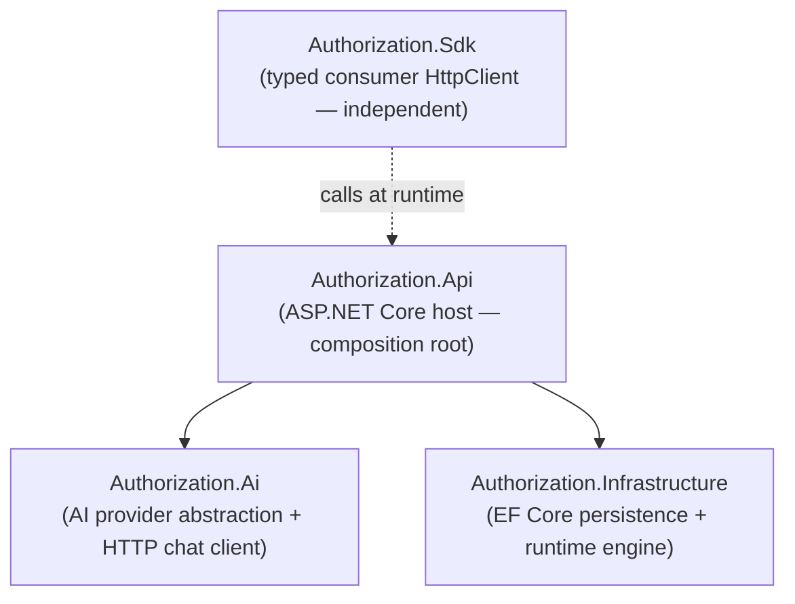
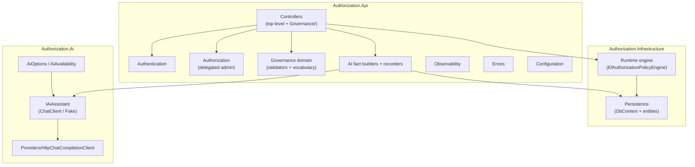
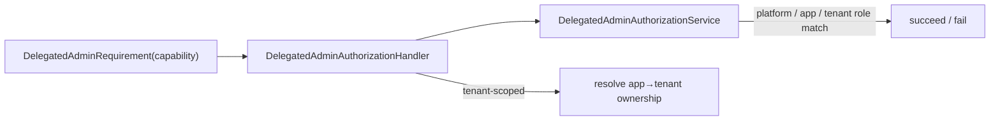

# 12 — Module Design (Backend)

> Part of the [Documentation Portal](README.md).
> Related: [System Architecture](04_System_Architecture.md) · [Solution Design](05_Solution_Design.md) · [API Documentation](13_API_Documentation.md) · [Data Model](14_Data_Model_Documentation.md)

---

## Table of Contents

1. [Purpose & Scope](#purpose--scope)
2. [Project Topology & Dependencies](#project-topology--dependencies)
3. [Module Map](#module-map)
4. [Composition Root & Request Pipeline](#composition-root--request-pipeline)
5. [Controllers Module](#controllers-module)
6. [Authentication Module](#authentication-module)
7. [Authorization (Delegated Admin) Module](#authorization-delegated-admin-module)
8. [Governance Domain Module](#governance-domain-module)
9. [Runtime Engine Module](#runtime-engine-module)
10. [Persistence Module](#persistence-module)
11. [AI Modules](#ai-modules)
12. [Observability, Health & Errors](#observability-health--errors)
13. [Configuration Module](#configuration-module)
14. [SDK Module](#sdk-module)
15. [Cross-References](#cross-references)

---

## Purpose & Scope

This document describes the **backend module architecture** of the Authorization Control Plane: the
source projects, how they depend on one another, and — for each module — its responsibility, the key
types it contains, its dependencies, and how it is wired into the running application.

**In scope:** project topology, the `Program.cs` composition root and middleware pipeline, the HTTP
controller surface and its shared base, authentication, delegated-admin authorization, the governance
domain (validators/vocabulary), the runtime decision engine, persistence, the AI subsystem,
observability/health/errors, configuration binding, and the consumer SDK.

**Out of scope:** the exact request/response contract of each endpoint (see
[API Documentation](13_API_Documentation.md)), the database schema and constraints (see
[Data Model](14_Data_Model_Documentation.md)), the decision algorithm's rules in depth (see
[Business Rules](19_Business_Rules.md)), and the front-end (see [Component Design](11_Component_Design.md)).

## Project Topology & Dependencies

The backend solution ([AuthorizationControlPlane.slnx](../backend/AuthorizationControlPlane.slnx))
contains four source projects. **`Authorization.Api` is the single composition root** — it is the only
project that references the others; `Authorization.Ai`, `Authorization.Infrastructure`, and
`Authorization.Sdk` have **no project references** and are independent libraries.

| Project | Kind | References | Responsibility |
|---------|------|-----------|----------------|
| [Authorization.Api](../backend/src/Authorization.Api/) | ASP.NET Core Web API (`net10.0`) | `Authorization.Ai`, `Authorization.Infrastructure` | Hosts controllers, authN/authZ, governance domain, AI fact-builders/recorders, observability, errors, configuration |
| [Authorization.Infrastructure](../backend/src/Authorization.Infrastructure/) | Class library | — | EF Core `DbContext`, entities, migrations, Dapper connection factory, the runtime decision engine, and the decision outbox |
| [Authorization.Ai](../backend/src/Authorization.Ai/) | Class library | — | `IAiAssistant` abstraction, live/fake implementations, the OpenAI-compatible HTTP chat client, options, and availability |
| [Authorization.Sdk](../backend/src/Authorization.Sdk/) | Class library | — | `IAuthorizationClient` typed HttpClient for *consumers* of the runtime API |

Registration is expressed through one `Add…` extension per module, so `Program.cs` reads as a short
list of feature registrations (see [Composition Root](#composition-root--request-pipeline)).

## Module Map

## Composition Root & Request Pipeline

[Program.cs](../backend/src/Authorization.Api/Program.cs) builds the host, registers services in
module order, then composes the middleware pipeline.

**Service registration order** (each `Add…` lives in the module's own `ServiceCollectionExtensions`):

| # | Registration | Source | Registers |
|---|--------------|--------|-----------|
| 1 | `AddAuthorizationControlPlaneConfiguration(config)` | [Configuration/ServiceCollectionExtensions.cs](../backend/src/Authorization.Api/Configuration/ServiceCollectionExtensions.cs) | Options binding + validation (`DatabaseOptions`, `OidcOptions`, `PortalOptions`, `RuntimeClientOptions`) |
| 2 | `AddAuthorizationControlPlaneAuthentication()` | [Authentication/ServiceCollectionExtensions.cs](../backend/src/Authorization.Api/Authentication/ServiceCollectionExtensions.cs) | JWT bearer + runtime-client schemes, validators, delegated-admin policies |
| 3 | `AddAuthorizationObservability()` | [Observability/ServiceCollectionExtensions.cs](../backend/src/Authorization.Api/Observability/ServiceCollectionExtensions.cs) | Health checks + OpenTelemetry tracing/metrics |
| 4 | `AddAuthorizationInfrastructure(config)` | [DependencyInjection.cs](../backend/src/Authorization.Infrastructure/DependencyInjection.cs) | `AuthorizationDbContext`, connection factory, runtime engine, decision outbox |
| 5 | `AddAuthorizationAi(config)` | [AiServiceCollectionExtensions.cs](../backend/src/Authorization.Ai/AiServiceCollectionExtensions.cs) | `IAiAssistant` (live or fake), chat client, `AiAvailability` |
| 6 | Scoped AI fact builders | Program.cs | `DecisionDiagnosticsBuilder`, `ImpactAnalysisBuilder`, `ConfigAdvisorBuilder`, `AccessSearchExecutor`, `SodAnalysisBuilder`, `AccessReviewBuilder`, `SubjectPseudonymizer`, `AuditNarrativeBuilder` |
| 7 | AI usage sinks | Program.cs | Singleton `AiUsageAccumulator` (also registered as `IAiUsageObserver`), scoped `AiInvocationRecorder`, `AiUsageBuilder`, `AiPromptLogRecorder` |
| 8 | `AddControllers()` + `AddCanonicalErrorEnvelope()` | [Errors/ServiceCollectionExtensions.cs](../backend/src/Authorization.Api/Errors/ServiceCollectionExtensions.cs) | MVC controllers + a model-state/400 handler that emits the canonical error envelope |
| 9 | `AddCors("PortalCors")` + `AddOpenApi()` | Program.cs | CORS for the portal (default origin `http://localhost:5173`, overridable via `Cors:AllowedOrigins`) and the dev OpenAPI document |

**Middleware pipeline** (order matters):

```mermaid
flowchart LR
    S["await UseDevelopmentDatabaseSetupAsync()<br/>(startup: migrate + seed in Dev)"] --> C["CorrelationIdMiddleware"]
    C --> E["ExceptionHandlingMiddleware"]
    E --> O["MapOpenApi() (Dev only)"]
    O --> H["UseHttpsRedirection() (non-Dev)"]
    H --> CO["UseCors(PortalCors)"]
    CO --> AN["UseAuthentication"]
    AN --> AZ["UseAuthorization"]
    AZ --> HC["/health/live (no checks)<br/>/health/ready (ready tag)"]
    HC --> MC["MapControllers"]
```

`Program` ends with `public partial class Program;` so the integration tests can drive the real
pipeline through `WebApplicationFactory` ([TestWebApplicationFactory.cs](../backend/tests/Authorization.Api.Tests/TestWebApplicationFactory.cs)).

## Controllers Module

Controllers live in [Controllers](../backend/src/Authorization.Api/Controllers/) (runtime, config, AI,
insights) and [Controllers/Governance](../backend/src/Authorization.Api/Controllers/Governance/)
(governance CRUD + lifecycle). Route bases below are the controller `[Route]` attribute; individual
actions append resource segments.

| Controller | Route base | Responsibility |
|------------|-----------|----------------|
| `RuntimeAuthorizationController` | `v1` | Single + batch authorize; records each decision |
| `ConfigController` | `v1/config` | Server-owned portal runtime config |
| `AiAssistController` | `v1/admin/applications/{applicationId}/ai` | App-scoped AI features |
| `PlatformAiAssistController` | `v1/admin/ai` | Platform-scoped AI + `usage`/`prompt-logs` reads |
| `ApplicationInsightsController` | `v1/admin/applications/{applicationId}/insights` | Deterministic config findings & SoD |
| `DecisionAnalyticsController` | `v1/admin` | Decision analytics (`applications/{id}/decisions/analytics`) |
| `TenantsController`, `ApplicationsController`, `RolesController`, `PermissionsController`, `RolePermissionsController`, `AssignmentsController`, `PoliciesController`, `OidcProvidersController`, `ReferenceDataController`, `ReviewCampaignsController`, `GovernanceInsightsController` | `v1/admin` | Governance CRUD + lifecycle (assignments, policies, review campaigns, overview/simulator) |

**Shared base — [`GovernanceControllerBase`](../backend/src/Authorization.Api/Controllers/GovernanceControllerBase.cs):**
the 11 governance controllers derive from it to behave identically. It provides:

- `DbContext` — the injected `AuthorizationDbContext`.
- `Actor` — `User.Identity?.Name` (falls back to `local-admin`); `ActorRole` — `AuditActorRole.Resolve(User)`.
- `Error(code, message)` — builds an `ApiErrorEnvelope` stamped with `HttpContext.TraceIdentifier`.
- `RequireText(value, field)` — returns a 422 validation result for null/blank text (the framework's
  `[Required]` accepts whitespace, so create/update handlers use this).
- `ApplicationExistsAsync(id, ct)` / `ResolveApplicationRefIdAsync(id, ct)` — existence check and
  business-id→surrogate-`Guid` resolution.
- `SaveGovernanceMutationAsync(eventType, applicationId, targetSubjectEmail, [oldValue,] newValue, ct)` —
  adds the audit event and calls `SaveChangesAsync` **once**, so the entity mutation and its audit row
  commit atomically inside EF Core's implicit transaction. EF back-fills store-generated `Id`,
  `CreatedAt`, and `Version` afterward, so callers can map the entity into the response.

## Authentication Module

Source: [Authentication](../backend/src/Authorization.Api/Authentication/). Two authentication schemes
coexist: admin JWTs (portal/API callers) and runtime client credentials (services calling
`/v1/authorize`).

| Type | Responsibility |
|------|----------------|
| `ApiAuthenticationSchemes` | Scheme name constants `AdminJwt` and `RuntimeClientCredentials` |
| `JwtTokenValidator` / `JwtTokenValidationResult` | Validates admin JWTs; returns a typed result with failure codes (`TOKEN_MISSING`, `TOKEN_SIGNATURE_INVALID`, …) |
| `RuntimeCallerAuthenticator` | Authenticates a runtime caller against the matched OIDC provider + subject claim |
| `RuntimeClientCredentialValidator` / `RuntimeClientValidationResult` | Validates client credentials taken from request headers |
| `IRuntimeSigningKeyResolver` / `JwksRuntimeSigningKeyResolver` | Resolves JWKS signing keys for token validation |
| `ServiceCollectionExtensions` | `AddAuthorizationControlPlaneAuthentication()` — registers JWT bearer, the validators, and the delegated-admin authorization policies |

See [Security Design](16_Security_Design.md).

## Authorization (Delegated Admin) Module

Source: [Authorization](../backend/src/Authorization.Api/Authorization/). Fine-grained,
capability-based authorization layered over ASP.NET Core policies.

- `DelegatedAdminCapability` — the **8 fine-grained capabilities**: `ManageApplication`, `ManageRoles`,
  `ManagePermissions`, `MapRolePermission`, `ManagePolicies`, `AssignRoles`, `ViewAudit`,
  `ReadOnlyView`. (There is **no `PlatformAdmin` capability** — see policies below.)
- `DelegatedAdminRoles` — well-known role names (`PlatformSuperAdmin`, `ApplicationAdmin`,
  `TenantAdmin`, …).
- `DelegatedAdminClaimTypes` — the claim types the handler reads: `AppRole`, `PlatformRole`, and
  `TenantRole` (formatted `{tenantId}:{role}`).
- `DelegatedAdminPolicyNames` — the ASP.NET Core policy names: `AdminApi`, `PlatformAdmin` (requires
  the platform-super-admin role; gates tenant/application create/update/delete), plus one policy per
  capability.
- `DelegatedAdminRequirement` + `DelegatedAdminAuthorizationHandler` + `DelegatedAdminAuthorizationService` —
  the requirement/handler/service triad that evaluates a capability against the caller's platform, app,
  and tenant roles (resolving app→tenant ownership for tenant-scoped checks).

See [Security Design](16_Security_Design.md).

## Governance Domain Module

Source: [Governance](../backend/src/Authorization.Api/Governance/). Stateless validators and constants
that enforce governance invariants before persistence.

| Type | Responsibility |
|------|----------------|
| `GovernanceVocabulary` | Canonical status/state/risk constants; `AssignmentDisplayStatus.Resolve()` derives the display status from state + expiry |
| `PolicyConditionValidator` | Validates policy condition JSON (combinators, match types, operators) |
| `PolicyObligationsValidator` | Validates the obligations array on a policy |
| `ReferenceDataValueValidator` | Validates reference-data value JSON |

Related constants: [AuditEventTypes.cs](../backend/src/Authorization.Api/Constants/AuditEventTypes.cs)
(audit event-type names) and
[GovernanceErrorCodes.cs](../backend/src/Authorization.Api/Constants/GovernanceErrorCodes.cs) (error
codes such as `VALIDATION_ERROR`, `*_EXISTS`, `*_NOT_FOUND`, `*_IN_USE`).

## Runtime Engine Module

Source: [RuntimeAuthorization](../backend/src/Authorization.Infrastructure/RuntimeAuthorization/). This
is the hot path behind `POST /v1/authorize`.

| Type | Responsibility |
|------|----------------|
| `EfAuthorizationPolicyEngine` (`IAuthorizationPolicyEngine`) | The decision algorithm — resolves the `ACTIVE` application/permission, evaluates RBAC baseline + optional policies, and opens a tracing span per decision |
| `AuthorizeModels` | The engine's models: `AuthorizeRequest`, `AuthorizeDecision`, `MatchedPolicy`, obligations |
| `PolicyOperators` | The supported condition operators used when evaluating policy conditions |
| `InProcessDecisionOutbox` (`IDecisionRecorder`) | Persists each decision record (in-process outbox) |

The algorithm, effect-combining, and deny-code semantics are detailed in
[Business Rules](19_Business_Rules.md) and [Code Walkthrough](23_Code_Walkthrough.md).

## Persistence Module

Source: [Persistence](../backend/src/Authorization.Infrastructure/Persistence/).

| Type | Responsibility |
|------|----------------|
| `AuthorizationDbContext` | Sealed EF Core context; `HasDefaultSchema("authz")`; exposes **17 `DbSet`s**; configures constraints, indexes, and the integer `version` concurrency token |
| `AuthorizationEntities` | The **17 entity classes** (13 extend `AuditedEntity`; `AuditEventEntity`, `DecisionEntity`, `AiInvocationEntity`, and `AiPromptLogEntity` do not) |
| `AuthorizationDbContextFactory` | Design-time factory used by `dotnet ef` for migrations |
| `NpgsqlConnectionFactory` (`IDbConnectionFactory`) | Creates raw Npgsql connections for the Dapper-based read paths |
| `LocalDevelopmentSeeder` | Seeds the dev tenant/app/roles/permissions/assignments/OIDC providers |
| `Migrations/` | EF Core migration snapshots |

The 17 `DbSet`s are: `Tenants`, `Applications`, `OidcProviders`, `Roles`, `Permissions`,
`RolePermissions`, `Assignments`, `AssignmentAttributes`, `Policies`, `ReferenceData`, `SodRules`,
`ReviewCampaigns`, `ReviewItems`, `AuditEvents`, `Decisions`, `AiInvocations`, `AiPromptLogs`. See
[Data Model](14_Data_Model_Documentation.md) for the full schema.

## AI Modules

The AI subsystem spans two projects: a **provider abstraction** in `Authorization.Ai` and the
**deterministic fact-builders/recorders** in `Authorization.Api/Ai` that assemble grounded prompts and
persist telemetry.

### Authorization.Ai — provider abstraction

Source: [Authorization.Ai](../backend/src/Authorization.Ai/).

| Type | Responsibility |
|------|----------------|
| `IAiAssistant` | The provider abstraction consumed by the API |
| `ChatClientAiAssistant` | Live implementation (internal) driving the HTTP chat client |
| `FakeAiAssistant` | Deterministic implementation used when AI is disabled or in tests |
| `Providers/HttpChatCompletionClient` | Hand-rolled OpenAI-compatible chat-completions transport |
| `AiOptions` / `AiAvailability` | Bound options and the computed feature/availability flags |
| `AiPolicyOperators` / `PolicyEffectInference` | Helpers for AI-assisted policy drafting |
| `AiStartupLogger` | Logs the resolved AI configuration at startup |
| `AiUsageObserver` (`IAiUsageObserver`) | Sink that receives per-call token usage |
| `AiPayloadTooLargeException` | Raised when a grounded prompt exceeds the size budget |

### Authorization.Api/Ai — fact builders & recorders

Source: [Authorization.Api/Ai](../backend/src/Authorization.Api/Ai/). Each builder produces the
deterministic facts that ground a specific AI feature; recorders persist metadata-only telemetry.

- **Fact builders:** `ConfigAdvisorBuilder`, `SodAnalysisBuilder`, `DecisionDiagnosticsBuilder`,
  `ImpactAnalysisBuilder`, `AccessSearchExecutor`, `AccessReviewBuilder`, `AuditNarrativeBuilder`.
- **Access-search support:** `AccessRelationshipRegistry`, `AccessSearchRegistry`,
  `AccessSearchSuggester` (the queryable relationship catalogue behind natural-language access search).
- **Privacy:** `SubjectPseudonymizer` — pseudonymizes subject identifiers before they reach the model.
- **Telemetry:** `AiInvocationRecorder` (persists one invocation row per model call), the singleton
  `AiUsageAccumulator` (an `IAiUsageObserver` that aggregates token usage within a call scope),
  `AiUsageBuilder`, and `AiPromptLogRecorder`.

Detail: [AI Features](15_AI_Features.md).

## Observability, Health & Errors

Sources: [Observability](../backend/src/Authorization.Api/Observability/) and
[Errors](../backend/src/Authorization.Api/Errors/).

| Type | Source | Responsibility |
|------|--------|----------------|
| `CorrelationIdMiddleware` | Observability | Extracts/generates/validates `X-Correlation-ID` and flows it to logs and error envelopes |
| `DatabaseReadinessHealthCheck` | Observability | Readiness probe tagged `ready`; backs `/health/ready` |
| `ServiceCollectionExtensions` (`AddAuthorizationObservability`) | Observability | Registers health checks + OpenTelemetry tracing/metrics |
| `ExceptionHandlingMiddleware` | Errors | Converts unhandled exceptions into the canonical 500 error envelope |
| `ApiError` / `ApiErrorDetail` / `ApiErrorEnvelope` / `ApiErrorFactory` | Errors | The canonical error shape (`{ error, correlationId }`) and its factory |
| `ServiceCollectionExtensions` (`AddCanonicalErrorEnvelope`) | Errors | Reshapes MVC model-state/400 responses into the canonical envelope |

`/health/live` maps with no checks (liveness); `/health/ready` runs only checks tagged `ready`. See
[Logging & Observability](18_Logging_and_Observability.md) and [Error Handling](17_Error_Handling.md).

## Configuration Module

Source: [Configuration](../backend/src/Authorization.Api/Configuration/). Strongly-typed options bound
and validated at startup by `AddAuthorizationControlPlaneConfiguration`.

| Options | Binds | Notes |
|---------|-------|-------|
| `DatabaseOptions` | `Database` | Postgres connection string; validated non-empty |
| `OidcOptions` | `Oidc` | Admin-JWT issuer/audience/authority |
| `PortalOptions` | `Portal` | Server-owned portal config surfaced by `ConfigController` |
| `RuntimeClientOptions` | `RuntimeClients` | Runtime client-credential definitions |

See [Configuration](20_Configuration.md).

## SDK Module

Source: [Authorization.Sdk](../backend/src/Authorization.Sdk/) — an independent, typed HttpClient for
**consumers** of the runtime authorization API.

- `IAuthorizationClient` / `AuthorizationClient` — `AuthorizeAsync(AuthorizeRequest)` →
  `POST v1/authorize` and `AuthorizeBatchAsync(BatchAuthorizeRequest)` → `POST v1/authorize/batch`,
  each stamping an `X-Correlation-ID` header.
- **Batch limit:** `MaxBatchSize = 50` (mirrors the server); empty or over-limit batches are rejected
  client-side with an `ArgumentException` to avoid a wasted round trip.
- **Retry policy:** transient responses/exceptions are retried up to `MaxRetryAttempts + 1` attempts.
  Between attempts `ComputeRetryDelay` honors the server's `Retry-After` header when present; otherwise
  it uses a **linear** backoff of `RetryBaseDelay × attempt` plus jitter in `[0, base)` to spread out
  concurrent callers. (Requests are rebuilt per attempt because an `HttpRequestMessage` cannot be
  re-sent.)
- `ServiceCollectionExtensions.AddAuthorizationClient(...)` — registers the typed client with its
  options.

## Cross-References

- Endpoint surface & contracts: [API Documentation](13_API_Documentation.md)
- Entities & schema: [Data Model](14_Data_Model_Documentation.md)
- Startup pipeline in detail: [Code Walkthrough](23_Code_Walkthrough.md)
- Decision algorithm & rules: [Business Rules](19_Business_Rules.md)
- Configuration keys & defaults: [Configuration](20_Configuration.md)
- Frontend counterparts: [Component Design](11_Component_Design.md)
