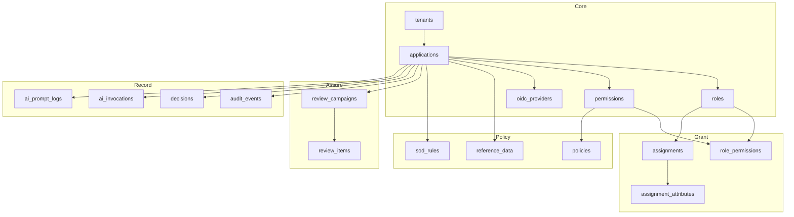
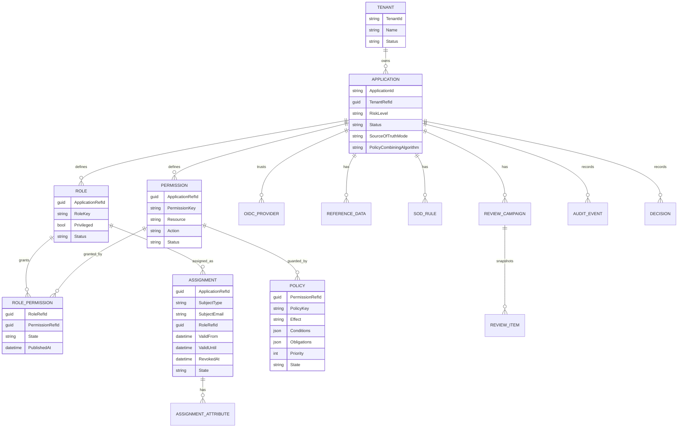
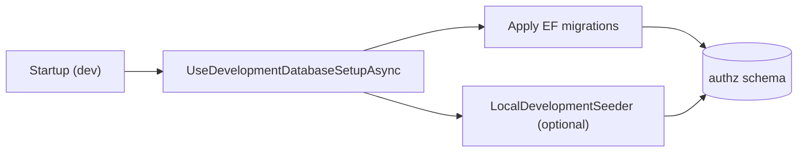

# 14 — Data Model Documentation

> Part of the [Documentation Portal](README.md).
> Related: [Module Design](12_Module_Design.md) · [API Documentation](13_API_Documentation.md) · [Business Rules](19_Business_Rules.md) · [System Architecture](04_System_Architecture.md)

---

## Table of Contents

1. [Purpose & Scope](#purpose--scope)
2. [Storage & Conventions](#storage--conventions)
3. [Shared Base: `AuditedEntity`](#shared-base-auditedentity)
4. [Schema Overview](#schema-overview)
5. [Entity–Relationship Diagram](#entityrelationship-diagram)
6. [Core Configuration Entities](#core-configuration-entities)
7. [Access-Granting Entities](#access-granting-entities)
8. [Policy & Reference Entities](#policy--reference-entities)
9. [Governance-Assurance Entities](#governance-assurance-entities)
10. [Record & Telemetry Entities](#record--telemetry-entities)
11. [Keys, Constraints & Indexes](#keys-constraints--indexes)
12. [Migrations & Seeding](#migrations--seeding)
13. [Cross-References](#cross-references)

---

## Purpose & Scope

Documents the persistence model implemented in
[AuthorizationDbContext.cs](../backend/src/Authorization.Infrastructure/Persistence/AuthorizationDbContext.cs)
and [AuthorizationEntities.cs](../backend/src/Authorization.Infrastructure/Persistence/AuthorizationEntities.cs).
It is the reference for the tables, columns, keys, constraints, indexes, and relationships that back
the control plane — everything needed to reason about queries, migrations, and data integrity without
reading the mapping code.

The model is **EF Core code-first**: the C# entity classes plus the fluent configuration in
`OnModelCreating` are the source of truth, and the physical schema is produced by EF Core migrations.
The context registers **17 `DbSet`s**, one per entity:

- **13 configuration/governance entities** inherit the shared [`AuditedEntity`](#shared-base-auditedentity)
  base (audit columns + optimistic-concurrency token) and are mutable through the governance APIs.
- **4 record/telemetry entities** — `audit_events`, `decisions`, `ai_invocations`, `ai_prompt_logs` —
  are **append-only**: they do not inherit `AuditedEntity`, carry their own primary keys, and are
  never updated after insert.

## Storage & Conventions

| Aspect | Convention |
|--------|-----------|
| Engine | PostgreSQL (Npgsql provider) |
| Schema | All tables live in the `authz` schema (`HasDefaultSchema("authz")`) |
| Naming | Tables and columns are `snake_case` (e.g. `role_permissions.application_ref_id`); C# properties are `PascalCase` |
| Primary keys | `Guid` (`uuid`), server-defaulted with `gen_random_uuid()` — except `decisions.decision_id`, a client-supplied `text` id from the runtime engine |
| Foreign keys | Named `*_ref_id` (`Guid`) — e.g. `application_ref_id`, `role_ref_id`, `permission_ref_id` |
| Timestamps | `timestamptz` (`DateTimeOffset`); `created_at`/`timestamp`/`valid_from` default to `now()` |
| JSON | Structured columns use `jsonb`; multi-value scalar columns use PostgreSQL arrays (`text[]`) |
| Enums | Modelled as `text` columns guarded by `CHECK` constraints (no native PostgreSQL enum types) |
| Migrations | EF Core migrations under [Persistence/Migrations](../backend/src/Authorization.Infrastructure/Persistence/Migrations/) |

## Shared Base: `AuditedEntity`

The 13 configuration/governance entities inherit
[`AuditedEntity`](../backend/src/Authorization.Infrastructure/Persistence/AuthorizationEntities.cs),
which contributes the following columns to every such table (configured once in
`ConfigureAuditedEntity`):

| Column | Type | Default | Purpose |
|--------|------|---------|---------|
| `id` | `uuid` | `gen_random_uuid()` | Primary key |
| `created_at` | `timestamptz` | `now()` | Row creation time |
| `created_by` | `text` | `"system"` (required) | Actor that created the row |
| `updated_at` | `timestamptz` | *null* | Last mutation time |
| `updated_by` | `text` | *null* | Actor of the last mutation |
| `version` | `int` | `1` | **Optimistic-concurrency token** (`IsConcurrencyToken()`) — incremented on each update; a stale write fails with a concurrency exception surfaced as `409` |

The `version` column is a plain integer, **not** a PostgreSQL `xmin` system column. Audit columns are
populated by the governance controllers (see [Module Design](12_Module_Design.md)), and every mutation
is additionally recorded as an `audit_events` row in the same transaction.

## Schema Overview

## Entity–Relationship Diagram

> **Referential integrity note:** solid relationships above are enforced database foreign keys (see
> [Keys, Constraints & Indexes](#keys-constraints--indexes)). The `records` relationships to
> `AUDIT_EVENT` and `DECISION` are **logical only** — those append-only tables reference the owning
> application by the `application_id` **string** (the business key), not by an enforced FK, so history
> is retained even if an application row is later removed. The AI telemetry tables (`ai_invocations`,
> `ai_prompt_logs`) similarly carry a nullable `application_id` string with no FK.

## Core Configuration Entities

These five entities form the ownership hierarchy `tenant → application → { role, permission,
oidc_provider }`. Each has a **unique business key** enforced by an alternate key (see
[Keys, Constraints & Indexes](#keys-constraints--indexes)).

| Entity | Table | Business key | Key fields & notes |
|--------|-------|--------------|--------------------|
| `TenantEntity` | `tenants` | `tenant_id` (unique) | `Name`, `Description?`, `Status` ∈ `ACTIVE`/`DISABLED`/`ARCHIVED`. Root of the ownership hierarchy. |
| `ApplicationEntity` | `applications` | `application_id` (unique) | FK `TenantRefId`; `RiskLevel` ∈ `LOW`/`MEDIUM`/`HIGH`/`CRITICAL`; `Status` ∈ `ACTIVE`/`DISABLED`/`DEPRECATED`/`ARCHIVED` (only `ACTIVE` resolves at runtime); `SourceOfTruthMode` ∈ `PLATFORM_OWNED`/`EXTERNAL_READ`/`DUAL_WRITE`/`EXTERNAL_OWNED`; `PolicyCombiningAlgorithm` ∈ `deny-overrides` (default)/`allow-overrides`/`first-applicable`; ownership metadata `OwnerTeam?`/`BusinessOwner?`/`TechnicalOwner?`. |
| `RoleEntity` | `roles` | `(application_ref_id, role_key)` (unique) | `Name`, `Privileged` (bool, default false), `RiskLevel`, `Status` ∈ `ACTIVE`/`DISABLED`/`DEPRECATED`/`ARCHIVED`. Privileged roles require an expiry when assigned. |
| `PermissionEntity` | `permissions` | `(application_ref_id, permission_key)` (unique) | The runtime unit of access; `PermissionKey` is the dotted `resource.action` form (e.g. `price.publish`) with separate `Resource`+`Action` columns; `RiskLevel`, `Status` (same 4-value vocabulary as roles). |
| `OidcProviderEntity` | `oidc_providers` | FK `application_ref_id` | Authenticates runtime callers: `Issuer`, `Audience`, `JwksUri`, `AllowedAlgorithms[]` (default `['RS256']`; `none` forbidden by check constraint), `RequiredScopes[]`, `RequiredClaims` (`jsonb`), `ClaimMappings` (`jsonb`), `SubjectType` (default `USER`), `SubjectClaim` (default `sub`), `Enabled`, `VersionId`. |

## Access-Granting Entities

These entities connect subjects to roles and enrich them with attributes. They are what the runtime
engine reads (published mappings + active assignments) to reach a decision.

| Entity | Table | Notes |
|--------|-------|-------|
| `RolePermissionEntity` | `role_permissions` | Maps a role to a permission. `State` ∈ `DRAFT`/`REVIEW`/`APPROVED`/`PUBLISHED` — **only `PUBLISHED` mappings authorize at runtime**. Columns: FK `RoleRefId`, FK `PermissionRefId`, FK `ApplicationRefId`, `VersionId`, `ValidFrom?`, `PublishedAt?`. |
| `AssignmentEntity` | `assignments` | Grants a role to a subject. `SubjectType` (see constraint); `SubjectEmail?`/`GroupId?`; FK `RoleRefId`; optional `ResourceType?`/`ResourceId?` narrowing scope; validity window `ValidFrom` (default `now()`)/`ValidUntil?`/`RevokedAt?`; `State` ∈ `ACTIVE`/`EXPIRED`/`REVOKED`; `Source` ∈ `MANUAL`/`IMPORT`/`WORKFLOW`/`LIFECYCLE`/`EMERGENCY`; `Reason?`. The `subject_type` constraint permits `USER`, `GROUP`, `SERVICE_ACCOUNT`, `EXTERNAL_USER`, `TENANT`, `APPLICATION` (USER and SERVICE_ACCOUNT are the functional norm). |
| `AssignmentAttributeEntity` | `assignment_attributes` | ABAC attributes a policy reads as `subject.<name>`: FK `AssignmentId`, `Name`, `Value` (`jsonb`), `ValueType` ∈ `string`/`number`/`boolean`/`string[]`/`number[]`. Unique per `(assignment_id, name)`; **cascade-deleted** with its assignment. |

## Policy & Reference Entities

| Entity | Table | Notes |
|--------|-------|-------|
| `PolicyEntity` | `policies` | An ABAC rule bound to a permission (FK `PermissionRefId`). `PolicyKey`; `Effect` ∈ `ALLOW`/`DENY`; `Conditions` (`jsonb`); `Obligations` (`jsonb` array, default `[]`); `Priority` (int, default 0 — used by `first-applicable` and as an obligation tie-breaker); `State` ∈ `DRAFT`/`REVIEW`/`APPROVED`/`PUBLISHED` (**only `PUBLISHED` applies at runtime**); `VersionId`; `PublishedAt?`. Unique per `(application_ref_id, policy_key, version_id)`. |
| `ReferenceDataEntity` | `reference_data` | Named application-scoped `jsonb` documents that policy conditions reference via `reference.<key>` instead of hard-coding values. `Key` (unique per application), `Value` (`jsonb`, e.g. `["US","CA"]`), `Status` ∈ `ACTIVE`/`ARCHIVED` (soft-delete). |
| `SodRuleEntity` | `sod_rules` | Separation-of-duties: a pair of permission matchers `MatcherA`/`MatcherB` (`jsonb`, each `{ permissionKey?, resource?, action? }`) that must not be held together; `RuleKey` (unique per application), `Name`, `Rationale?`, `Severity` ∈ `LOW`/`MEDIUM`/`HIGH`/`CRITICAL`, `Status` ∈ `ACTIVE`/`DISABLED`/`ARCHIVED`. |

## Governance-Assurance Entities

| Entity | Table | Notes |
|--------|-------|-------|
| `ReviewCampaignEntity` | `review_campaigns` | An access-recertification campaign scoped to one application (FK `ApplicationRefId`). `Status` ∈ `DRAFT`/`ACTIVE`/`CLOSED`; `Name`, `DueAt?`. Activating snapshots in-scope active assignments into `review_items`; finalising applies approved REVOKEs through the audited revoke path. |
| `ReviewItemEntity` | `review_items` | One reviewable item; FK `CampaignRefId` (**cascade-deleted** with its campaign) and `AssignmentRefId`. Subject/role are **denormalised** (`SubjectEmail`/`RoleKey`) so the worklist stays stable if the assignment later changes. `Decision` ∈ `PENDING`/`KEEP`/`REVOKE`/`NEEDS_INFO` with `DecisionNote?`/`DecidedAt?`/`DecidedBy?`. |

## Record & Telemetry Entities

These four entities are **append-only** — inserted once and never updated. They do not inherit
`AuditedEntity`; each defines its own primary key.

| Entity | Table | Primary key | Notes |
|--------|-------|-------------|-------|
| `AuditEventEntity` | `audit_events` | `event_id` (`gen_random_uuid()`) | Immutable governance audit trail written in the same transaction as each mutation: `EventType`, `ApplicationId?`, `ActorEmail?`, `ActorRole?`, `ActorClientId?`, `TargetSubjectEmail?`, `SourceIp?` (`inet`), `OldValue?`/`NewValue?` (`jsonb`), `Reason?`, `CorrelationId?`, `Timestamp`. Event types enumerated in [AuditEventTypes.cs](../backend/src/Authorization.Api/Constants/AuditEventTypes.cs). |
| `DecisionEntity` | `decisions` | `decision_id` (`text`, **client-supplied** by the runtime engine) | Immutable log of every runtime authorization decision: `ApplicationId`, subject (`SubjectType`/`SubjectEmail?`), resource (`ResourceType`/`ResourceId?`), `Action`, `ContextSnapshot?` (`jsonb`), `Allowed`, `DenyReason?`, `MatchedRoles[]`/`MatchedPermissions[]`/`MatchedPolicies[]` (`text[]`), `Obligations` (`jsonb`), `VersionsUsed` (`jsonb`), `CorrelationId?`, `Timestamp`. |
| `AiInvocationEntity` | `ai_invocations` | `id` (`gen_random_uuid()`) | **Metadata-only** per model call — `Feature`, `Provider`, `Model?`, `Outcome` ∈ `Success`/`Timeout`/`Error`, `LatencyMs`, `PromptTokens?`/`CompletionTokens?`/`TotalTokens?`, `ApplicationId?` (null = platform-scoped). Stores **no** prompt/response content or reversible PII. |
| `AiPromptLogEntity` | `ai_prompt_logs` | `id` (`gen_random_uuid()`) | The exact admin **prompt text** plus `Outcome` ∈ `Succeeded`/`Unmapped`/`ValidationFailed`/`InvalidInput`/`Timeout`/`ModelError`, `ErrorMessage?`, and the model's `Interpretation?` (`jsonb`). Capture gated by `Ai:Logging:CapturePrompts`; reads are admin-gated. |

See [AI Features](15_AI_Features.md) and [Logging & Observability](18_Logging_and_Observability.md).

## Keys, Constraints & Indexes

### Business keys (alternate keys)

Beyond the surrogate `id`, several entities enforce a **unique business key**:

| Table | Unique key |
|-------|-----------|
| `tenants` | `tenant_id` |
| `applications` | `application_id` |
| `roles` | `(application_ref_id, role_key)` |
| `permissions` | `(application_ref_id, permission_key)` |
| `reference_data` | `(application_ref_id, key)` |
| `sod_rules` | `(application_ref_id, rule_key)` |
| `assignment_attributes` | `(assignment_id, name)` (unique index) |
| `policies` | `(application_ref_id, policy_key, version_id)` (unique index) |
| `decisions` | `decision_id` (unique index) |

### Check constraints

Enum-like columns are `text` guarded by `CHECK` constraints:

| Constraint | Column | Allowed values |
|-----------|--------|----------------|
| `ck_tenants_status` | `tenants.status` | `ACTIVE`, `DISABLED`, `ARCHIVED` |
| `ck_applications_status` | `applications.status` | `ACTIVE`, `DISABLED`, `DEPRECATED`, `ARCHIVED` |
| `ck_applications_risk_level` | `applications.risk_level` | `LOW`, `MEDIUM`, `HIGH`, `CRITICAL` |
| `ck_applications_source_of_truth_mode` | `applications.source_of_truth_mode` | `PLATFORM_OWNED`, `EXTERNAL_READ`, `DUAL_WRITE`, `EXTERNAL_OWNED` |
| `ck_applications_policy_combining_algorithm` | `applications.policy_combining_algorithm` | `deny-overrides`, `allow-overrides`, `first-applicable` |
| `ck_oidc_providers_provider_type` | `oidc_providers.provider_type` | `OIDC` |
| `ck_oidc_providers_no_alg_none` | `oidc_providers.allowed_algorithms` | must **not** contain `none` |
| `ck_roles_status` / `ck_permissions_status` | `roles.status` / `permissions.status` | `ACTIVE`, `DISABLED`, `DEPRECATED`, `ARCHIVED` |
| `ck_roles_risk_level` / `ck_permissions_risk_level` | `*.risk_level` | `LOW`, `MEDIUM`, `HIGH`, `CRITICAL` |
| `ck_role_permissions_state` | `role_permissions.state` | `DRAFT`, `REVIEW`, `APPROVED`, `PUBLISHED` |
| `ck_assignments_subject_type` | `assignments.subject_type` | `USER`, `GROUP`, `SERVICE_ACCOUNT`, `EXTERNAL_USER`, `TENANT`, `APPLICATION` |
| `ck_assignments_source` | `assignments.source` | `MANUAL`, `IMPORT`, `WORKFLOW`, `LIFECYCLE`, `EMERGENCY` |
| `ck_assignments_state` | `assignments.state` | `ACTIVE`, `EXPIRED`, `REVOKED` |
| `ck_assignment_attributes_value_type` | `assignment_attributes.value_type` | `string`, `number`, `boolean`, `string[]`, `number[]` |
| `ck_policies_effect` | `policies.effect` | `ALLOW`, `DENY` |
| `ck_policies_state` | `policies.state` | `DRAFT`, `REVIEW`, `APPROVED`, `PUBLISHED` |
| `ck_reference_data_status` | `reference_data.status` | `ACTIVE`, `ARCHIVED` |
| `ck_sod_rules_severity` | `sod_rules.severity` | `LOW`, `MEDIUM`, `HIGH`, `CRITICAL` |
| `ck_sod_rules_status` | `sod_rules.status` | `ACTIVE`, `DISABLED`, `ARCHIVED` |
| `ck_review_campaigns_status` | `review_campaigns.status` | `DRAFT`, `ACTIVE`, `CLOSED` |
| `ck_review_items_decision` | `review_items.decision` | `PENDING`, `KEEP`, `REVOKE`, `NEEDS_INFO` |

### Foreign keys & delete behavior

Every relationship is a required FK to the owning row. Deletes use **`Restrict`** (a parent cannot be
deleted while children exist) **except** the two child tables owned by their parent, which use
**`Cascade`**:

- `assignment_attributes.assignment_id → assignments.id` — **Cascade**
- `review_items.campaign_ref_id → review_campaigns.id` — **Cascade**

All other FKs (`applications→tenants`; `roles`/`permissions`/`oidc_providers`/`policies`/`sod_rules`/
`reference_data`/`review_campaigns`/`assignments`/`role_permissions`→`applications`;
`role_permissions`→`roles`/`permissions`; `assignments`→`roles`) are `Restrict`.

### Indexes

Indexes are tuned for the two dominant access patterns — runtime resolution (per application, by
state) and governance list/audit views (per application/actor, newest-first):

| Table | Indexes |
|-------|---------|
| `applications` | `tenant_ref_id` |
| `roles`, `permissions`, `oidc_providers`, `sod_rules`, `review_campaigns` | `application_ref_id` |
| `review_items` | `campaign_ref_id` |
| `role_permissions` | `(application_ref_id, role_ref_id, state, published_at)`, `(application_ref_id, permission_ref_id, state)` |
| `assignments` | `(application_ref_id, subject_email, state, valid_from, valid_until)`, `(application_ref_id, role_ref_id, state)` |
| `reference_data` | `(application_ref_id, status)` |
| `policies` | unique `(application_ref_id, policy_key, version_id)`, `(application_ref_id, permission_ref_id, state, published_at)` |
| `audit_events` | `(application_id, timestamp desc)`, `(actor_email, timestamp desc)` |
| `decisions` | `(application_id, timestamp desc)`, unique `decision_id`, `(subject_email, timestamp desc)` |
| `ai_invocations` | `timestamp desc`, `(feature, timestamp desc)` |
| `ai_prompt_logs` | `timestamp desc`, `(feature, timestamp desc)`, `(outcome, timestamp desc)` |

Runtime resolution queries use `AsNoTracking()` reads for performance
([EfAuthorizationPolicyEngine.cs](../backend/src/Authorization.Infrastructure/RuntimeAuthorization/EfAuthorizationPolicyEngine.cs)).

## Migrations & Seeding

- **Migrations:** EF Core migrations live under [Persistence/Migrations](../backend/src/Authorization.Infrastructure/Persistence/Migrations/);
  the design-time [AuthorizationDbContextFactory.cs](../backend/src/Authorization.Infrastructure/Persistence/AuthorizationDbContextFactory.cs)
  lets the EF CLI build the context outside the host.
- **Startup (dev):** `UseDevelopmentDatabaseSetupAsync` applies migrations and (optionally) runs the
  seeder before the request pipeline starts.
- **Local seeding:** [LocalDevelopmentSeeder.cs](../backend/src/Authorization.Infrastructure/Persistence/LocalDevelopmentSeeder.cs)
  provisions two tenants (`squad-1`, `squad-2`) and four applications — `pricing-management` (HIGH),
  `intelligence-authoring` (MEDIUM), `market-reference` (LOW), `lng-edge` (HIGH) — each with roles
  (some privileged), permissions, **published** role–permission mappings, assignments, policies, and a
  per-application service-account OIDC provider (`pricing-management` also gets a user-facing provider).

## Cross-References

- Entities exposed by APIs: [API Documentation](13_API_Documentation.md)
- Rules constraining state transitions: [Business Rules](19_Business_Rules.md)
- Backend module owning persistence: [Module Design](12_Module_Design.md)
