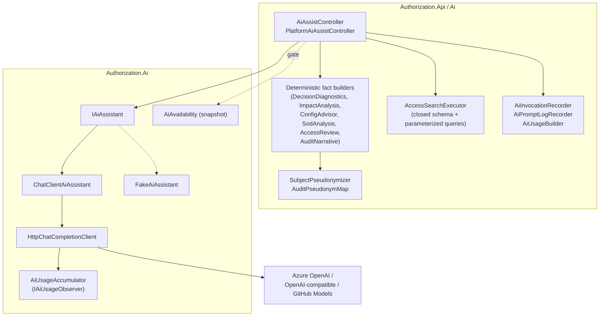
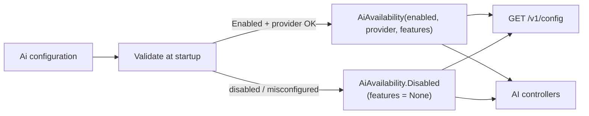
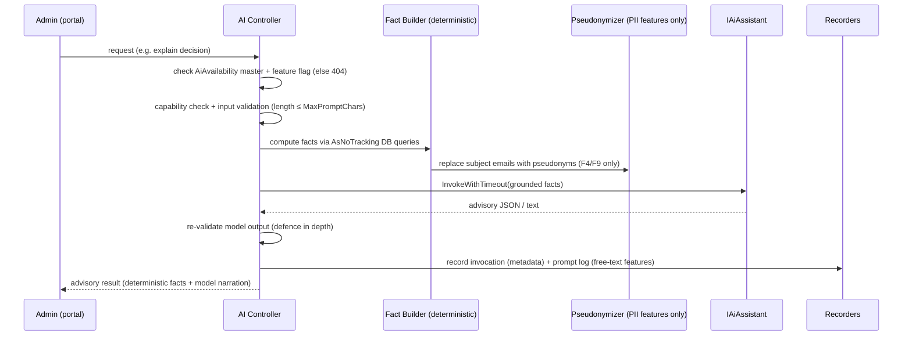
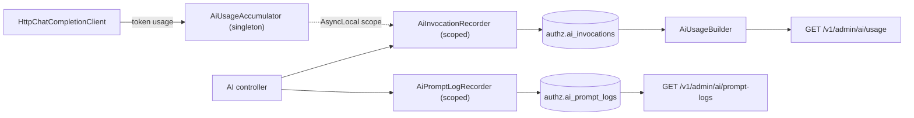

# 15 — AI Features

> Part of the [Documentation Portal](README.md).
> Related: [Feature Documentation](08_Feature_Documentation.md) · [Security Design](16_Security_Design.md) · [Configuration](20_Configuration.md) · [Logging & Observability](18_Logging_and_Observability.md)

---

## Table of Contents

1. [Purpose & Scope](#purpose--scope)
2. [Design Principles](#design-principles)
3. [Architecture](#architecture)
4. [Providers & Transport](#providers--transport)
5. [Availability & Feature Gating](#availability--feature-gating)
6. [Feature Catalog](#feature-catalog)
7. [Request Processing Pipeline](#request-processing-pipeline)
8. [Prompt Construction & Model Contract](#prompt-construction--model-contract)
9. [Guardrails & Validation](#guardrails--validation)
10. [PII Protection](#pii-protection)
11. [Configuration Reference](#configuration-reference)
12. [Observability & Telemetry](#observability--telemetry)
13. [Error Handling & Resilience](#error-handling--resilience)
14. [Cross-References](#cross-references)

---

## Purpose & Scope

The control plane ships an **optional, opt-in AI advisory layer** that helps administrators author
policies, understand decisions, review access, and generate compliance narratives. This document
describes its architecture, the individual features, how providers are selected, how prompts are
constructed and grounded, and — most importantly — the guardrails that keep AI **strictly advisory**.

The defining rule, stated in the interface itself, is that **AI output never participates in the
authorization enforcement path**. The deterministic policy engine ([Runtime Authorization API](13_API_Documentation.md#runtime-authorization-api))
always decides; the model only ranks, explains, drafts, or summarizes facts that the API layer has
already computed. Turning AI off (the default) leaves the product fully functional.

All statements here are grounded in two assemblies:

- **[Authorization.Ai](../backend/src/Authorization.Ai/)** — the provider-neutral assistant
  abstraction ([IAiAssistant.cs](../backend/src/Authorization.Ai/IAiAssistant.cs)), the live HTTP
  chat client, the deterministic stub, options, and the availability snapshot. It has **no**
  database, HTTP-context, or persistence dependency.
- **[Authorization.Api/Ai](../backend/src/Authorization.Api/Ai/)** — the API-side deterministic
  **fact builders**, the closed-schema access-search executor, the pseudonymizer, and the telemetry
  recorders, driven by two controllers
  ([AiAssistController.cs](../backend/src/Authorization.Api/Controllers/AiAssistController.cs),
  [PlatformAiAssistController.cs](../backend/src/Authorization.Api/Controllers/PlatformAiAssistController.cs)).

## Design Principles

The `IAiAssistant` contract encodes five principles that every feature obeys:

1. **Advisory only.** The enforcement path never resolves or calls `IAiAssistant`. Only the advisory
   controllers do, and nothing the model returns is ever persisted automatically or used to make an
   authorization decision.
2. **Facts are computed deterministically.** For every feature the API layer computes the ground
   truth — decision diagnostics, publish blast-radius counts/flips, governance findings, review
   recommendations, audit aggregates — and the model only narrates or prioritizes it. The
   deterministic result stays authoritative even if the model is unavailable or returns nonsense.
3. **Grounded generation.** Access search and SoD/policy drafting receive the application's **real
   vocabulary** (permission keys, resources, actions, role keys) and a **closed schema**. The model
   must never invent fields or emit SQL; the API validates every value it returns against live data.
4. **No PII to the model.** The two PII-sensitive features (access review, audit narrative) replace
   subject emails with pseudonymous labels before any prompt is sent (see [PII Protection](#pii-protection)).
5. **Human-in-the-loop.** Drafts (policies, SoD rules) are suggestions only; a human reviews,
   possibly edits, and explicitly accepts them before anything is persisted.

## Architecture

The AI subsystem is split cleanly across the two assemblies. `Authorization.Ai` knows how to talk to
a model but nothing about the domain database; `Authorization.Api/Ai` knows the domain, computes all
facts, and enforces the guardrails.

Key structural facts:

- **`IAiAssistant`** has one method per feature. The concrete implementation is either
  `ChatClientAiAssistant` (live) or `FakeAiAssistant` (deterministic stub), chosen by configuration.
- **Fact builders** live entirely on the API side and query the database with `AsNoTracking()`. The
  model receives their output, never raw database access.
- **`AiAvailability`** is an immutable startup snapshot injected everywhere; it is the single gate
  consulted by both controllers and the config endpoint.
- When AI is **disabled**, no `IAiAssistant` is registered at all, so the controllers resolve it as
  `null` (via `serviceProvider.GetService`) rather than failing construction.

## Providers & Transport

The provider is selected by `Ai:Provider`
([AiOptions.cs](../backend/src/Authorization.Ai/AiOptions.cs)); the three accepted values are defined
in `AiProviders`:

| Provider | Implementation | Behaviour |
|----------|----------------|-----------|
| `AzureOpenAI` | `ChatClientAiAssistant` → `HttpChatCompletionClient` | Live model via an Azure OpenAI resource. Calls `{Endpoint}/openai/deployments/{ChatDeployment}/chat/completions?api-version=...` with an `api-key` header. |
| `OpenAI` | `ChatClientAiAssistant` → `HttpChatCompletionClient` | Live model via any OpenAI-compatible endpoint (also used for **GitHub Models** in development). Calls `{Endpoint}/chat/completions` with a `Bearer` token and the model in the request body. |
| `Fake` | [FakeAiAssistant.cs](../backend/src/Authorization.Ai/FakeAiAssistant.cs) | Deterministic, model-free, keyless in-process stub for tests and offline development. |

> **Defaults.** AI is **off by default** (`Ai:Enabled = false`). The `AiOptions.Provider` property
> defaults to `AzureOpenAI` in code, but the shipped local configuration
> ([appsettings.Development.json](../backend/src/Authorization.Api/appsettings.Development.json))
> selects `Provider: "Fake"` with `Enabled: false`, so a fresh checkout runs with no key and no model.

**Transport.** [HttpChatCompletionClient.cs](../backend/src/Authorization.Ai/Providers/HttpChatCompletionClient.cs)
is a deliberately small, dependency-light client over the two OpenAI-compatible wire dialects — no
preview SDK. It always requests `response_format: { "type": "json_object" }` so the model returns
strict JSON. The **API key is never logged**. Two toggles adapt it to reasoning-style deployments
(e.g. `gpt-5.5`, o-series) that reject legacy fields:

- `AzureOpenAI:SupportsTemperature = false` → the `temperature` field is omitted entirely so the
  provider applies its own default.
- `AzureOpenAI:SupportsMaxTokens = false` → the request uses `max_completion_tokens` instead of the
  legacy `max_tokens` field.

Registration and graceful configuration validation live in
[AiServiceCollectionExtensions.cs](../backend/src/Authorization.Ai/AiServiceCollectionExtensions.cs).
Registration **never throws**: a misconfigured live provider degrades to disabled rather than
blocking startup.

## Availability & Feature Gating

[AiAvailability.cs](../backend/src/Authorization.Ai/AiAvailability.cs) is an **immutable snapshot
computed once at startup after validating configuration**. It is the single source of truth consulted
by both the config endpoint and the AI controllers, so a misconfigured provider results in AI being
reported (and treated) as disabled rather than crashing.

Validation ([`BuildAvailability`](../backend/src/Authorization.Ai/AiServiceCollectionExtensions.cs))
proceeds as:

- `Ai:Enabled = false` → `AiAvailability.Disabled` (features = `None`).
- Provider `Fake` → always considered configured (needs no endpoint/key).
- Provider `AzureOpenAI`/`OpenAI` → requires non-empty `Endpoint`, `ApiKey`, and `ChatDeployment`;
  each missing value is collected as a config error and the whole surface degrades to disabled.
- Unknown provider name → disabled, with a descriptive error.

Any collected config errors are logged once at startup by
[AiStartupLogger.cs](../backend/src/Authorization.Ai/AiStartupLogger.cs) (which also logs the
effective per-feature state, and **never logs secrets**).

**Per-feature gating.** `AiFeatureAvailability` carries one boolean per feature, taken from
`Ai:Features:*:Enabled`. Every controller action re-checks the master switch **and** its own feature
flag before doing any work; when the check fails the endpoint responds **`404 Not Found`** so the
surface is effectively absent (the portal hides these surfaces accordingly). A subtlety worth noting:
the fully deterministic sub-features — the config-advisor **findings** list, the SoD **violations**
and **rules** list, the raw access-**review** and audit-**narrative** feeds — require only the
feature flag, not a live model, so they still work in `Fake` mode (returning the deterministic data
with an empty AI summary).

**Config endpoint.** [ConfigController.cs](../backend/src/Authorization.Api/Controllers/ConfigController.cs)
(`GET /v1/config`) surfaces the availability snapshot to the portal: `Enabled`, `Provider` (only when
enabled), `Model` (only for live providers — never for `Fake`), the per-feature flags, the
per-feature temperatures, and the non-sensitive limits. **The API key is never part of this
response.**

## Feature Catalog

`IAiAssistant` defines **eight** advisory features. The internal method IDs deliberately skip **F3**
— there is no third feature; the eight below are the complete set and match the `Ai:Features:*`
configuration keys and the `features` block of `GET /v1/config`.

| ID | Method | Feature flag | What the model does | What stays deterministic |
|----|--------|--------------|---------------------|--------------------------|
| F1 | `DraftPolicyAsync` | `policyAuthoring` | Translates NL → a draft condition-tree JSON + summary + warnings + a suggested effect | Human validates & persists; the condition schema |
| F2 | `ExplainDecisionAsync` | `decisionExplainer` | Explains an already-made decision and (for denials) lists remediation steps | The decision itself + DB-grounded diagnostics |
| F4 | `SummarizeAccessReviewAsync` | `accessCertification` | Overall summary + one-line rationale per item (pseudonymized) | The keep/revoke/review recommendation per item |
| F5 | `NarrateImpactAsync` | `impactAnalysis` | Narrates the publish blast radius | Evaluated count + allow↔deny flips from shadow evaluation |
| F6 | `SummarizeFindingsAsync` | `configAdvisor` | Ranks + explains findings, suggests a fix per finding | The findings themselves |
| F7 | `DraftSodRuleAsync` | `sodAnalysis` | Drafts an SoD rule (two grounded permission matchers) + severity | Violation detection; matcher validation & persistence |
| F8 | `PlanAccessSearchAsync` | `accessSearch` | Translates NL → a closed, validated query spec (never SQL) | Schema validation + parameterized execution |
| F9 | `NarrateAuditAsync` | `auditNarrative` | Auditor-ready narrative grouped into sections, each citing real event ids | The events + grouped counts + deny-reason aggregates |

### Endpoint scope

- **Application-scoped** features live under `/v1/admin/applications/{applicationId}/ai/*`
  ([AiAssistController.cs](../backend/src/Authorization.Api/Controllers/AiAssistController.cs)):
  F1 (`policy-draft`), F2 (`explain-decision`), F5 (`impact-analysis`), F6 (`advisor/findings` +
  `advisor/summarize`), F8 (`access-search`), and F7 (`sod/violations`, `sod/rules`,
  `sod/rules/draft`, `POST sod/rules`, `DELETE sod/rules/{ruleKey}`).
- **Platform (cross-application)** features live under `/v1/admin/ai/*`
  ([PlatformAiAssistController.cs](../backend/src/Authorization.Api/Controllers/PlatformAiAssistController.cs)):
  F4 (`access-review/summarize`), F9 (`audit/narrative`), a **platform-wide** variant of F8
  (`access-search`), plus the read-only telemetry surfaces `GET usage` and `GET prompt-logs`.

Access search (F8) therefore exists in **two scopes** that share the single `accessSearch` flag: a
single-application search and a platform search that fans out over every application the caller may
view (capped at 200 aggregated rows). Both controllers guard with the same `AdminApi` policy and then
apply per-application capability checks (`ReadOnlyView` to read, `ManagePolicies` to author,
`ViewAudit` for audit/prompt-log reads). Exact routes and request/response shapes are in
[API Documentation](13_API_Documentation.md#ai-apis).

### SoD (F7) draft-then-save flow

F7 is the clearest illustration of human-in-the-loop: the AI **draft** (`sod/rules/draft`) is
advisory, but persisting a rule goes through a separate deterministic **save** (`POST sod/rules`)
that re-validates independently of the model. A saved rule's two matchers must (a) each reference a
permission key / resource / action that **exists** in the application's real vocabulary and (b) be
**different** from each other, or the save is rejected `422`. Deleting a rule (`DELETE
sod/rules/{ruleKey}`) is a **soft-delete** (archived) so authoring history is preserved; re-saving the
same key reactivates it. Violation detection itself is entirely deterministic and needs no model.

## Request Processing Pipeline

Every AI action follows the same shape: gate → authorize → validate input → compute deterministic
facts → (pseudonymize) → invoke the model under a timeout → record telemetry → return.

- **Timeout wrapper.** `AiInvocationRecorder.InvokeAsync`
  ([AiInvocationRecorder.cs](../backend/src/Authorization.Api/Ai/AiInvocationRecorder.cs)) wraps every
  model call in a linked `CancellationTokenSource` that cancels after
  `Ai:Limits:RequestTimeoutSeconds`, opens a token-usage scope, times the call, and always writes one
  metadata-only invocation row in a `finally` block.
- **Free-text prompt logging.** The three features that accept free text (F1 policy authoring, F7 SoD
  draft, F8 access search) additionally record the prompt, terminal outcome, and the model's
  interpretation via `AiPromptLogRecorder` — including the input/validation failures the metadata log
  cannot see.
- **Defence in depth.** Controllers re-check model output before returning it (for example, the
  policy draft must be valid JSON or the request returns `502` and logs a `ModelError`).

## Prompt Construction & Model Contract

The model is constrained tightly so a bad response can never corrupt state:

- **Strict JSON out.** System prompts instruct the model to emit a single JSON object in an exact
  shape, and the transport requests `response_format: json_object`. Parsing in
  [ChatClientAiAssistant.cs](../backend/src/Authorization.Ai/ChatClientAiAssistant.cs) **degrades
  gracefully**: a malformed or non-JSON reply falls back to a safe default (an empty condition group
  for policy drafts, the raw text as narrative for explainers) rather than throwing.
- **Grounded inputs.** Structured features receive the closed schema and the app's real vocabulary.
  The config advisor is told the findings are ground truth ("never invent, merge, drop, or re-score
  them, and never reference a finding id that is not in the input"); the access-search planner
  receives only an allow-listed set of entities/fields; SoD/policy drafting receive the real
  permission keys.
- **Model output is filtered.** For the config advisor, only per-finding suggestions whose `id`
  matches a real deterministic finding are kept — the model cannot introduce a suggestion for an
  invented issue. For the audit narrative, sections citing unknown event ids are dropped by the
  caller.
- **Some cases skip the model entirely.** When the deterministic facts fully determine the answer,
  the code composes the response directly: impact narration with zero evaluated requests or zero
  flips, and the config advisor with zero findings, both return a deterministic summary without ever
  calling the model — avoiding a misleading "N outcomes change" claim on a change-review surface.
- **Per-feature temperature.** Structured-extraction features (policy, SoD, access-search planning)
  run at temperature `0` for determinism; narrative features (explainer, impact, advisor, review,
  audit) use a small positive value (default `0.2`) for phrasing variety.

## Guardrails & Validation

| Guardrail | Mechanism |
|-----------|-----------|
| AI never decides | The enforcement path never resolves or calls `IAiAssistant`; only advisory controllers do. Nothing the model returns is persisted automatically. |
| No fabricated fields / SQL | Access search returns a **closed query spec** (entity + filters over a fixed field allow-list); [AccessSearchExecutor.cs](../backend/src/Authorization.Api/Ai/AccessSearchExecutor.cs) validates every field/operator and executes with **parameterized** queries. Unmapped questions return friendly "did you mean" guidance, not errors. |
| Filter values resolved against live data | Every planned filter value is resolved against real data before execution, so a mis-cased or invented value becomes a real value or guidance — correctness never depends on the prompt. |
| Grounded vocabulary | SoD/policy drafting may reference only permission keys / resources / actions that exist; saved SoD matchers are re-validated server-side. |
| Bounded input | Free-text prompts are capped at `MaxPromptChars` (rejected `422`); output is capped at `MaxTokens`; each call is bounded by `RequestTimeoutSeconds`. |
| Output re-validation | Controllers re-check model output (e.g. policy JSON validity → `502` on failure) before returning it. |
| Human-in-the-loop | Drafted policies and SoD rules require an explicit, separate human-triggered save. |
| Feature isolation | Independent per-feature availability flags; disabling one never affects the others or the enforcement path. |

## PII Protection

Two features handle subject identities, and each uses a mechanism suited to its needs. In **both**,
no real email address ever leaves the process inside a prompt.

**F4 — access review (`SubjectPseudonymizer`).**
[SubjectPseudonymizer.cs](../backend/src/Authorization.Api/Ai/SubjectPseudonymizer.cs) maps the single
subject under review to a **one-way** token before the summary request is sent. Each email is hashed
with **SHA-256 plus a per-instance 16-byte random salt** to produce a stable `user-xxxxxxxx` token
(8 hex chars). The token is stable within one request (so the model can reference the subject
consistently) yet can never be reversed to the address; review items are keyed by opaque ids the
model echoes back so the API re-associates rationales without ever seeing PII. A blank subject becomes
the generic `unknown-subject` placeholder.

**F9 — audit narrative (`AuditPseudonymMap` + email redaction).** The audit narrative references
*many* actors and targets and must be de-pseudonymized for the authorized auditor, so it uses a
**per-request reversible** map (`AuditPseudonymMap` in
[PlatformAiAssistController.cs](../backend/src/Authorization.Api/Controllers/PlatformAiAssistController.cs)):
each email is replaced with a sequential `person-N` label before the prompt, and the labels are
restored to real emails **only after** the model returns, for the authorized auditor. Additionally,
any email embedded in free-text audit reasons is stripped with a regex (`RedactEmails` → `[email]`)
before it reaches the model, so PII cannot leak even indirectly. This restore/redact behaviour is why
F9 uses a distinct mechanism from F4's one-way hash.

## Configuration Reference

All keys bind from the `Ai` section
([AiOptions.cs](../backend/src/Authorization.Ai/AiOptions.cs)); the API key must come from an
environment variable or secret store and is never committed or logged.

| Key | Default | Meaning |
|-----|---------|---------|
| `Ai:Enabled` | `false` | Master switch. When off, no AI services are registered and every AI endpoint is absent. |
| `Ai:Provider` | `AzureOpenAI` (code) / `Fake` (dev config) | `AzureOpenAI`, `OpenAI`, or `Fake`. |
| `Ai:AzureOpenAI:Endpoint` | *empty* | Resource endpoint or OpenAI-compatible base URL. Required for live providers. |
| `Ai:AzureOpenAI:ApiKey` | *empty* | Secret; required for live providers. Never logged. |
| `Ai:AzureOpenAI:ChatDeployment` | `gpt-4o-mini` | Azure deployment name / OpenAI model. Required for live providers. |
| `Ai:AzureOpenAI:ApiVersion` | `2024-10-21` | Azure API version (Azure dialect only). |
| `Ai:AzureOpenAI:SupportsTemperature` | `true` | Set `false` for reasoning models that reject non-default temperature. |
| `Ai:AzureOpenAI:SupportsMaxTokens` | `true` | Set `false` for reasoning models needing `max_completion_tokens`. |
| `Ai:Features:{Feature}:Enabled` | see below | Per-feature flag. |
| `Ai:Features:{Feature}:Temperature` | `0` (structured) / `0.2` (narrative) | Per-feature sampling temperature. |
| `Ai:Limits:MaxPromptChars` | `4000` | Max characters for the caller's free-text prompt (`422` if exceeded). |
| `Ai:Limits:MaxTokens` | `2048` | Max completion tokens (ceiling, not target). |
| `Ai:Limits:RequestTimeoutSeconds` | `30` | Per-request model-call timeout. |
| `Ai:Limits:Temperature` | `0.2` | Fallback temperature when a feature specifies none. |
| `Ai:Limits:MaxRetries` | `2` | Transient (429/503) retry attempts; honours `Retry-After`. |
| `Ai:Limits:MaxRetryDelaySeconds` | `8` | Upper bound on any single retry wait. |
| `Ai:Logging:CapturePrompts` | `true` | Persist free-text prompts + outcome + interpretation to `ai_prompt_logs`. Set `false` to keep a metadata-only privacy boundary. |

**Code defaults for `Ai:Features:*:Enabled`** ([AiOptions.cs](../backend/src/Authorization.Ai/AiOptions.cs)):
`PolicyAuthoring`, `DecisionExplainer`, `ImpactAnalysis`, `ConfigAdvisor` default **on**;
`AccessSearch`, `SodAnalysis`, `AccessCertification`, `AuditNarrative` default **off** (pending schema
/ PII review). Feature enablement only matters when the master switch is on; see
[Configuration](20_Configuration.md) for full environment-specific values.

## Observability & Telemetry

Two independent, best-effort logs make the advisory surface observable without ever affecting the
advisory result (a logging failure is swallowed).

- **Invocation log (metadata only).** One `AiInvocationEntity` row per model call: feature, actor,
  actor role, application id, provider, model (null for `Fake`), outcome (`Success`/`Timeout`/`Error`),
  latency, and token counts when the provider reports them. **No prompt or response content is
  stored.** Token usage flows from the singleton transport to the currently executing request via an
  `AsyncLocal` scope opened by `AiInvocationRecorder`, so one shared observer attributes usage to
  concurrent requests without per-request wiring.
- **Prompt log (free-text features).** One `AiPromptLogEntity` row per free-text request stores the
  actual prompt (truncated to `MaxPromptChars`), the terminal outcome (`Succeeded`, `Unmapped`,
  `ValidationFailed`, `InvalidInput`, `Timeout`, `ModelError`), an optional error message, and the
  model's interpretation. It deliberately stores prompt text (gated by `Ai:Logging:CapturePrompts`)
  so admins can review failed prompts and improve the logic. Because it exposes prompt text, reads are
  admin-gated (`ViewAudit`) and scoped to the caller's auditable applications; platform-scoped rows
  are visible only to full platform admins.
- **Surfaces.** `GET /v1/admin/ai/usage` (windowed aggregate via `AiUsageBuilder`, `windowDays` 1–90,
  default 30) and `GET /v1/admin/ai/prompt-logs` (always paged, default 25/page, filterable by
  feature/outcome/failures-only) back the portal's **AI Usage** and prompt-review pages.

Both logs persist with `CancellationToken.None` so a row is written even when the originating request
was aborted or timed out. Telemetry storage is described in [Data Model](14_Data_Model_Documentation.md).

## Error Handling & Resilience

- **Startup:** invalid/missing configuration disables AI (`AiAvailability.Disabled`) and logs the
  reason instead of crashing.
- **Disabled feature:** the endpoint responds `404 Not Found` and the portal hides the surface.
- **Input too large:** a prompt over `MaxPromptChars` is rejected `422` (and logged as `InvalidInput`)
  before the model is ever called.
- **Transient throttling:** the transport retries on `429`/`503` up to `MaxRetries`, honouring
  `Retry-After` with bounded exponential backoff clamped to `MaxRetryDelaySeconds`.
- **Payload too large:** a provider `413` is surfaced as `AiPayloadTooLargeException` (retrying the
  same body cannot help — the caller must shrink the prompt).
- **Timeout:** exceeding `RequestTimeoutSeconds` cancels the call, records a `Timeout` outcome, and
  surfaces through the standard error envelope.
- **Unusable model output:** re-validated on return (e.g. non-JSON policy draft → `502`,
  `ModelError`); the deterministic facts are always still returned.
- **Enforcement is never affected:** because AI is entirely off the decision path, none of these
  failure modes can change an authorization outcome. See [Error Handling](17_Error_Handling.md) for
  the shared error envelope.

## Cross-References

- Feature list & portal surfaces: [Feature Documentation](08_Feature_Documentation.md)
- AI API routes & payloads: [API Documentation](13_API_Documentation.md#ai-apis)
- Configuration keys & environments: [Configuration](20_Configuration.md)
- Telemetry storage (`ai_invocations`, `ai_prompt_logs`): [Data Model](14_Data_Model_Documentation.md)
- Security & PII posture: [Security Design](16_Security_Design.md)
- Deterministic enforcement engine: [Runtime Authorization API](13_API_Documentation.md#runtime-authorization-api)
