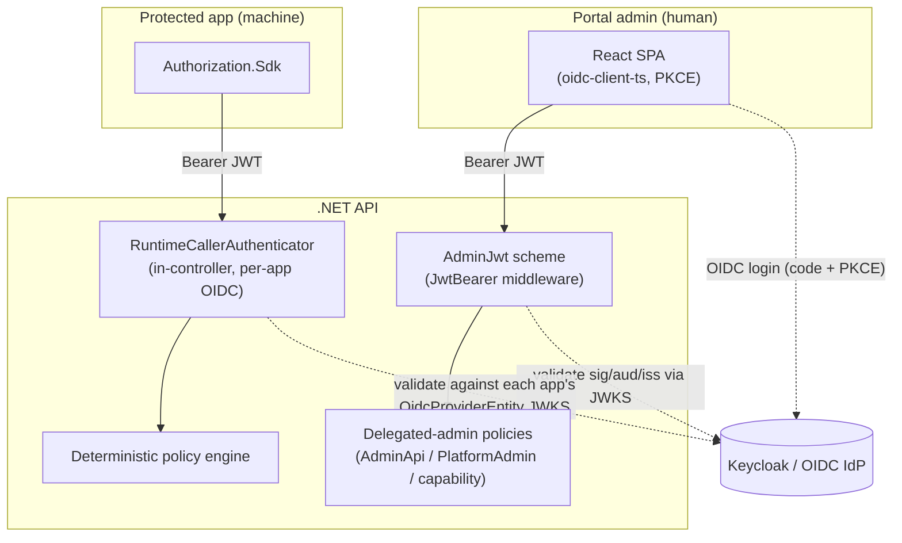
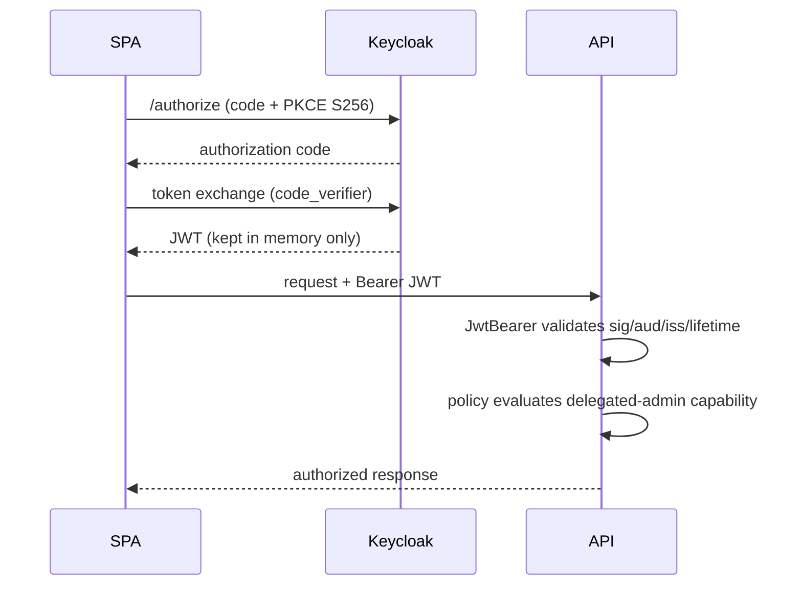
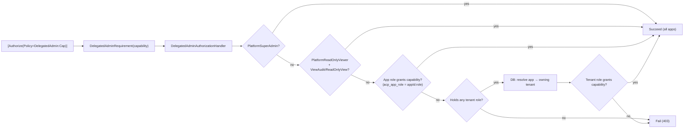

# 16 — Security Design

> Part of the [Documentation Portal](README.md).
> Related: [Non-Functional Requirements](03_Non_Functional_Requirements.md) · [API Documentation](13_API_Documentation.md) · [Error Handling](17_Error_Handling.md) · [Configuration](20_Configuration.md)

---

## Table of Contents

1. [Purpose & Scope](#purpose--scope)
2. [Security Model Overview](#security-model-overview)
3. [Authentication Overview](#authentication-overview)
4. [Portal Admin Authentication (OIDC + PKCE)](#portal-admin-authentication-oidc--pkce)
5. [Runtime Caller Authentication](#runtime-caller-authentication)
6. [Authorization Model (Delegated Admin)](#authorization-model-delegated-admin)
7. [Request Gating & Trust Boundaries](#request-gating--trust-boundaries)
8. [Secrets & Key Management](#secrets--key-management)
9. [Input Validation & Request Limits](#input-validation--request-limits)
10. [Transport Security & CORS](#transport-security--cors)
11. [AI Security Posture](#ai-security-posture)
12. [Threat Model & Mitigations](#threat-model--mitigations)
13. [Cross-References](#cross-references)

---

## Purpose & Scope

This document describes the security architecture of the Authorization Control Plane: how the two
classes of caller are authenticated, how portal administration is authorized, how secrets and tokens
are handled, what input limits protect the API, and the residual threats and their mitigations.

The design rests on three principles, all enforced server-side:

- **Two trust boundaries.** A *human* portal administrator (the React SPA) and a *machine* runtime
  caller (a protected application using the SDK) are authenticated by **different** mechanisms and
  reach **different** surfaces.
- **The server is authoritative.** Every authorization decision — both delegated-admin capability
  checks and the runtime caller's subject — is made from verified server-side data. UI gating and
  request-body hints are conveniences that can never grant access.
- **Least privilege & defense in depth.** Coarse controller-level gates, fine-grained per-capability
  policies, per-application isolation, algorithm restrictions, and bounded inputs are layered so a
  single lapse does not expose the plane.

Every claim below is traced to source under
[Authentication](../backend/src/Authorization.Api/Authentication/) and
[Authorization](../backend/src/Authorization.Api/Authorization/).

## Security Model Overview

The two paths never share a code path: `/v1/admin/*` and `/v1/config` are protected by the ASP.NET
authentication/authorization middleware; `/v1/authorize*` is **self-authenticated inside the
controller** (there is no `[Authorize]` attribute on it) so it can select the correct
per-application trust configuration from the database at request time.

## Authentication Overview

The codebase defines two scheme name constants in
[ApiAuthenticationSchemes.cs](../backend/src/Authorization.Api/Authentication/ApiAuthenticationSchemes.cs),
but only **one** is wired as an actual ASP.NET authentication scheme:

| Surface | How it is authenticated | Registered scheme? |
|---------|-------------------------|--------------------|
| `/v1/admin/*`, `/v1/config` | `AdminJwt` — a standard `JwtBearer` handler registered in [ServiceCollectionExtensions.cs](../backend/src/Authorization.Api/Authentication/ServiceCollectionExtensions.cs) and enforced by the `[Authorize]` policies | **Yes** (`AddJwtBearer(AdminJwt)`) |
| `/v1/authorize`, `/v1/authorize/batch` | Self-managed: [RuntimeAuthorizationController.cs](../backend/src/Authorization.Api/Controllers/RuntimeAuthorizationController.cs) extracts the bearer token itself and validates it with `RuntimeCallerAuthenticator` against the requested application's OIDC provider(s) | **No** — no `[Authorize]`, no middleware scheme |

> **Correction to a common misconception.** `RuntimeClientCredentials` is only a *string constant*;
> it is **not** registered as an authentication scheme and no controller references it. Likewise the
> `RuntimeApi` policy and the static `RuntimeClientCredentialValidator` (+ the `RuntimeClients`
> configuration section it reads) are a **legacy static-secret path retained only for unit tests** —
> they are not part of the live request pipeline. The production runtime path is OIDC-provider based
> (see [Runtime Caller Authentication](#runtime-caller-authentication)).

## Portal Admin Authentication (OIDC + PKCE)

**Identity provider.** Keycloak realm `authorization-local` in local development
(`Oidc:Authority`, default dev authority `http://localhost:8081/realms/authorization-local`);
audience `authorization-api` (`Oidc:Audience`); portal client `authorization-portal`
(`Oidc:PortalClientId` / `VITE_OIDC_CLIENT_ID`).

**Frontend flow** ([auth.ts](../frontend/src/auth.ts), `oidc-client-ts`):

- Authorization-code flow with **PKCE (S256, the library default)**, `response_type=code`, scope
  `openid`.
- **Access/refresh tokens are held in memory only** (`InMemoryWebStorage`), so a successful XSS
  cannot read a persisted admin session and tokens are discarded on reload/tab-close.
- Only the transient **PKCE/auth state** (never the tokens) is parked in per-tab `sessionStorage`, so
  it survives the full-page redirect to Keycloak.
- Sessions are re-established after a reload via a silent `prompt=none` sign-in (`trySilentSignin`);
  `automaticSilentRenew` keeps the token fresh via a hidden iframe.
- In production the `VITE_OIDC_*` build-time variables are **required** (the app fails fast rather
  than silently pointing at a developer's local Keycloak).

**Backend validation** (`AddJwtBearer(AdminJwt)` in
[ServiceCollectionExtensions.cs](../backend/src/Authorization.Api/Authentication/ServiceCollectionExtensions.cs)):

- Validates **audience, issuer, signing key (via JWKS), and lifetime**, and requires signed tokens.
- `RequireHttpsMetadata = false` (dev); an optional `Oidc:MetadataAddress` allows back-channel
  discovery/JWKS on an internal Docker network while still validating the token against the public
  issuer.
- `RoleClaimType = acp_platform_role`, `NameClaimType = preferred_username`.
- Failures produce the framework's standard `401` challenge (these are **not** the `TOKEN_*` codes —
  those belong to the runtime path; see below).

**Delegated-admin role claims**
([DelegatedAdminClaimTypes.cs](../backend/src/Authorization.Api/Authorization/DelegatedAdminClaimTypes.cs)):

| Claim | Meaning | Format |
|-------|---------|--------|
| `acp_platform_role` | Platform-wide role (used by `IsInRole`) | plain role name, e.g. `PlatformSuperAdmin` |
| `acp_app_role` | Application-scoped role | `{applicationId}:{role}` |
| `acp_tenant_role` | Tenant-scoped role | `{tenantId}:{role}` |

## Runtime Caller Authentication

Runtime callers (protected applications) present a bearer JWT that is validated **inside the
controller** by
[RuntimeCallerAuthenticator.cs](../backend/src/Authorization.Api/Authentication/RuntimeCallerAuthenticator.cs)
against the **per-application OIDC provider(s)** (`OidcProviderEntity`) stored in the database. This
lets each application trust its own issuer without any global scheme.

Validation sequence for `POST /v1/authorize`:

1. Load every **enabled** `OidcProviderEntity` whose owning application matches the request
   `applicationId`. None found → `401 CALLER_UNAUTHENTICATED`.
2. For each provider, resolve its JWKS via `IRuntimeSigningKeyResolver`
   (`JwksRuntimeSigningKeyResolver`, an HTTP JWKS fetch) and validate the token with
   [JwtTokenValidator.cs](../backend/src/Authorization.Api/Authentication/JwtTokenValidator.cs):
   issuer, audience, **the provider's `AllowedAlgorithms`**, signing key, and lifetime. The `none`
   algorithm is rejected outright (`TOKEN_ALGORITHM_INVALID`), and inbound claims are not remapped
   (`MapInboundClaims = false`).
3. Enforce the provider's **required-claim binding** (e.g. `azp` = the app's client id).
4. Derive the subject from the provider's configured **subject claim** (default `sub`) and the
   subject **type** from the provider (`USER` vs `SERVICE_ACCOUNT`).

The custom `JwtTokenValidator` produces the typed failure codes `TOKEN_MISSING`,
`TOKEN_ALGORITHM_INVALID`, `TOKEN_AUDIENCE_INVALID`, `TOKEN_ISSUER_INVALID`,
`TOKEN_SIGNATURE_INVALID`, `TOKEN_INVALID`. The authenticator maps its outcome to the caller-facing
codes:

| Situation | Code | HTTP |
|-----------|------|------|
| No/blank token, no providers, or token never validated against any provider | `CALLER_UNAUTHENTICATED` | 401 |
| Token authentic to an issuer but fails the required-claim binding for the app | `CALLER_APPLICATION_MISMATCH` | 403 |
| Token matched but lacks the configured subject claim (wrong token type) | `CALLER_SUBJECT_CLAIM_MISSING` | 403 |

**Critical rule — the token subject is authoritative.** The controller derives the subject from the
verified token; a request-body `subject.email` may only **corroborate** it, never override it. Any
conflicting body subject is rejected with `403 SUBJECT_MISMATCH`
([RuntimeAuthorizationController.cs](../backend/src/Authorization.Api/Controllers/RuntimeAuthorizationController.cs)).
This prevents a compromised or careless caller from impersonating another subject.

## Authorization Model (Delegated Admin)

Portal authorization is **policy-based** with a custom requirement/handler. A controller action
carries `[Authorize(Policy = …)]`; the policy resolves to a `DelegatedAdminRequirement(capability)`
handled by
[DelegatedAdminAuthorizationHandler.cs](../backend/src/Authorization.Api/Authorization/DelegatedAdminAuthorizationHandler.cs),
which delegates the decision to
[DelegatedAdminAuthorizationService.cs](../backend/src/Authorization.Api/Authorization/DelegatedAdminAuthorizationService.cs).

**Building blocks:**

- **Capabilities** ([DelegatedAdminCapability.cs](../backend/src/Authorization.Api/Authorization/DelegatedAdminCapability.cs)):
  `ManageApplication`, `ManageRoles`, `ManagePermissions`, `MapRolePermission`, `ManagePolicies`,
  `AssignRoles`, `ViewAudit`, `ReadOnlyView`.
- **Roles** ([DelegatedAdminRoles.cs](../backend/src/Authorization.Api/Authorization/DelegatedAdminRoles.cs)):
  `PlatformSuperAdmin`, `PlatformReadOnlyViewer`, `ApplicationAdmin`, `ReadOnlyViewer`, `TenantAdmin`,
  `TenantReadOnlyViewer`.
- **Policies** ([DelegatedAdminPolicyNames.cs](../backend/src/Authorization.Api/Authorization/DelegatedAdminPolicyNames.cs)):
  the coarse `AdminApi` (any authenticated admin — the controller-level baseline), `PlatformAdmin`
  (requires the `PlatformSuperAdmin` role), and one `DelegatedAdmin:{Capability}` policy per
  capability. (A `RuntimeApi` policy is also registered but no controller uses it.)

**Role → capability matrix** (from `DelegatedAdminAuthorizationService`):

| Role | Scope | Capabilities granted |
|------|-------|----------------------|
| `PlatformSuperAdmin` | All applications | **All** capabilities |
| `PlatformReadOnlyViewer` | All applications | `ViewAudit`, `ReadOnlyView` |
| `ApplicationAdmin` | Its application | **All** capabilities |
| `ReadOnlyViewer` | Its application | `ViewAudit`, `ReadOnlyView` |
| `TenantAdmin` | Every app in its tenant | **All** capabilities |
| `TenantReadOnlyViewer` | Every app in its tenant | `ViewAudit`, `ReadOnlyView` |

**Evaluation order & tenant scoping.** The handler runs the **cheap claims-only checks first**
(platform role, then application role matched as `applicationId:role`). Only if those fail *and* the
caller actually holds some `acp_tenant_role` does it perform a **single database lookup** to resolve
the application's owning tenant and re-check the tenant-scoped roles — avoiding a DB hit for callers
with no tenant roles. The handler requires an `applicationId` route value, so platform-level
endpoints (tenant/application creation) are gated by the `PlatformAdmin` policy instead.

## Request Gating & Trust Boundaries

| Policy / capability | Representative gated operations |
|---------------------|---------------------------------|
| `AdminApi` (baseline: any authenticated admin) | Read-only list/detail across the admin plane, `GET /v1/config`, audit-event reads |
| `PlatformAdmin` (policy; requires `PlatformSuperAdmin` role) | Create/update/delete **tenants** and create **applications** |
| `ManageApplication` | Update / activate / disable / archive an application; manage its OIDC providers |
| `ManageRoles` | Role CRUD & status |
| `ManagePermissions` | Permission CRUD & status |
| `MapRolePermission` | Map / publish / revoke role–permission mappings |
| `ManagePolicies` | Policy & reference-data CRUD and publish |
| `AssignRoles` | Assignments, break-glass, review campaigns |
| `ViewAudit` | Audit reads (also held by the read-only viewers) |
| `ReadOnlyView` | List / detail reads |

Two boundaries are worth restating explicitly:

- **Server-side gating is the only gate.** The portal hides controls the user cannot use, but that is
  UX only — every mutation re-checks its capability policy on the server.
- **Per-application isolation.** A capability grant is always evaluated against the specific
  `applicationId` in the route; holding `ApplicationAdmin` for app A never authorizes app B.

## Secrets & Key Management

| Concern | Practice | Source |
|---------|----------|--------|
| Browser token storage | **In-memory only** (`InMemoryWebStorage`); only PKCE/auth state in `sessionStorage` | [auth.ts](../frontend/src/auth.ts) |
| AI API key | **Never** returned by `/v1/config` (and never logged) | [ConfigController.cs](../backend/src/Authorization.Api/Controllers/ConfigController.cs) |
| Runtime trust config | Live path uses per-application `OidcProviderEntity` records (issuer/JWKS/audience/allowed algorithms) in the DB — not static secrets | [RuntimeCallerAuthenticator.cs](../backend/src/Authorization.Api/Authentication/RuntimeCallerAuthenticator.cs) |
| Legacy static client secrets | `RuntimeClients` options exist but are consumed only by the test-only `RuntimeClientCredentialValidator` | [RuntimeClientOptions.cs](../backend/src/Authorization.Api/Configuration/RuntimeClientOptions.cs) |
| Dev secrets | Real values live only in a **git-ignored** `deploy/local/.env`; the committed `.env.example` holds placeholders | [deploy/local/README.md](../deploy/local/README.md) |
| Data-protection keys | Persisted to the `api-data-protection` named volume so keys survive container restarts | [docker-compose.yml](../deploy/local/docker-compose.yml) |

## Input Validation & Request Limits

Limits are enforced at the boundary before any expensive work, each returning a specific error code
(see [Error Handling](17_Error_Handling.md)):

| Limit | Value | Enforcement / error |
|-------|-------|---------------------|
| Batch size | ≤ **50** checks | `413 BATCH_TOO_LARGE` ([RuntimeAuthorizationController.cs](../backend/src/Authorization.Api/Controllers/RuntimeAuthorizationController.cs)) |
| Request body | ≤ **256 KB** | `[RequestSizeLimit]` + explicit check → `413 REQUEST_TOO_LARGE` |
| Context JSON | ≤ **32 KB** (serialized) | `422 CONTEXT_TOO_LARGE` |
| Correlation ID | ≤ **128 chars**, charset `[A-Za-z0-9-_.:]` | Over-length/invalid values are dropped for the server trace id ([CorrelationIdMiddleware.cs](../backend/src/Authorization.Api/Observability/CorrelationIdMiddleware.cs)) |
| AI prompt | ≤ **4000 chars** | `422` (see [AI Features](15_AI_Features.md)) |
| Token algorithm | `none` forbidden | Runtime `TOKEN_ALGORITHM_INVALID`; OIDC provider config rejects `none` in `AllowedAlgorithms` (check constraint) |

Governance DTOs additionally use data-annotation attributes plus domain validators; the runtime
subject rule (`SUBJECT_MISMATCH`) and the per-application binding are themselves validation gates.

## Transport Security & CORS

- **HTTPS.** `UseHttpsRedirection()` is enabled in **non-development** environments only
  ([Program.cs](../backend/src/Authorization.Api/Program.cs)); TLS termination in production is a
  deployment concern (reverse proxy / ingress).
- **CORS.** A single `PortalCors` policy allows the origins in `Cors:AllowedOrigins` (default
  `http://localhost:5173`) with any header and method. It does **not** allow credentials — admin auth
  is a **bearer token in the `Authorization` header**, not a cookie, so cookie-based CSRF does not
  apply to the API.
- **Correlation ID.** `CorrelationIdMiddleware` accepts a validated inbound `X-Correlation-ID`
  (bounded as above) or generates one, echoes it on the response, and adds it to the log scope for
  traceability.
- **Middleware order** (`Program.cs`): correlation-id → exception handling → (dev OpenAPI) →
  (prod HTTPS redirect) → CORS → authentication → authorization → controllers.

## AI Security Posture

The AI subsystem is designed to be security-neutral to the enforcement plane. In summary (full detail
in [AI Features](15_AI_Features.md)):

- **Advisory only** — AI is never on the authorization decision path, so no model output can change a
  decision.
- **PII minimization** — the two PII-sensitive features pseudonymize subjects before any prompt (a
  one-way hash for access review; a reversible per-request map plus email redaction for the audit
  narrative), so no real email leaves the process in a prompt.
- **Grounded & bounded** — free-text prompts are length-capped, access-search is a closed,
  parameterized query spec (no model-authored SQL), and the API key is never exposed.

## Threat Model & Mitigations

| Threat (STRIDE) | Vector | Mitigation |
|-----------------|--------|------------|
| **Spoofing** a subject | Caller claims to be another user in the request body | Token subject is authoritative; body mismatch → `403 SUBJECT_MISMATCH` |
| **Spoofing** an application | Caller uses another app's `applicationId` | Token must satisfy that app's OIDC provider binding, else `403 CALLER_APPLICATION_MISMATCH` |
| **Tampering** with tokens | Forged/altered JWT | Signature + issuer + audience + lifetime validation via JWKS; `none` algorithm forbidden |
| **Elevation of privilege** via the UI | Calling a mutation the UI hides | Server-side capability policies re-check every mutation; per-application isolation |
| **Elevation** across applications | `ApplicationAdmin` on app A used on app B | Capability evaluated against the route `applicationId` only |
| **Information disclosure** of secrets | Reading the AI key or admin session | API key omitted from `/v1/config`; tokens memory-only + PKCE |
| **Denial of service** via large payloads | Oversized body/batch/context | `413`/`422` limits enforced before processing |
| **Repudiation** | Disputed admin action | Every mutation writes an `audit_events` row in the same transaction; correlation id propagated |
| **PII exposure** to third parties | Subject data sent to the AI model | Pseudonymization + email redaction before prompts |

## Cross-References

- Delegated-admin capabilities & governance behavior: [Feature Documentation](08_Feature_Documentation.md)
- Runtime enforcement algorithm: [Business Rules](19_Business_Rules.md) · [Runtime Authorization API](13_API_Documentation.md#runtime-authorization-api)
- Error codes returned by the gates above: [Error Handling](17_Error_Handling.md)
- OIDC / CORS / secret configuration keys: [Configuration](20_Configuration.md)
- AI advisory security detail: [AI Features](15_AI_Features.md)
