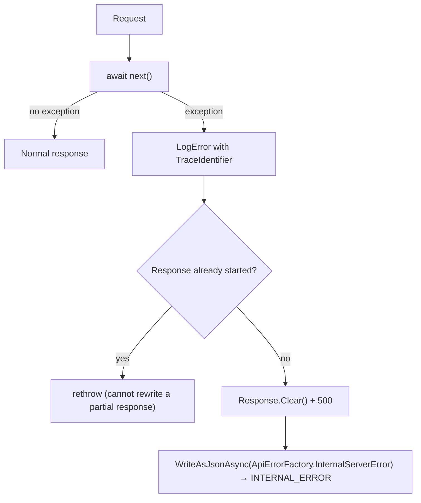
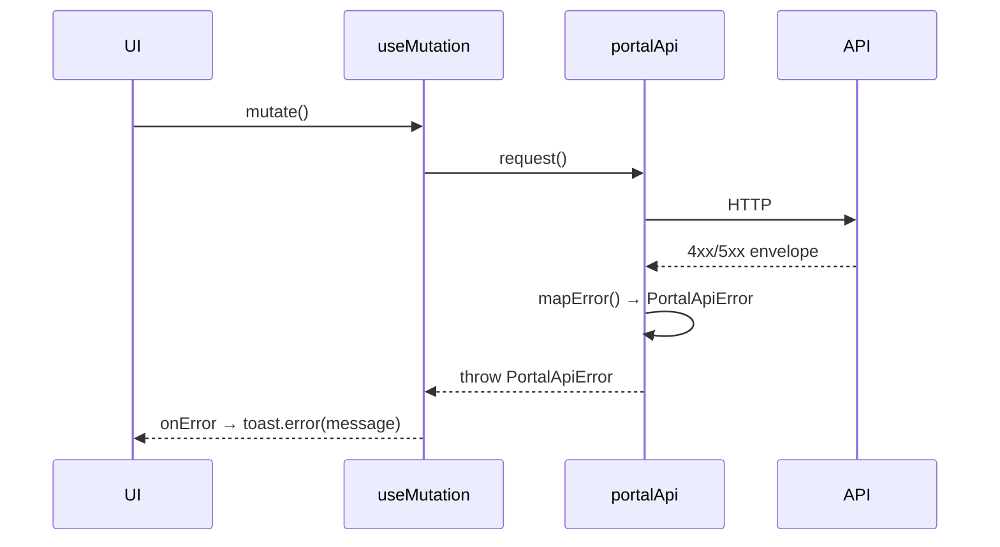

# 17 — Error Handling

> Part of the [Documentation Portal](README.md).
> Related: [API Documentation](13_API_Documentation.md) · [Security Design](16_Security_Design.md) · [Logging & Observability](18_Logging_and_Observability.md) · [Business Rules](19_Business_Rules.md)

---

## Table of Contents

1. [Purpose & Scope](#purpose--scope)
2. [Design Principles](#design-principles)
3. [The Canonical Error Envelope](#the-canonical-error-envelope)
4. [Where Errors Come From](#where-errors-come-from)
5. [Global Exception Handling](#global-exception-handling)
6. [Validation Errors](#validation-errors)
7. [Governance Error Codes & Status Mapping](#governance-error-codes--status-mapping)
8. [Runtime Errors vs. Decision Deny Reasons](#runtime-errors-vs-decision-deny-reasons)
9. [AI Error Handling](#ai-error-handling)
10. [HTTP Status Code Reference](#http-status-code-reference)
11. [Frontend Error Handling](#frontend-error-handling)
12. [Cross-References](#cross-references)

---

## Purpose & Scope

This document describes how errors are **represented, produced, and consumed** across the whole
stack. It covers the single JSON error envelope the API always returns, the code that produces it
(global exception middleware, the model-validation factory, and per-controller helpers), the stable
machine-readable error codes for each subsystem, the HTTP status each maps to, and how the React
portal turns those responses into typed errors and user-facing toasts.

Primary sources: [Errors/](../backend/src/Authorization.Api/Errors/),
[GovernanceErrorCodes.cs](../backend/src/Authorization.Api/Constants/GovernanceErrorCodes.cs),
[EfAuthorizationPolicyEngine.cs](../backend/src/Authorization.Infrastructure/RuntimeAuthorization/EfAuthorizationPolicyEngine.cs),
and the frontend [apiClient.ts](../frontend/src/apiClient.ts).

## Design Principles

- **One envelope everywhere.** Every non-2xx API response — whether a hand-written controller error,
  a framework model-binding failure, or an unhandled exception — is the same `ApiErrorEnvelope`
  shape, so clients parse one thing.
- **Stable machine codes.** `ApiError.Code` values are contract; clients switch on them and the
  string values must not change. Human-readable `message` may change freely.
- **Every error is traceable.** The envelope always carries the request `correlationId`
  (`HttpContext.TraceIdentifier`), which is also echoed in the `X-Correlation-ID` response header and
  the log scope (see [Logging & Observability](18_Logging_and_Observability.md)).
- **Transport errors ≠ decision denies.** A runtime *deny* is a **successful `200`** response with a
  `denyReason`; only malformed/unauthenticated/oversized requests produce a non-2xx error. Confusing
  the two is the most common integration mistake — the two are kept strictly separate below.
- **Fail closed.** Anything unexpected becomes a generic `500 INTERNAL_ERROR` with no internal detail
  leaked; the runtime engine's ultimate fallback is `DENY_BY_DEFAULT`.

## The Canonical Error Envelope

Defined in [ApiErrorEnvelope.cs](../backend/src/Authorization.Api/Errors/ApiErrorEnvelope.cs),
[ApiError.cs](../backend/src/Authorization.Api/Errors/ApiError.cs), and
[ApiErrorDetail.cs](../backend/src/Authorization.Api/Errors/ApiErrorDetail.cs):

```csharp
record ApiErrorEnvelope(ApiError Error, string CorrelationId);
record ApiError(string Code, string Message, IReadOnlyCollection<ApiErrorDetail>? Details = null);
record ApiErrorDetail(string? Field, string Message, string? Code = null);
```

Serialization rules (all fields camel-cased in JSON):

- `correlationId` carries `HttpContext.TraceIdentifier` for support/tracing correlation.
- `Details`, `ApiErrorDetail.Field`, and `ApiErrorDetail.Code` are each annotated
  `JsonIgnoreCondition.WhenWritingNull`, so they are **omitted** from the JSON when null (a simple
  error has no `details` key at all).

**Example — a governance validation failure:**

```json
{
  "error": {
    "code": "VALIDATION_FAILED",
    "message": "The request is invalid.",
    "details": [
      { "field": "roleKey", "message": "Role key is required.", "code": "VALIDATION_FAILED" }
    ]
  },
  "correlationId": "0HN...:00000001"
}
```

**Example — a simple error (no `details`):**

```json
{
  "error": { "code": "ROLE_NOT_FOUND", "message": "Role was not found." },
  "correlationId": "0HN...:00000007"
}
```

## Where Errors Come From

The same envelope is emitted from three distinct places, so it is worth knowing which produces which:

| Producer | Triggered by | Code(s) | Registered / located in |
|----------|-------------|---------|--------------------------|
| `ExceptionHandlingMiddleware` | Any unhandled exception | `INTERNAL_ERROR` (500) | [ExceptionHandlingMiddleware.cs](../backend/src/Authorization.Api/Errors/ExceptionHandlingMiddleware.cs) |
| `InvalidModelStateResponseFactory` | Model-binding / data-annotation failures | `VALIDATION_FAILED` (422) | `AddCanonicalErrorEnvelope()` in [Errors/ServiceCollectionExtensions.cs](../backend/src/Authorization.Api/Errors/ServiceCollectionExtensions.cs) |
| Controller `Error(code, message)` helper | Explicit business/transport checks | Domain codes (409/404/422/403/413/502) | [GovernanceControllerBase.cs](../backend/src/Authorization.Api/Controllers/GovernanceControllerBase.cs) and the runtime/AI controllers |

`AddCanonicalErrorEnvelope()` also registers `ProducesResponseType(ApiErrorEnvelope)` filters for
`401/403/422/500`, so the OpenAPI document advertises the envelope on every operation.

## Global Exception Handling

`ExceptionHandlingMiddleware` wraps the pipeline (registered immediately after the correlation-id
middleware in [Program.cs](../backend/src/Authorization.Api/Program.cs), so the correlation id is
already set when it logs):



The produced envelope has code `INTERNAL_ERROR` and the deliberately generic message
"An unexpected error occurred." — **no exception detail is leaked to the caller**
([ApiErrorFactory.cs](../backend/src/Authorization.Api/Errors/ApiErrorFactory.cs)). The full
exception and stack trace go to the server logs, keyed by the same `TraceIdentifier`. If the response
has already started streaming, the middleware cannot safely rewrite it, so it rethrows.

## Validation Errors

There are **two distinct validation codes**, and they are not interchangeable — a client switching on
the code must handle both:

| Code | Layer | HTTP | Produced by |
|------|-------|------|-------------|
| `VALIDATION_FAILED` | Framework / model-binding | **422** | `InvalidModelStateResponseFactory` → `ApiErrorFactory.ValidationFailed`, one `details[]` entry per invalid field (field = model key) |
| `VALIDATION_ERROR` | Governance domain rules | **422** | Controllers via `Error(GovernanceErrorCodes.ValidationError, …)` and `RequireText(...)` |

- **Model-state (`VALIDATION_FAILED`).** Because `AddCanonicalErrorEnvelope()` overrides
  `InvalidModelStateResponseFactory` to return an `UnprocessableEntityObjectResult`, invalid model
  state is returned as **`422`** (not the ASP.NET default `400`). Each field error becomes an
  `ApiErrorDetail{ field, message, code = VALIDATION_FAILED }`.
- **Domain (`VALIDATION_ERROR`).** Business-rule checks that the framework cannot express use the
  distinct code. `GovernanceControllerBase.RequireText()` rejects blank/whitespace text (the
  framework `[Required]` accepts `"   "`), and the domain validators
  ([PolicyConditionValidator](../backend/src/Authorization.Api/Governance/PolicyConditionValidator.cs),
  [PolicyObligationsValidator](../backend/src/Authorization.Api/Governance/PolicyObligationsValidator.cs),
  [ReferenceDataValueValidator](../backend/src/Authorization.Api/Governance/ReferenceDataValueValidator.cs))
  raise the more specific `POLICY_CONDITIONS_INVALID`, `POLICY_OBLIGATIONS_INVALID`, and
  `REFERENCE_DATA_VALUE_INVALID` — all also `422`.

## Governance Error Codes & Status Mapping

Governance operations surface stable codes from
[GovernanceErrorCodes.cs](../backend/src/Authorization.Api/Constants/GovernanceErrorCodes.cs). The
HTTP status is chosen at each call site (`Conflict(...)`, `NotFound(...)`,
`UnprocessableEntity(...)`, `StatusCode(403, ...)`); the pattern is consistent by suffix:

| Code | HTTP | Meaning / when |
|------|------|----------------|
| `TENANT_EXISTS`, `APPLICATION_EXISTS`, `ROLE_EXISTS`, `PERMISSION_EXISTS`, `ASSIGNMENT_EXISTS`, `REFERENCE_DATA_EXISTS` | **409** | Creating an entity whose unique key already exists |
| `TENANT_IN_USE`, `ROLE_IN_USE`, `PERMISSION_IN_USE` | **409** | Deleting an entity still referenced (e.g. a role with assignments, a permission still granted) |
| `TENANT_NOT_FOUND`, `APPLICATION_NOT_FOUND`, `ROLE_NOT_FOUND`, `PERMISSION_NOT_FOUND`, `ASSIGNMENT_NOT_FOUND`, `ROLE_PERMISSION_NOT_FOUND`, `POLICY_NOT_FOUND`, `REFERENCE_DATA_NOT_FOUND`, `OIDC_PROVIDER_NOT_FOUND` | **404** | Target entity does not exist |
| `VALIDATION_ERROR` | **422** | Domain validation (blank text, out-of-range values, bad dates) |
| `POLICY_CONDITIONS_INVALID`, `POLICY_OBLIGATIONS_INVALID`, `REFERENCE_DATA_VALUE_INVALID` | **422** | Structured governance content failed its validator |
| `POLICY_NOT_EDITABLE` | **422** | Only **draft** policies can be edited/deleted |
| `PRIVILEGED_ASSIGNMENT_REQUIRES_EXPIRY` | **422** | A grant of a **privileged** role must be time-boxed (`validUntil` mandatory) |
| `ASSIGNMENT_REVOKED` | **422** | Attempting to edit an already-revoked assignment (grant a new one instead) |
| `FORBIDDEN` | **403** | Caller authenticated but lacks the delegated-admin capability |

> **`ASSIGNMENT_REVOKED` is overloaded by context.** As a *governance* error it is a `422` (you tried
> to edit a revoked grant). As a *runtime* outcome it is a **deny reason on a `200`** (the subject's
> grant is revoked). See the next section.

## Runtime Errors vs. Decision Deny Reasons

The runtime authorization endpoints (`/v1/authorize`, `/v1/authorize/batch`) distinguish **transport
errors** from **decision denies**. This is the single most important error-handling concept for SDK
integrators.

**Transport errors** — the request could not be processed. Returned as a non-2xx envelope from
[RuntimeAuthorizationController.cs](../backend/src/Authorization.Api/Controllers/RuntimeAuthorizationController.cs):

| Code | HTTP | Meaning |
|------|------|---------|
| `CALLER_UNAUTHENTICATED` | 401 | Missing/invalid runtime token, or no OIDC provider for the app |
| `CALLER_APPLICATION_MISMATCH` | 403 | Token authentic but fails the app's required-claim binding |
| `CALLER_SUBJECT_CLAIM_MISSING` | 403 | Token matched but lacks the provider's configured subject claim |
| `SUBJECT_MISMATCH` | 403 | Body `subject.email` conflicts with the authoritative token subject |
| `BATCH_TOO_LARGE` | 413 | More than 50 checks in one batch |
| `REQUEST_TOO_LARGE` | 413 | Request body larger than 256 KB |
| `CONTEXT_TOO_LARGE` | 422 | Serialized `context` JSON larger than 32 KB |

**Decision deny reasons** — the request was well-formed and the caller authenticated, but the engine
decided **deny**. Returned inside a **`200`** `AuthorizeResponse.denyReason`, in the order the engine
can emit them ([EfAuthorizationPolicyEngine.cs](../backend/src/Authorization.Infrastructure/RuntimeAuthorization/EfAuthorizationPolicyEngine.cs)):

| `denyReason` | Emitted when |
|--------------|--------------|
| `APPLICATION_NOT_FOUND` | The `applicationId` does not resolve to a known application |
| `PERMISSION_NOT_FOUND` | No permission matches the request's `resource.type` + `action` |
| `ASSIGNMENT_REVOKED` | The subject's relevant assignment is revoked (no active grant) |
| `ASSIGNMENT_EXPIRED` | The subject's relevant assignment is past its `validUntil` |
| `NO_ACTIVE_ASSIGNMENT` | The subject has no active assignment in the application at all |
| `PERMISSION_NOT_GRANTED` | The subject's role(s) have no **published** mapping to the permission |
| `EXPLICIT_DENY` | A matching **published** policy evaluates to DENY under the combining algorithm |
| `MISSING_CONTEXT` | A relevant policy needs a context attribute the caller did not supply |
| `DENY_BY_DEFAULT` | Nothing decisive matched under `deny-overrides` (the safe fallback) |

These deny reasons are documented alongside the decision algorithm in
[Business Rules](19_Business_Rules.md) and [Feature Documentation](08_Feature_Documentation.md#runtime-enforcement).

## AI Error Handling

The AI assist controllers ([AiAssistController.cs](../backend/src/Authorization.Api/Controllers/AiAssistController.cs),
[PlatformAiAssistController.cs](../backend/src/Authorization.Api/Controllers/PlatformAiAssistController.cs))
add a few error shapes specific to calling an external model, and record every attempt in the prompt
log regardless of outcome:

| Situation | HTTP | Code | Notes |
|-----------|------|------|-------|
| Feature (or AI) disabled | **404** | `VALIDATION_ERROR` | The endpoint behaves as "not found" when its feature flag is off |
| Caller lacks capability for the app | **403** | `FORBIDDEN` | Same capability model as governance |
| Empty / over-length prompt | **422** | `VALIDATION_ERROR` | Prompt capped at `Ai:Limits:MaxPromptChars` (default 4000) |
| Model returned non-JSON / unusable output | **502** | `VALIDATION_ERROR` | Defence-in-depth: the client is never handed invalid JSON |
| Model call timed out or otherwise failed | **500** | `INTERNAL_ERROR` | The exception is rethrown to the global middleware; the prompt log records the outcome as `Timeout`/`ModelError` |

The corresponding prompt-log outcomes (`Succeeded`, `Timeout`, `ModelError`, `ValidationFailed`,
`InvalidInput`, `Unmapped`) are captured in a `finally` block so telemetry is written even on
failure. Deterministic sub-features (e.g. a zero-impact analysis) are composed without calling the
model at all and therefore cannot fail this way. Full AI detail: [AI Features](15_AI_Features.md).

## HTTP Status Code Reference

Consolidated view of every status the API returns and the codes that map to it:

| HTTP | Used for | Representative codes |
|------|----------|----------------------|
| **200** | Success — including a runtime **deny** (`denyReason` in the body) | — |
| **204** | Successful mutation with no body | — |
| **401** | Unauthenticated runtime caller / missing admin token | `CALLER_UNAUTHENTICATED` (+ framework challenge on admin routes) |
| **403** | Authenticated but not permitted | `FORBIDDEN`, `CALLER_APPLICATION_MISMATCH`, `CALLER_SUBJECT_CLAIM_MISSING`, `SUBJECT_MISMATCH` |
| **404** | Missing resource / disabled AI feature | `*_NOT_FOUND`, AI `VALIDATION_ERROR` (disabled) |
| **409** | Uniqueness / referential conflict | `*_EXISTS`, `*_IN_USE` |
| **413** | Oversized request | `BATCH_TOO_LARGE`, `REQUEST_TOO_LARGE` |
| **422** | Validation / business-rule failure | `VALIDATION_FAILED`, `VALIDATION_ERROR`, `POLICY_*_INVALID`, `POLICY_NOT_EDITABLE`, `PRIVILEGED_ASSIGNMENT_REQUIRES_EXPIRY`, `CONTEXT_TOO_LARGE`, `ASSIGNMENT_REVOKED` |
| **500** | Unhandled exception / AI timeout or model failure | `INTERNAL_ERROR` |
| **502** | AI model returned unusable (non-JSON) output | `VALIDATION_ERROR` |

## Frontend Error Handling

[apiClient.ts](../frontend/src/apiClient.ts) turns every failed HTTP response into a typed
`PortalApiError` (`message`, `code`, `status`, optional `details`) via its `mapError` routine:

| HTTP | Frontend `code` |
|------|-----------------|
| 401 | `UNAUTHORIZED` |
| 403 | `FORBIDDEN` |
| 409 | `CONFLICT` |
| 422 **or** 400 | `VALIDATION` (populates `details` from `error.details`) |
| **any other status** (incl. 404, 413, 500, 502) | `SERVER_ERROR` |
| fetch/connection failure (no response) | `NETWORK` |

> Note the catch-all: there is **no** dedicated frontend code for `404` or `413` — both, along with
> `5xx`, fall through to `SERVER_ERROR`. `NETWORK` is thrown when `fetch` itself rejects (backend
> unreachable), before any status is available.

Failed **mutations** are surfaced to the user as error toasts through the React Query mutation-cache
`onError` handler in [App.tsx](../frontend/src/App.tsx) +
[components/Toast.tsx](../frontend/src/components/Toast.tsx), using the `PortalApiError.message`.



## Cross-References

- Endpoint-by-endpoint status codes: [API Documentation](13_API_Documentation.md)
- Deny reasons within the decision algorithm: [Business Rules](19_Business_Rules.md)
- Error codes from the auth gates (401/403): [Security Design](16_Security_Design.md)
- Correlation-id propagation & where exceptions are logged: [Logging & Observability](18_Logging_and_Observability.md)
