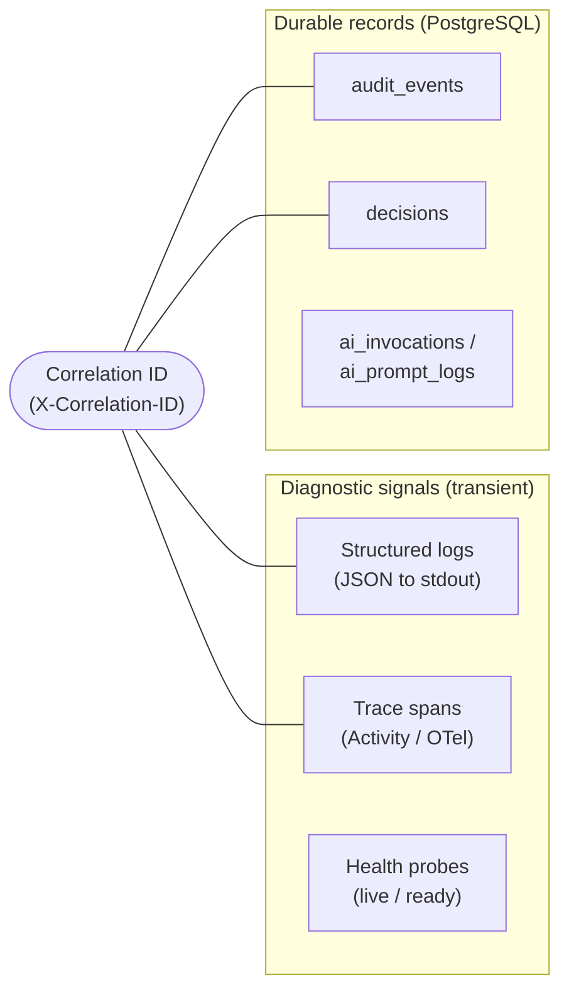
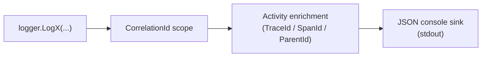
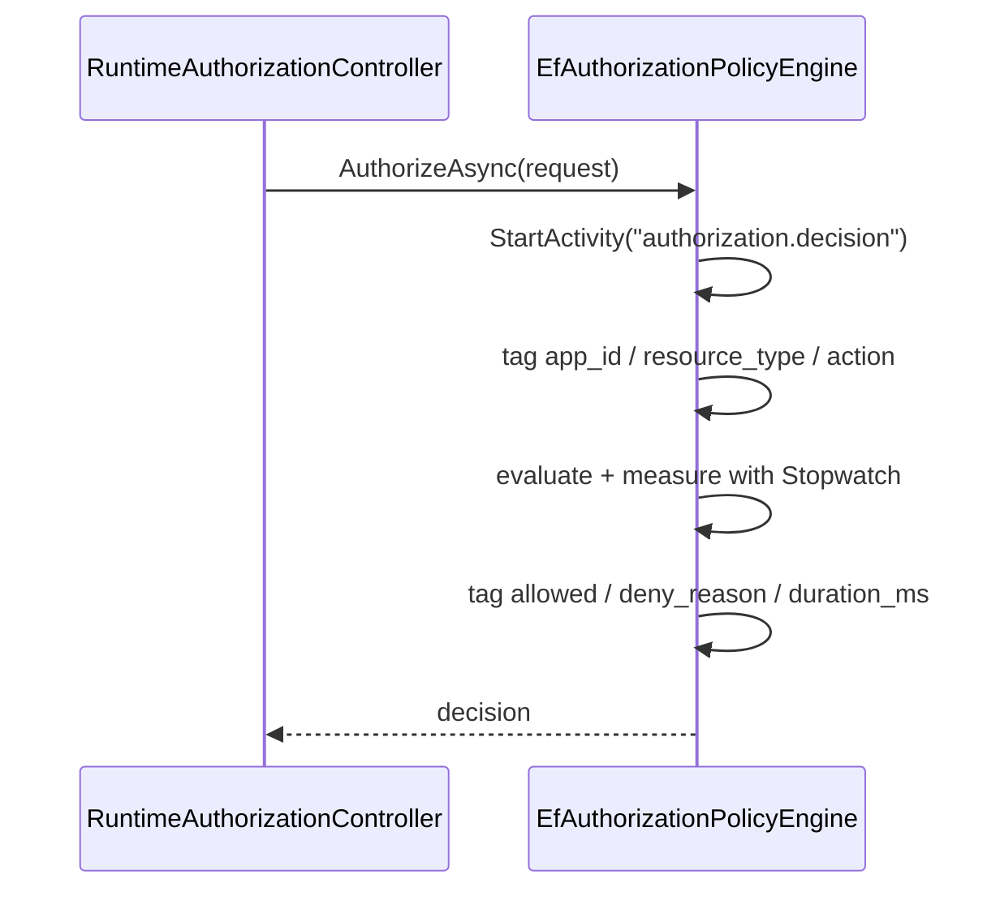
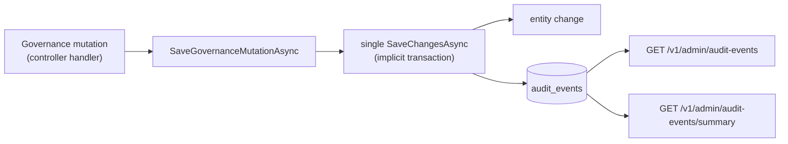
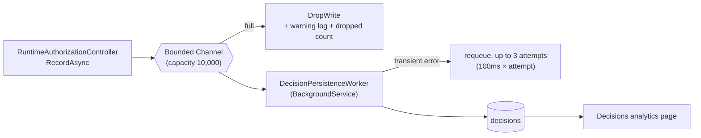
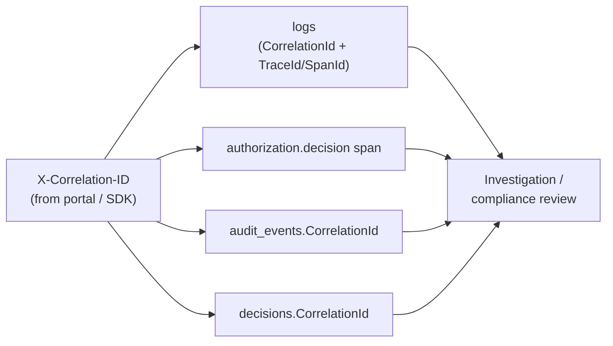

# 18 — Logging & Observability

> Part of the [Documentation Portal](README.md).
> Related: [System Architecture](04_System_Architecture.md) · [Error Handling](17_Error_Handling.md) · [Non-Functional Requirements](03_Non_Functional_Requirements.md) · [Security Design](16_Security_Design.md)

---

## Table of Contents

1. [Purpose & Scope](#purpose--scope)
2. [The Observability Model](#the-observability-model)
3. [Structured Logging](#structured-logging)
4. [Correlation IDs](#correlation-ids)
5. [Distributed Tracing](#distributed-tracing)
6. [Health Checks](#health-checks)
7. [Audit Trail](#audit-trail)
8. [Decision Recording (Async Outbox)](#decision-recording-async-outbox)
9. [AI Telemetry](#ai-telemetry)
10. [End-to-End Traceability](#end-to-end-traceability)
11. [Operational Guidance](#operational-guidance)
12. [Cross-References](#cross-references)

---

## Purpose & Scope

This document describes how the Authorization Control Plane makes itself **observable** (can an
operator see what the running system is doing?) and **auditable** (can a reviewer reconstruct who
changed what, and why a given access decision was reached?).

It covers four categories of signal:

| Category | Signal | Where it lives | Primary consumer |
|----------|--------|----------------|------------------|
| **Diagnostic** | Structured JSON logs | stdout of the API container | Operators, log aggregators |
| **Diagnostic** | Distributed-tracing spans | In-process `Activity` / OpenTelemetry pipeline | Trace/log correlation |
| **Operational** | Health probes | `/health/live`, `/health/ready` | Orchestrators, Compose |
| **Business/forensic** | Audit events, recorded decisions, AI telemetry | PostgreSQL (`authz` schema) | Portal analytics, compliance, investigation |

The unifying thread across all of them is a single **correlation ID** per request. The diagnostic
signals are transient (they age out of the log/trace backend); the business signals are **durable
records** persisted to the database and surfaced through the admin portal.

Primary sources: [Observability/](../backend/src/Authorization.Api/Observability/),
[Program.cs](../backend/src/Authorization.Api/Program.cs), the runtime engine
([EfAuthorizationPolicyEngine.cs](../backend/src/Authorization.Infrastructure/RuntimeAuthorization/EfAuthorizationPolicyEngine.cs)),
and the decision outbox
([InProcessDecisionOutbox.cs](../backend/src/Authorization.Infrastructure/RuntimeAuthorization/InProcessDecisionOutbox.cs)).

## The Observability Model

The API emits diagnostic signals for every request and writes durable records for the two event
classes that matter to compliance: **governance mutations** (who changed configuration) and
**runtime decisions** (what the engine allowed or denied). AI telemetry is a third durable record
class that exists only when the AI features are enabled.

## Structured Logging

Logging is configured in [Program.cs](../backend/src/Authorization.Api/Program.cs):

- **JSON console sink** — `builder.Logging.AddJsonConsole(...)` writes every log entry as a single
  JSON object to stdout. `JsonWriterOptions.Indented` is `true` in Development (human-readable) and
  `false` elsewhere (one compact line per entry, ideal for log shippers).
- **Activity enrichment** — `ActivityTrackingOptions.TraceId | SpanId | ParentId` stamps each log
  entry with the current trace/span identifiers, so a log line can be joined to its trace span
  without any manual plumbing.
- **Correlation scope** — `CorrelationIdMiddleware` opens a logging scope carrying
  `CorrelationId`, so every log written while handling a request includes the request's correlation
  id as a structured property.
- **Log levels** — taken from the `Logging:LogLevel` configuration section
  ([appsettings.json](../backend/src/Authorization.Api/appsettings.json)); the default minimum is
  `Information`, with the `Microsoft.AspNetCore` category raised to `Warning` to suppress framework
  request noise.

Notable domain log lines include the per-decision debug line emitted by the engine (application,
resource, action, elapsed milliseconds, `allowed`, `denyReason`) and the **warning** the decision
outbox emits when it drops a record under backpressure (see
[Decision Recording](#decision-recording-async-outbox)).

## Correlation IDs

A correlation id is the single key that ties together a request's logs, its trace span, and any
durable record it produces. It is managed by
[CorrelationIdMiddleware.cs](../backend/src/Authorization.Api/Observability/CorrelationIdMiddleware.cs),
which is registered **first** in the pipeline (before exception handling, auth, and controllers) so
that everything downstream shares the same id.

Resolution rules (`X-Correlation-ID` header, constant `CorrelationIdMiddleware.HeaderName`):

1. If the inbound header is present and **acceptable**, its trimmed value is used.
2. Otherwise the framework-generated `HttpContext.TraceIdentifier` is used — this is the fallback
   both when the header is **absent** and when it is **rejected** as unacceptable.

A value is *acceptable* when it is **≤ 128 characters** (`MaxCorrelationIdLength`) and every
character is ASCII alphanumeric or one of `- _ . :`. These bounds keep the id safe to echo into
headers and logs without injection or unbounded-size risk.

Once resolved, the id is:

- assigned back onto `HttpContext.TraceIdentifier` (so downstream code — including audit and
  decision writers — reads the same value);
- written to the **response** `X-Correlation-ID` header (registered via `Response.OnStarting` so it
  survives even when the response has already begun);
- pushed into the logging scope as `CorrelationId`.

Callers generate their own ids so a client-side action can be traced end to end: the portal sends a
fresh UUID per request ([apiClient.ts](../frontend/src/apiClient.ts)) and the .NET SDK sends one per
call ([AuthorizationClient.cs](../backend/src/Authorization.Sdk/AuthorizationClient.cs)).

## Distributed Tracing

Tracing is registered in
[Observability/ServiceCollectionExtensions.cs](../backend/src/Authorization.Api/Observability/ServiceCollectionExtensions.cs)
via `AddOpenTelemetry().WithTracing(...)`:

- **Service resource** — `ConfigureResource(r => r.AddService("Authorization.Api"))` labels all
  spans with the service name.
- **Auto-instrumentation** — `AddAspNetCoreInstrumentation()` (one span per inbound HTTP request)
  and `AddHttpClientInstrumentation()` (one span per outbound call, e.g. to the AI model endpoint).
- **Custom source** — `AddSource("Authorization.RuntimeAuthorization")` registers the runtime
  engine's activity source (constant `EfAuthorizationPolicyEngine.ActivitySourceName`).

For every authorization decision the engine opens an internal span named **`authorization.decision`**
and tags it in two phases — request attributes up front, outcome attributes after evaluation:

| Tag | Set when | Value |
|-----|----------|-------|
| `authorization.application_id` | before evaluation | requested application id |
| `authorization.resource_type` | before evaluation | requested resource type |
| `authorization.action` | before evaluation | requested action |
| `authorization.allowed` | after evaluation | `true` / `false` |
| `authorization.deny_reason` | after evaluation | deny-reason code, or null when allowed |
| `authorization.duration_ms` | after evaluation | engine latency (measured with `Stopwatch`) |

> **No exporter is wired in the current build.** The pipeline *produces* spans and enriches logs
> with `TraceId`/`SpanId`, but no OTLP/Jaeger/console **exporter** is registered, and OpenTelemetry
> **metrics** are not collected. In practice this means: (a) trace/span ids flow into the structured
> logs for correlation, and (b) to export spans to an external backend you add an exporter (e.g.
> `.AddOtlpExporter()`) in `AddAuthorizationObservability`. Quantitative signals today come from the
> logged `duration_ms` values and from the durable `decisions` / `audit_events` tables rather than
> from a metrics backend.

## Health Checks

Two probes are mapped in [Program.cs](../backend/src/Authorization.Api/Program.cs) using the
ASP.NET Core health-check middleware:

| Endpoint | Predicate | Purpose |
|----------|-----------|---------|
| `/health/live` | `Predicate = _ => false` (runs **no** checks) | **Liveness** — the process is up and serving HTTP. Always `Healthy` while the app is running; used to decide whether to restart the container. |
| `/health/ready` | `Predicate = r => r.Tags.Contains("ready")` | **Readiness** — dependencies are reachable. Used to decide whether to route traffic. |

`/health/ready` runs the only registered check,
[DatabaseReadinessHealthCheck.cs](../backend/src/Authorization.Api/Observability/DatabaseReadinessHealthCheck.cs),
registered under the name `database` with the `ready` tag. It calls
`DbContext.Database.CanConnectAsync(...)` and reports `Healthy` when PostgreSQL is reachable,
`Unhealthy` otherwise. Liveness is deliberately **decoupled** from the database so a transient DB
outage takes the instance out of rotation (not-ready) without triggering a restart loop (still
alive).

At the container level, `docker-compose.yml` additionally defines healthchecks for the Postgres and
Keycloak dependencies so the API only starts once they are healthy (see
[Configuration](20_Configuration.md) and [Developer Guide](21_Developer_Guide.md)).

## Audit Trail

Every governance mutation appends an `AuditEventEntity` row **atomically with the change itself**.
`GovernanceControllerBase.SaveGovernanceMutationAsync(...)` adds the audit row and the entity change
to the same `DbContext`, then issues a **single `SaveChangesAsync`** — on PostgreSQL this runs inside
EF Core's implicit transaction, so the mutation and its audit record commit together or not at all
([GovernanceControllerBase.cs](../backend/src/Authorization.Api/Controllers/GovernanceControllerBase.cs)).
The table is treated as **append-only**: audit rows are never updated or deleted.

Each audit row (built by `BuildAuditEvent`) captures:

| Field | Source |
|-------|--------|
| `EventType` | one of the canonical constants in [AuditEventTypes.cs](../backend/src/Authorization.Api/Constants/AuditEventTypes.cs) (e.g. `TENANT_CREATED`, `ROLE_UPDATED`, `ASSIGNMENT_REVOKED`, `POLICY_PUBLISHED`, `BREAK_GLASS_ACTIVATED`) |
| `ApplicationId` | the application scope of the change (may be null for tenant-level events) |
| `ActorEmail` / `ActorRole` | the authenticated admin's identity and role |
| `TargetSubjectEmail` | the subject affected, when applicable |
| `OldValue` / `NewValue` | before/after state serialized as JSON (either may be null) |
| `Timestamp` | UTC time of the mutation |
| `CorrelationId` | `HttpContext.TraceIdentifier` — the request's correlation id |

Event-type identifiers are stable, versioned strings (they are consumed by reporting tooling), and
span the full governance surface: tenants, applications, OIDC providers, roles, permissions,
role-permission grants, assignments (including break-glass), policies, reference data, and review
campaigns.

Audit rows are read back through
[GovernanceInsightsController.cs](../backend/src/Authorization.Api/Controllers/Governance/GovernanceInsightsController.cs):
`GET /v1/admin/audit-events` returns the (application-scoped, category-filterable) feed, and
`GET /v1/admin/audit-events/summary` returns an activity heatmap. Portal presentation — icons,
tones, category grouping, relative timestamps — lives in
[workspace/activity.ts](../frontend/src/workspace/activity.ts).

## Decision Recording (Async Outbox)

Every runtime authorization decision is captured as a durable `DecisionEntity`, but recording is
deliberately **decoupled from the hot path** so that persistence throughput can never add latency to
an authorization check. The recorder is an **in-process, bounded, lossy outbox** — not a synchronous
database write.

**Producer.** After the engine returns a decision, `RuntimeAuthorizationController` calls
`IDecisionRecorder.RecordAsync(...)` for each check (single and batch). The implementation,
[InProcessDecisionOutbox.cs](../backend/src/Authorization.Infrastructure/RuntimeAuthorization/InProcessDecisionOutbox.cs),
simply `TryWrite`s the record onto a bounded `Channel` (**capacity 10,000**) and returns
immediately. The channel uses `BoundedChannelFullMode.DropWrite`: under sustained backpressure the
write is **dropped** rather than blocking the caller. Each drop increments a running counter and
emits a **warning** log naming the capacity, the dropped `DecisionId`/`ApplicationId`, and the total
dropped so far — so loss is visible, never silent.

**Consumer.** `DecisionPersistenceWorker` (a hosted `BackgroundService`, registered via
`AddHostedService`) drains the channel with `ReadAllAsync` and persists each record in its **own DI
scope / `DbContext`**. Persistence is retried on transient failures (`DbUpdateException` /
`InvalidOperationException`) up to **3 attempts** with a short escalating back-off (`100ms × attempt`)
by re-queuing the record; after the budget is exhausted it logs an error and drops that record.

**Persisted fields** (`DecisionEntity`): `DecisionId`, `ApplicationId`, `SubjectType`,
`SubjectEmail`, `ResourceType`, `ResourceId`, `Action`, `ContextSnapshot` (JSON of the request
context), `Allowed`, `DenyReason`, `MatchedRoles` / `MatchedPermissions` / `MatchedPolicies`
(arrays), `Obligations` (JSON), `Timestamp`, and `CorrelationId` (the request's
`HttpContext.TraceIdentifier`). These rows power the **Decisions analytics** page via
[DecisionAnalyticsController.cs](../backend/src/Authorization.Api/Controllers/DecisionAnalyticsController.cs)
(`GET /v1/admin/applications/{applicationId}/decisions/analytics`).

> **Design trade-off.** The outbox favours runtime **availability and latency** over guaranteed
> analytics completeness: a decision is always returned to the caller regardless of persistence
> health, and a small fraction of decision *records* may be lost under extreme load (surfaced as
> warnings). The `IDecisionRecorder` seam leaves room to swap in a durable queue later without
> touching the request path.

## AI Telemetry

When the AI features are enabled, each model call produces two durable, **metadata-only** records
(no raw request payloads are persisted): an `AiInvocationEntity` (feature, model, token usage,
latency, outcome) and an `AiPromptLogEntity` (redacted prompt metadata and outcome, including
`Timeout` / `ModelError` failure outcomes). These are surfaced through
`GET /v1/admin/ai/usage` and `GET /v1/admin/ai/prompt-logs`
([PlatformAiAssistController.cs](../backend/src/Authorization.Api/Controllers/PlatformAiAssistController.cs))
and the portal **AI Usage** page. See [AI Features](15_AI_Features.md) for the full schema, the
usage accumulator, and the redaction/pseudonymization guarantees.

## End-to-End Traceability

Because the correlation id is assigned onto `HttpContext.TraceIdentifier` and re-read by both the
audit writer and the decision recorder, **one id stitches together every signal a request produces**:

Given a single correlation id an operator can pivot from a portal action's log lines to its trace
span, to the governance `audit_events` row it created, and — for a runtime call — to the recorded
`decisions` row, reconstructing the full path of a request.

## Operational Guidance

- **Investigating a request** — start from its correlation id (returned in the `X-Correlation-ID`
  response header and shown by the portal). Filter logs by `CorrelationId`, then join to
  `audit_events`/`decisions` on the same value.
- **Readiness vs liveness** — a container reporting **not-ready** but **alive** almost always means
  PostgreSQL is unreachable; check the DB and the `DatabaseReadinessHealthCheck` result before
  restarting the API.
- **"Dropped decision" warnings** — indicate the decision outbox is shedding records under load.
  Authorization itself is unaffected (decisions are still returned); the loss only affects the
  Decisions analytics completeness. Investigate DB write throughput / worker health if the running
  dropped count grows.
- **Decision latency** — read the engine's `duration_ms` from the per-decision log line or the
  `authorization.decision` span tag; this is the measurement behind the performance target in
  [Non-Functional Requirements](03_Non_Functional_Requirements.md).
- **Exporting traces/metrics** — add an OpenTelemetry exporter (and, if needed, a metrics pipeline)
  in `AddAuthorizationObservability`; no external observability backend is wired by default.

## Cross-References

- Correlation id in error envelopes: [Error Handling](17_Error_Handling.md)
- Where audit / decision / AI records are stored: [Data Model](14_Data_Model_Documentation.md)
- AI telemetry detail: [AI Features](15_AI_Features.md)
- Performance target measured via decision latency: [Non-Functional Requirements](03_Non_Functional_Requirements.md)
- Health-check dependencies and container orchestration: [Configuration](20_Configuration.md) · [Developer Guide](21_Developer_Guide.md)
