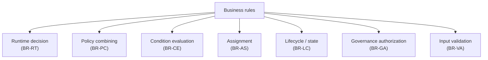
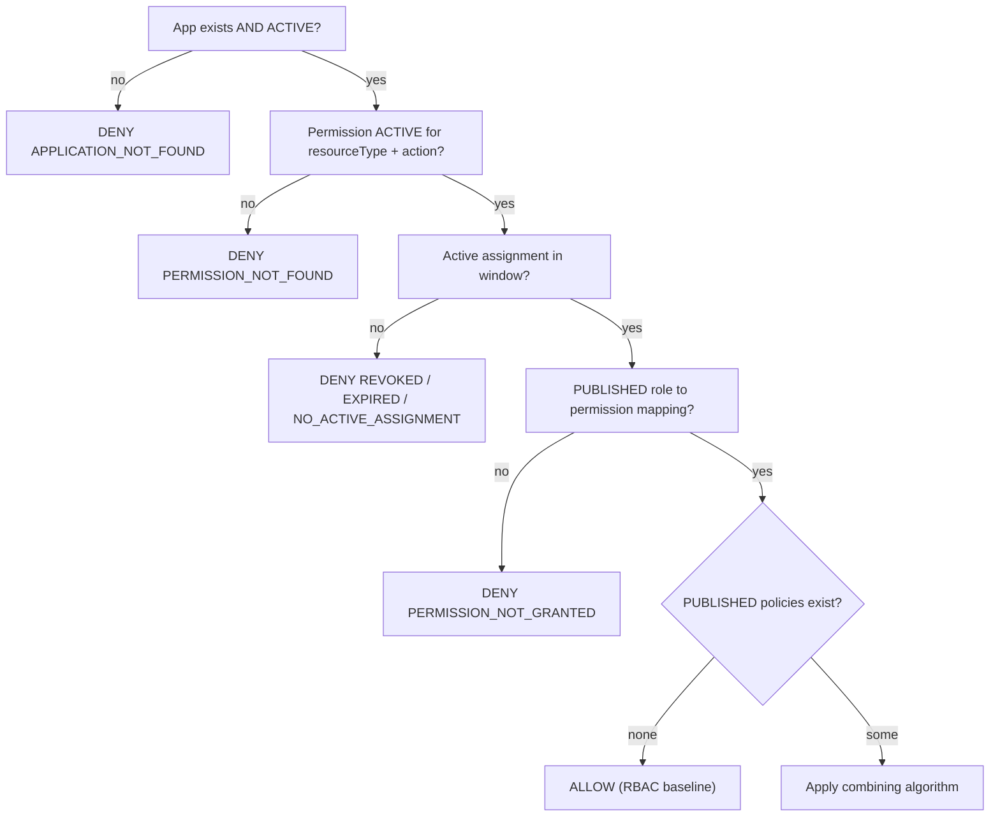
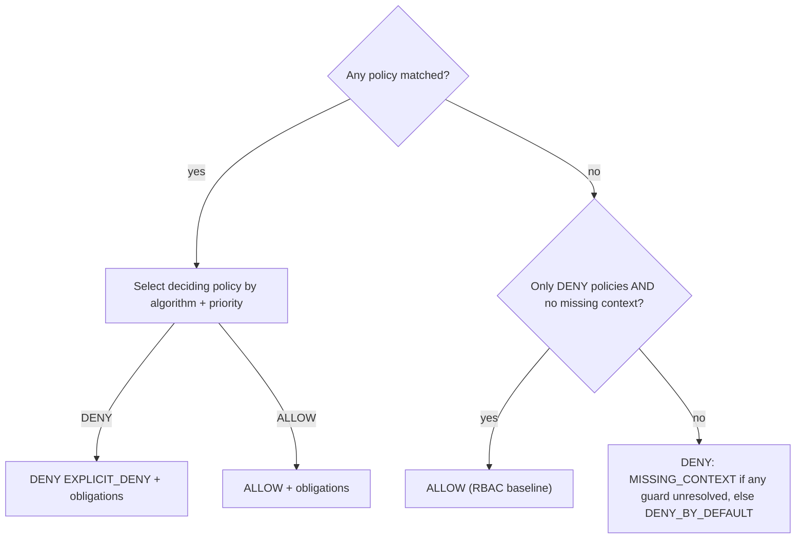
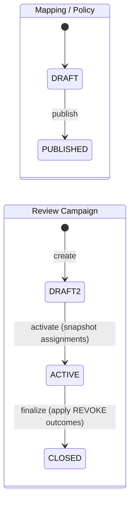

# 19 — Business Rules

> Part of the [Documentation Portal](README.md).
> Related: [Feature Documentation](08_Feature_Documentation.md) · [Data Model](14_Data_Model_Documentation.md) · [Security Design](16_Security_Design.md) · [API Documentation](13_API_Documentation.md)

---

## Table of Contents

1. [Purpose & Scope](#purpose--scope)
2. [Rule Taxonomy](#rule-taxonomy)
3. [Runtime Authorization Decision Rules](#runtime-authorization-decision-rules)
4. [Policy Combining Rules](#policy-combining-rules)
5. [Condition Evaluation Rules](#condition-evaluation-rules)
6. [Assignment Rules](#assignment-rules)
7. [Lifecycle & State Rules](#lifecycle--state-rules)
8. [Governance Authorization Rules](#governance-authorization-rules)
9. [Input Validation Rules](#input-validation-rules)
10. [Cross-References](#cross-references)

---

## Purpose & Scope

A **business rule** is an invariant the system enforces regardless of who calls it or through which
interface. This document extracts, categorizes, and — crucially — **traces to code** every material
rule the Authorization Control Plane enforces, so a reader can understand *what* is guaranteed and
*where* it is implemented without reverse-engineering the source.

Two rule surfaces exist, and they must not be confused:

- **Runtime authorization rules** decide whether a subject may perform an action. They are enforced
  by [EfAuthorizationPolicyEngine.cs](../backend/src/Authorization.Infrastructure/RuntimeAuthorization/EfAuthorizationPolicyEngine.cs)
  and always **fail closed** — the default outcome is *deny*.
- **Governance rules** constrain how administrators change configuration (assignments, roles,
  policies, tenants, …). They are enforced by the controllers under
  [Controllers/Governance/](../backend/src/Authorization.Api/Controllers/Governance/) and their
  shared base [GovernanceControllerBase.cs](../backend/src/Authorization.Api/Controllers/GovernanceControllerBase.cs).

**Rule identifiers.** Each rule below has a stable id of the form `BR-<area>-<n>` (e.g. `BR-RT-3`)
so it can be referenced from tests, tickets, and other documents.

## Rule Taxonomy

| Area | What it governs | Enforcement point | Failure mode |
|------|-----------------|-------------------|--------------|
| Runtime decision (`BR-RT`) | Whether an action is allowed | `EfAuthorizationPolicyEngine` | Deny with a reason code (HTTP 200) |
| Policy combining (`BR-PC`) | How multiple matched policies resolve | `SelectDecidingPolicy` / `CollectObligations` | Fail-closed `DENY_BY_DEFAULT` |
| Condition evaluation (`BR-CE`) | How a policy's ABAC conditions are tested | `EvaluateGroup` / `EvaluateLeaf` | Missing context ⇒ no-match |
| Assignment (`BR-AS`) | How grants are created/derived | `AssignmentsController` | HTTP 4xx validation error |
| Lifecycle / state (`BR-LC`) | Draft→publish, archive, review flows | Governance controllers + DB check constraints | HTTP 4xx / DB constraint |
| Governance authorization (`BR-GA`) | Who may perform a mutation | Delegated-admin policies | HTTP 403 |
| Input validation (`BR-VA`) | Structural validity of inputs | Governance validators / runtime limits | HTTP 422 (413 for size) |

## Runtime Authorization Decision Rules

The engine evaluates a request in a **fixed order** and short-circuits at the first failing gate,
returning the **most informative deny reason**. A denial is a normal `200 OK` response whose body
carries `allowed:false` and a `denyReason` — it is not an error (see
[Error Handling](17_Error_Handling.md)).

| # | Rule | Deny reason if it fails |
|---|------|-------------------------|
| BR-RT-1 | The application must exist **and have `Status = ACTIVE`** (the lookup filters on `ACTIVE`). | `APPLICATION_NOT_FOUND` |
| BR-RT-2 | A permission must exist whose `Resource = resourceType` and `Action = action` **and `Status = ACTIVE`**. | `PERMISSION_NOT_FOUND` |
| BR-RT-3 | The subject must hold at least one **active assignment**: `State = ACTIVE`, `RevokedAt` is null, and `ValidFrom ≤ now < ValidUntil` (a null `ValidUntil` means no expiry). | `ASSIGNMENT_REVOKED` / `ASSIGNMENT_EXPIRED` / `NO_ACTIVE_ASSIGNMENT` (see precedence below) |
| BR-RT-4 | A **`PUBLISHED`** role→permission mapping must connect one of the subject's assigned roles to the permission. | `PERMISSION_NOT_GRANTED` |
| BR-RT-5 | If **no `PUBLISHED` policies** exist for the permission, the role grant alone authorizes (the **RBAC baseline**). | — (ALLOW) |
| BR-RT-6 | If published policies exist, the **combining algorithm** decides (see [Policy Combining](#policy-combining-rules)). | `EXPLICIT_DENY` / `DENY_BY_DEFAULT` / `MISSING_CONTEXT` |

**BR-RT-3 deny-reason precedence.** When no assignment satisfies the active window, the engine
inspects the subject's *other* assignments to report the most useful reason, in this order:

1. any assignment is `REVOKED` or has a `RevokedAt` timestamp ⇒ `ASSIGNMENT_REVOKED`;
2. else any assignment has `ValidUntil ≤ now` or `State = EXPIRED` ⇒ `ASSIGNMENT_EXPIRED`;
3. else ⇒ `NO_ACTIVE_ASSIGNMENT`.

## Policy Combining Rules

Policies are an **optional, additive ABAC guardrail layer** on top of RBAC: a subject must already
have an RBAC grant (BR-RT-4) before policies are ever consulted. Only `PUBLISHED` policies whose
`PermissionRefId` matches the permission participate.

Each policy is evaluated against every active assignment; a policy **matches** if its condition
document matches for at least one assignment (or if it has no conditions). The set of matched
policies is then resolved by the application's `PolicyCombiningAlgorithm` via `SelectDecidingPolicy`.

**BR-PC-1 — Priority ordering.** Within any candidate set the "first" policy is chosen by
`FirstByPriority`: **descending `Priority`, then ordinal `PolicyKey`** as a deterministic tie-break.
This ordering — not insertion or evaluation order — drives all three algorithms.

| Algorithm | Deciding policy |
|-----------|-----------------|
| `deny-overrides` (**default**) | highest-priority matched **`DENY`**; if none, highest-priority matched `ALLOW` |
| `allow-overrides` | highest-priority matched **`ALLOW`**; if none, highest-priority matched `DENY` |
| `first-applicable` | highest-priority matched policy **regardless of effect** |

> The default is `deny-overrides`, preserving the safest historical behavior: any matched deny wins.

**BR-PC-2 — Deciding outcome & obligations.** A deciding `DENY` returns `EXPLICIT_DENY`; a deciding
`ALLOW` returns ALLOW. Either way the decision carries the **obligations** collected by
`CollectObligations` from *every matched policy sharing the deciding effect*, de-duplicated by
obligation `id` (first occurrence wins), ordered by descending priority then policy key.

**BR-PC-3 — Fail-open for deny-only, fully-evaluable sets.** If **no** policy matched, **only `DENY`
policies exist**, and **no** guard reported missing context, the RBAC baseline still authorizes
(ALLOW). Rationale: unmatched deny guards impose no restriction.

**BR-PC-4 — Fail-closed otherwise.** If any `ALLOW` policy exists but none matched, the result is
`DENY_BY_DEFAULT`. If any guard could not resolve its context, the result is `MISSING_CONTEXT`
(missing context takes precedence over `DENY_BY_DEFAULT`).

## Condition Evaluation Rules

A policy's conditions are a JSON **group node** evaluated by `EvaluateGroup` / `EvaluateLeaf`. The
canonical operator and match-mode set is the single source of truth in
[PolicyOperators.cs](../backend/src/Authorization.Infrastructure/RuntimeAuthorization/PolicyOperators.cs),
shared by the engine, the API-side validator, and the AI drafting prompt so they cannot drift.

- **BR-CE-1 — Match semantics.** A group's `match` is `all` ⇒ **AND** (every child matches), `any` ⇒
  **OR** (at least one matches), `none` ⇒ **NOT-any** (no child matches). A legacy root that has
  only `conditions:[...]` and no `match` defaults to `all`.
- **BR-CE-2 — Recursive nesting.** Each child is either a **leaf** (`{ attribute, operator, value }`)
  or a nested **group** (`{ match, conditions:[...] }`); groups nest to arbitrary depth.
- **BR-CE-3 — Attribute namespaces.** A leaf's `attribute` (and a `value` that references another
  attribute) resolves from one of four namespaces:
  - `context.*` — the request's `context` object (supports dotted paths into nested JSON/dictionaries);
  - `assignment.*` — the matched assignment's stored attributes;
  - `system.*` — the computed evaluation clock: `now` (ISO-8601), `date`, `time`, `hour`,
    `dayOfWeek`, and `dow` (ISO weekday, Monday = 1 … Sunday = 7), built once per decision;
  - `reference.*` — application-scoped reference-data documents (`reference.<key>` returns the whole
    document; `reference.<key>.<path>` walks into it).
- **BR-CE-4 — Reference-data laziness.** `reference.*` documents are loaded **only when a policy
  actually references them**, so decisions that don't use reference data incur no extra query.
- **BR-CE-5 — Literal vs. reference values.** A leaf's `value` is treated as a **literal** unless it
  begins with `context.`, `assignment.`, `system.`, or `reference.`, in which case it is resolved as
  an attribute (enabling attribute-to-attribute comparison).
- **BR-CE-6 — Missing context is fail-closed.** If either side of a leaf cannot be resolved, the leaf
  reports `MissingContext` and does **not** match. Missing context propagates only when its group
  does **not** match — a group that still matches clears the flag.
- **BR-CE-7 — One parse per decision.** Each policy's condition document is parsed **once** per
  decision and then evaluated against each assignment (values differ, structure does not).

**Supported operators** (from `PolicyOperators.All`; all string comparisons are
`OrdinalIgnoreCase`):

| Group | Operators | Notes |
|-------|-----------|-------|
| Comparison | `eq`, `neq`, `gt`, `gte`, `lt`, `lte` | Ordering operators use **typed** comparison: decimal first, then date/time; non-comparable values fail (no match) rather than falling back to lexical order. |
| Text | `contains`, `notContains`, `startsWith`, `endsWith`, `matches`, `notMatches` | `matches`/`notMatches` use a ReDoS-hardened `NonBacktracking` regex with a **100 ms timeout**; invalid or timed-out patterns evaluate to no-match. |
| Set / collection | `in`, `notIn`, `containsAny`, `containsAll` | Accept a JSON array (`["a","b"]`) or a comma-separated string. |
| Date / range | `before`, `after`, `between` | `before`/`after` are strict date/time (never lexical); `between` is an inclusive `min,max` range for numbers or dates. |
| Presence / boolean | `exists`, `notExists`, `isTrue`, `isFalse` | `exists` = non-blank; `isTrue` = `true`/`1`/`yes`; `isFalse` = `false`/`0`/`no`. |

An **unrecognized operator** evaluates to no-match (fail-closed), so a malformed condition can never
accidentally grant access.

## Assignment Rules

| # | Rule | Detail | Source |
|---|------|--------|--------|
| BR-AS-1 | **Privileged roles must be time-boxed.** | Creating an assignment for a `Privileged` role without a `ValidUntil` is rejected with **422 `PRIVILEGED_ASSIGNMENT_REQUIRES_EXPIRY`**. | `AssignmentsController.CreateAssignment` |
| BR-AS-2 | **Active USER grants are consolidated, not duplicated.** | For a `USER` subject already actively holding the role: an identical expiry returns **409 `ASSIGNMENT_EXISTS`**; a different expiry **updates the single existing record to the later expiry** (audited `ASSIGNMENT_UPDATED`, `consolidated:true`) instead of creating a second grant. Revoked/expired grants are history and never block a re-grant. Manual and CSV-import paths share these rules. | `AssignmentsController` |
| BR-AS-3 | **Break-glass access is a short, justified, self-expiring grant.** | A `reason` is mandatory (422 if blank); `durationHours` is clamped by `Math.Min(h, 24)` and must be ≥ 1 (else **422 "durationHours must be between 1 and 24"**); the grant is created with `Source = EMERGENCY`, a `ValidUntil = now + hours`, a distinct `BREAK_GLASS_ACTIVATED` audit event, and auto-expires via the same runtime validity window (no standing emergency access). | `AssignmentsController.BreakGlass` |
| BR-AS-4 | **Display status is derived, not stored.** | `AssignmentDisplayStatus.Resolve` returns `REVOKED` when `State = REVOKED` or `RevokedAt` is set; else `EXPIRED` when `ValidUntil < now`; else `ACTIVE`. List/summary filters use this derived status. | [GovernanceVocabulary.cs](../backend/src/Authorization.Api/Governance/GovernanceVocabulary.cs) |
| BR-AS-5 | **Only assignments in the active window authorize at runtime.** | The engine's `activeAssignments` filter (`State = ACTIVE`, not revoked, within `ValidFrom`/`ValidUntil`) is the single gate for BR-RT-3; a break-glass grant becomes ineffective the instant it expires. | `EfAuthorizationPolicyEngine` |

## Lifecycle & State Rules

- **BR-LC-1 — Only `PUBLISHED` affects runtime.** Draft role→permission mappings and draft policies
  are invisible to the engine; only `PUBLISHED` rows participate in a decision.
- **BR-LC-2 — Policies are editable only while `DRAFT`.** Editing or deleting a non-draft policy is
  rejected with **422 `POLICY_NOT_EDITABLE`**; a published policy must be superseded by a new draft.
- **BR-LC-3 — Reference-data delete is a soft archive.** "Deleting" reference data transitions it to
  `ARCHIVED` rather than removing the row, preserving history and any auditable references.
- **BR-LC-4 — Review-campaign finalize applies revokes.** Finalizing a campaign moves it to the
  terminal `CLOSED` state and applies every `REVOKE` outcome through the standard **audited revoke
  path**; `KEEP`, `NEEDS_INFO`, and still-`PENDING` items are left untouched. A `CLOSED` campaign
  cannot be finalized again.
- **BR-LC-5 — Status vocabularies are fixed and DB-enforced.** Each entity's status set is mirrored
  by an `authz`-schema check constraint (`GovernanceVocabulary.cs` values must not diverge):
  - applications / roles / permissions: `ACTIVE`, `DISABLED`, `DEPRECATED`, `ARCHIVED`;
  - tenants and SoD rules: `ACTIVE`, `DISABLED`, `ARCHIVED`;
  - reference data: `ACTIVE`, `ARCHIVED`;
  - review campaigns: `DRAFT`, `ACTIVE`, `CLOSED`;
  - draft/publish workflow (mappings, policies, assignments): `DRAFT`, `PUBLISHED`, `REVOKED`, `ACTIVE`.
- **BR-LC-6 — Optimistic concurrency.** Every governed entity carries an integer `version` column
  configured as a concurrency token; a stale update fails rather than silently overwriting a
  concurrent change (see [Data Model](14_Data_Model_Documentation.md)).

## Governance Authorization Rules

- **BR-GA-1 — Platform scope.** Creating/updating/deleting **tenants** and creating **applications**
  requires the `PlatformAdmin` policy (satisfied only by the platform-super-admin role).
- **BR-GA-2 — Capability-gated mutations.** Every other governance mutation is gated by its specific
  delegated-admin **capability** (e.g. `ManageRoles`, `AssignRoles`, `ManagePolicies`, `ViewAudit`);
  the coarse `AdminApi` policy is the controller baseline. See [Security Design](16_Security_Design.md).
- **BR-GA-3 — Tenant scoping.** A tenant-scoped admin is authorized only for applications belonging
  to their tenant; the delegated-admin handler resolves the application's tenant via a DB lookup and
  denies (403) cross-tenant access.
- **BR-GA-4 — Atomic audit.** Every mutation writes an `AuditEventEntity` in the **same
  `SaveChangesAsync`** as the change, so a change and its audit record commit together or not at all
  (see [Logging & Observability](18_Logging_and_Observability.md)).

## Input Validation Rules

- **BR-VA-1 — Policy conditions** must be valid JSON containing a `conditions` array; every group
  `match` must be `all`/`any`/`none`, and every leaf `operator` must be in the supported set
  ([PolicyConditionValidator.cs](../backend/src/Authorization.Api/Governance/PolicyConditionValidator.cs)).
  Failures return **422 `POLICY_CONDITIONS_INVALID`**.
- **BR-VA-2 — Obligations** must be a JSON **array** of either bare id strings or `{ id, value? }`
  objects; ids must be non-empty and unique, and `value` (when present) must be a string
  ([PolicyObligationsValidator.cs](../backend/src/Authorization.Api/Governance/PolicyObligationsValidator.cs)).
  Failures return **422 `POLICY_OBLIGATIONS_INVALID`**.
- **BR-VA-3 — Reference-data values** must be non-empty, valid JSON that is an **array or object**
  ([ReferenceDataValueValidator.cs](../backend/src/Authorization.Api/Governance/ReferenceDataValueValidator.cs)).
  Failures return **422 `REFERENCE_DATA_VALUE_INVALID`**.
- **BR-VA-4 — OIDC algorithm `none` is forbidden.** An empty algorithm list defaults to `["RS256"]`.
  The `none` algorithm is rejected on the **update** path with **422** and is additionally forbidden
  on **all** paths by the `ck_oidc_providers_no_alg_none` check constraint
  ([OidcProvidersController.cs](../backend/src/Authorization.Api/Controllers/Governance/OidcProvidersController.cs)).
- **BR-VA-5 — Runtime input limits.** The runtime controller enforces `MaxBatchSize = 50`
  (**413 `BATCH_TOO_LARGE`**), `MaxRequestBodyBytes = 256 KB` (**413 `REQUEST_TOO_LARGE`**), and
  `MaxContextJsonBytes = 32 KB` (**422 `CONTEXT_TOO_LARGE`**). In a batch, an oversized per-check
  context denies only that check rather than failing the whole batch
  ([RuntimeAuthorizationController.cs](../backend/src/Authorization.Api/Controllers/RuntimeAuthorizationController.cs)).
- **BR-VA-6 — Blank text is rejected.** Because the framework's `[Required]` accepts whitespace,
  create/update handlers call `RequireText` to reject blank/whitespace names with
  **422 `VALIDATION_ERROR`**.

## Cross-References

- How these rules surface as features: [Feature Documentation](08_Feature_Documentation.md)
- Entities the rules govern (and their constraints): [Data Model](14_Data_Model_Documentation.md)
- Deny reasons vs. transport error codes: [Error Handling](17_Error_Handling.md)
- Authorization model behind `BR-GA`: [Security Design](16_Security_Design.md)
- Runtime & governance APIs that apply these rules: [API Documentation](13_API_Documentation.md)
