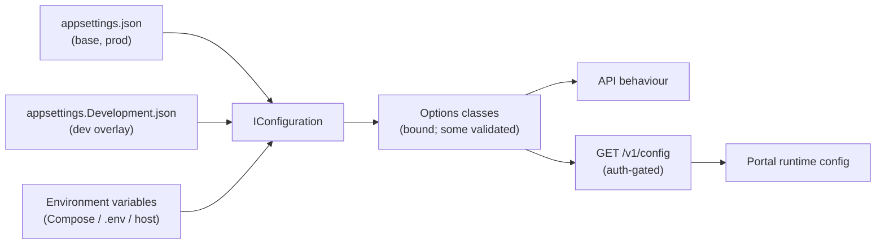
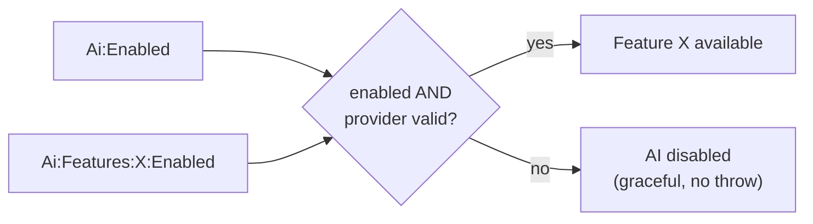

# 20 — Configuration

> Part of the [Documentation Portal](README.md).
> Related: [Security Design](16_Security_Design.md) · [AI Features](15_AI_Features.md) · [Developer Guide](21_Developer_Guide.md) · [Non-Functional Requirements](03_Non_Functional_Requirements.md)

---

## Table of Contents

1. [Purpose & Scope](#purpose--scope)
2. [Configuration Sources & Precedence](#configuration-sources--precedence)
3. [Options Binding & Validation](#options-binding--validation)
4. [Backend Configuration Reference](#backend-configuration-reference)
5. [AI Configuration](#ai-configuration)
6. [Feature Flags](#feature-flags)
7. [Server-Owned Portal Config](#server-owned-portal-config)
8. [Frontend Build-Time Configuration](#frontend-build-time-configuration)
9. [Local Environment: Compose & `.env`](#local-environment-compose--env)
10. [Secrets Handling](#secrets-handling)
11. [Cross-References](#cross-references)

---

## Purpose & Scope

This document is the single reference for **every knob that changes how the Authorization Control
Plane runs** without a code change. It covers the backend's strongly-typed options, the AI section,
feature flags, the server-owned portal config surfaced at `GET /v1/config`, the frontend's
build-time variables, and the Docker Compose / `.env` variables that wire the local stack together.

Two properties are essential to understand up front:

- **The product is fully functional with almost nothing configured.** Only the database connection
  and the OIDC settings are strictly required at startup; the AI surface is **off by default** and
  everything else has a safe compiled default.
- **Configuration is layered, and the running values depend on the topology.** The same setting has
  different values when you `dotnet run` locally versus when you run the Docker Compose stack (for
  example, the DB host is `localhost` in one and `postgres` in the other). Both are documented below.

## Configuration Sources & Precedence

The API uses the standard ASP.NET Core configuration stack. Later sources override earlier ones:

| Source | When it applies | Notes |
|--------|-----------------|-------|
| [appsettings.json](../backend/src/Authorization.Api/appsettings.json) | Always (base) | Ships only `Logging` and `AllowedHosts: "*"`. It has **no** `ConnectionStrings`, `Oidc`, or `Ai` section, so those must come from the environment (or the dev overlay) in production. |
| [appsettings.Development.json](../backend/src/Authorization.Api/appsettings.Development.json) | `ASPNETCORE_ENVIRONMENT=Development` | The `dotnet run` overlay — real localhost values for Postgres, Keycloak, and a `Fake`-provider AI section. |
| Environment variables | Always; **highest precedence** | Use the ASP.NET Core `Section__Key` double-underscore convention (e.g. `Oidc__Authority` binds `Oidc:Authority`, `Cors__AllowedOrigins__0` binds the first array element). This is how the Compose stack injects everything. |

> **Precedence in one line:** environment variable → `appsettings.Development.json` → `appsettings.json`.

## Options Binding & Validation

Not every options class is bound the same way, and only some are **validated at startup**. This
distinction matters operationally: a validated option that is missing crashes the app immediately
(fail-fast), whereas an unvalidated one silently falls back to its default.

| Options class | Section | Bound in | Validated? |
|---------------|---------|----------|------------|
| [DatabaseOptions](../backend/src/Authorization.Api/Configuration/DatabaseOptions.cs) | `ConnectionStrings` (single `Postgres` string, `[Required]`) | [Configuration/ServiceCollectionExtensions.cs](../backend/src/Authorization.Api/Configuration/ServiceCollectionExtensions.cs) | **Yes** — `ValidateDataAnnotations().ValidateOnStart()` |
| [OidcOptions](../backend/src/Authorization.Api/Configuration/OidcOptions.cs) | `Oidc` (`Authority`, `Audience`, `PortalClientId` all `[Required]`; `MetadataAddress` optional) | Configuration/ServiceCollectionExtensions.cs | **Yes** — data annotations + `ValidateOnStart` |
| [PortalOptions](../backend/src/Authorization.Api/Configuration/PortalOptions.cs) | `Portal` (pagination, cache, UI windows, role labels) | Configuration/ServiceCollectionExtensions.cs | **Yes** (no required fields, but validated on start) |
| [AiOptions](../backend/src/Authorization.Ai/AiOptions.cs) | `Ai` | [AiServiceCollectionExtensions.cs](../backend/src/Authorization.Ai/AiServiceCollectionExtensions.cs) via `services.Configure<AiOptions>(...)` | **No** — bound but not validated; a misconfigured provider **degrades to disabled** instead of failing startup |
| [RuntimeClientOptions](../backend/src/Authorization.Api/Configuration/RuntimeClientOptions.cs) | `RuntimeClients` | **Not wired into the running app** | n/a |

Key points:

- **`AddValidatedOptions<T>` is the fail-fast path.** It calls
  `AddOptions<T>().Bind(section).ValidateDataAnnotations().ValidateOnStart()`, so a blank
  `ConnectionStrings:Postgres` or a missing `Oidc:Authority`/`Audience`/`PortalClientId` aborts
  startup with a clear error rather than failing later at first use. Only `DatabaseOptions`,
  `OidcOptions`, and `PortalOptions` go through it.
- **`AiOptions` is bound in the AI project, not the API's configuration module.**
  `AddAuthorizationAi` reads the `Ai` section, computes availability, and registers
  `services.Configure<AiOptions>(...)`. It is deliberately **not** validated: a bad provider/endpoint
  results in AI being registered as *disabled* (graceful degradation) — see [AI Configuration](#ai-configuration).
- **`RuntimeClientOptions` is a legacy/test-only class.** It is consumed by
  `RuntimeClientCredentialValidator` (the legacy static-secret runtime path), but the running
  application never binds the `RuntimeClients` section — production runtime callers authenticate via
  per-application OIDC (see [Security Design](16_Security_Design.md)). It is populated only by the
  test host, so treat it as **not part of the deployed configuration surface**.
- **The `Database:*` dev flags are not part of `DatabaseOptions`.** `DatabaseOptions` contains only
  the `Postgres` connection string. `Database:RunDevelopmentSetup` and `Database:SeedDevelopmentData`
  are read directly with `Configuration.GetValue(...)` in
  [DevelopmentDatabaseExtensions.cs](../backend/src/Authorization.Api/Startup/DevelopmentDatabaseExtensions.cs)
  (both default `true`).

## Backend Configuration Reference

The table below lists the backend settings and their **`dotnet run` (Development) values** from
[appsettings.Development.json](../backend/src/Authorization.Api/appsettings.Development.json). The
Docker Compose values differ for host-dependent settings and are shown in
[Local Environment](#local-environment-compose--env).

| Key | Development value | Required? | Meaning |
|-----|-------------------|-----------|---------|
| `ConnectionStrings:Postgres` | `Host=localhost;Port=5432;Database=authorization;Username=authorization;Password=authorization_dev_password` | **Yes** (validated) | PostgreSQL connection string. |
| `Oidc:Authority` | `http://localhost:8081/realms/authorization-local` | **Yes** (validated) | Public issuer URL used to validate the token issuer and (absent `MetadataAddress`) to fetch discovery/JWKS. |
| `Oidc:Audience` | `authorization-api` | **Yes** (validated) | Expected `aud` claim on admin JWTs. |
| `Oidc:PortalClientId` | `authorization-portal` | **Yes** (validated) | The portal's OIDC client id (surfaced for reference). |
| `Oidc:MetadataAddress` | *(unset in dev)* | No | Optional back-channel discovery URL used when the public `Authority` is not reachable from the API's network (common in Docker); issuer is still validated against `Authority`. |
| `Cors:AllowedOrigins:<n>` | *(unset in dev)* → defaults to `http://localhost:5173` | No | Allowed browser origins for the portal CORS policy (`PortalCors`). When unset, the code default `http://localhost:5173` is used. The policy allows any header/method but **not** credentials (bearer tokens, not cookies). |
| `FeatureFlags:DecisionCachingEnabled` | `false` | No | **Reserved / inert.** Declared in config but **read by no code** — decision caching is not implemented, so toggling it has no effect today. |
| `Database:RunDevelopmentSetup` | `true` | No | Development only: apply EF Core migrations on startup. |
| `Database:SeedDevelopmentData` | `true` | No | Development only: seed demo tenants/apps/roles/etc. |
| `Logging:LogLevel:Default` | `Information` | No | Minimum log level. `Microsoft.AspNetCore` is raised to `Warning` to suppress framework request noise (both dev and prod). |
| `AllowedHosts` | `*` (from base `appsettings.json`) | No | Host filtering; permissive by default. |

Logging output format is set in [Program.cs](../backend/src/Authorization.Api/Program.cs): a JSON
console sink (`AddJsonConsole`) that is **indented in Development** and **compact (one line) elsewhere**,
with `TraceId`/`SpanId`/`ParentId` activity enrichment. See
[Logging & Observability](18_Logging_and_Observability.md) for details.

## AI Configuration

The `Ai` section binds to [AiOptions.cs](../backend/src/Authorization.Ai/AiOptions.cs). Because
production [appsettings.json](../backend/src/Authorization.Api/appsettings.json) has **no** `Ai`
section, an unconfigured deployment uses the compiled **code defaults**. The table shows both the
development-overlay value and the code default; where the dev overlay does **not** set a key, that is
noted explicitly (the effective value is then the code default).

| Key | Dev overlay value | Code default | Meaning |
|-----|-------------------|--------------|---------|
| `Ai:Enabled` | `false` | `false` | Master switch. When `false`, no AI services register and every AI endpoint is absent. |
| `Ai:Provider` | `Fake` | `AzureOpenAI` | `AzureOpenAI` \| `OpenAI` (OpenAI-compatible, e.g. GitHub Models) \| `Fake` (deterministic offline stub). |
| `Ai:AzureOpenAI:Endpoint` | `""` | `""` | Azure resource endpoint or OpenAI-compatible base URL. |
| `Ai:AzureOpenAI:ApiKey` | `""` | `""` | **Secret** — supplied via env/secret store only; never returned by `/v1/config` and never logged. |
| `Ai:AzureOpenAI:ChatDeployment` | `openai/gpt-4.1-mini` | `gpt-4o-mini` | Chat deployment (Azure) or model name (OpenAI-compatible). |
| `Ai:AzureOpenAI:EmbeddingDeployment` | `text-embedding-3-small` | `text-embedding-3-small` | Embedding deployment (deferred RAG feature only). |
| `Ai:AzureOpenAI:ApiVersion` | `2024-10-21` | `2024-10-21` | Azure API version. |
| `Ai:AzureOpenAI:SupportsTemperature` | `true` | `true` | Set `false` for reasoning deployments (gpt-5.5/o-series) that reject a non-default `temperature`; the field is then omitted from the request. |
| `Ai:AzureOpenAI:SupportsMaxTokens` | `true` | `true` | Set `false` for reasoning deployments that require `max_completion_tokens` instead of `max_tokens`. |
| `Ai:Features:<Feature>:Enabled` | all `true` (dev) | see per-feature note | Per-feature switch (still gated by `Ai:Enabled`). |
| `Ai:Features:<Feature>:Temperature` | see per-feature note | see per-feature note | Per-feature sampling temperature (0.0–2.0). |
| `Ai:Limits:MaxPromptChars` | `4000` | `4000` | Max characters for the caller's free-text prompt. |
| `Ai:Limits:RequestTimeoutSeconds` | `30` | `30` | Per model-call timeout. |
| `Ai:Limits:MaxTokens` | `2048` | `2048` | Max completion tokens (a ceiling, not a target). |
| `Ai:Limits:Temperature` | `0.2` | `0.2` | Fallback temperature used only when a feature omits its own. |
| `Ai:Limits:MaxRetries` | *(not set in dev)* | `2` | Transient (429/503) retry attempts; `Retry-After` honored. |
| `Ai:Limits:MaxRetryDelaySeconds` | *(not set in dev)* | `8` | Upper bound (seconds) on a single retry wait. |
| `Ai:Logging:CapturePrompts` | *(not set in dev)* | `true` | Persist prompt text + outcome to `authz.ai_prompt_logs` (admin-gated reads); `false` keeps the metadata-only privacy boundary. |

**Per-feature enablement and temperatures.** The dev overlay turns **all eight** features on;
the **code defaults** enable only the four low-risk ones. Temperatures are identical in both:

| Feature | Dev enabled | Code-default enabled | Temperature |
|---------|-------------|----------------------|-------------|
| PolicyAuthoring (F1) | ✅ | ✅ | 0 (deterministic JSON) |
| DecisionExplainer (F2) | ✅ | ✅ | 0.2 |
| ImpactAnalysis (F5) | ✅ | ✅ | 0.2 |
| ConfigAdvisor (F6) | ✅ | ✅ | 0.2 |
| AccessSearch (F8) | ✅ | ❌ (off until schema review) | 0 |
| SodAnalysis (F7) | ✅ | ❌ | 0 |
| AccessCertification (F4) | ✅ | ❌ (off until PII review) | 0.2 |
| AuditNarrative (F9) | ✅ | ❌ (off until PII review) | 0.2 |

**Graceful degradation.** `AddAuthorizationAi` never throws. If `Ai:Enabled` is `false`, or the
selected provider is misconfigured (e.g. a live provider with an empty endpoint/key), AI is registered
as **disabled**: no `IAiAssistant` is resolvable, `AiAvailability.Enabled` is `false`, and `/v1/config`
reports the surface as off. A startup logger records the reason. Every feature is also gated by the
master switch — even with all per-feature flags on, AI stays off until `Ai:Enabled = true`.

See [AI Features](15_AI_Features.md) for provider transport details, retry semantics, and the
redaction/pseudonymization guarantees behind `CapturePrompts`.

## Feature Flags

| Flag | Where read | Effect |
|------|------------|--------|
| `Ai:Enabled` (+ `Ai:Features:*`) | `AddAuthorizationAi` / `AiAvailability` | Master + per-feature gates for the AI surface. |
| `Database:RunDevelopmentSetup` | `DevelopmentDatabaseExtensions` (Development only) | Apply EF migrations on startup. |
| `Database:SeedDevelopmentData` | `DevelopmentDatabaseExtensions` (Development only) | Seed demo data. |
| `FeatureFlags:DecisionCachingEnabled` | **Nowhere** | **Inert/reserved.** No code reads it; decision caching is not implemented. Present for forward-compatibility only. |

## Server-Owned Portal Config

The portal treats the server as the single source of truth for presentation and feature knobs so
operators can retune a deployment without a frontend rebuild.
[ConfigController.cs](../backend/src/Authorization.Api/Controllers/ConfigController.cs) exposes
`GET /v1/config` — **authenticated** (`[Authorize(Policy = AdminApi)]`) — projecting `PortalOptions`
and `AiAvailability`/`AiOptions` into `PortalConfigResponse`:

| Group | Fields | Source / notes |
|-------|--------|----------------|
| `ai` | `enabled`, `provider?`, `model?`, `limits?`, `features`, `featureTemperatures?` | `provider`/`limits`/`featureTemperatures` are emitted **only when AI is enabled**; `model` only when the provider is **live** (enabled and not `Fake`). The API key is never included. |
| `pagination` | `defaultPageSize` (25), `maxPageSize` (200), `pageSizeOptions` ([10,25,50,100]) | `PortalOptions.Pagination`. |
| `cache` | `defaultStaleMs` (30000), `volatileStaleMs` (10000), `configStaleMs` (300000) | React Query staleness windows. |
| `ui` | `aiReportingWindows` ([7,30,90]), `activityTrendDays` (14), `auditPageSize` (200) | `PortalOptions.Ui`. |
| `roleLabels` | role-key → friendly display name map | Keyed by lower-cased role id (`platformsuperadmin`, `applicationadmin`, …); unknown roles are humanised client-side. |

The frontend consumes this via [api/runtimeConfig.ts](../frontend/src/api/runtimeConfig.ts) and
[api/aiConfig.ts](../frontend/src/api/aiConfig.ts); their built-in defaults mirror the server values
and are overridden on load.

## Frontend Build-Time Configuration

The portal is a static Vite build, so its configuration is **baked in at build time** (there is no
runtime env injection into the SPA bundle). The three variables come from
[frontend/Dockerfile](../frontend/Dockerfile) build args and are read via `import.meta.env` in
[apiClient.ts](../frontend/src/apiClient.ts) and [auth.ts](../frontend/src/auth.ts):

| Variable | Dev default | Purpose |
|----------|-------------|---------|
| `VITE_API_BASE_URL` | `http://localhost:8080` | Base URL for API calls. |
| `VITE_OIDC_AUTHORITY` | `http://localhost:8081/realms/authorization-local` | Keycloak realm the portal logs in against. |
| `VITE_OIDC_CLIENT_ID` | `authorization-portal` | Portal OIDC client id. |

**Fail-fast in production.** For all three, the localhost value is a **dev-only convenience**
(`import.meta.env.DEV`). In a production build, if the variable is not supplied the code throws at
startup (e.g. *"VITE_API_BASE_URL is not configured. Set it at build time for production
deployments."*) rather than silently falling back to a localhost origin that would never work for
real users.

## Local Environment: Compose & `.env`

The local stack is defined in
[deploy/local/docker-compose.yml](../deploy/local/docker-compose.yml) and driven by a single
`deploy/local/.env` file. [scripts/dev-up.ps1](../scripts/dev-up.ps1) copies
[deploy/local/.env.example](../deploy/local/.env.example) to `.env` (if absent), then runs
`docker compose --env-file .env -f docker-compose.yml up --build` (add `-d` with `-Detached`).
**`.env.example` is the canonical, complete list of tunables** — the Compose file only supplies
inline fallbacks for a subset.

The four services and their variables:

| Variable | Default (`.env.example`) | Service | Notes |
|----------|--------------------------|---------|-------|
| `API_PORT` / `PORTAL_PORT` / `KEYCLOAK_PORT` / `POSTGRES_PORT` | 8080 / 5173 / 8081 / 5432 | ports | Host port mappings. |
| `POSTGRES_DB` / `POSTGRES_USER` / `POSTGRES_PASSWORD` | authorization / authorization / authorization_dev_password | postgres | DB bootstrap. |
| `ConnectionStrings__Postgres` | `Host=postgres;Port=5432;Database=authorization;…` | api | **`Host=postgres`** (the Compose service DNS name), not `localhost`. |
| `KEYCLOAK_ADMIN` / `KEYCLOAK_ADMIN_PASSWORD` | admin / admin_dev_password | keycloak | Maps to `KC_BOOTSTRAP_ADMIN_USERNAME`/`PASSWORD`. |
| `Oidc__Authority` | `http://localhost:8081/realms/authorization-local` | api | Public issuer (must match the browser's Keycloak URL). |
| `Oidc__Audience` / `Oidc__PortalClientId` | authorization-api / authorization-portal | api | Token audience / portal client id. |
| `Oidc__MetadataAddress` | `http://keycloak:8080/realms/authorization-local/.well-known/openid-configuration` | api | **Back-channel** discovery on the Docker network, so the API validates public-issuer tokens while fetching JWKS internally. |
| `Cors__AllowedOrigins__0` | `http://localhost:5173` | api | Allowed portal origin. |
| `Database__RunDevelopmentSetup` / `Database__SeedDevelopmentData` | true / true | api | Migrate + seed on startup. |
| `Logging__LogLevel__Default` | `Information` | api | Base log level. |
| `Ai__Enabled` | `false` | api | AI master switch (compose inline fallback is also `false`). |
| `Ai__Provider` | `OpenAI` (template) / `Fake` (compose inline fallback) | api | Template pre-selects GitHub Models via the OpenAI-compatible dialect, but AI stays off while `Ai__Enabled=false`. |
| `Ai__AzureOpenAI__Endpoint` | `https://models.github.ai/inference` | api | OpenAI-compatible base URL for GitHub Models. |
| `Ai__AzureOpenAI__ApiKey` | *(empty)* | api | Paste a GitHub PAT (`Models: read-only`) into **`.env` only**; never commit it. |
| `Ai__AzureOpenAI__ChatDeployment` | `openai/gpt-4.1-mini` | api | Model name. |
| `Ai__AzureOpenAI__SupportsTemperature` / `Ai__AzureOpenAI__SupportsMaxTokens` | true / true | api | Reasoning-model compatibility toggles. |
| `Portal__ApiBaseUrl` | `http://localhost:8080` | portal (build arg → `VITE_API_BASE_URL`) | The portal image is built with this baked in. |
| `Portal__OidcAuthority` | `http://localhost:8081/realms/authorization-local` | portal (build arg → `VITE_OIDC_AUTHORITY`) | |
| `Oidc__PortalClientId` | `authorization-portal` | portal (build arg → `VITE_OIDC_CLIENT_ID`) | Reused for the portal build. |
| `Portal__OidcAuthorityBase` | `http://localhost:8081` | keycloak (`KC_HOSTNAME`) | Fixes Keycloak's public hostname. |

> **`Section__Key` convention.** Compose injects settings as environment variables using
> double-underscores (`Oidc__Authority` → `Oidc:Authority`; `Cors__AllowedOrigins__0` → the first
> array element). This is why the API needs no code change to be configured entirely from the
> environment.

**Two topologies, two value sets.** The most common source of local confusion is that host-dependent
settings differ between `dotnet run` and Compose:

| Setting | `dotnet run` (appsettings.Development.json) | Docker Compose (`.env`) |
|---------|--------------------------------------------|-------------------------|
| DB host | `Host=localhost` | `Host=postgres` |
| `Oidc:MetadataAddress` | *(unset — uses `Authority`)* | `http://keycloak:8080/...` (back-channel) |
| AI provider | `Fake` | `OpenAI` (template), still disabled |

## Secrets Handling

- **The AI API key is the only real secret** in this system. It lives **only** in the git-ignored
  `deploy/local/.env` (or a real secret store in production) — never in `appsettings*.json`, never in
  the committed `.env.example` (which ships an empty placeholder), and it is never returned by
  `GET /v1/config` or written to logs.
- **DB and Keycloak passwords** in local config are clearly-labelled dev-only values
  (`authorization_dev_password`, `admin_dev_password`); replace them for any shared/hosted deployment.
- **Data-protection keys** are persisted to the `api-data-protection` Docker volume so the API's
  antiforgery/data-protection keys survive container restarts.
- **Required-secret fail-fast** applies on both tiers: a missing DB connection string or OIDC setting
  aborts API startup (validated options), and a missing `VITE_*` variable aborts a production portal
  build.

See [Security Design](16_Security_Design.md) for the authentication model and how these settings feed
token validation.

## Cross-References

- Secrets, token validation, and the auth model: [Security Design](16_Security_Design.md)
- AI provider transport, retries, and privacy: [AI Features](15_AI_Features.md)
- Running the stack with these settings: [Developer Guide](21_Developer_Guide.md)
- How logging/observability options behave: [Logging & Observability](18_Logging_and_Observability.md)
- Performance/operational targets these knobs support: [Non-Functional Requirements](03_Non_Functional_Requirements.md)
