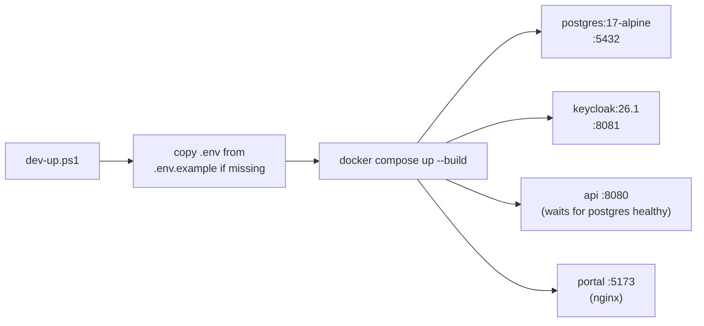
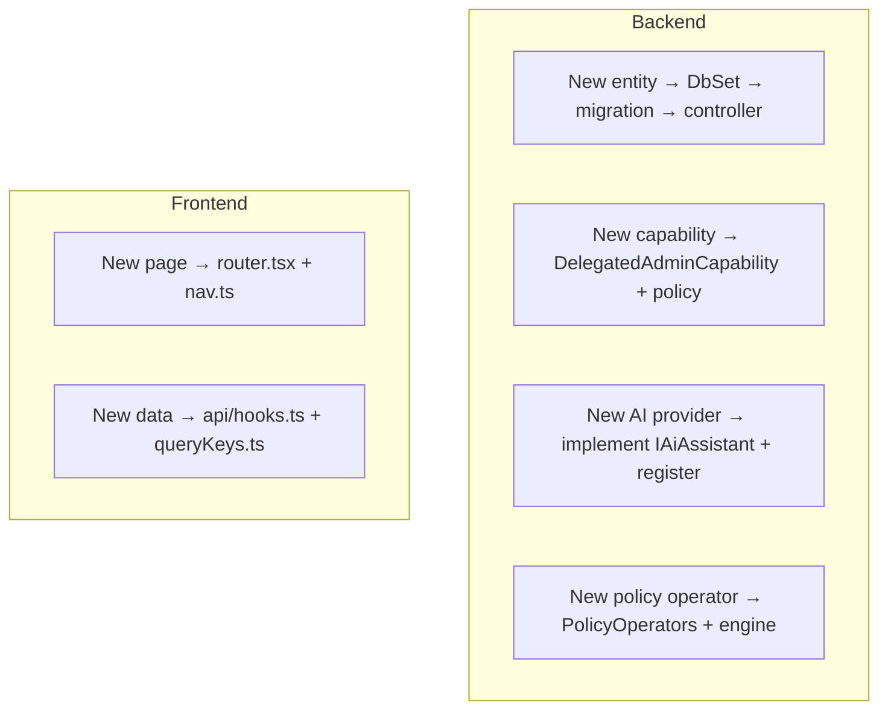

# 21 — Developer Guide

> Part of the [Documentation Portal](README.md).
> Related: [Repository Structure](07_Repository_Structure.md) · [Technology Stack](06_Technology_Stack.md) · [Configuration](20_Configuration.md) · [Code Walkthrough](23_Code_Walkthrough.md)

---

## Table of Contents

1. [Purpose & Audience](#purpose--audience)
2. [Prerequisites](#prerequisites)
3. [Running the Local Stack](#running-the-local-stack)
4. [Seeded Credentials](#seeded-credentials)
5. [Building & Testing](#building--testing)
6. [Verifying the Stack (Smoke & Performance)](#verifying-the-stack-smoke--performance)
7. [Project Conventions](#project-conventions)
8. [How to Extend the System](#how-to-extend-the-system)
9. [Troubleshooting](#troubleshooting)
10. [Cross-References](#cross-references)

---

## Purpose & Audience

This is the hands-on guide for a developer who has just cloned the repository and needs to **build,
run, test, and extend** the Authorization Control Plane. It is sourced directly from the scripts,
Dockerfiles, project files, and the local-deploy README, so the commands here are the ones the
project actually ships.

The fastest path is the container stack ([Running the Local Stack](#running-the-local-stack)); the
per-tier build/test commands ([Building & Testing](#building--testing)) are for working on one
component at a time. New contributors should also read [Repository Structure](07_Repository_Structure.md)
and [Configuration](20_Configuration.md).

## Prerequisites

| Tool | Version | Needed for |
|------|---------|-----------|
| Docker Desktop / Docker Engine + Compose | current | Running the full local stack (the primary path). |
| .NET SDK | **10.x** (all backend projects target `net10.0`) | Building/testing the backend outside containers. |
| Node.js + npm | **20+** (the portal image builds on Node 24) | Building/testing the frontend outside containers. |
| PowerShell | 7+ (`pwsh`) | The `scripts/*.ps1` helpers are PowerShell. |

Everything runs on Windows, macOS, or Linux. No AI provider or API key is required — the stack ships
with AI **off by default** (see [Configuration](20_Configuration.md)).

## Running the Local Stack

The one-command path uses the PowerShell helper from the repository root:

```powershell
.\scripts\dev-up.ps1            # foreground (build + up)
.\scripts\dev-up.ps1 -Detached  # background (adds -d)
```

[scripts/dev-up.ps1](../scripts/dev-up.ps1) copies `deploy/local/.env` from
[deploy/local/.env.example](../deploy/local/.env.example) if it is missing, then runs the equivalent
of:

```powershell
docker compose --env-file deploy/local/.env -f deploy/local/docker-compose.yml up --build
```



On startup the API applies EF Core migrations and seeds demo data (`Database:RunDevelopmentSetup`
and `Database:SeedDevelopmentData` default `true` in Development). The `api` service waits for
Postgres to report healthy before starting.

**Stop / reset:**

```powershell
.\scripts\dev-down.ps1    # docker compose down — stops containers, KEEPS the database volume
.\scripts\dev-reset.ps1   # docker compose down -v — stops AND wipes the Postgres volume (clean DB)
```

Both fall back to `.env.example` if `.env` does not exist.

**Ports and URLs:**

| Service | URL | Notes |
|---------|-----|-------|
| Portal | http://localhost:5173 | React admin portal (nginx-served build). |
| API | http://localhost:8080 | ASP.NET Core API. Health: `/health/live`, `/health/ready`. |
| Keycloak | http://localhost:8081 | Local OIDC provider (realm `authorization-local`). |
| PostgreSQL | localhost:5432 | Database `authorization`. |

> The API exposes **`/health/live`** and **`/health/ready`** — there is no bare `/health` endpoint.

## Seeded Credentials

All credentials below are **dev-only placeholders** seeded by the Keycloak realm import
[authorization-local-realm.json](../deploy/local/keycloak/authorization-local-realm.json) and the
API's demo-data seeder. None are real secrets — never put real secrets or customer data in
`deploy/local/.env`.

**Role plumbing.** Platform roles ride Keycloak **realm roles** (`PlatformSuperAdmin`,
`PlatformReadOnlyViewer`), while application-scoped roles ride the **`acp_app_role` user attribute**
(format `<applicationId>:<Role>`) mapped into the access token by the `acp-application-roles` client
scope. This is how one Keycloak login is scoped to a single application's admin surface — see
[Security Design](16_Security_Design.md).

**Portal logins — platform-level (realm roles):** all use password `admin_dev_password`.

| Username | Role | Access |
|----------|------|--------|
| `admin@local.test` | `PlatformSuperAdmin` | Full platform access (tenants, applications, everything). |
| `platform-viewer@local.test` | `PlatformReadOnlyViewer` | Read-only across the platform. |

**Portal logins — application-scoped (`acp_app_role` attribute):** all use password
`admin_dev_password`. One admin + one viewer per seeded application:

| Username | `acp_app_role` |
|----------|----------------|
| `pricing-management-admin@local.test` | `pricing-management:ApplicationAdmin` |
| `pricing-management-viewer@local.test` | `pricing-management:ReadOnlyViewer` |
| `intelligence-authoring-admin@local.test` | `intelligence-authoring:ApplicationAdmin` |
| `intelligence-authoring-viewer@local.test` | `intelligence-authoring:ReadOnlyViewer` |
| `market-reference-admin@local.test` | `market-reference:ApplicationAdmin` |
| `market-reference-viewer@local.test` | `market-reference:ReadOnlyViewer` |
| `lng-edge-admin@local.test` | `lng-edge:ApplicationAdmin` |
| `lng-edge-viewer@local.test` | `lng-edge:ReadOnlyViewer` |

**End user (runtime subject):**

| Username | Password | Notes |
|----------|----------|-------|
| `user7.lead@icis.com` | `pricing_lead_dev_password` | Pricing-lead end user; holds `price.publish` when `context.status = READY_TO_PUBLISH`. |

**Runtime clients (one per seeded application):** used for machine-to-machine authorization calls.

| Client ID | Secret | Grant |
|-----------|--------|-------|
| `pricing-management-runtime-client` | `pricing_management_dev_secret` | client-credentials |
| `intelligence-authoring-runtime-client` | `intelligence_authoring_dev_secret` | client-credentials |
| `market-reference-runtime-client` | `market_reference_dev_secret` | client-credentials |
| `lng-edge-runtime-client` | `lng_edge_dev_secret` | client-credentials |
| `pricing-management-user-client` | `pricing_management_user_dev_secret` | password (direct-access) grant |

**Infrastructure:**

| Service | Username | Password |
|---------|----------|----------|
| Keycloak admin console | `admin` | `admin_dev_password` |
| PostgreSQL | `authorization` | `authorization_dev_password` |

## Building & Testing

### Backend

The solution file is [backend/AuthorizationControlPlane.slnx](../backend/AuthorizationControlPlane.slnx):

```powershell
dotnet build backend/AuthorizationControlPlane.slnx
dotnet test  backend/AuthorizationControlPlane.slnx
```

Test projects (see [Repository Structure](07_Repository_Structure.md)):

| Project | Scope |
|---------|-------|
| `Authorization.Api.Tests` | API/controller + integration tests (boot the API in-process). |
| `Authorization.ContractTests` | Route/contract assertions. |
| `Authorization.Infrastructure.Tests` | Persistence + runtime-engine tests. |
| `Authorization.Sdk.Tests` | SDK client behaviour (retries, correlation, batch). |

Integration tests boot the real API via
[TestWebApplicationFactory.cs](../backend/tests/Authorization.Api.Tests/TestWebApplicationFactory.cs);
this works because `Program.cs` ends with `public partial class Program;`, exposing the entry point
to `WebApplicationFactory<Program>`.

### Frontend

Scripts from [frontend/package.json](../frontend/package.json):

```powershell
cd frontend
npm install          # (CI/containers use `npm ci` for reproducible installs)
npm run dev          # Vite dev server (http://localhost:5173)
npm run build        # tsc -b && vite build
npm test             # vitest run
npm run lint         # oxlint
npm run format       # prettier --check .   (use `npm run format:write` to apply)
npm run preview      # serve the production build locally
```

## Verifying the Stack (Smoke & Performance)

Two scripts validate a running stack end to end.

### Domain smoke test

```powershell
.\scripts\local-smoke.ps1
```

[scripts/local-smoke.ps1](../scripts/local-smoke.ps1) first checks `/health/live`, `/health/ready`,
and portal reachability, then exercises both runtime caller flows against the seeded
`pricing-management` application. The **subject is always derived from the verified token**, never
from request input:

- **Machine-to-machine** (client-credentials, `pricing-management-runtime-client`; `SERVICE_ACCOUNT`
  subject from the token's `azp` claim): `price.publish` **allows** with
  `context.status = READY_TO_PUBLISH` and **denies** (`MISSING_CONTEXT`) without it; a conflicting
  body `subject.email` → 403 `SUBJECT_MISMATCH`; a mixed **batch** returns ordered allow/deny results.
- **Negative auth:** no token → 401 `CALLER_UNAUTHENTICATED`; a valid token used against the wrong
  application (`market-reference`) → 403 `CALLER_APPLICATION_MISMATCH`.
- **User** (password grant, `pricing-management-user-client`, `user7.lead@icis.com`; `USER` subject
  from `preferred_username`): the same allow/deny `price.publish` checks.

See [User Flows](10_User_Flows.md) for the full request/response shapes.

### Performance sanity

```powershell
.\scripts\perf-authorize.ps1 -Requests 1000 -Concurrency 20
```

[scripts/perf-authorize.ps1](../scripts/perf-authorize.ps1) acquires a client-credentials token,
warms the API with 50 requests, then issues `-Requests` authorize calls at `-Concurrency` (default
1000 @ 20) over a shared pooled `HttpClient`, and reports average/min/max and p50/p90/p95/p99 plus
throughput. The MVP target is **`/v1/authorize` p95 ≤ 50 ms** for warmed requests at 20 concurrent
clients, excluding cold start and token acquisition
([deploy/local/README.md](../deploy/local/README.md)). The measured `duration_ms` behind this comes
from the engine — see [Logging & Observability](18_Logging_and_Observability.md) and
[Non-Functional Requirements](03_Non_Functional_Requirements.md).

## Project Conventions

| Area | Convention |
|------|-----------|
| Backend DI | Each module exposes an `AddX(...)` extension; composed in [Program.cs](../backend/src/Authorization.Api/Program.cs) (`Api` is the sole composition root). |
| Options | Only `DatabaseOptions`/`OidcOptions`/`PortalOptions` are bound **and validated** via [Configuration/ServiceCollectionExtensions.cs](../backend/src/Authorization.Api/Configuration/ServiceCollectionExtensions.cs); `AiOptions` is bound without validation (see [Configuration](20_Configuration.md)). |
| Governance mutations | Persist via `GovernanceControllerBase.SaveGovernanceMutationAsync` so the entity change and its audit event commit in one `SaveChangesAsync`. |
| Errors | Return the canonical error envelope (see [Error Handling](17_Error_Handling.md)). |
| Vocabulary | Use the shared constants (`AuditEventTypes`, `GovernanceErrorCodes`, `GovernanceVocabulary`, `PolicyOperators`) — never string literals. |
| Concurrency | Every governed entity carries an integer `version` optimistic-concurrency token. |
| Frontend routes | Add in [router.tsx](../frontend/src/router.tsx); nav paths in [workspace/nav.ts](../frontend/src/workspace/nav.ts). |
| Frontend data | React Query hooks in [api/hooks.ts](../frontend/src/api/hooks.ts); cache keys in [api/queryKeys.ts](../frontend/src/api/queryKeys.ts). |

## How to Extend the System



Detailed extension points are in [Solution Design](05_Solution_Design.md#extension-points).

**Worked example — add a governance endpoint:**

1. Add request/response DTOs to
   [Contracts/GovernanceRequests.cs](../backend/src/Authorization.Api/Contracts/GovernanceRequests.cs).
2. Add an action to the relevant controller under
   [Controllers/Governance/](../backend/src/Authorization.Api/Controllers/Governance/), guarded by
   the correct delegated-admin capability policy.
3. Persist through `SaveGovernanceMutationAsync`, emitting a new `AuditEventTypes` constant so the
   change is audited atomically.
4. Add a React Query hook in [api/hooks.ts](../frontend/src/api/hooks.ts) (with a key in
   [api/queryKeys.ts](../frontend/src/api/queryKeys.ts)) and wire it into a page.

**Adding a new policy operator:** add the identifier to
[PolicyOperators.cs](../backend/src/Authorization.Infrastructure/RuntimeAuthorization/PolicyOperators.cs)
(the single registry) and its evaluation in the engine's `Compare`. The API validator and the AI
drafting prompt both derive from that registry, so they stay in sync automatically — see
[Business Rules](19_Business_Rules.md).

## Troubleshooting

| Symptom | Check |
|---------|-------|
| Portal can't reach API | `VITE_API_BASE_URL` (baked at build time) and API CORS `Cors:AllowedOrigins` (default `http://localhost:5173`). |
| Login loops / token rejected | `Oidc:Authority` / `VITE_OIDC_AUTHORITY` must match the browser's Keycloak URL; check Keycloak health at `:8081`. In Docker, `Oidc:MetadataAddress` provides back-channel discovery. |
| API stuck starting / not ready | Postgres healthcheck; hit `/health/ready` (DB reachability). Liveness (`/health/live`) stays healthy even when the DB is down. |
| AI surfaces missing | `Ai:Enabled` must be `true` **and** the specific feature enabled; a misconfigured provider degrades to disabled. See [AI Features](15_AI_Features.md). |
| Config validation errors at startup | Validated options fail fast — read the startup log and see [Configuration](20_Configuration.md). |
| Need a clean database | `.\scripts\dev-reset.ps1` wipes the Postgres volume, then `dev-up.ps1` re-seeds. |

## Cross-References

- What lives where: [Repository Structure](07_Repository_Structure.md)
- Frameworks and versions: [Technology Stack](06_Technology_Stack.md)
- Every setting these commands rely on: [Configuration](20_Configuration.md)
- Startup internals and request pipeline: [Code Walkthrough](23_Code_Walkthrough.md)
- Runtime flows the smoke test exercises: [User Flows](10_User_Flows.md)
- Auth model behind the seeded roles: [Security Design](16_Security_Design.md)
