# 22 — User Manual

> Part of the [Documentation Portal](README.md).
> Related: [UI/UX Documentation](09_UI_UX_Documentation.md) · [User Flows](10_User_Flows.md) · [Feature Documentation](08_Feature_Documentation.md)

---

## Table of Contents

1. [Purpose & Who This Manual Is For](#purpose--who-this-manual-is-for)
2. [Core Concepts You Need to Know](#core-concepts-you-need-to-know)
3. [Signing In & Where You Land](#signing-in--where-you-land)
4. [Understanding Your Access: Roles & Capabilities](#understanding-your-access-roles--capabilities)
5. [Getting Around the Portal](#getting-around-the-portal)
6. [The Platform Workspace, Page by Page](#the-platform-workspace-page-by-page)
7. [An Application Workspace, Page by Page](#an-application-workspace-page-by-page)
8. [Step-by-Step Workflows](#step-by-step-workflows)
9. [Using AI Assistance](#using-ai-assistance)
10. [Tips, Shortcuts & Troubleshooting](#tips-shortcuts--troubleshooting)
11. [Cross-References](#cross-references)

---

## Purpose & Who This Manual Is For

This is a **task-oriented manual for portal users** — the administrators who sign in to the web
portal to manage *who can do what* in each connected application. It walks through **every screen,
every button, and every workflow** so that someone with no prior context can sit down and use the
product confidently.

The portal is the human-facing front end of the Authorization Control Plane. Applications ask the
platform, at runtime, "may this subject perform this action?"; this portal is where administrators
**define and govern the rules** behind those answers — roles, permissions, policies, and the access
granted to individual users.

**Who uses it:**

| You are… | You mostly work in… | You can… |
|----------|---------------------|----------|
| A **platform administrator** | The Platform workspace + any application | Everything: manage tenants, register applications, and administer every app. |
| A **platform read-only viewer** | The Platform workspace (read-only) | See everything across all applications, but change nothing. |
| A **tenant administrator** | Applications owned by your tenant | Fully administer every application under your tenant. |
| A **delegated application administrator** | A single application workspace | Fully administer *your one* application (roles, permissions, policies, assignments). |
| A **read-only viewer** (app or tenant) | Your scope (read-only) | Inspect configuration and audit trails without making changes. |

> The portal only ever **shows controls you are allowed to use** — but the API is the real security
> boundary. Even if a button were shown, the server independently re-checks your permission on every
> request. See [Security Design](16_Security_Design.md).

## Core Concepts You Need to Know

A handful of terms recur on every screen. Understanding them makes the rest of the manual obvious.

| Term | What it means in this portal |
|------|------------------------------|
| **Tenant** | An organization that owns one or more applications. The top of the hierarchy. |
| **Application** | A single protected system (e.g. *pricing-management*). Almost all day-to-day work happens inside one application's workspace. |
| **Role** | A named bundle of permissions granted to users (e.g. *pricing-lead*). Roles can be marked **privileged** (higher risk, must be time-boxed when assigned). |
| **Permission** | A single `resource.action` right (e.g. `price.publish`) that roles and policies govern. |
| **Assignment** | A grant that gives a **subject** (a user or service account, identified by email) a role — optionally with an expiry date and ABAC attributes. |
| **Policy** | A conditional **ALLOW** or **DENY** rule evaluated against a permission using attributes (amount, region, status, time…). Only **published** policies affect real decisions. |
| **Reference data** | Named JSON lookup documents (e.g. an approved-regions list) that policies reference via `reference.<key>`. |
| **Decision** | The recorded result of an authorization check — `ALLOW` or `DENY` (with a reason) — plus the roles, permissions, and policies that matched. |
| **Obligation** | An advisory instruction returned alongside a decision (e.g. "log this event") for the calling app to honor. |
| **Certification** | A periodic access review campaign: snapshot current grants, decide keep/revoke per user, then apply. |
| **Break-glass** | Emergency, short-lived access (max 24h, auto-expiring) recorded as a high-visibility audit event. |

The scope hierarchy you will see reflected in breadcrumbs and navigation:

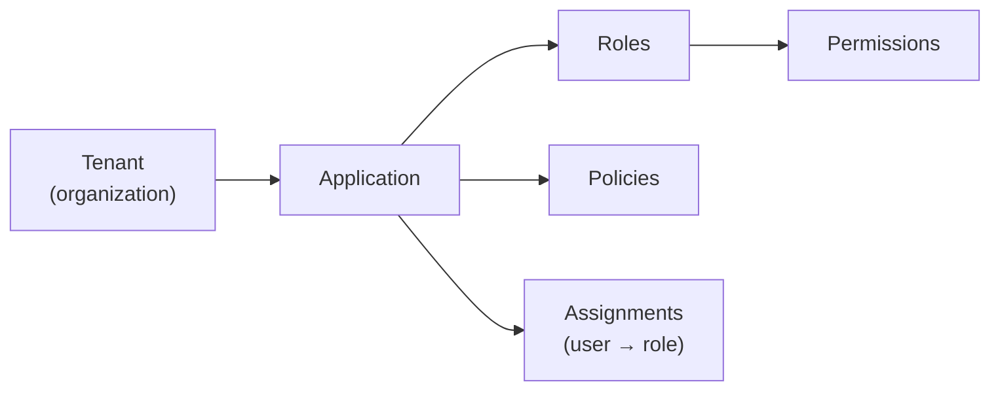
```mermaid
flowchart LR
    Tenant["Tenant<br/>(organization)"] --> App["Application"]
    App --> Roles["Roles"] --> Perms["Permissions"]
    App --> Policies["Policies"]
    App --> Assign["Assignments<br/>(user → role)"]
```

## Signing In & Where You Land

1. Open the portal — **http://localhost:5173** in the local stack.
2. The portal first attempts a **silent sign-in**: if you already have a session with the identity
   provider (Keycloak), you are signed in with no prompt. Otherwise you are redirected to the
   Keycloak login page to enter your credentials.
3. Sign-in uses **OpenID Connect** with the authorization-code flow and **PKCE**. Your access token
   is held **in memory only** (never in `localStorage`), and is refreshed silently in the background,
   so a page reload keeps you signed in without re-typing your password.

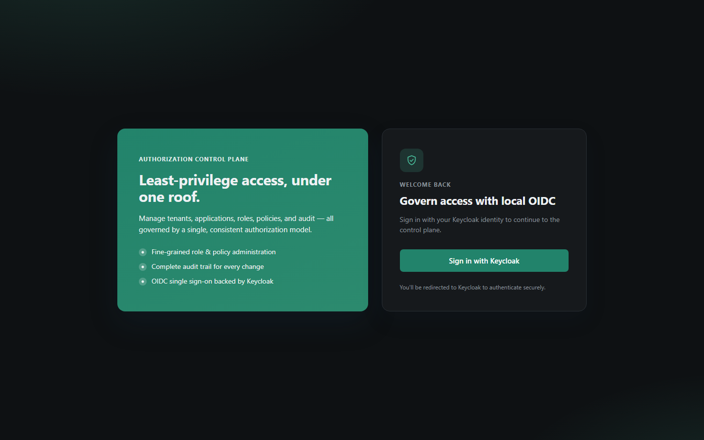

*Portal sign-in — authentication is delegated to Keycloak (OpenID Connect authorization-code + PKCE). After login you are routed automatically based on the roles in your token.*

**Where you land depends on your roles:**

- **Platform principals** (platform super-admin or platform read-only viewer) land on the **Platform
  Overview** at `/platform`.
- A **delegated application administrator** with no platform role is taken **straight into their
  application's workspace** (`/app/{appId}`) — they never see the platform area.
- If you hold both, the **platform** landing takes precedence.

*A delegated administrator's scoped view — the portal opens directly into the one application they administer, with no cross-application platform navigation.*

To sign out, open the **user menu** (your avatar, top-right) and choose **Sign out**; this ends your
session at Keycloak and clears the in-memory token.

## Understanding Your Access: Roles & Capabilities

What you can see and do is determined by the **roles in your token**, which resolve to a set of
**capabilities**. The portal hides any control your capabilities don't cover; if a page or button is
missing, it's because your role doesn't grant it.

**The eight capabilities:**

| Capability | Lets you… |
|------------|-----------|
| **Manage application** | Configure the application, its identity providers, and its lifecycle. |
| **Manage roles** | Create, edit, and delete roles. |
| **Manage permissions** | Create, edit, and delete permissions. |
| **Map role ↔ permission** | Grant and revoke permissions on roles in the access matrix. |
| **Manage policies** | Author, edit, and publish policies (and reference data). |
| **Assign roles** | Grant and revoke user assignments, including break-glass. |
| **View audit** | View the audit trail, activity, and decision analytics. |
| **Read-only view** | View configuration without making changes. |

**How roles map to capabilities:**

| Role | Source | Scope | Capabilities |
|------|--------|-------|--------------|
| **PlatformSuperAdmin** | Identity-provider realm role | Every tenant & application | All eight. |
| **PlatformReadOnlyViewer** | Identity-provider realm role | Every application | View audit + read-only. |
| **ApplicationAdmin** | `acp_app_role` = `{appId}:ApplicationAdmin` | One application | All eight (for that app). |
| **ReadOnlyViewer** | `acp_app_role` = `{appId}:ReadOnlyViewer` | One application | View audit + read-only. |
| **TenantAdmin** | `acp_tenant_role` = `{tenantId}:TenantAdmin` | Every app under a tenant | All eight (for those apps). |
| **TenantReadOnlyViewer** | `acp_tenant_role` = `{tenantId}:TenantReadOnlyViewer` | Every app under a tenant | View audit + read-only. |

Only **PlatformSuperAdmin** can create/edit tenants and register new applications. Both platform
roles can *see* every application; delegated and tenant roles are scoped to their own application(s).

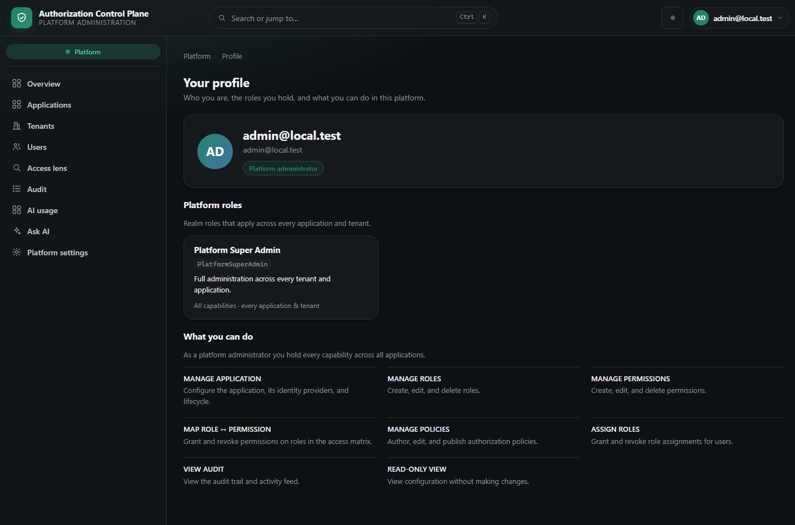

*Your Profile — confirm your identity and see exactly which platform and per-application roles you hold and what they let you do.*

## Getting Around the Portal

The portal has **two workspaces**, each with its own left-hand navigation:

- The **Platform workspace** (`/platform/…`) — cross-application administration.
- An **Application workspace** (`/app/{appId}/…`) — everything about one application.

The **scope is always visible in the URL and breadcrumbs**, so you can tell at a glance whether you
are working platform-wide or inside a single application.

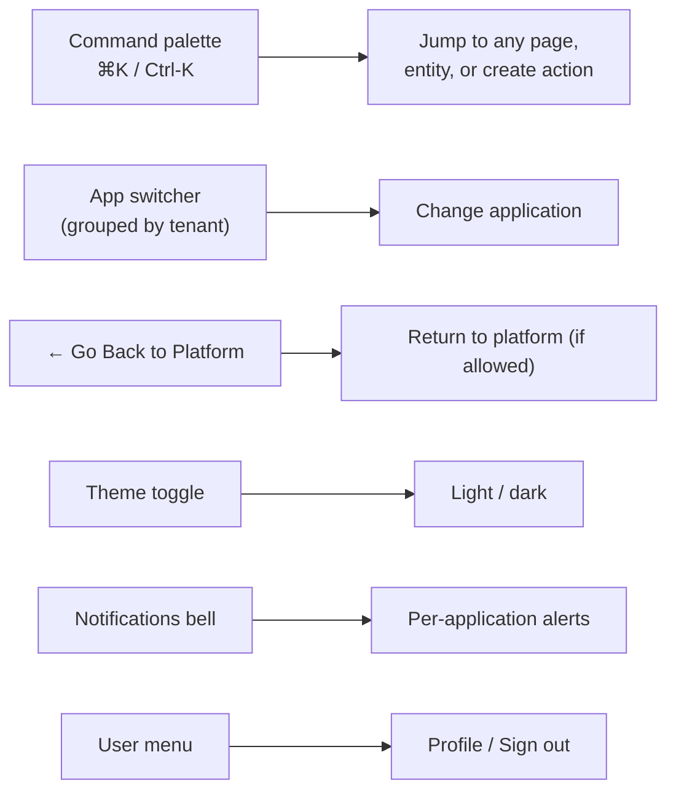
```mermaid
flowchart LR
    Palette["Command palette<br/>⌘K / Ctrl-K"] --> Jump["Jump to any page,<br/>entity, or create action"]
    Switcher["App switcher<br/>(grouped by tenant)"] --> Apps["Change application"]
    Back["← Go Back to Platform"] --> Plat["Return to platform (if allowed)"]
    Theme["Theme toggle"] --> Mode["Light / dark"]
    Bell["Notifications bell"] --> Alerts["Per-application alerts"]
    Menu["User menu"] --> Id["Profile / Sign out"]
```

**Navigation mechanics:**

- **Command palette** — press **⌘K** (macOS) or **Ctrl-K** (Windows/Linux), or click the
  **"Search or jump to…"** box in the top bar. It fuzzy-searches pages, applications, roles,
  permissions, and policies, and offers **create** actions and **switch-application** shortcuts.
  Arrow keys move the highlight, **Enter** runs it, **Esc** closes.
- **App switcher** — in an application workspace, a dropdown in the sidebar lets you jump to another
  application. Applications are **grouped by their owning tenant**.
- **← Go Back to Platform** — shown in an application's sidebar only if you have platform access, to
  return to the platform area.
- **Notifications bell** — in an application workspace, surfaces per-application alerts.
- **Theme toggle** — switches light/dark; your choice is remembered across sessions.
- **User menu** — your avatar (top-right) opens **Your profile** and **Sign out**.
- **Deep links & bookmarks** — table filters are kept in the URL, so a filtered view can be shared or
  reloaded. Opening an application you can't access returns you to the platform list with an
  explanatory message.

## The Platform Workspace, Page by Page

The Platform workspace is available to platform principals (and tenant admins, filtered to their
tenant). Its left nav has nine destinations.

### Overview — `/platform`

The platform home. KPI cards summarize **tenants, applications, users, roles, permissions, policies,
and assignments** (active vs total); an **activity trend** shows event volume over the last 14 days;
side panels break applications down **by risk** and **by tenant**; and a **recent activity** feed
lists the latest governance events. An **AI assistance** panel shows whether AI is enabled and which
features are on. The **Platform map** button opens an interactive tenant → application tree.

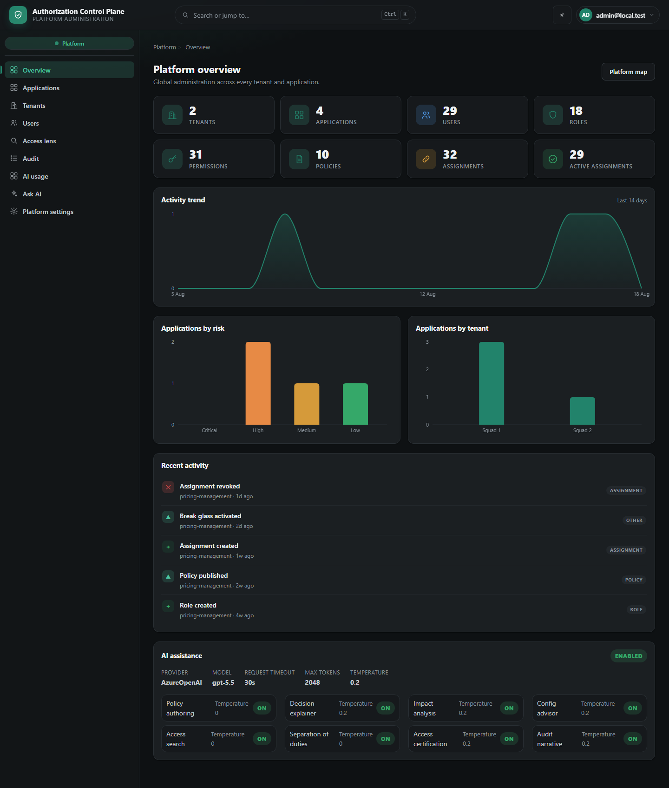

*Platform Overview — global KPIs, a 14-day activity trend, risk/tenant breakdowns, and a live activity feed.*

### Applications — `/platform/applications`

A searchable, filterable table of **every application across all tenants**, with columns for name,
tenant, risk level, and status. Filter by **tenant, status, and risk**. Platform admins get a
**New application** button (and a **Portfolio map**). Click any application to open its workspace.

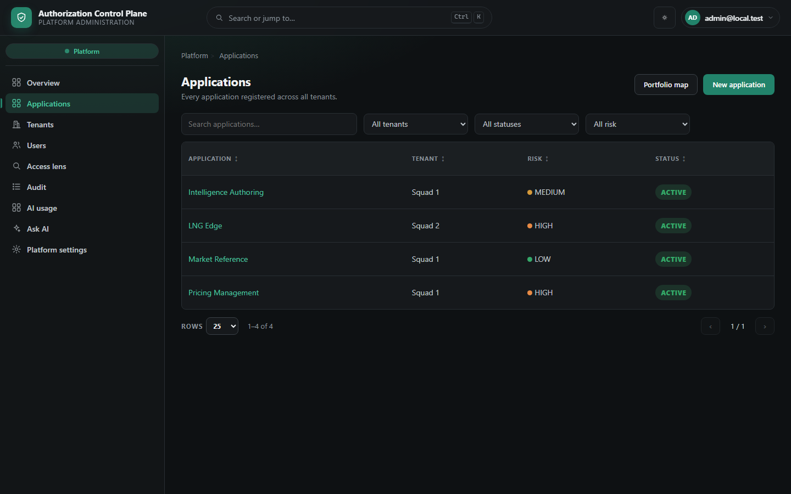

*Applications — the full portfolio across every tenant, with search and tenant/status/risk filters; platform admins can register a new application here.*

### Tenants — `/platform/tenants` (and Tenant detail `/platform/tenants/:tenantId`)

Lists the **tenants** (organizations) and the applications each owns. Opening a tenant shows its
stats (application count, roles, total/active assignments), a filterable table of its applications,
and a small tenant → apps map.

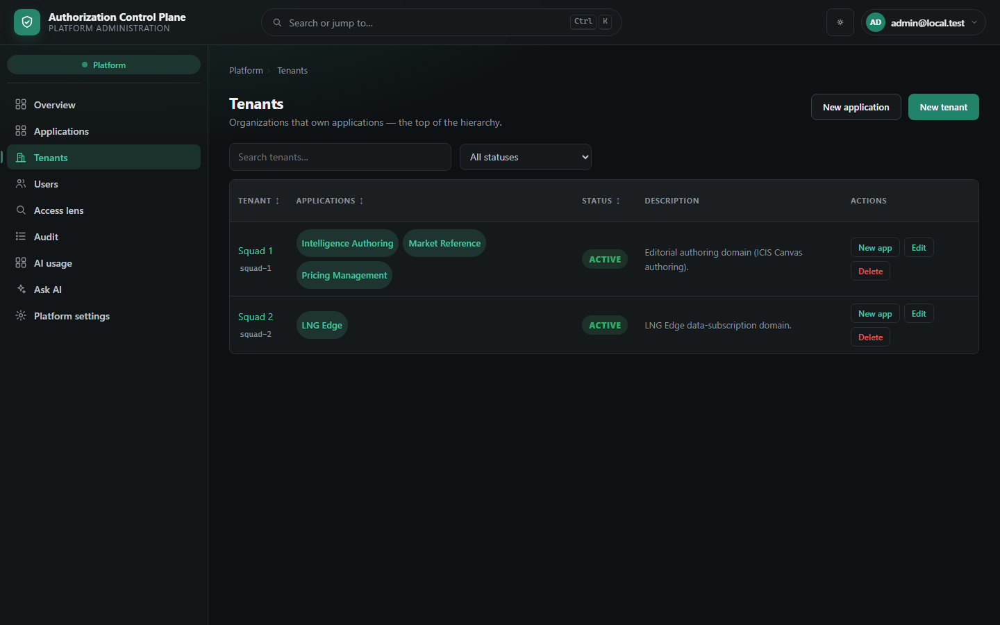

*Tenants — organizations that own applications; open one to see its applications and rolled-up access stats.*

### Users — `/platform/users` (and User detail `/platform/users/:email`)

A **directory of every subject** (users and service accounts) known across the platform, searchable
by email or name. Opening a user shows their **grants across all applications** — role, state, and
expiry — with **edit/revoke** actions where you have permission. When the **access-certification** AI
feature is on, a **Review access** button recommends keep/revoke per grant with a rationale.

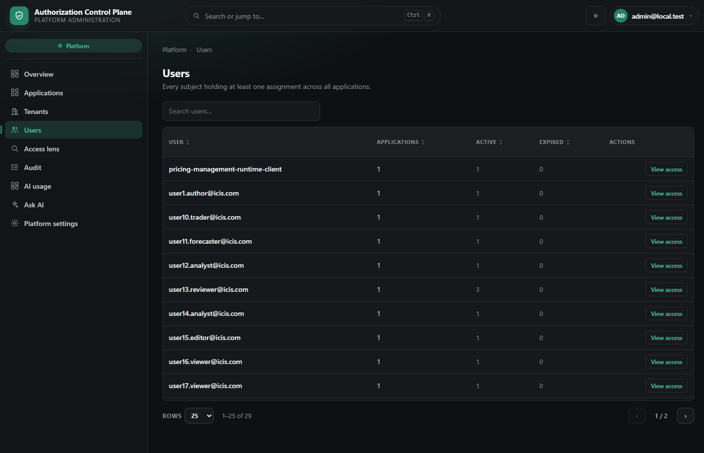

*Users — the cross-application subject directory; open a user to review and manage every grant they hold.*

### Access lens — `/platform/access-lens`

A **hierarchical explorer** of access: drill from **tenant → application → roles → permissions** to
understand how access is structured and who ends up with what.

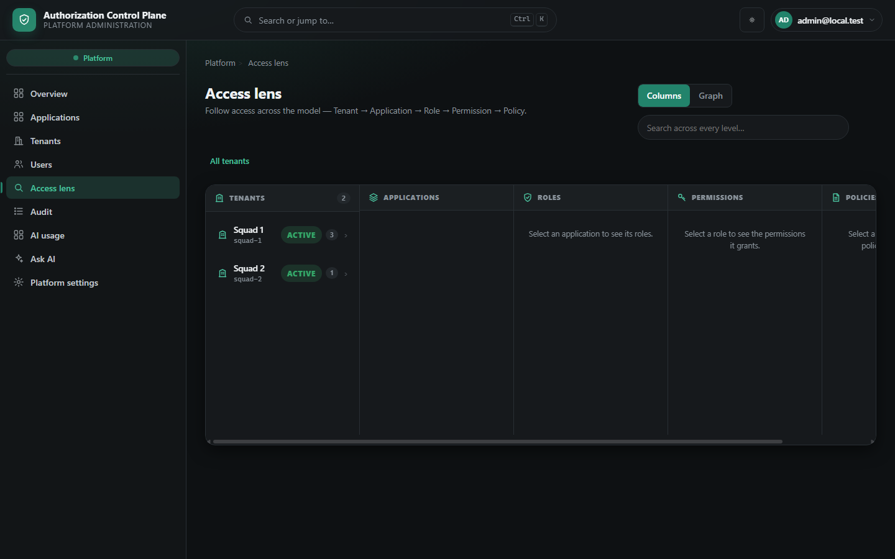

*Access lens — navigate the access hierarchy from tenants down to individual role/permission grants.*

### Audit — `/platform/audit`

A comprehensive, searchable **event log** of every governance change (roles, permissions, policies,
assignments) across all accessible applications, with a category filter and an **activity calendar**
heatmap. Each event expands to show old/new values and correlation details. When the
**audit-narrative** AI feature is on, **Generate summary** produces a plain-English recap of recent
activity for reviews.

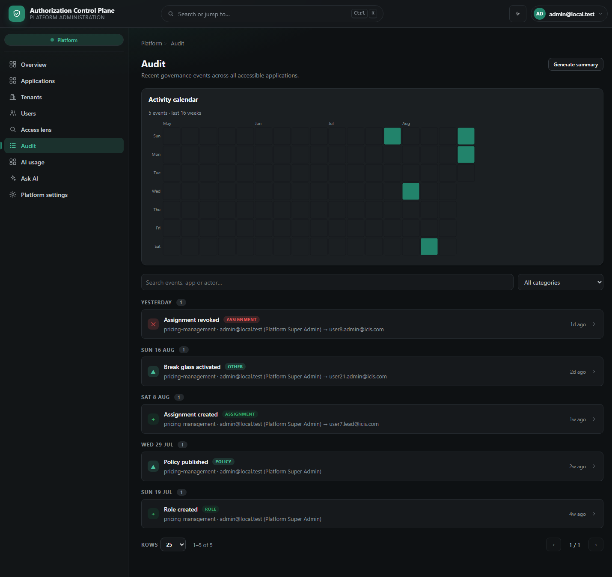

*Audit — search and filter governance events across every application, with an activity heatmap and an optional AI-generated summary.*

### AI usage — `/platform/ai-usage`

Observability for AI assistance. Choose a **time window** (e.g. 7/30/90 days) to see **invocation
trends, per-feature usage, success rate, token counts, and estimated cost**, plus a **prompt log** of
the exact free-text prompts submitted (filterable by feature and failures-only) for review. Aggregate
charts use invocation metadata only.

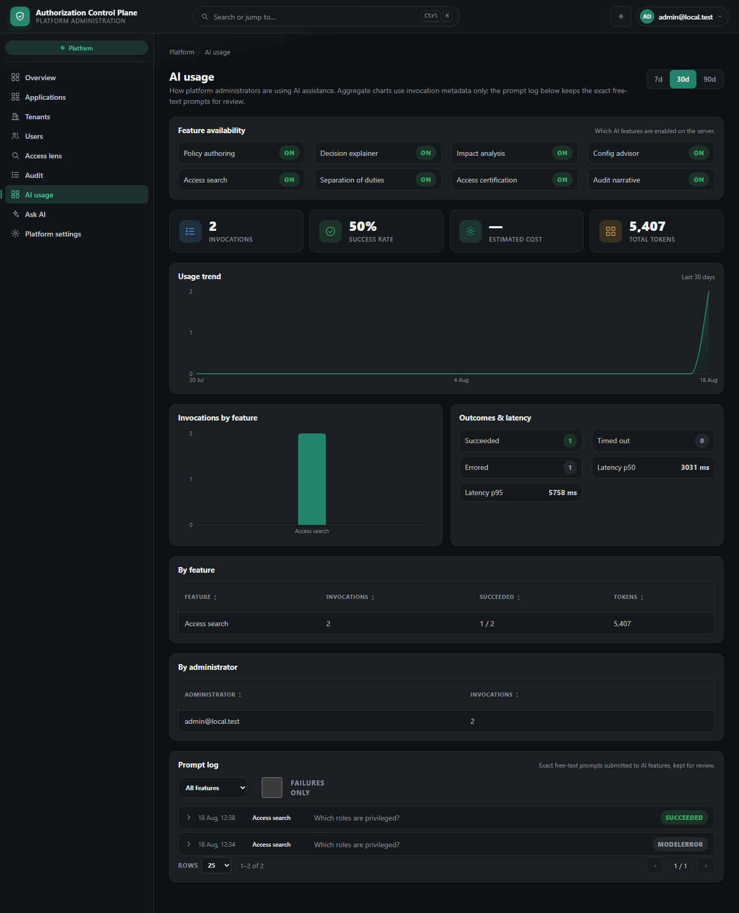

*AI usage — how administrators are using AI assistance, including a reviewable prompt log; visible only when AI is enabled.*

### Ask AI — `/platform/ask-ai`

A **natural-language access search** across every application: ask questions like "Who can publish
prices?" and get **citation-backed** answers. Ask AI is strictly **read-only** — it explains access
but never grants, revokes, or changes anything, and it says so (and suggests a rephrase) when a
question can't be answered. Available only when the **access-search** feature is enabled.

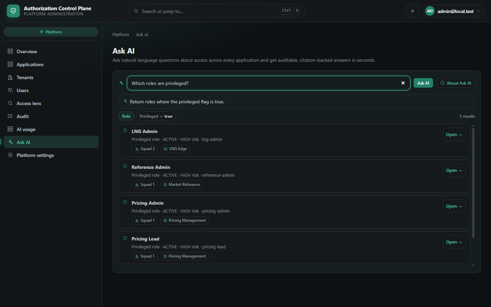

*Ask AI — ask access questions in plain language and get auditable, citation-backed answers; read-only by design.*

### Platform settings — `/platform/settings`

A **reference** for the access model and AI capabilities (not a place that changes runtime behavior).
An **Access model** tab documents the platform roles, the delegated application roles and the
capabilities each bundles; an **AI features** tab lists all eight AI features with what each does,
where to find it, and an example — and whether AI is currently enabled.

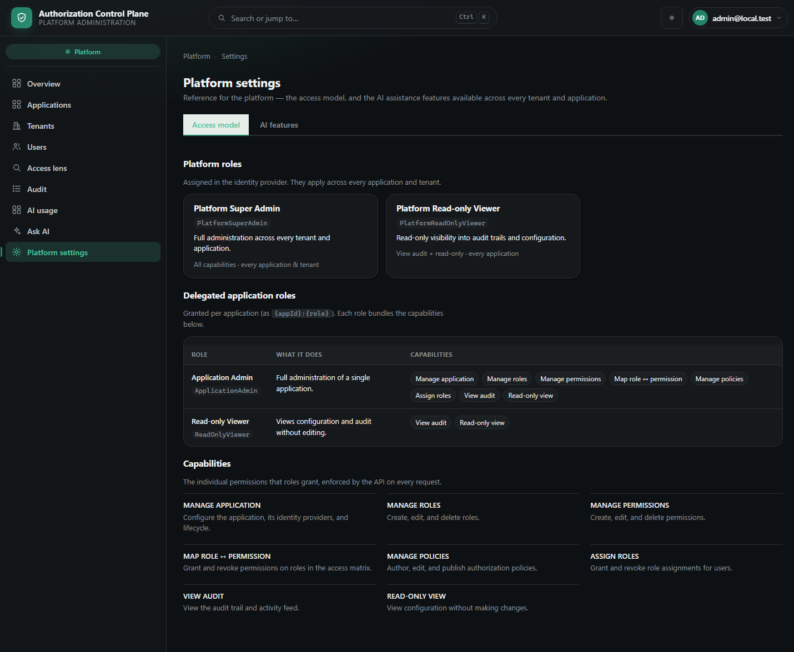

*Platform settings — a living reference for the role/capability model and the AI feature catalog.*

### Profile — `/platform/profile`

Your identity and effective access: the platform and per-application roles you hold and the
capabilities they grant. (See the Profile screenshot in
[Understanding Your Access](#understanding-your-access-roles--capabilities).)

## An Application Workspace, Page by Page

Everything about a single application lives here. The left nav has thirteen destinations. Which
**action** buttons appear depends on your capabilities for *this* application; read-only viewers see
the same pages without create/edit/delete controls.

### Dashboard — `/app/{appId}`

The application's home. KPI tiles show **roles** (with privileged count), **permissions**,
**policies** (live vs draft), and **assignments** (active); donut charts show **role risk
distribution** and **policy posture** (allow vs deny). Quick-action buttons — **New role**, **New
permission**, **New policy** — appear for admins. Panels highlight **expiring access**, and, when the
relevant AI features are on, **Configuration advisory** (Summarize with AI) and **Separation of
duties** (Draft rule with AI). An access graph visualizes roles → permissions.

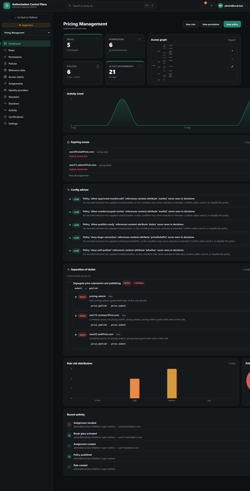

*Application Dashboard — configuration health at a glance: role/permission/policy/assignment KPIs, risk and policy-posture donuts, expiring access, and optional AI advisories.*

### Roles — `/app/{appId}/roles` (and Role detail `/…/roles/:roleKey`)

A table of the application's **roles**: name (with a risk dot), key, **privileged** flag, permission
count, and status. Search and filter by status/privileged; admins get **New role**. Opening a role
shows its details, the permissions it grants (with **Publish**/unmap controls), the users assigned to
it (with **Revoke**), and its activity history.

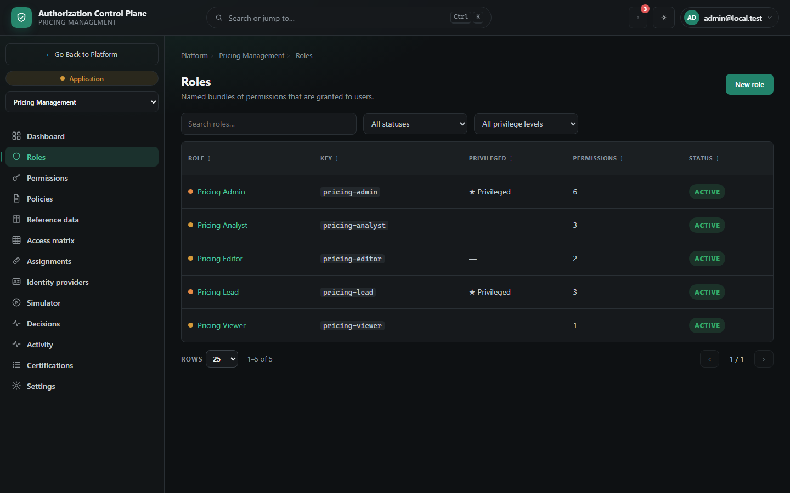

*Roles — named bundles of permissions; open one to manage its permissions and see who holds it.*

### Permissions — `/app/{appId}/permissions` (and Permission detail)

A table of the application's **permissions** (`resource.action`) with resource, action, and status.
Opening a permission shows the roles that grant it, the policies that evaluate it, and its history.
Admins can create and edit permissions.

### Policies — `/app/{appId}/policies` (and Policy detail)

A table of **conditional ALLOW/DENY rules**: policy key (with a green/red effect pip), the permission
it governs, effect, priority, and **state** (DRAFT/PUBLISHED…). Filter by effect and state. Opening a
policy reveals the **visual condition builder** (match All/Any/None + attribute/operator/value rows),
optional **obligations**, and — when enabled — an AI **Draft with AI** box and an **Analyze publish
impact** button. The **Publish policy** button turns a draft live; *draft policies are never
evaluated at runtime.*

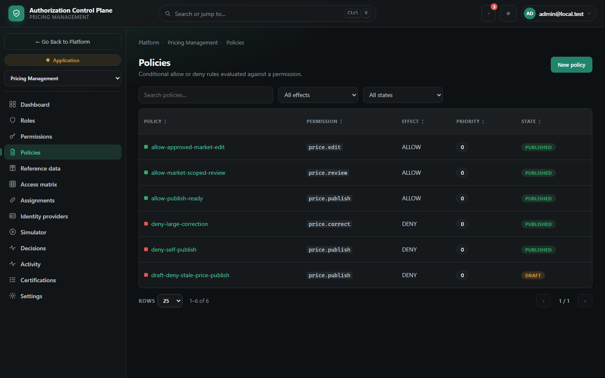

*Policies — author ABAC conditions and obligations against a permission; only published policies affect runtime decisions.*

### Reference data — `/app/{appId}/reference-data`

Named **JSON lookup documents** referenced by policy conditions via `reference.<key>` (e.g. an
approved-regions list). Create, edit, and archive them here so shared values live in one place.
Requires the *manage policies* capability.

### Access matrix — `/app/{appId}/matrix`

A **roles × permissions** grid. Each cell shows whether a role grants a permission and whether that
mapping is **published** or still **draft**. Click cells (with *map role ↔ permission*) to grant or
revoke, individually or in bulk.

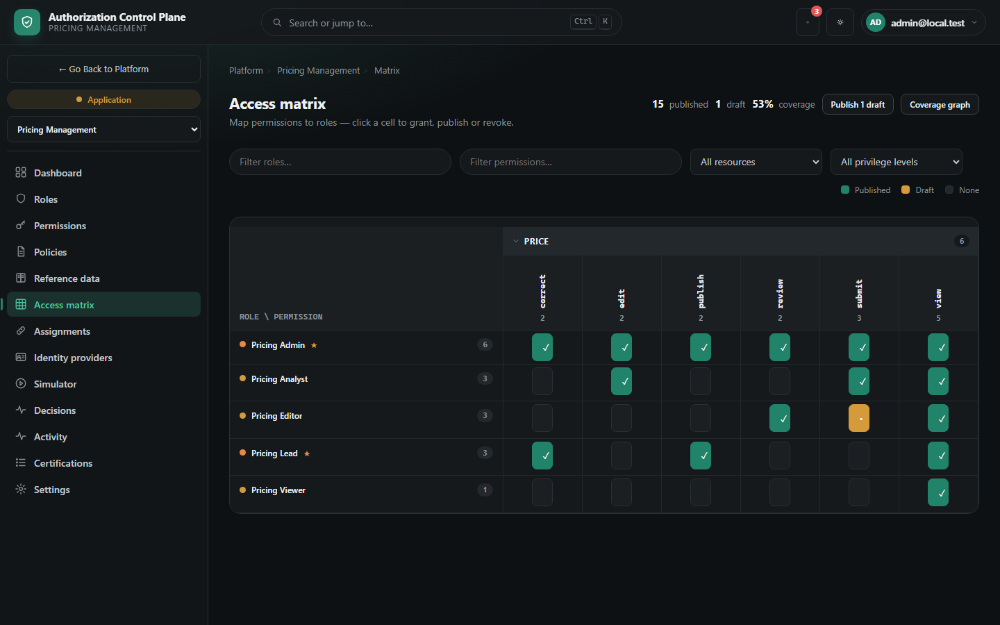

*Access matrix — grant or revoke permissions on roles at the intersection of the grid; cells show published vs draft mappings.*

### Assignments — `/app/{appId}/assignments`

Grant and manage **user → role** access. The table lists subject, role, state, and expiry, with a
donut of assignment states and filters for state and expiry window. Action buttons: **Grant access**
(create a grant), **Break-glass** (emergency access, max 24h), **Import** (bulk), **Export CSV**, and
**Assignment graph**. Privileged roles **require an expiry**. Per-row **Edit** and **Revoke** are
available to admins.

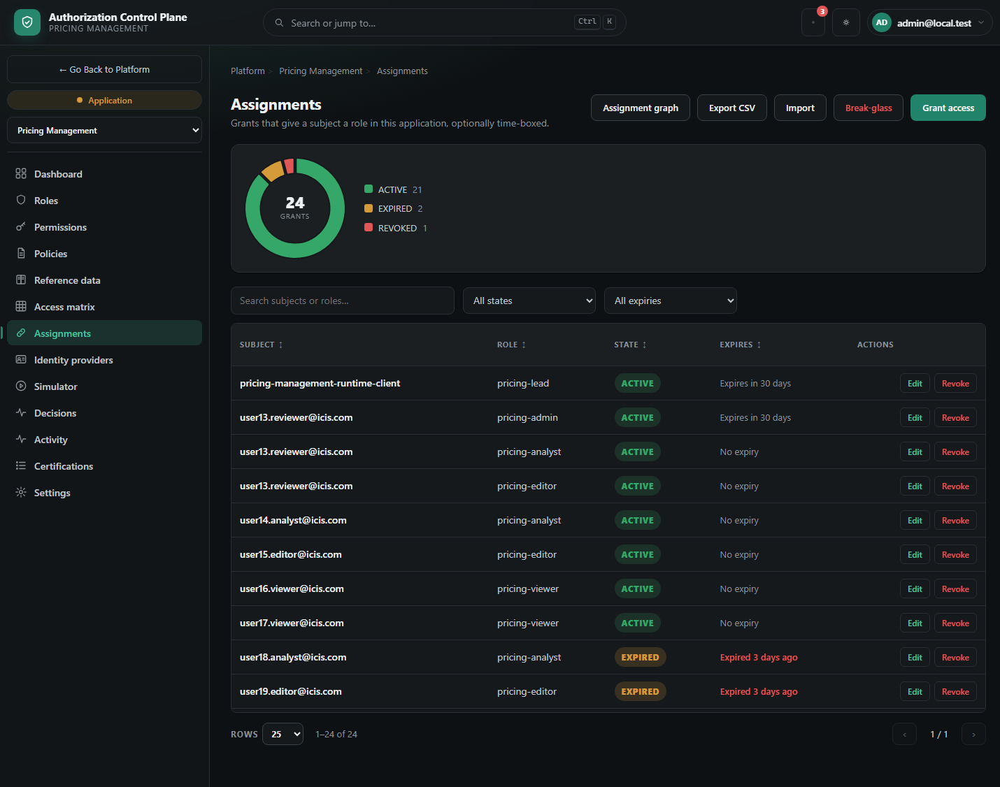

*Assignments — grant, edit, revoke, break-glass, and import/export role grants; privileged grants must be time-boxed.*

### Identity providers — `/app/{appId}/identity`

Configure the **OIDC providers** whose tokens this application accepts at runtime: issuer, audience,
allowed algorithms, subject claim, and subject type. Requires *manage application*.

### Simulator — `/app/{appId}/simulator`

**Test an authorization decision** without affecting anything. Enter subject, resource type/id,
action, and optional context/attributes, then press **Evaluate**. The result shows **ALLOWED** or
**DENIED** (with the deny **reason**) and the matched roles, permissions, and policies — using the
**same engine as runtime**. When the **decision-explainer** feature is on, **Explain this decision**
adds a plain-English rationale and remediation steps.

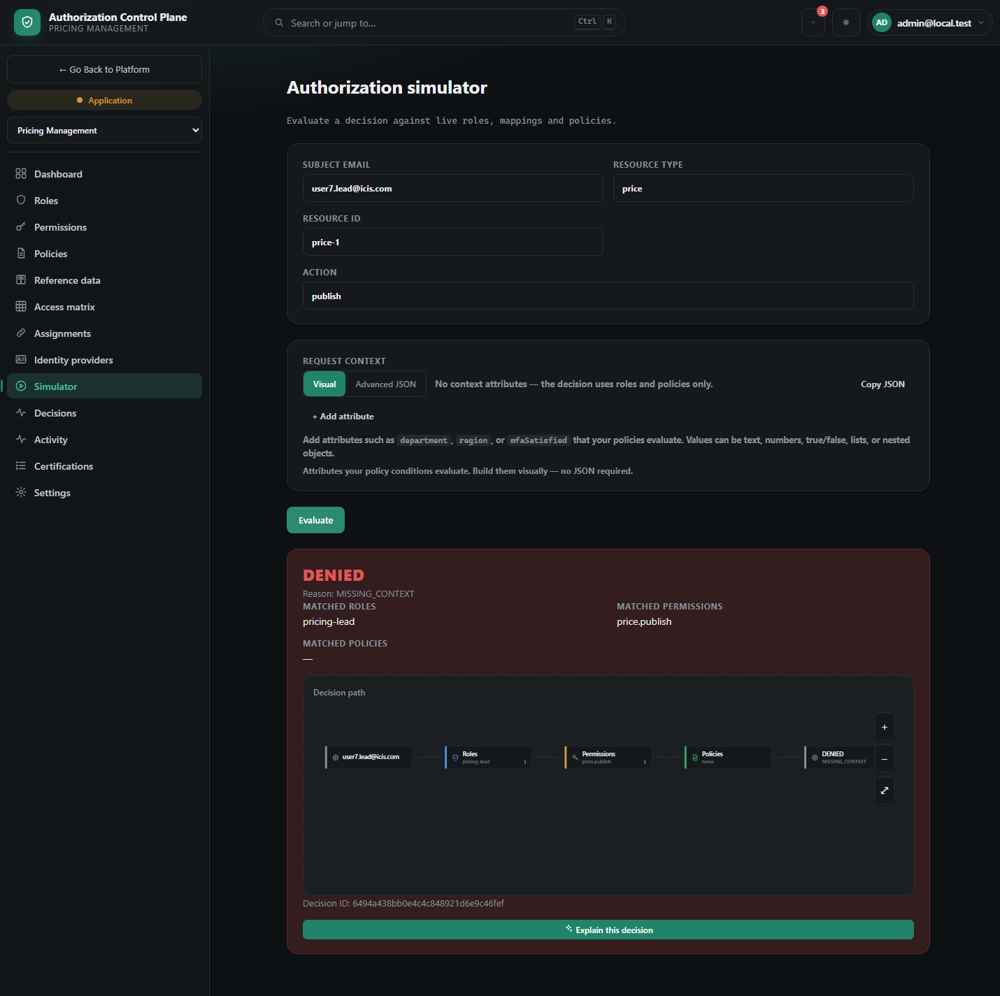

*Simulator — evaluate any decision with the real runtime engine and see exactly what matched.*

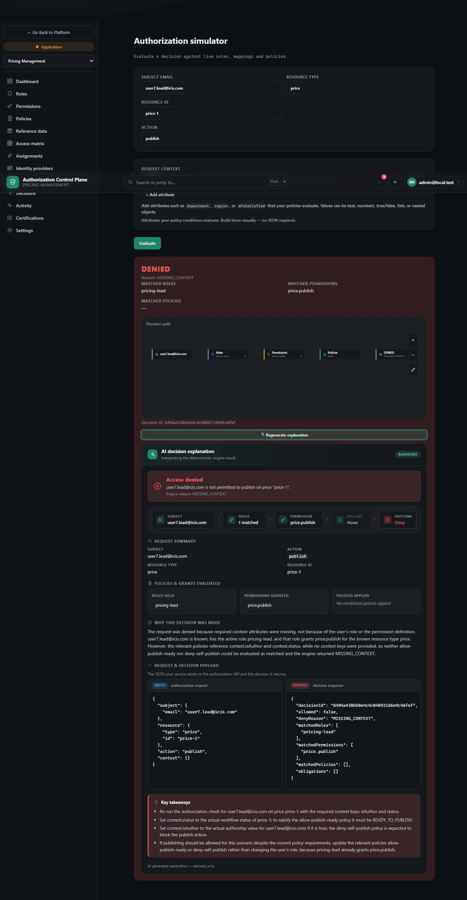

*Explain this decision — an optional, advisory AI rationale shown only when the Decision Explainer feature is enabled.*

### Decisions — `/app/{appId}/decisions`

Analytics over recorded **authorization decisions**: allow/deny trend over a chosen window, outcome
mix, top permissions and subjects, and a breakdown of **deny reasons**.

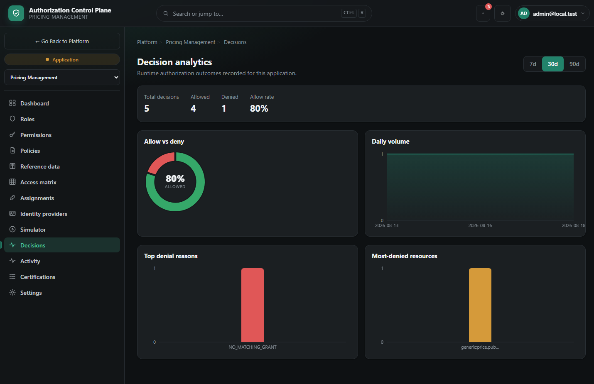

*Decisions — understand real authorization traffic: allow/deny trends, top permissions/subjects, and why requests were denied.*

### Activity — `/app/{appId}/activity`

The application-scoped **audit feed**: governance mutations (role/permission/policy/assignment
created, updated, published, revoked) with search, category filters, and expandable detail.

### Certifications — `/app/{appId}/certifications`

Run **access-review campaigns**. Create a campaign (DRAFT), **Activate campaign** to snapshot current
assignments into review items, decide each item (**Keep**/**Revoke**/needs-info; **Keep all
remaining** helps clear the list), then **Finalize** to apply revocations and close the campaign.
When the **access-certification** feature is on, each item carries an AI recommendation.

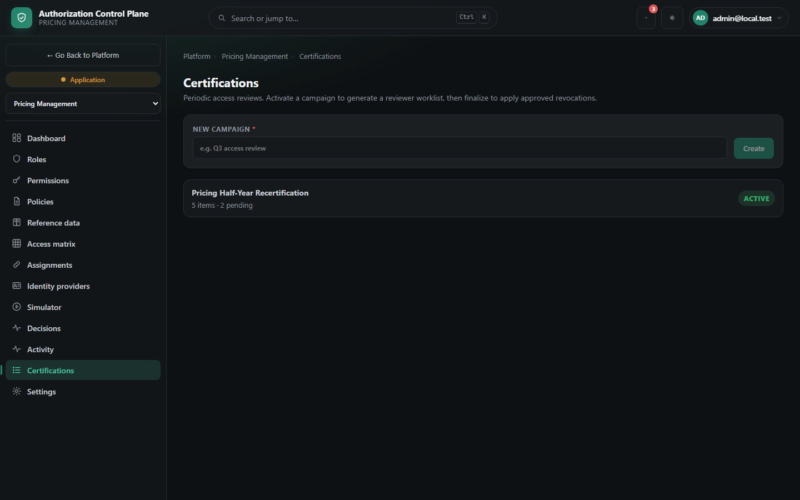

*Certifications — snapshot active grants into review items, decide each, then finalize to apply revocations and close the campaign.*

### Settings — `/app/{appId}/settings`

Application metadata and governance: name, owning tenant, description, risk level, owners, and the
**policy combining algorithm** (deny-overrides / allow-overrides / first-applicable) that decides how
multiple matching policies resolve. Lifecycle actions (activate/disable/archive) require *manage
application*.

## Step-by-Step Workflows

### Grant a user access

1. Open the application workspace → **Assignments**.
2. Click **Grant access**. Enter the **subject email**, choose a **role**, and set **Expires on**
   (required for privileged roles, optional otherwise).
3. Click **Grant**. A success toast confirms and the list refreshes; the assignment is now **ACTIVE**.

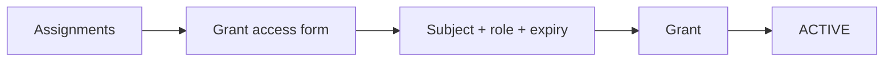
```mermaid
flowchart LR
    A["Assignments"] --> B["Grant access form"] --> C["Subject + role + expiry"] --> D["Grant"] --> E["ACTIVE"]
```

### Grant emergency (break-glass) access

1. In **Assignments**, click **Break-glass**.
2. Enter the subject, role, and a duration (**max 24h**); the grant **auto-expires** and is recorded
   as a **high-visibility audit event**. Use only when normal approval paths are unavailable.
3. Click **Grant emergency access**.

### Bulk import / export assignments

- **Export CSV** downloads the current assignments for offline review.
- **Import** uploads a set of grants at once; review the preview before confirming so you can catch
  mistakes before anything is written.

### Author and publish a policy

1. Open **Policies** → **New policy**; pick the permission and effect.
2. Build conditions in the **visual builder** (choose match **All/Any/None**, then add
   attribute/operator/value rows). Optionally type a sentence and use **Draft with AI** to generate
   the conditions, then review them.
3. Add **obligations** if the app should receive advisory instructions with the decision.
4. Save as **draft**. Optionally click **Analyze publish impact** to preview how many decisions would
   flip before going live.
5. Click **Publish policy**. Only now does it affect real decisions.

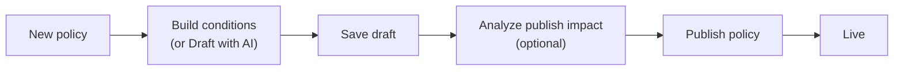
```mermaid
flowchart LR
    N["New policy"] --> C["Build conditions<br/>(or Draft with AI)"] --> D["Save draft"]
    D --> I["Analyze publish impact<br/>(optional)"] --> P["Publish policy"] --> L["Live"]
```

### Test a decision in the Simulator

1. Open **Simulator**. Enter subject, resource type/id, action, and any **context**
   (e.g. `{"status":"READY_TO_PUBLISH"}`).
2. Press **Evaluate**. Read the **ALLOWED/DENIED** verdict, the deny **reason** if any, and the
   matched roles/permissions/policies.
3. If enabled, click **Explain this decision** for a plain-English rationale and how to fix a denial.

### Revoke access and verify

1. In **Assignments**, click **Revoke** on the grant (or revoke it from the user's Role detail).
2. Re-run the **Simulator** for that subject/action — it should now show **DENIED** with a reason
   such as `ASSIGNMENT_REVOKED`. (See the deny-reason catalog in [Business Rules](19_Business_Rules.md).)

### Map permissions to a role (Access matrix)

1. Open **Access matrix**.
2. Click the cell where a role meets a permission to grant it; publish individually or in bulk. Cells
   show whether each mapping is **published** or still **draft**.

### Add reference data for policies

1. Open **Reference data** → create a new document with a **key** and a **JSON value**
   (e.g. `approved_regions` = `["US","EU","CA"]`).
2. Reference it from a policy condition as `reference.approved_regions`.

### Register an identity provider

1. Open **Identity providers** → add a provider.
2. Enter issuer, audience, allowed algorithms, subject claim, and subject type; save. Runtime tokens
   from that issuer are then accepted for this application.

### Run a certification campaign

1. Open **Certifications** → create a campaign (starts as **DRAFT**).
2. **Activate campaign** to snapshot current assignments into review items.
3. Decide each item — **Keep**, **Revoke**, or needs-info (**Keep all remaining** clears the rest).
4. **Finalize** to apply all revocations and close the campaign; each revocation is audited.

### Register a new application (platform admins)

1. In **Platform → Applications**, click **New application**.
2. Provide its name, owning tenant, and risk level; save. It now appears in the portfolio and has its
   own workspace.

## Using AI Assistance

AI features are **entirely optional** and appear **only when enabled on the server** — if AI is off,
none of these controls show. Every AI output is **advisory**: nothing is saved or changed until you
confirm, and AI can never grant or revoke access on its own.

| Feature | Where you find it | What it does |
|---------|-------------------|--------------|
| **Policy authoring** | Policies → condition builder → **Draft with AI** | Turns a plain-English sentence into structured policy conditions. |
| **Decision explainer** | Simulator result → **Explain this decision** | Explains an allow/deny in plain English with remediation steps. |
| **Impact analysis** | Draft policy → **Analyze publish impact** | Estimates how many decisions would flip before you publish. |
| **Config advisor** | Dashboard → **Summarize with AI** | Summarizes configuration health and suggests fixes. |
| **Access search** | Platform → **Ask AI** | Answers natural-language access questions with citations (read-only). |
| **SoD analysis** | Dashboard → **Draft rule with AI** | Drafts a separation-of-duties rule from a described conflict. |
| **Access certification** | Users → user detail → **Review access** | Recommends keep/revoke per grant with a rationale. |
| **Audit narrative** | Audit → **Generate summary** | Produces a plain-English recap of recent audit events. |

All AI usage — including the exact prompts and their outcomes — is recorded and reviewable on the
**AI usage** page. For the full design, see [AI Features](15_AI_Features.md).

## Tips, Shortcuts & Troubleshooting

**Shortcuts & conveniences:**

| Shortcut / Feature | Effect |
|--------------------|--------|
| **⌘K / Ctrl-K** | Open the command palette to navigate, switch application, or create. |
| **URL filters** | Table filters persist in the URL — share or reload a filtered view. |
| **Breadcrumbs** | Click to jump up the scope (platform → application → section). |
| **App switcher** | Change application (grouped by tenant) from the sidebar. |
| **Theme toggle** | Switch light/dark; your choice is remembered. |
| **Toasts** | Success/error feedback appears after each action. |

**Troubleshooting:**

| Situation | What's happening / what to do |
|-----------|-------------------------------|
| A page or button is missing | Your role doesn't grant that capability. Check **Profile** for your effective access; ask a platform or application admin to grant the needed role. |
| Opening an app returns me to the platform list | You don't have access to that application; a message explains why. |
| A policy "doesn't work" at runtime | Confirm it is **Published** — drafts are never evaluated. Use the **Simulator** to see what matched. |
| I can't create an open-ended grant for a privileged role | Privileged assignments **must have an expiry**; set **Expires on**. |
| AI buttons are absent | AI (or that feature) is disabled on the server. See [Configuration](20_Configuration.md). |
| I was signed out unexpectedly | Your session expired and couldn't be silently renewed; sign in again. |

## Cross-References

- Screen-by-screen UI reference: [UI/UX Documentation](09_UI_UX_Documentation.md)
- End-to-end journeys: [User Flows](10_User_Flows.md)
- Feature depth: [Feature Documentation](08_Feature_Documentation.md)
- AI assistance in detail: [AI Features](15_AI_Features.md)
- Roles, capabilities & enforcement: [Security Design](16_Security_Design.md)
- Decision & deny-reason rules: [Business Rules](19_Business_Rules.md)
- Running the portal locally: [Developer Guide](21_Developer_Guide.md)
