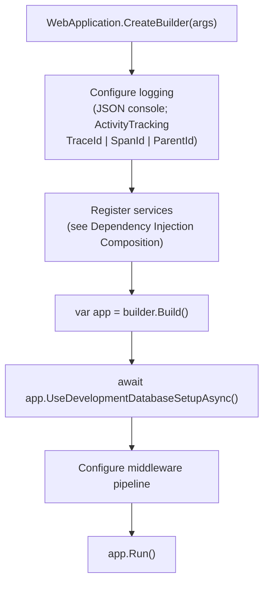
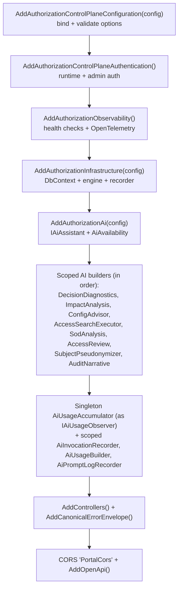
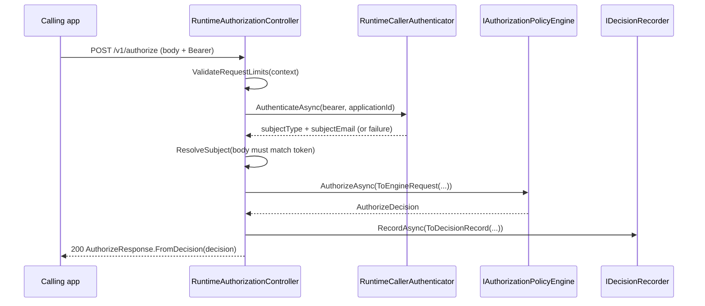
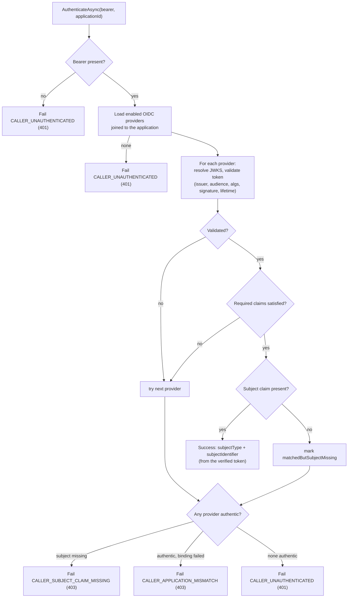
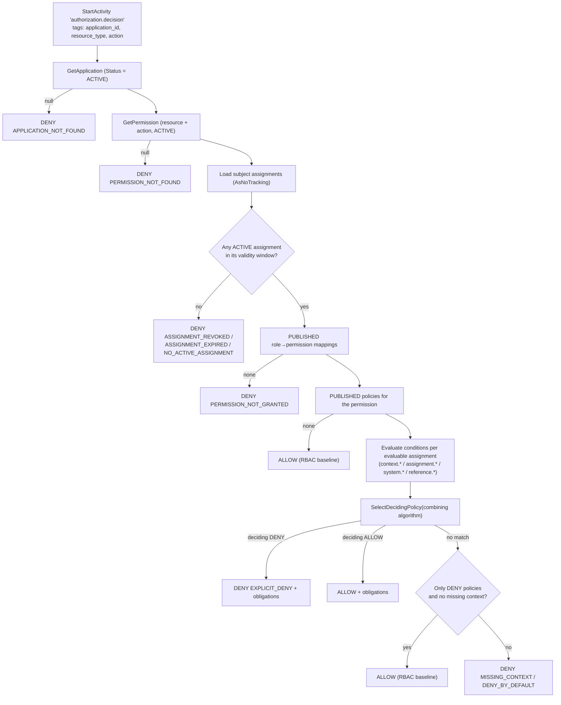
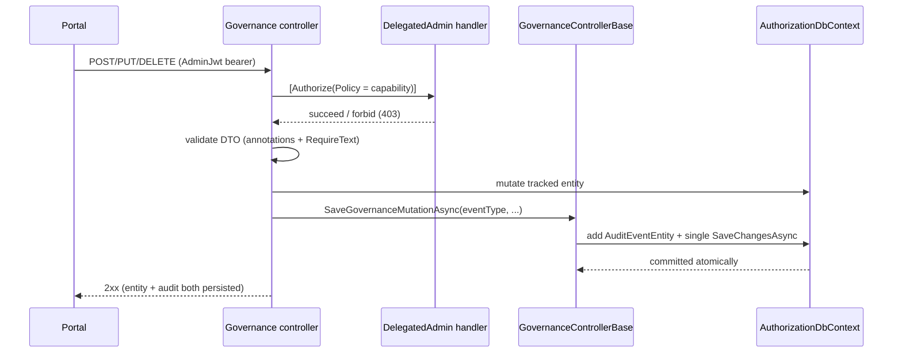
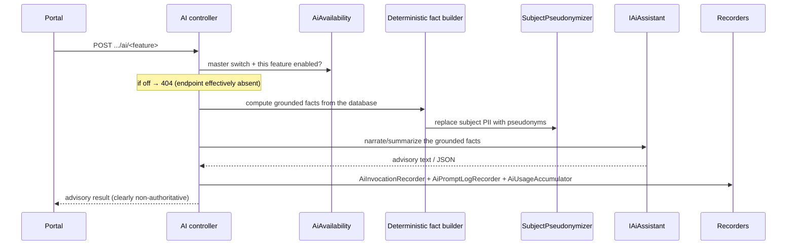

# 23 — Code Walkthrough

> Part of the [Documentation Portal](README.md).
> Related: [System Architecture](04_System_Architecture.md) · [Module Design](12_Module_Design.md) · [Business Rules](19_Business_Rules.md) · [Security Design](16_Security_Design.md)

---

## Table of Contents

1. [Purpose & How to Read This Walkthrough](#purpose--how-to-read-this-walkthrough)
2. [Solution & Project Layout](#solution--project-layout)
3. [Application Startup](#application-startup)
4. [Dependency Injection Composition](#dependency-injection-composition)
5. [HTTP Middleware Pipeline](#http-middleware-pipeline)
6. [Portal Authentication Flow](#portal-authentication-flow)
7. [Runtime Authorization Request Lifecycle](#runtime-authorization-request-lifecycle)
8. [Caller Authentication Internals](#caller-authentication-internals)
9. [Decision Engine Internals](#decision-engine-internals)
10. [Governance Mutation Path](#governance-mutation-path)
11. [Error Handling & Correlation](#error-handling--correlation)
12. [Observability Hooks](#observability-hooks)
13. [AI Advisory Path](#ai-advisory-path)
14. [Cross-References](#cross-references)

---

## Purpose & How to Read This Walkthrough

This document is a guided tour through the source, following the **actual execution paths** rather
than the folder tree. Each section traces one path from its entry point to its result and links the
exact file it describes, so you can read the prose and the code side by side.

There are two runtimes:

- The **backend API** — an ASP.NET Core (`net10.0`) application whose composition root is the
  [Authorization.Api](../backend/src/Authorization.Api) project.
- The **portal** — a React + Vite single-page app under [frontend/src](../frontend/src).

Suggested reading order: start at [Application Startup](#application-startup) to see how the API is
assembled, then follow either the enforcement path
([Runtime Authorization Request Lifecycle](#runtime-authorization-request-lifecycle) →
[Decision Engine Internals](#decision-engine-internals)) or the administration path
([Portal Authentication Flow](#portal-authentication-flow) →
[Governance Mutation Path](#governance-mutation-path)). For the concepts behind these paths, read
alongside [System Architecture](04_System_Architecture.md) and [Module Design](12_Module_Design.md).

## Solution & Project Layout

The solution file is [AuthorizationControlPlane.slnx](../backend/AuthorizationControlPlane.slnx). The
backend is split into four projects with a strict dependency direction (Api → Infrastructure/Ai;
nothing depends on Api):

| Project | Responsibility | Key types |
| --- | --- | --- |
| `Authorization.Api` | HTTP surface, composition root, middleware, caller & admin authentication, AI orchestration | `Program`, controllers, `RuntimeCallerAuthenticator`, `GovernanceControllerBase` |
| `Authorization.Infrastructure` | EF Core persistence and the runtime decision engine | `AuthorizationDbContext`, `EfAuthorizationPolicyEngine`, `IDecisionRecorder` |
| `Authorization.Ai` | Provider selection and the advisory abstraction | `IAiAssistant`, `AiAvailability`, `AddAuthorizationAi` |
| `Authorization.Sdk` | Typed client for calling the runtime API from other services | `AuthorizationClient` |

The portal lives in [frontend/src](../frontend/src): [auth.ts](../frontend/src/auth.ts) (OIDC),
[App.tsx](../frontend/src/App.tsx) (auth gate + providers), [router.tsx](../frontend/src/router.tsx)
(routes), and [apiClient.ts](../frontend/src/apiClient.ts) (typed HTTP calls).

**Where do I look to understand…?**

| I want to understand… | Read |
| --- | --- |
| How the API boots and wires services | [Program.cs](../backend/src/Authorization.Api/Program.cs) |
| How a runtime `authorize` call is handled | [RuntimeAuthorizationController.cs](../backend/src/Authorization.Api/Controllers/RuntimeAuthorizationController.cs) |
| How allow/deny is actually computed | [EfAuthorizationPolicyEngine.cs](../backend/src/Authorization.Infrastructure/RuntimeAuthorization/EfAuthorizationPolicyEngine.cs) |
| How admin writes are authorized and audited | [GovernanceControllerBase.cs](../backend/src/Authorization.Api/Controllers/GovernanceControllerBase.cs) |
| How the portal signs a user in | [auth.ts](../frontend/src/auth.ts) + [App.tsx](../frontend/src/App.tsx) |

For a full directory map, see [Repository Structure](07_Repository_Structure.md).

## Application Startup

Entry point: [Program.cs](../backend/src/Authorization.Api/Program.cs). It reads top to bottom with
no hidden startup class.



- **Logging** — `builder.Logging.Configure(...)` enables `ActivityTrackingOptions.TraceId |
  SpanId | ParentId` so log records carry trace correlation, and `AddJsonConsole` emits structured
  JSON (indented only in Development).
- **Database setup** —
  [`UseDevelopmentDatabaseSetupAsync`](../backend/src/Authorization.Api/Startup/DevelopmentDatabaseExtensions.cs)
  runs **only** in Development and only when `Database:RunDevelopmentSetup` is true (default). It
  opens an async scope, calls `Database.MigrateAsync()`, then — unless `Database:SeedDevelopmentData`
  is false — runs `LocalDevelopmentSeeder.SeedAsync()`. Finally it *best-effort* compares each seeded
  OIDC provider's issuer against the identity provider's discovery `issuer` (from
  `Oidc:MetadataAddress`) and logs a loud warning on mismatch, because a mismatch makes every runtime
  token fail with `CALLER_UNAUTHENTICATED`. Discovery failures here are logged and ignored, never
  fatal.
- **Testability** — the file ends with `public partial class Program;` so the integration test suite
  can host the app through `WebApplicationFactory`.

## Dependency Injection Composition

The service registration block in `Program.cs` runs in this **exact** order; each `AddX` extension
lives in its own module so composition stays modular (see [Module Design](12_Module_Design.md)).



What each block contributes:

| Step | Adds | Notes |
| --- | --- | --- |
| Configuration | Bound + validated option objects (`OidcOptions`, `AiOptions`, CORS, `Database`) | Fail-fast on invalid config. See [Configuration](20_Configuration.md). |
| Authentication | `JwtTokenValidator`, `IRuntimeSigningKeyResolver` (+ `HttpClient`), scoped `RuntimeCallerAuthenticator`, `DelegatedAdminAuthorizationService` + handler, the **AdminJwt** bearer scheme, and authorization policies (`AdminApi`, `PlatformAdmin`, `RuntimeApi`, plus one per `DelegatedAdminCapability`) | The admin scheme sets `RoleClaimType = acp_platform_role` and `NameClaimType = preferred_username`. |
| Observability | Health checks + OpenTelemetry tracing | Registers the engine's `ActivitySource`. |
| Infrastructure | `AuthorizationDbContext`, `IAuthorizationPolicyEngine → EfAuthorizationPolicyEngine`, `IDecisionRecorder`, seeder, `TimeProvider` | The persistence + enforcement core. |
| AI | `IAiAssistant` (live or fake), chat client, immutable `AiAvailability` snapshot | Disabled by default. |
| AI builders + recorders | 8 scoped deterministic fact builders, a singleton usage accumulator (aliased as `IAiUsageObserver`), and three scoped recorders | Ordering shown above is the literal registration order. |
| MVC + errors | Controllers and the canonical error envelope | See [Error Handling & Correlation](#error-handling--correlation). |
| CORS + OpenAPI | `PortalCors` policy from `Cors:AllowedOrigins` (default `http://localhost:5173`); OpenAPI document | The policy uses `WithOrigins` + `AllowAnyHeader` + `AllowAnyMethod` and does **not** allow credentials. |

## HTTP Middleware Pipeline

After `builder.Build()` and the development database step, `Program.cs` composes the pipeline in this
order:

```mermaid
flowchart LR
    A["UseMiddleware&lt;CorrelationIdMiddleware&gt;"] --> B["UseMiddleware&lt;ExceptionHandlingMiddleware&gt;"]
    B --> C["MapOpenApi()<br/>(Development only)"]
    C --> D["UseHttpsRedirection()<br/>(non-Development only)"]
    D --> E["UseCors('PortalCors')"]
    E --> F["UseAuthentication()"]
    F --> G["UseAuthorization()"]
    G --> H["MapHealthChecks /health/live + /health/ready"]
    H --> I["MapControllers()"]
    I --> J["app.Run()"]
```



Order is deliberate:

- **Correlation first** — `CorrelationIdMiddleware` establishes the correlation id before anything
  else, so every downstream log scope, trace, audit row, and error envelope carries the same id.
- **Exception handler second** — it wraps every component registered after it; an unhandled
  exception anywhere downstream is caught here and turned into a canonical 500 envelope.
- **Auth before controllers** — `UseAuthentication`/`UseAuthorization` run before `MapControllers`
  so `[Authorize(Policy=…)]` on the governance controllers is enforced.

Note that the runtime `authorize` endpoints are **not** gated by `UseAuthorization` — they perform
their own per-application token validation (see
[Caller Authentication Internals](#caller-authentication-internals)).

## Portal Authentication Flow

The SPA holds access/refresh tokens **only in memory**, so it re-establishes a session on every load.

```mermaid
sequenceDiagram
    participant Boot as main.tsx
    participant SPA as App.tsx (Portal)
    participant Auth as auth.ts (UserManager)
    participant KC as Keycloak
    participant API
    Boot->>Auth: completeSilentRenewIfIframe()
    Note over Boot: If in silent-renew iframe → finish handshake and stop
    Boot->>SPA: render &lt;App/&gt;
    SPA->>Auth: handleRedirectCallback()
    Auth-->>SPA: user (if returning from ?code=) or null
    SPA->>Auth: getUser() then trySilentSignin()
    alt active SSO cookie
        Auth->>KC: signinSilent (prompt=none, PKCE S256)
        KC-->>Auth: tokens (in-memory)
    else no session
        SPA->>Auth: login() → signinRedirect
        KC-->>SPA: redirect back with ?code=
        SPA->>Auth: handleRedirectCallback()
    end
    SPA->>API: GET /v1/config (Bearer)
    API-->>SPA: PortalConfigResponse (AI availability, features)
    SPA->>SPA: derive capabilities from token claims → land on Platform or App
```

Implementation notes:

- **[main.tsx](../frontend/src/main.tsx)** — `bootstrap()` calls `completeSilentRenewIfIframe()`
  first; when the app is loaded inside Keycloak's hidden renew iframe it finishes the handshake and
  returns without mounting a second copy of the SPA.
- **[auth.ts](../frontend/src/auth.ts)** — the `UserManager` uses `response_type: "code"`, `scope:
  "openid"`, `automaticSilentRenew: true`, an **in-memory** user store, and a **`sessionStorage`**
  state store (so only the transient PKCE verifier — not the tokens — survives the redirect). PKCE
  (S256) is the oidc-client-ts default. `getAccessToken()` returns a valid token (silently renewing
  when expired) for [apiClient.ts](../frontend/src/apiClient.ts) to attach as a bearer.
- **[App.tsx](../frontend/src/App.tsx)** — the `Portal` component gates on an auth state machine
  (`loading` → `signedIn` / `signedOut`): it runs `handleRedirectCallback()`, then `getUser()`, then
  `trySilentSignin()`, showing a "Signing you in…" card while resolving and a login card when signed
  out. Once signed in it renders the router with the `CapabilitiesProvider` and fetches `/v1/config`.

## Runtime Authorization Request Lifecycle

Follow `POST /v1/authorize` through
[RuntimeAuthorizationController.cs](../backend/src/Authorization.Api/Controllers/RuntimeAuthorizationController.cs)
(`[Route("v1")]`).



Guardrails enforced by the controller (all constants defined at the top of the file):

- **Size limits** — `[RequestSizeLimit(256 KB)]` on the action; `ValidateRequestLimits` rejects a
  body over `256 KB` with `413 REQUEST_TOO_LARGE`, and a context object that serializes over `32 KB`
  with `422 CONTEXT_TOO_LARGE`.
- **Subject binding** — the subject is derived **authoritatively from the verified token**. A subject
  in the request body may only corroborate it; any conflicting body email returns `403
  SUBJECT_MISMATCH`.
- **Caller failures** — `CALLER_APPLICATION_MISMATCH` and `CALLER_SUBJECT_CLAIM_MISSING` map to
  `403`; every other caller failure maps to `401`.

The **batch** endpoint `POST /v1/authorize/batch` adds:

- A batch of more than `MaxBatchSize` (50) checks → `413 BATCH_TOO_LARGE`.
- Per-check context that is too large does **not** fail the whole batch — that single check is
  returned as a `Denied` result carrying the `CONTEXT_TOO_LARGE` code, and the rest proceed.
- Each check's context is **merged** onto the request-level context via a case-insensitive
  dictionary, so a per-check key overrides the request-level value of the same name.

Every decision — single or per-check — is written through `IDecisionRecorder.RecordAsync` as a
`DecisionRecord` that includes the matched roles/permissions/policies, obligations, and the
`HttpContext.TraceIdentifier` correlation id.

## Caller Authentication Internals

`POST /v1/authorize` is not protected by the ASP.NET Core authorization middleware; instead
[RuntimeCallerAuthenticator.cs](../backend/src/Authorization.Api/Authentication/RuntimeCallerAuthenticator.cs)
validates the presented bearer token against the **OIDC providers registered for the requested
application**.



Key points:

- The subject **type** and **identifier** are read from the matched provider's configured
  `SubjectClaim` (defaulting to `sub`) on the *verified* principal — never from request input. A
  `SERVICE_ACCOUNT` provider typically reads a client-id claim (e.g. `azp`); a `USER` provider reads
  a user-identity claim.
- JWKS resolution failures for one provider are swallowed (`continue`) so another registered provider
  can still authenticate the token.
- The three failure codes encode increasing specificity: never validated (`401`), authentic but not
  bound to the app (`403`), and bound but missing the subject claim / wrong token type (`403`).

## Decision Engine Internals

[EfAuthorizationPolicyEngine.cs](../backend/src/Authorization.Infrastructure/RuntimeAuthorization/EfAuthorizationPolicyEngine.cs)
turns a request into a decision. `AuthorizeAsync` opens an `Activity` span, times the work with
`Stopwatch`, then delegates to `AuthorizeInternalAsync`, which walks a deterministic deny-ladder.



Notable implementation details:

- **Assignment filtering** — an assignment counts as active when `State = "ACTIVE"`, `RevokedAt is
  null`, `ValidFrom <= now`, and (`ValidUntil is null` or `> now`). When none qualify, the engine
  surfaces the *most informative* reason (revoked → expired → none).
- **RBAC baseline** — with a valid role→permission grant and **no** published policies, the action is
  allowed. Policies are an additive guardrail layer on top of RBAC, not a replacement.
- **Condition evaluation** — each policy's condition document is parsed once per decision and
  evaluated against every evaluable assignment. Groups support `all` (AND), `any` (OR), and `none`
  (NOT) and nest recursively. Attribute references resolve across four namespaces: `context.*` (from
  the request), `assignment.*` (assignment attributes), `system.*` (a computed evaluation clock built
  once per decision), and `reference.*` (shared application lookup lists, queried only when a policy
  actually references them).
- **Fail-closed** — a missing referenced attribute marks the branch as `MISSING_CONTEXT`; if no allow
  policy matched and context was missing, the decision denies rather than falling through to allow.
- **Combining** — `SelectDecidingPolicy` applies the application's configured combining algorithm
  (deny-overrides by default). See [Business Rules](19_Business_Rules.md) for the full semantics.

After the internal call, `AuthorizeAsync` sets the `authorization.allowed`,
`authorization.deny_reason`, and `authorization.duration_ms` tags on the span and logs a debug line
per decision.

## Governance Mutation Path

Every administrative write goes through a controller under
[Controllers/Governance](../backend/src/Authorization.Api/Controllers/Governance) that extends
[GovernanceControllerBase](../backend/src/Authorization.Api/Controllers/GovernanceControllerBase.cs).



What the base class provides:

- **Actor resolution** — `Actor` is `User.Identity?.Name` (the `preferred_username` claim) or the
  `"local-admin"` fallback; `ActorRole` resolves the admin role for the audit trail.
- **Validation helpers** — `RequireText` returns `422` for blank/whitespace text that `[Required]`
  would otherwise accept; `ApplicationExistsAsync` / `ResolveApplicationRefIdAsync` translate a
  business application id to its surrogate row id.
- **Atomic mutation + audit** — the controller mutates the tracked entity first, then calls
  `SaveGovernanceMutationAsync`, which **adds** the `AuditEventEntity` and issues a single
  `SaveChangesAsync`. On a relational provider both the entity change and the audit row commit inside
  EF Core's implicit transaction — atomically — and EF back-fills store-generated values (`Id`,
  `CreatedAt`, `Version`) so the handler can safely map the entity into its response afterward.
- **Audit stamping** — `BuildAuditEvent` records the event type, actor, actor role, target subject,
  UTC timestamp, JSON old/new values, and the `HttpContext.TraceIdentifier` correlation id.

## Error Handling & Correlation

Two middleware components plus one MVC configuration produce a consistent error contract.

- **[CorrelationIdMiddleware](../backend/src/Authorization.Api/Observability/CorrelationIdMiddleware.cs)**
  reads the inbound `X-Correlation-ID` header; it accepts a value up to 128 characters made of ASCII
  letters/digits and `-`, `_`, `.`, `:` and otherwise falls back to the server-generated trace id. It
  sets `HttpContext.TraceIdentifier`, echoes the id back on the response (including via
  `OnStarting`), and opens a logging scope so every log line carries `CorrelationId`.
- **[ExceptionHandlingMiddleware](../backend/src/Authorization.Api/Errors/ExceptionHandlingMiddleware.cs)**
  wraps the rest of the pipeline. It logs the exception against the trace id, and — if the response
  has not already started — clears the response, sets `500`, and writes
  `ApiErrorFactory.InternalServerError(context)` as JSON. If the response has started it rethrows.
- **[AddCanonicalErrorEnvelope](../backend/src/Authorization.Api/Errors/ServiceCollectionExtensions.cs)**
  advertises the `ApiErrorEnvelope` response type for `401`/`403`/`422`/`500` and replaces the
  default model-validation response with `ApiErrorFactory.ValidationFailed`, returning `422
  UnprocessableEntity`.

Every error therefore shares the same shape — an `ApiErrorEnvelope` with `{ error { code, message },
correlationId }` — where `correlationId` is the same trace id the caller saw on the response header.
See [Error Handling](17_Error_Handling.md) for the full catalogue of codes.

## Observability Hooks

[AddAuthorizationObservability](../backend/src/Authorization.Api/Observability/ServiceCollectionExtensions.cs)
wires the telemetry surface:

- **Tracing** — OpenTelemetry with a resource service name of `Authorization.Api`, sourcing the
  engine's `ActivitySource` (`"Authorization.RuntimeAuthorization"`) plus ASP.NET Core and
  `HttpClient` instrumentation. The engine emits one `authorization.decision` span per decision with
  the tags listed in [Decision Engine Internals](#decision-engine-internals).
- **Decision records** — the runtime controller writes each decision through `IDecisionRecorder`,
  producing the audit/analytics trail the portal's decision views read.
- **Health checks** — `MapHealthChecks("/health/live")` has no registered checks (pure liveness), and
  `MapHealthChecks("/health/ready")` runs only checks tagged with
  `DatabaseReadinessHealthCheck.ReadyTag`, i.e. the database readiness probe.

See [Logging & Observability](18_Logging_and_Observability.md) for signals, fields, and dashboards.

## AI Advisory Path

AI assistance is an **advisory** surface that is completely separate from enforcement. Endpoints live
under two roots:
[AiAssistController](../backend/src/Authorization.Api/Controllers/AiAssistController.cs)
(`v1/admin/applications/{applicationId}/ai`) for per-application features, and
[PlatformAiAssistController](../backend/src/Authorization.Api/Controllers/PlatformAiAssistController.cs)
(`v1/admin/ai`) for platform-wide features.



- **Gating** — [AiAvailability](../backend/src/Authorization.Ai/AiAvailability.cs) is an immutable
  startup snapshot. When the master switch is off or the provider is misconfigured it is
  `AiAvailability.Disabled` and the feature endpoints are unavailable. `/v1/config` reports `live =
  enabled && provider != Fake` so the portal only shows features that are truly wired to a provider.
- **Grounding** — the deterministic builders compute facts from the database first; the assistant only
  *narrates* those facts, and `SubjectPseudonymizer` strips PII before anything leaves the process.
- **Never on the enforcement path** — no AI call participates in `authorize`. See
  [AI Features](15_AI_Features.md).

## Cross-References

- Architectural context: [System Architecture](04_System_Architecture.md)
- Module responsibilities: [Module Design](12_Module_Design.md)
- Directory map: [Repository Structure](07_Repository_Structure.md)
- Decision rules: [Business Rules](19_Business_Rules.md)
- Error contract & codes: [Error Handling](17_Error_Handling.md)
- Signals & telemetry: [Logging & Observability](18_Logging_and_Observability.md)
- AI surface: [AI Features](15_AI_Features.md)
- Startup config: [Configuration](20_Configuration.md)
- Extending the code: [Developer Guide](21_Developer_Guide.md)
