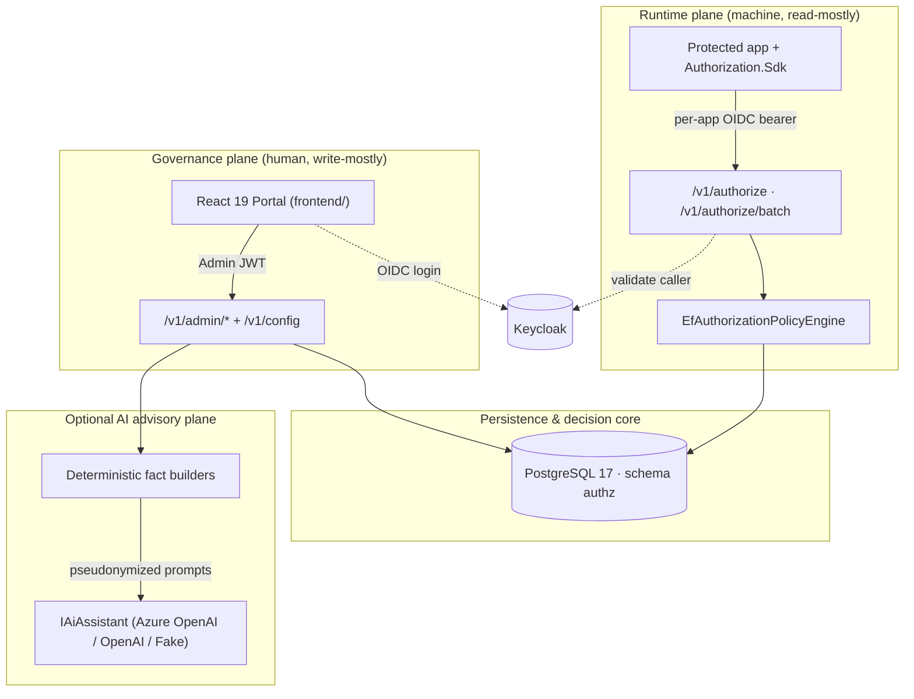

# 🛡️ Authorization Control Plane — Documentation Portal

> A centralized system for **governing** and **enforcing** authorization across many applications:
> role- and attribute-based access control (RBAC + ABAC), low-latency deny-by-default runtime
> decisions, a fully audited trail, and an optional, advisory-only AI layer.

This is the **index** for the documentation suite. It orients you, routes you by role, and links to
the 24 detailed guides. It intentionally stays high-level — each topic is owned by a dedicated
document, and **the code is the source of truth** (see [Conventions](#documentation-conventions--source-of-truth)).

> **Project status:** this repository is an **MVP / proof-of-concept** — a complete, working
> end-to-end slice (API, portal, SDK, one-command local stack), not a production-hardened deployment.
> See [Project Overview](01_Project_Overview.md#project-status--maturity).

---

## Table of Contents

1. [What Is the Authorization Control Plane?](#what-is-the-authorization-control-plane)
2. [Architecture at a Glance](#architecture-at-a-glance)
3. [Key Capabilities](#key-capabilities)
4. [Technology Stack](#technology-stack)
5. [Quick Start (Local)](#quick-start-local)
6. [Documentation Suite Index](#documentation-suite-index)
7. [Recommended Reading Paths](#recommended-reading-paths)
8. [Documentation Conventions & Source of Truth](#documentation-conventions--source-of-truth)
9. [Security & AI at a Glance](#security--ai-at-a-glance)
10. [Glossary & Getting Help](#glossary--getting-help)

---

## What Is the Authorization Control Plane?

Most application estates scatter authorization logic — role checks, entitlement tables, ad-hoc "is
admin?" branches — across every service, causing inconsistency, poor auditability, and slow change.
The Authorization Control Plane (ACP) fixes this by **externalizing and centralizing** access into one
auditable, versioned source of truth, split into two cooperating planes:

- **Governance (control) plane** — a delegated-administration React portal and `/v1/admin` APIs where
  administrators model tenants, applications, roles, permissions, role→permission mappings, subject
  assignments, and optional ABAC policies. Human-driven, capability-gated, and fully audited.
- **Runtime (enforcement) plane** — the `POST /v1/authorize` and `POST /v1/authorize/batch` endpoints
  that protected applications call at request time to get a **deny-by-default** allow/deny decision
  with a structured reason and any obligations. Machine-driven, read-mostly, and latency-sensitive.

Every governance change writes an audit event in the same transaction, and every runtime decision is
recorded — producing a complete, queryable trail. Full context: [Project Overview](01_Project_Overview.md).

## Architecture at a Glance

The system is organized as **two primary planes** — governance and runtime — over a shared
persistence and decision core, with a **supporting plane** for cross-cutting concerns and an
**optional AI advisory plane** alongside. This keeps the runtime decision path lean and the
enforcement core independent of the AI layer.



The full layered view, request lifecycle, middleware pipeline, and sequence diagrams are in
[System Architecture](04_System_Architecture.md); the design rationale is in
[Solution Design](05_Solution_Design.md).

## Key Capabilities

| Capability area | API surface | Detail |
|-----------------|-------------|--------|
| **Tenant & application governance** | `/v1/admin/tenants`, `/v1/admin/applications` | Multi-tenant hierarchy; per-application access model, risk profile, and lifecycle status. |
| **RBAC modeling** | `.../roles`, `.../permissions`, `.../role-permissions` | Roles and permissions linked by mappings with an explicit **Draft → Publish** lifecycle (only `PUBLISHED` grants resolve). |
| **Assignments & break-glass** | `.../assignments`, `.../assignments/break-glass` | Time-boxed grants, CSV import/export, and emergency self-expiring access (1–24 h). |
| **ABAC policies** | `.../policies`, `.../reference-data` | Additive `ALLOW`/`DENY` guardrails with JSON conditions (`all`/`any`/`none`) and obligations. |
| **Runtime enforcement** | `/v1/authorize`, `/v1/authorize/batch` | Single and batch (≤ 50 checks) decisions, deny-by-default, with structured reasons and obligations. |
| **Access reviews** | `.../review-campaigns` | Periodic recertification with snapshotting and revoke-on-finalize. |
| **Insights & analytics** | `/v1/admin/simulator/authorize`, `.../decisions/analytics`, `/v1/admin/audit-events`, `.../insights/*` | Dry-run simulator, decision analytics, audit trail, and deterministic config/SoD findings. |
| **AI advisory (optional)** | `.../ai/*` | Grounded, advisory-only assistance — policy drafting, decision explanation, audit narratives. |

Capabilities are specified as requirements in [Functional Requirements](02_Functional_Requirements.md)
and walked through in [Feature Documentation](08_Feature_Documentation.md).

> **Runtime payload limits:** request body ≤ 256 KB, context ≤ 32 KB, batch ≤ 50 checks.

## Technology Stack

| Layer | Technology | Notes |
|-------|-----------|-------|
| Backend API | **.NET 10** ASP.NET Core Web API | Layered; OpenTelemetry; split liveness/readiness health checks |
| Persistence | **EF Core 10** + **Npgsql** on **PostgreSQL 17** | Schema `authz` (17 mapped entities); optimistic concurrency via integer `Version` token |
| Admin portal | **React 19** + **Vite 8**, **TypeScript ~6.0** | `react-router` v7, `@tanstack/react-query` v5, hand-authored CSS |
| Visualization | **D3** (modular v3 packages) | Access graph/matrix, lineage trees, activity charts |
| Identity | **Keycloak 26.1** (OIDC) | Admin: auth-code + PKCE; runtime: per-application OIDC providers |
| Client SDK | **.NET 10** `Authorization.Sdk` | Thin, resilient HTTP client with retry/backoff and batching |
| Observability | **OpenTelemetry** + JSON logging | `X-Correlation-ID` propagation, per-decision trace spans |
| AI (optional) | **Azure OpenAI / OpenAI / Fake** | Pluggable via `Ai:Provider`; default chat `gpt-4o-mini`; off by default |

Exact versions and rationale: [Technology Stack](06_Technology_Stack.md).

## Quick Start (Local)

**Prerequisites:** Docker Desktop (with Compose); PowerShell 7+ for the `scripts/*.ps1` helpers.
.NET 10 SDK and Node.js 20+ are needed only for running the backend or portal *outside* Docker.

From the repository root:

```powershell
./scripts/dev-up.ps1
```

This copies `deploy/local/.env` from the template if missing, then `docker compose up --build` for the
project `authorization-control-plane`. On boot the API applies EF Core migrations to the `authz`
schema and seeds demo tenants, applications, roles, permissions, policies, and assignments (controlled
by `Database__RunDevelopmentSetup` / `Database__SeedDevelopmentData`, both `true` in dev).

**Local endpoints & development credentials** (dev defaults only — never real secrets):

| Service | Endpoint | Access |
|---------|----------|--------|
| Admin Portal | `http://localhost:5173` | `admin@local.test` / `admin_dev_password` (platform super admin) |
| Backend API | `http://localhost:8080` | `/v1/admin/*` via **AdminJwt**; `/v1/authorize*` via **per-app OIDC bearer** |
| Keycloak | `http://localhost:8081` | `admin` / `admin_dev_password`; realm `authorization-local` |
| PostgreSQL | `localhost:5432` | `authorization` / `authorization_dev_password` (db `authorization`, schema `authz`) |
| Runtime client (pricing-management) | Keycloak token endpoint | `pricing-management-runtime-client` / `pricing_management_dev_secret` (OAuth2 client-credentials grant) |

Verify the stack end-to-end with `./scripts/local-smoke.ps1`. Helper scripts: `dev-up.ps1`,
`dev-down.ps1`, `dev-reset.ps1`, `local-smoke.ps1`, `perf-authorize.ps1`. Full setup, the seeded users
across all four demo apps, environment variables, and secret handling:
[Developer Guide](21_Developer_Guide.md) and [Configuration](20_Configuration.md).

## Documentation Suite Index

Twenty-four numbered guides plus this index and an internal accuracy log. Read in order, or jump
straight to what you need.

### 1. Requirements, Architecture & Design

- [01 — Project Overview](01_Project_Overview.md): what the system is, who uses it, goals & non-goals, domain language, boundaries.
- [02 — Functional Requirements](02_Functional_Requirements.md): actors, capability domains, and requirements FR-01 through FR-22 with acceptance criteria.
- [03 — Non-Functional Requirements](03_Non_Functional_Requirements.md): performance targets, limits, resilience, and quality attributes.
- [04 — System Architecture](04_System_Architecture.md): planes, layers, the decision model, request lifecycle, and deployment topology.
- [05 — Solution Design](05_Solution_Design.md): design decisions, patterns (outbox, composition root), and abstraction boundaries.
- [06 — Technology Stack](06_Technology_Stack.md): frameworks, libraries, and exact versions per layer.

### 2. Implementation & Engineering

- [07 — Repository Structure](07_Repository_Structure.md): file and folder reference across backend, frontend, deploy, and scripts.
- [08 — Feature Documentation](08_Feature_Documentation.md): feature-by-feature breakdown across all planes.
- [09 — UI/UX Documentation](09_UI_UX_Documentation.md): portal layout, route map, and page composition.
- [10 — User Flows](10_User_Flows.md): end-to-end operational journeys for governance and enforcement.
- [11 — Component Design](11_Component_Design.md): React component hierarchy, hooks, and D3 visualizers.
- [12 — Module Design](12_Module_Design.md): backend DI composition, controllers, and persistence layers.

### 3. APIs, Data, AI & Security

- [13 — API Documentation](13_API_Documentation.md): endpoint specifications, status codes, and DTO contracts (with payload examples).
- [14 — Data Model Documentation](14_Data_Model_Documentation.md): entities, relationships, indexes, and the `authz` schema.
- [15 — AI Features](15_AI_Features.md): the advisory subsystem — guardrails, prompting pipeline, and PII protection.
- [16 — Security Design](16_Security_Design.md): authentication schemes, delegated-admin capabilities, and token rules.
- [17 — Error Handling](17_Error_Handling.md): the canonical error envelope and status-mapping rules.
- [18 — Logging & Observability](18_Logging_and_Observability.md): correlation IDs, OpenTelemetry tracing, and audit logging.

### 4. Rules, Configuration & Operations

- [19 — Business Rules](19_Business_Rules.md): the formal runtime invariants and evaluation semantics.
- [20 — Configuration](20_Configuration.md): environment variables, strongly-typed options, and server-owned settings.
- [21 — Developer Guide](21_Developer_Guide.md): local development, build/test commands, and the seeded environment.
- [22 — User Manual](22_User_Manual.md): the operational guide for portal administrators.
- [23 — Code Walkthrough](23_Code_Walkthrough.md): a guided trace from process start to a recorded decision.
- [24 — Glossary](24_Glossary.md): terms, acronyms, capabilities, and reason codes.

**Supporting file:** [documentation-review-report.md](documentation-review-report.md) — the internal
accuracy-review log tracking corrections made against the source code.

## Recommended Reading Paths

| Persona | Goal | Suggested sequence |
|---------|------|--------------------|
| **New developer** | Set up locally and understand the code | [21 Developer Guide](21_Developer_Guide.md) → [07 Repository Structure](07_Repository_Structure.md) → [23 Code Walkthrough](23_Code_Walkthrough.md) |
| **Application integrator** | Call the runtime API from an app | [01 Project Overview](01_Project_Overview.md) → [13 API Documentation](13_API_Documentation.md) → [`Authorization.Sdk`](../backend/src/Authorization.Sdk/AuthorizationClient.cs) |
| **Security / auditor** | Evaluate identity, capabilities, and audit integrity | [16 Security Design](16_Security_Design.md) → [19 Business Rules](19_Business_Rules.md) → [18 Logging & Observability](18_Logging_and_Observability.md) |
| **Frontend engineer** | Extend the admin portal | [09 UI/UX](09_UI_UX_Documentation.md) → [11 Component Design](11_Component_Design.md) → [06 Technology Stack](06_Technology_Stack.md) |
| **Architect / reviewer** | Understand the whole design | [01 Overview](01_Project_Overview.md) → [04 System Architecture](04_System_Architecture.md) → [05 Solution Design](05_Solution_Design.md) |
| **Portal administrator** | Operate the system day-to-day | [22 User Manual](22_User_Manual.md) → [10 User Flows](10_User_Flows.md) → [08 Feature Documentation](08_Feature_Documentation.md) |
| **Operator** | Run and observe the stack | [21 Developer Guide](21_Developer_Guide.md) → [20 Configuration](20_Configuration.md) → [18 Logging & Observability](18_Logging_and_Observability.md) |

## Documentation Conventions & Source of Truth

- **Numbering.** Guides are numbered `01`–`24` in a rough reading order (requirements → architecture →
  implementation → operations). This index groups them by theme; either path works.
- **Code is authoritative.** Every guide links to the source files it describes. Where documentation
  and code disagree, **the code wins** and the documentation is corrected — tracked in
  [documentation-review-report.md](documentation-review-report.md).
- **Consistent structure.** Each guide opens with a "Part of / Related" header and a table of contents,
  and ends with a Cross-References section, so related concepts are one hop away.
- **Diagrams.** All diagrams are authored in **Mermaid** inside fenced code blocks; they render in any
  Mermaid-aware Markdown viewer (including GitHub and VS Code).
- **Scope discipline.** This README orients and indexes; it does not duplicate deep content. API
  payloads live in [13](13_API_Documentation.md), configuration in [20](20_Configuration.md), security
  in [16](16_Security_Design.md), and so on — each fact has exactly one home.

## Security & AI at a Glance

**Two identity planes**, both delegated to OIDC (details in [Security Design](16_Security_Design.md)):

- **Admin plane** — administrators sign in via OIDC authorization-code + **PKCE (`S256`)**; their JWT
  is validated under the `AdminJwt` scheme. Portal actions are gated by **delegated-admin
  capabilities** — `ManageApplication`, `ManageRoles`, `ManagePermissions`, `MapRolePermission`,
  `ManagePolicies`, `AssignRoles`, `ViewAudit`, `ReadOnlyView` — resolved from platform/tenant/
  application role claims by `DelegatedAdminAuthorizationHandler`.
- **Runtime plane** — protected applications present a **per-application OIDC bearer token** (the
  seeded dev clients obtain one via the OAuth2 **client-credentials** grant against Keycloak). The
  runtime endpoints self-validate the token in the controller via `RuntimeCallerAuthenticator`
  (supporting **multiple issuers per application**) and derive the subject **from the verified token**;
  a request body that contradicts the token is rejected with `403 SUBJECT_MISMATCH`.

  > Note: `RuntimeClientCredentials` is only a legacy string constant, **not** a wired authentication
  > scheme; the live runtime path is OIDC-based via `RuntimeCallerAuthenticator`.

**AI advisory subsystem** is optional and safe by construction (details in [AI Features](15_AI_Features.md)):
**off by default** (`Ai:Enabled=false`), **advisory-only** (never on the decision path), **deterministic
facts first** (aggregates computed in the backend before any model call), **PII-pseudonymized** prompts
(`SubjectPseudonymizer` strips subject emails), and **human-in-the-loop** (drafts require explicit human
publication). Providers are pluggable (`AzureOpenAI` / `OpenAI` / `Fake`), with `Fake` giving
deterministic offline behavior for tests and demos.

## Glossary & Getting Help

- **Unfamiliar term, capability, or reason code?** See the [Glossary](24_Glossary.md).
- **Where does behavior live?** Follow the code links in each guide, or start from the
  [Code Walkthrough](23_Code_Walkthrough.md).
- **Running into setup issues?** See the [Developer Guide](21_Developer_Guide.md) and
  [Configuration](20_Configuration.md).