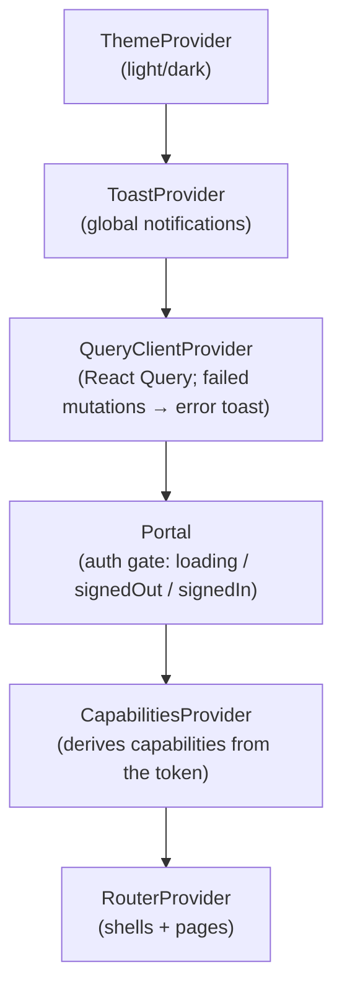

# Authorization Control Plane — Admin Portal (Frontend)

The **admin portal** for the Authorization Control Plane (ACP): a React single-page application (SPA)
that delegated administrators use to model and operate access — tenants, applications, roles,
permissions, role→permission mappings, subject assignments, ABAC policies, access reviews, decision
analytics, the audit trail, and the optional AI advisory features. It is a **pure API client**: it
holds no business rules of its own and renders entirely from the backend, which remains the enforced
security boundary.

> Part of the [documentation portal](../documentation/README.md). For the deeper design of this UI see
> [UI/UX Documentation](../documentation/09_UI_UX_Documentation.md) and
> [Component Design](../documentation/11_Component_Design.md). For the whole system, start with the
> [Project Overview](../documentation/01_Project_Overview.md).

---

## Table of Contents

1. [Overview](#overview)
2. [Technology Stack](#technology-stack)
3. [Prerequisites](#prerequisites)
4. [Getting Started](#getting-started)
5. [Environment Variables](#environment-variables)
6. [NPM Scripts](#npm-scripts)
7. [Project Structure](#project-structure)
8. [Application Architecture](#application-architecture)
9. [Authentication](#authentication)
10. [Authorization: Capability-Gated UI](#authorization-capability-gated-ui)
11. [API Layer & Data Fetching](#api-layer--data-fetching)
12. [Server-Owned Configuration](#server-owned-configuration)
13. [Theming & Data Visualization](#theming--data-visualization)
14. [Testing](#testing)
15. [Linting & Formatting](#linting--formatting)
16. [Building & Deployment](#building--deployment)
17. [Troubleshooting](#troubleshooting)
18. [Further Reading](#further-reading)

---

## Overview

The portal is organized around **two navigational shells** that reflect the two scopes an administrator
works in:

- **Platform shell** — cross-application context: the platform overview, tenants, applications, the
  user directory, the platform-wide audit trail, AI usage, the "Ask AI" assistant, and profile /
  settings.
- **Application workspace shell** — everything scoped to a single application: dashboard, roles,
  permissions, role→permission mappings (matrix), policies, assignments, reference data, the decision
  simulator, decision analytics, access-review certifications, identity, and activity.

The SPA authenticates administrators with **OIDC (authorization-code + PKCE)** against Keycloak, calls
the backend REST API with the resulting bearer token, and adapts its own limits, cache windows, and
feature availability from the server via `GET /v1/config`. It never makes an authorization decision
itself — it hides controls the API would reject (a least-privilege UX layer) while the backend enforces
the actual rules.

## Technology Stack

| Concern | Technology | Version |
|---------|-----------|---------|
| UI framework | React + react-dom | `19.2.7` |
| Build tool / dev server | Vite (`@vitejs/plugin-react`) | `8.1.1` (`plugin-react` `6.0.3`) |
| Language | TypeScript | `~6.0.2` |
| Routing | react-router-dom | `7.18.1` |
| Server state / caching | @tanstack/react-query | `5.101.2` |
| Authentication | oidc-client-ts (PKCE `S256`) | `3.5.0` |
| Data visualization | d3-array / d3-hierarchy / d3-scale / d3-selection / d3-shape / d3-zoom | `3.x` |
| Unit testing | Vitest + jsdom | `4.1.10` / `29.1.1` |
| Linting | Oxlint | `1.71.0` |
| Formatting | Prettier | `3.9.5` |
| Styling | Hand-authored CSS (no CSS framework) | — |

There is **no state-management library** (Redux/Zustand/etc.): server state is owned by React Query and
the little local UI state that exists uses React hooks and the URL. Styling is plain CSS
(`index.css`, `App.css`, component-level classes) with a light/dark theme — no Tailwind or CSS-in-JS.

## Prerequisites

- **Node.js 24** and **npm** (the Docker build uses `node:24-alpine`; match it locally to avoid
  lockfile drift).
- A running **backend API** and **Keycloak** for anything beyond a static build — the portal is an API
  client and cannot do anything useful in isolation. The simplest way to get both is the full local
  stack (below).
- **PowerShell 7+** if you use the repository's `scripts/*.ps1` helpers.

## Getting Started

There are two ways to run the portal.

### Option A — Full local stack (recommended)

From the **repository root**, bring up Postgres, Keycloak, the API, and the portal together:

```powershell
./scripts/dev-up.ps1
```

This runs `docker compose` for the `authorization-control-plane` project. The portal is built into a
static bundle and served by nginx at **http://localhost:5173**; the API is on `http://localhost:8080`
and Keycloak on `http://localhost:8081`. Sign in with the seeded platform admin
`admin@local.test` / `admin_dev_password`. See the
[Developer Guide](../documentation/21_Developer_Guide.md) for the full seeded environment.

> In this mode the portal is a **production build** (nginx). Use Option B when you want hot-module
> reloading while iterating on the UI.

### Option B — Standalone Vite dev server (fast UI iteration)

Run only the portal with HMR, pointed at an API + Keycloak that are already running (e.g. started via
`./scripts/dev-up.ps1` and then stop just the `acp-portal` container, or run the API/Keycloak your own
way):

```powershell
cd frontend
npm install
npm run dev
```

Vite serves the app on **http://localhost:5173** by default. With no `VITE_*` variables set, the app
falls back to the local development defaults (`http://localhost:8080` API,
`http://localhost:8081/realms/authorization-local` authority, `authorization-portal` client) — see
[Environment Variables](#environment-variables).

> The API's CORS allow-list must include the dev origin. It defaults to `http://localhost:5173`
> (`Cors:AllowedOrigins`); if you serve the dev server elsewhere, add that origin on the API side or
> browser calls will be blocked.

## Environment Variables

All configuration that varies per environment is provided through **build-time** `VITE_*` variables.
Vite inlines them into the bundle at build time via `import.meta.env`, so they are **baked into the
compiled assets** — changing them requires a rebuild, not just a container restart.

| Variable | Purpose | Dev default |
|----------|---------|-------------|
| `VITE_API_BASE_URL` | Base URL the SPA calls for the backend REST API. | `http://localhost:8080` |
| `VITE_OIDC_AUTHORITY` | OIDC issuer (Keycloak realm) used for admin login. | `http://localhost:8081/realms/authorization-local` |
| `VITE_OIDC_CLIENT_ID` | OIDC public client id for the portal. | `authorization-portal` |

**Fail-fast in production.** The defaults above apply **only** when Vite is in dev mode
(`import.meta.env.DEV`). In a production build, a missing value throws at startup (e.g.
*"VITE_API_BASE_URL is not configured. Set it at build time for production deployments."*) rather than
silently pointing at a developer's local machine — see [auth.ts](src/auth.ts) and
[apiClient.ts](src/apiClient.ts).

**How they are supplied in Docker.** [Dockerfile](Dockerfile) declares them as `ARG`/`ENV` in the build
stage; the local Compose file maps `Portal__ApiBaseUrl` / `Portal__OidcAuthority` /
`Portal__OidcClientId` (from `deploy/local/.env`) onto the `VITE_*` build args. Full reference:
[Configuration](../documentation/20_Configuration.md).

## NPM Scripts

| Script | Command | Purpose |
|--------|---------|---------|
| `npm run dev` | `vite` | Start the dev server with hot-module reloading. |
| `npm run build` | `tsc -b && vite build` | Type-check the project, then produce the optimized production bundle in `dist/`. |
| `npm run preview` | `vite preview` | Serve the built `dist/` locally to sanity-check a production build. |
| `npm test` | `vitest run` | Run the unit test suite once (CI mode). |
| `npm run lint` | `oxlint` | Lint the source with Oxlint. |
| `npm run format` | `prettier --check .` | Check formatting without writing. |
| `npm run format:write` | `prettier --write .` | Apply Prettier formatting. |

The production `build` runs `tsc -b` **before** `vite build`, so a type error fails the build. Vite's
config also splits vendor code into cacheable chunks — `vendor-charts` (d3), `vendor-react`
(react / react-dom / react-router), and `vendor-query` (@tanstack) — see [vite.config.ts](vite.config.ts).

## Project Structure

```text
frontend/
├─ index.html               # SPA host page (Vite entry)
├─ vite.config.ts           # Vite + React plugin, manual vendor chunking
├─ tsconfig*.json           # TS project references (app / node)
├─ Dockerfile               # Multi-stage: node build → nginx runtime
├─ nginx.conf               # Static serving + SPA fallback + security headers/CSP
└─ src/
   ├─ main.tsx              # Bootstraps React; short-circuits the silent-renew iframe
   ├─ App.tsx               # Provider tree + auth gating (loading/signedOut/signedIn)
   ├─ router.tsx            # createBrowserRouter routes + legacy query-param redirects
   ├─ auth.ts               # OIDC UserManager (PKCE, in-memory tokens, silent renew)
   ├─ apiClient.ts          # Typed fetch wrapper, bearer injection, PortalApiError model
   ├─ capabilities.tsx      # Delegated-admin capability model (mirrors the backend)
   ├─ constants.ts          # Fixed domain enums (risk levels, policy effects, OIDC algs…)
   ├─ types.ts              # Shared API/domain TypeScript types
   ├─ ui.tsx                # Shared presentational helpers
   ├─ index.css / App.css   # Global + app styling
   ├─ api/                  # React Query hooks, query keys, server-config adapters, URL state
   ├─ components/           # Reusable primitives, Toast, icons, charts, viz/
   ├─ pages/                # Route pages: platform/ and app/ groupings
   ├─ shells/               # PlatformShell, AppWorkspaceShell, UserMenu, contexts
   ├─ workspace/            # Per-application feature surfaces (matrix, simulator, analytics…)
   ├─ scope/                # Selection/scope helpers
   ├─ theme/                # ThemeProvider + light/dark toggle
   └─ assets/               # Static assets
```

## Application Architecture

### Bootstrap and provider tree

[main.tsx](src/main.tsx) mounts the app — but first it calls `completeSilentRenewIfIframe()`: when
Keycloak redirects the hidden token-renew iframe back to the app origin, the SPA finishes the OIDC
handshake there and **does not** mount a second copy of the application.

[App.tsx](src/App.tsx) then composes the providers, outermost to innermost:



The `QueryClient` is configured with `retry: 1` and a `staleTime` sourced from the server-owned config
(`cache.defaultStaleMs`, default 30 s), and its `MutationCache` surfaces **every** failed write as an
error toast so create/edit/delete/grant actions can never fail silently.

### Routing and the two shells

[router.tsx](src/router.tsx) uses `createBrowserRouter`. Routes are split between the **PlatformShell**
(platform-scoped pages in [pages/platform](src/pages/platform)) and the **AppWorkspaceShell**
(application-scoped pages in [pages/app](src/pages/app)). Path construction lives in
[workspace/nav.ts](src/workspace/nav.ts). A `LegacyRedirect` maps old query-parameter URLs
(`?app=&view=&key=&email=`) onto the current path-based routes so old bookmarks and deep links keep
working.

## Authentication

Admin login uses **OIDC authorization-code flow with PKCE (`S256`, the oidc-client-ts default)** against
Keycloak, configured in [auth.ts](src/auth.ts):

- **Tokens are memory-only.** Access/refresh tokens are held in an `InMemoryWebStorage` store, **not**
  `localStorage`/`sessionStorage`. A successful XSS cannot read a persisted admin session, and tokens
  are discarded on reload or tab-close. Only the transient PKCE/auth **state** (not the tokens) is
  parked in per-tab `sessionStorage`, because it must survive the full-page redirect to Keycloak.
- **Session recovery after reload.** Because tokens are memory-only, a plain reload starts signed-out;
  the app then attempts a no-interaction **silent sign-in** using the Keycloak SSO cookie
  (`trySilentSignin()`) before prompting for an interactive login.
- **Silent renew.** `automaticSilentRenew` is on; renewal happens in a hidden same-origin iframe whose
  handshake is completed by the `main.tsx` short-circuit above.
- **Redirects.** `redirect_uri`, `post_logout_redirect_uri`, and `silent_redirect_uri` are all derived
  from `window.location.origin`, so the app works unchanged regardless of the host origin.

The nginx **Content-Security-Policy** (see [Building & Deployment](#building--deployment)) is the
companion mitigation to in-memory tokens: it blocks injected scripts so an XSS payload cannot read
tokens from memory or exfiltrate them.

## Authorization: Capability-Gated UI

[capabilities.tsx](src/capabilities.tsx) mirrors the backend `DelegatedAdminAuthorizationService` so the
UI hides controls the API would reject with `403`. **This is a UX convenience only — the backend is the
enforced boundary.** The eight capabilities are:

`ManageApplication`, `ManageRoles`, `ManagePermissions`, `MapRolePermission`, `ManagePolicies`,
`AssignRoles`, `ViewAudit`, `ReadOnlyView`.

They are derived from the signed-in caller's role claims across three scopes — **platform**
(`PlatformSuperAdmin`, `PlatformReadOnlyViewer`), **tenant** (`TenantAdmin`, `TenantReadOnlyViewer`),
and **application** (`ApplicationAdmin`, `ReadOnlyViewer`) — kept in sync with the backend's
capability→role tables. Components read capabilities from `CapabilitiesProvider` to enable/disable
actions. See [Security Design](../documentation/16_Security_Design.md).

## API Layer & Data Fetching

- **Transport.** [apiClient.ts](src/apiClient.ts) is a typed `fetch` wrapper that resolves the API base
  URL from `VITE_API_BASE_URL`, attaches the current bearer token (`getAccessToken()`), and normalizes
  failures into a single `PortalApiError` with a discriminated `code`: `UNAUTHORIZED`, `FORBIDDEN`,
  `CONFLICT`, `VALIDATION`, `SERVER_ERROR`, or `NETWORK` (plus optional field-level `details`). A
  `userFacingError()` helper turns these into human-readable toast messages.
- **Server state.** Components never call `apiClient` directly for reads; they use **React Query hooks**
  in [api/hooks.ts](src/api/hooks.ts) with centralized cache keys in
  [api/queryKeys.ts](src/api/queryKeys.ts). This gives caching, background refetching, and consistent
  invalidation after mutations.
- **Error surfacing.** Read errors render inline in the affected view; write (mutation) errors are
  surfaced globally as toasts via the `MutationCache` wired in `App.tsx`.

## Server-Owned Configuration

The backend is the single source of truth for the portal's operational settings, fetched from
`GET /v1/config` and cached in the [api/runtimeConfig.ts](src/api/runtimeConfig.ts) singleton (so
synchronous, non-React code like `apiClient` can read it). Sections, with their code defaults that apply
until the server responds:

| Section | Contents | Defaults |
|---------|----------|----------|
| `pagination` | Default/max page size and UI size options | `25` / `200` / `[10, 25, 50, 100]` |
| `cache` | React Query staleness windows (ms) | default `30000`, volatile `10000`, config `300000` |
| `ui` | AI reporting windows, activity-trend days, audit page size | `[7, 30, 90]`, `14`, `200` |
| `ai` | Whether AI is enabled, active provider/model, limits, per-feature flags | fully disabled |
| `roleLabels` | Display labels for delegated-admin roles | Platform/App admin & read-only labels |

Because these come from the server, an operator can change pagination limits, cache freshness, AI
availability, or role labels **without rebuilding the SPA**.

## Theming & Data Visualization

- **Theming.** [theme/ThemeProvider.tsx](src/theme/ThemeProvider.tsx) provides a light/dark theme
  toggled via [theme/ThemeToggle.tsx](src/theme/ThemeToggle.tsx); styling is plain CSS variables.
- **Visualization.** The access model is visualized with modular **D3** packages (bundled as the
  `vendor-charts` chunk): the role/permission **access matrix**, **access lens**/hierarchy panels,
  **decision analytics** charts, and activity trends live under [workspace/](src/workspace) and
  [components/viz](src/components/viz). These are hand-built SVG visualizers rather than a charting
  library. See [Component Design](../documentation/11_Component_Design.md).

## Testing

Unit tests run on **Vitest** with a **jsdom** environment and are colocated with the code they cover
(e.g. [src/App.test.tsx](src/App.test.tsx), [src/capabilities.test.ts](src/capabilities.test.ts),
[src/api/aiConfig.test.tsx](src/api/aiConfig.test.tsx), and several under `src/workspace/`).

```powershell
npm test                     # run the whole suite once
npx vitest                   # watch mode while developing
npx vitest run src/capabilities.test.ts   # a single file
```

Tests focus on pure logic and config/capability derivation (which is why `capabilities.tsx` and
`runtimeConfig.ts` mirror the backend precisely) rather than on end-to-end browser flows.

## Linting & Formatting

- **Lint:** `npm run lint` runs **Oxlint** across the source.
- **Format:** `npm run format` checks and `npm run format:write` applies **Prettier**.

Run both (and `npm run build`, which type-checks) before opening a change.

## Building & Deployment

`npm run build` type-checks and emits a static bundle to `dist/`. In containers this is a two-stage
[Dockerfile](Dockerfile):

1. **Build stage** (`node:24-alpine`) — `npm ci`, then `npm run build` with the `VITE_*` values baked in
   as build args.
2. **Runtime stage** (`nginx:1.29-alpine`) — copies `dist/` into nginx and applies
   [nginx.conf](nginx.conf).

The nginx config:

- **SPA fallback:** `try_files $uri $uri/ /index.html` so client-side routes resolve on refresh/deep
  links.
- **Long-lived asset caching:** hashed static assets are served `immutable` with a one-year expiry.
- **Security headers:** a strict **Content-Security-Policy**, `X-Content-Type-Options: nosniff`, and
  `Referrer-Policy: no-referrer`.

> **CSP must match your origins.** The CSP `connect-src` and `frame-src` list the browser-facing **API**
> and **Keycloak** origins (defaulting to `http://localhost:8080` and `http://localhost:8081`). If you
> deploy the API or Keycloak on different origins, update `nginx.conf` to match, or the browser will
> block API calls and the Keycloak silent-renew iframe. `frame-src 'self'` is required because the
> renew iframe returns to the app's own `silent_redirect_uri`.

Because every environment-specific value is baked at build time, **each target environment needs its own
image build** with the appropriate `VITE_*` args — you cannot repoint a built image with runtime
environment variables.

## Troubleshooting

| Symptom | Likely cause & fix |
|---------|--------------------|
| Blank page + console error *"VITE_… is not configured"* | A production build was made without the `VITE_*` build args. Rebuild with them set (see [Environment Variables](#environment-variables)). |
| Login redirect loops or fails | `VITE_OIDC_AUTHORITY` / `VITE_OIDC_CLIENT_ID` don't match the Keycloak realm/client, or the client's redirect URIs don't include this origin. |
| API calls blocked by CORS | The API's `Cors:AllowedOrigins` must include the portal origin (default `http://localhost:5173`). |
| API/Keycloak calls blocked by CSP (in the nginx build) | Update `connect-src`/`frame-src` in [nginx.conf](nginx.conf) to your API and Keycloak origins. |
| Signed out after every reload | Expected with memory-only tokens; the app silently re-signs-in via the Keycloak SSO cookie. If it can't, check that third-party/SSO cookies aren't blocked and silent renew isn't CSP-blocked. |
| Controls missing that you expected to see | Capability-gated UI: your role claims don't grant that capability. Verify the signed-in user's platform/tenant/app roles ([capabilities.tsx](src/capabilities.tsx)). |

## Further Reading

- [UI/UX Documentation](../documentation/09_UI_UX_Documentation.md) — routes, pages, and layout.
- [Component Design](../documentation/11_Component_Design.md) — component hierarchy, hooks, and D3 visualizers.
- [Technology Stack](../documentation/06_Technology_Stack.md) — exact versions and rationale.
- [Developer Guide](../documentation/21_Developer_Guide.md) — running the full stack and seeded accounts.
- [Configuration](../documentation/20_Configuration.md) — `VITE_*` build args and server-owned config.
- [Security Design](../documentation/16_Security_Design.md) — auth schemes and the capability model.
- [Documentation Portal](../documentation/README.md) — the full 24-guide suite.
